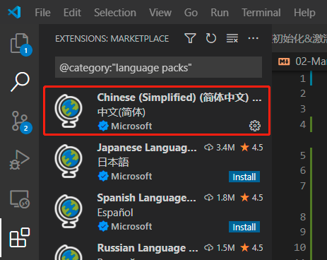
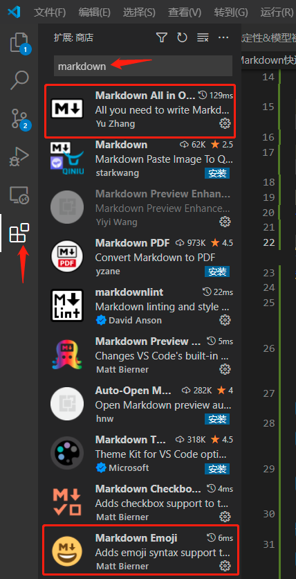
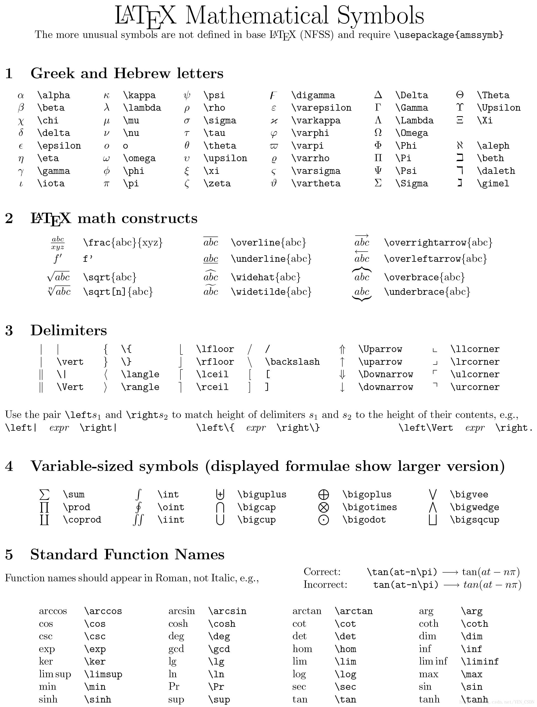
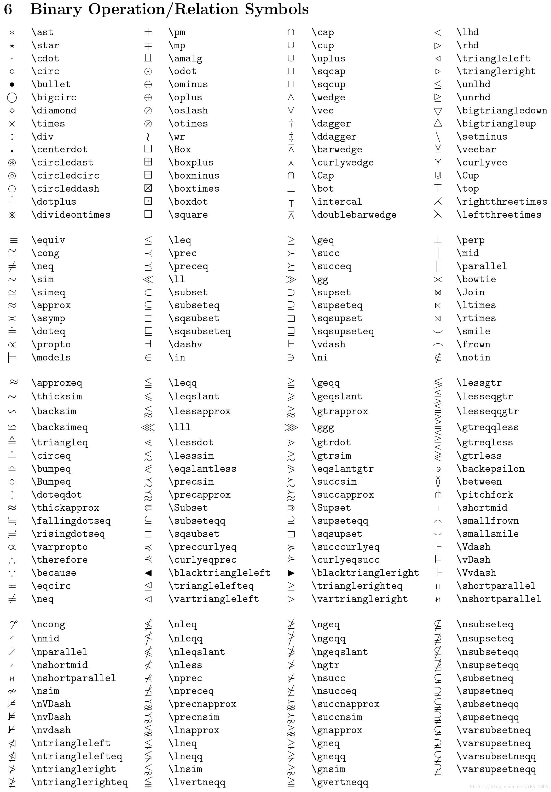
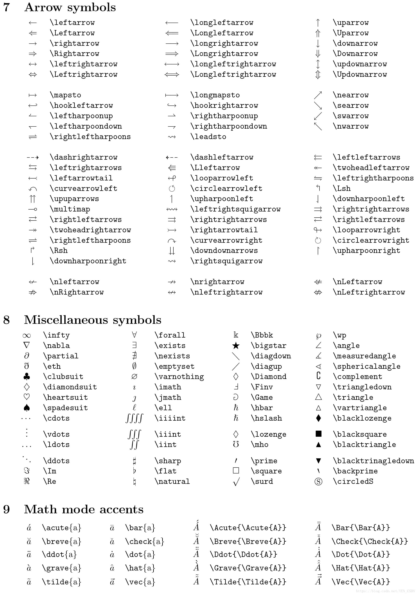

# 02 - Markdown 快速入门

---

## 为 Markdown 优化 VSCode 设置

目前安装好的 VSCode 仅支持最基础的 Markdown 编辑功能，这里为了提供更好的编写体验，需要在 VSCode 安装以下扩展：

- **Markdown All In One**：Markdown 增强包
- **Markdown Emoji**：支持插入 Emoji 表情

### 扩展安装方法

1. 首先打开 VSCode，为方便日后操作，切换为中文界面。点击`Ctrl+Shift+P`，输入`display`，选择`Configure Display Language`
   
2. 接着点击`Install additional languages...`
   
3. 在左侧扩展商店选择`Chinese(Simplified)(简体中文)`，点击安装
   
4. 重复第 2 步，选择`zh-cn`重启 VSCode，便切换为中文界面
5. 继续在左侧打开扩展商店，在顶部搜素框输入`markdown`，安装如下扩展：
   

## 基础语法

| 元素                        | Markdown 语法                                                                       |
| --------------------------- | ----------------------------------------------------------------------------------- |
| 标题（Heading）             | `# H1`<br>`## H2`<br>`### H3`<br>……                                                 |
| 粗体（Blod）                | `**blod text**`                                                                     |
| 斜体（Italic）              | `*italicized text*`                                                                 |
| 删除线（Strikethrough）     | `~~The world is flat.~~`                                                            |
| 引用块（Blockquote）        | `> blockquote`                                                                      |
| 有序列表（Ordered List）    | `1. First item`<br>`2. Second item`<br>`3. Third item`                              |
| 无序列表（Unordered List）  | `\backtick item`<br>`- item`                                                        |
| 代码（Code）                | &#96;`code`&#96;                                                                    |
| 分隔线（Horizontal Rule）   | `---`                                                                               |
| 超链接（Link）              | `[链接文字](https://gitee.com/greener/d2l-note)`                                    |
| 图片（Images）              | ``                                                  |
| 代码块（Fenced Code Block） | ` ``` `<br>`import tensorflow as torch`<br>`torch.__version__`<br>` ``` `           |
| 表格（Table）               | `\| Name \| Age \|`<br>`\|------\|------\|`<br>`\|Tom \|12 \|`<br>`\|Jerry \|10 \|` |

> 在 VSCode 中，可以在编写中使用快捷键，比如加粗文字按`Ctrl+B`等等

## 数学公式语法

Markdown 支持插入 Latex 公式语法，分为两种写法：

- 行内公式（文字内描述时用）：`$公式内容$`
- 独立公式（内容较多时用）：`$$公式内容$$`

以下为 Latex 语法内容：






