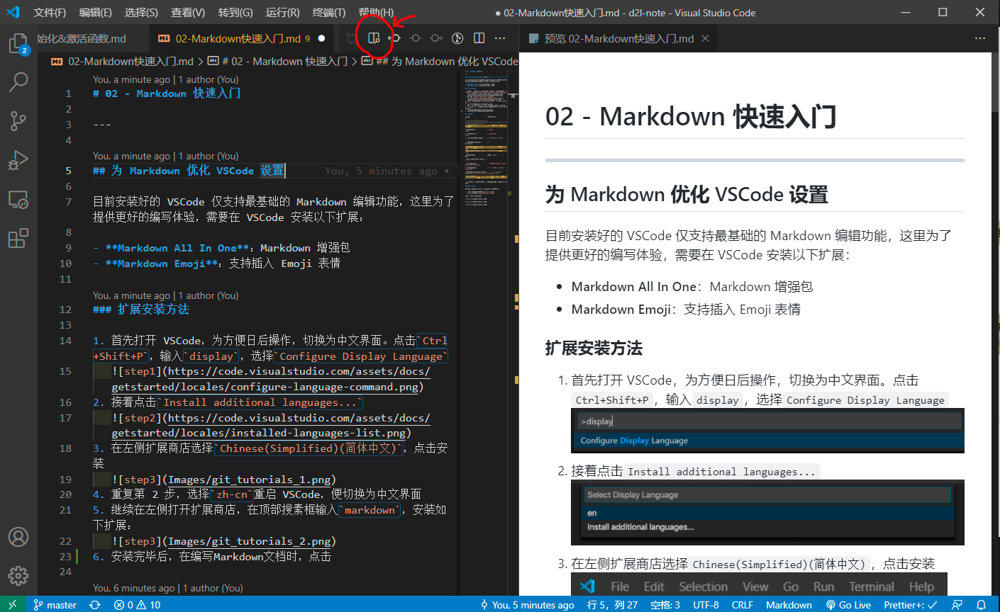
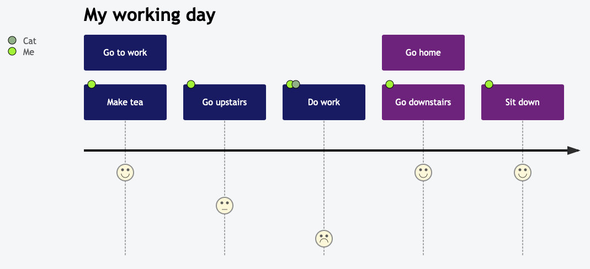
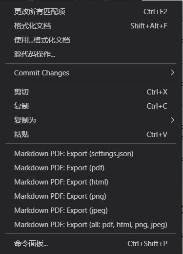

# 02 - Markdown 快速入门

---

## 为 Markdown 优化 VSCode 设置

目前安装好的 VSCode 仅支持最基础的 Markdown 编辑功能，这里为了提供更好的编写体验，需要在 VSCode 安装以下扩展：

- **Markdown All In One**：Markdown 增强包
- **Markdown Emoji**：支持插入 Emoji 表情
- **Markdown Preview Mermaid Support**：为 Markdown 增加作图支持（架构图、思维导图等）
- **Markdown PDF**：如果有导出为 PDF 文件需求，安装这个插件（安装过程中会在后台下载 Chromium Engine 作为渲染引擎，需要等待一段时间）

### 扩展安装方法

1. 首先打开 VSCode，为方便日后操作，切换为中文界面。点击`Ctrl+Shift+P`，输入`display`，选择`Configure Display Language`
   
2. 接着点击`Install additional languages...`
   
3. 在左侧扩展商店选择`Chinese(Simplified)(简体中文)`，点击安装
   
4. 重复第 2 步，选择`zh-cn`重启 VSCode，便切换为中文界面
5. 继续在左侧打开扩展商店，在顶部搜素框输入`markdown`，安装如下扩展：
   
6. 同理再安装`Markdown Preview Mermaid Support`插件
7. 安装完毕后，在编写 Markdown 文档时，点击顶部“放大镜 🔍”图标，便可在右侧开启实时预览功能
   

## 基础语法

| 元素                                                              | Markdown 语法                                                                       |
| ----------------------------------------------------------------- | ----------------------------------------------------------------------------------- |
| **标题**（Heading）                                               | `# H1`<br>`## H2`<br>`### H3`<br>……                                                 |
| **粗体**（Blod）                                                  | `**blod text**`                                                                     |
| **斜体**（Italic）                                                | `*italicized text*`                                                                 |
| **删除线**（Strikethrough）                                       | `~~The world is flat.~~`                                                            |
| **引用块**（Blockquote）                                          | `> blockquote`                                                                      |
| **有序列表**（Ordered List）                                      | `1. First item`<br>`2. Second item`<br>`3. Third item`                              |
| **无序列表**（Unordered List）                                    | `\backtick item`<br>`- item`                                                        |
| **代码**（Code）                                                  | &#96;`code`&#96;                                                                    |
| **分隔线**（Horizontal Rule）                                     | `---`                                                                               |
| **超链接**（Link）                                                | `[链接文字](https://gitee.com/greener/d2l-note)`                                    |
| **图片**（Images）                                                | ``                                                  |
| **代码块**（Fenced Code Block）<br>需在第一个三撇号后指定编程语言 | ` ```python `<br>`import tensorflow as torch`<br>`torch.__version__`<br>` ``` `     |
| **表格**（Table）                                                 | `\| Name \| Age \|`<br>`\|------\|------\|`<br>`\|Tom \|12 \|`<br>`\|Jerry \|10 \|` |

> 在 VSCode 中，可以在编写中使用快捷键，比如加粗文字按`Ctrl+B`等等

## 数学公式语法

Markdown 支持插入 Latex 公式语法，分为两种写法：

- 行内公式（文字内描述时用）：`$公式内容$`
- 独立公式（内容较多时用）：`$$公式内容$$`

如何输入公式，可以参考学习 👉[LaTex 数学公式语法手册](https://uinika.gitee.io/Zen/LaTex/)

以下为 Latex 数学符号语法整理：


## Mermaid 作图语法

Mermaid 是一个基于 Javascript 的图表绘制工具，通过解析类 Markdown 的文本语法来实现图表的创建和动态修改。Mermaid 通过减少创建可修改的图表所需要的时间、精力和工具来解决这一难题，从而提高了内容的智能化和可重用性。

详细使用教程可以参考 👉[Mermaid 官方文档](https://mermaid-js.github.io/mermaid/#/)


以下为快速入门示例：

<table>
<!-- <Flowchart> -->
<tr><td colspan=2 align="center">
    <b>流程图</b></br>
</td></tr>
<tr>
    <td><pre>
graph TD
A[Hard] -->|Text| B(Round)
B --> C{Decision}
C -->|One| D[Result 1]
C -->|Two| E[Result 2]
    </pre></td>
    <td align="center">
        
    </td>
</tr>
<!-- </Flowchart> -->
<!-- <Sequence> -->
<tr><td colspan=2 align="center">
    <b>时序图</b><br />
</td></tr>
<tr>
    <td><pre>
sequenceDiagram
Alice->>John: Hello John, how are you?
loop Healthcheck
    John->>John: Fight against hypochondria
end
Note right of John: Rational thoughts!
John-->>Alice: Great!
John->>Bob: How about you?
Bob-->>John: Jolly good!
    </pre></td>
    <td align="center">
        
    </td>
</tr>
<!-- </Sequence> -->
<!-- <Gantt> -->
<tr><td colspan=2 align="center">
    <b>甘特图</b><br />
<tr>
    <td><pre>
gantt
section Section
Completed :done,    des1, 2014-01-06,2014-01-08
Active        :active,  des2, 2014-01-07, 3d
Parallel 1   :         des3, after des1, 1d
Parallel 2   :         des4, after des1, 1d
Parallel 3   :         des5, after des3, 1d
Parallel 4   :         des6, after des4, 1d
    </pre></td>
    <td align="center">
        
    </td>
</tr>
<!-- </Gantt> -->
<!-- <Class> -->
<tr><td colspan=2 align="center">
    <b>类图</b><br />
</td></tr>
<tr>
    <td><pre>
classDiagram
Class01 &lt;|-- AveryLongClass : Cool
&lt;&lt;interface>> Class01
Class09 --> C2 : Where am i?
Class09 --* C3
Class09 --|> Class07
Class07 : equals()
Class07 : Object[] elementData
Class01 : size()
Class01 : int chimp
Class01 : int gorilla
class Class10 {
  &lt;&lt;service>>
  int id
  size()
}
</pre></td>
    <td align="center">
        
    </td>
</tr>
<!-- </Class> -->
<!-- <State> -->
<tr><td colspan=2 align="center">
    <b>状态图</b><br />
</td></tr>
<tr>
    <td><pre>
stateDiagram-v2
[*] --> Still
Still --> [*]
Still --> Moving
Moving --> Still
Moving --> Crash
Crash --> [*]
</pre></td>
    <td align="center">
        
    </td>
</tr>
<!-- </State> -->
<!-- <Pie> -->
<tr><td colspan=2 align="center">
    <b>饼图</b><br />
</td></tr>
<tr>
    <td><pre>
pie
"Dogs" : 386
"Cats" : 85
"Rats" : 15
</pre></td>
    <td align="center">
        
    </td>
</tr>
<!-- </Pie> -->
<!-- <Git> -->
<!-- </Git> -->
<!-- <Journey> -->
<tr><td colspan=2 align="center">
    <b>用户体验旅程图</b><br />
</td></tr>
<tr>
  <td>
  <pre>
  journey
    title My working day
    section Go to work
      Make tea: 5: Me
      Go upstairs: 3: Me
      Do work: 1: Me, Cat
    section Go home
      Go downstairs: 5: Me
      Sit down: 3: Me
</pre></td>
  <td align="center">
    
  </td>
</tr>
<!-- </Journey> -->
</table>

## 将导出为 PDF

在安装完“**Markdown PDF**”插件后，为了能在导出的 PDF 中正常显示 LaTex 公式，需要进行以下修改，为我们的导出模板增加一个号称数学公式渲染最快的 JS 库——[**KaTex**](https://katex.org/)：

1. 找到当前用户目录下的`.vscode\extensions\yzane.markdown-pdf-1.x.x\template`文件夹（Windows 系统一般在`C:\Users\<你的用户名>`，Linux 一般在根目录下的用户名文件夹）
2. 编辑`template.html`文件，在`<head>...</head>`标签中增加下述内容：

```html
<link
  rel="stylesheet"
  href="https://cdn.jsdelivr.net/npm/katex@0.15.2/dist/katex.min.css"
  integrity="sha384-MlJdn/WNKDGXveldHDdyRP1R4CTHr3FeuDNfhsLPYrq2t0UBkUdK2jyTnXPEK1NQ"
  crossorigin="anonymous"
/>
<script
  defer
  src="https://cdn.jsdelivr.net/npm/katex@0.15.2/dist/katex.min.js"
  integrity="sha384-VQ8d8WVFw0yHhCk5E8I86oOhv48xLpnDZx5T9GogA/Y84DcCKWXDmSDfn13bzFZY"
  crossorigin="anonymous"
></script>
<script
  defer
  src="https://cdn.jsdelivr.net/npm/katex@0.15.2/dist/contrib/auto-render.min.js"
  integrity="sha384-+XBljXPPiv+OzfbB3cVmLHf4hdUFHlWNZN5spNQ7rmHTXpd7WvJum6fIACpNNfIR"
  crossorigin="anonymous"
  onload="renderMathInElement(document.body);"
></script>
```

3. 在需要转换的 VSCode 窗口文件右键，出现以下菜单，选择`Markdown PDF:Export(PDF)`即可在 markdown 文件所在目录找到导出的 PDF 文件。



## 参考链接

- [Markdown 官方教程](https://markdown.com.cn/)
- [LaTex 数学公式语法手册](https://uinika.gitee.io/Zen/LaTex/)
- WikiBooks《LaTeX/Mathematics》👉[网页版](https://en.m.wikibooks.org/wiki/LaTeX/Mathematics#) 👉[PDF 版](https://www.aliyundrive.com/s/rNEwzrMEn2P)
- [Mermaid 官方文档](https://mermaid-js.github.io/mermaid/#/)
