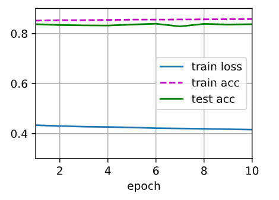
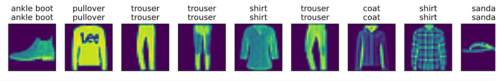

# 09 - Softmax回归
### 🎦 本节课程视频地址 👉[Bilibil](https://www.bilibili.com/video/BV1K64y1Q7wu)

**是以回归之名的分类**

回归估计一个连续值 VS 分类预测一个离散类别

**回归**

单连续值输出
自然区间R
跟真实值的区别作为损失

**分类**

通常多个输出  
输出$i$表示预测为第$i$类的置信度

## 从回归到多类 —— 均方损失

对类别进行有效编码  
$${\bf{y}}=[y_1, y_2,...,y_n]^T$$
$$y_i=
\left \{
\begin{array}{l}
1\ if\ i=y \\
0\ otherwise
\end{array}
\right.
$$
使用均方损失训练  
最大值最为预测（最大化$o_i$的置信度的值）
$$\hat y = arg\,\max_{i}o_i$$
无校验比例
## 从回归到多类分类——无校验比例
**需要更置信的识别正确类（大余量）**

正确类的置信度要远大于其他非正确类的置信度，数学表示为一个阈值。
$$o_y-o_i\ge\Delta(y,i)$$

## 从回归到多类分类——校验比例

输出匹配概率（非负，和为1）
$$\hat{\bf y}=softmax({\bf o})$$
$$\hat y_i={\exp{o_i}\over\sum_k\exp{o_k}}$$
预测概率$\hat{\bf{y}}$与真实概率$\bf{y}$的比较。
## Softmax和交叉熵损失
交叉熵通常用来衡量两个概率的区别：
$${H(\bf{p},\bf{q})}=\sum_{i}-p_i\log(q_i)$$
将他作为损失：
$$L(\bf{y}-\hat{\bf{y}})=-\sum_{i}y_i\log\hat{y}=-\log\hat{y}_y$$
其梯度是真实概率与预测概率的区别：
$$\partial_{o_i}L(\bf{y}-\hat{\bf{y}})=softmax({\bf o})_i-y_i$$
# 损失函数
**Huber's Robust Loss**
$$
L(y-y\prime)=
\begin{cases}
|y-y\prime|-{1\over2}&if\ |y-y\prime|\gt1\\
{1\over2}(y-y\prime)^2&otherwise
\end{cases}
$$
# 图像分类数据集读取
图像分类中使用最为广泛的数据集**MNIST**，创造与1986，用于识别手写数字，过于简单，此处用较为复杂的**Fashion MNIST**。
- 导入各库
```
%matplotlib inline
import torch
import torchvision
from torch.utils import data #读取数据小批量的函数集
from torchvision import transforms #数据操作
from d2l import torch as d2l
d2l.use_svg_display()
#svg可放缩矢量图形，有利于图片的高清显示
```
- 下载/导入数据
```
trans = transforms.ToTensor()
#ToTensor()把IPL图片转化为Tensor
#并除以255使所有像素均值在0-1之间
mnist_train = torchvision.datasets.FashionMNIST(root="../data", train=True, transform=trans, download=False)
#从FashionMNIST拿训练数据，没有则下载，transform代表改变图像为张量。
mnist_test = torchvision.datasets.FashionMNIST(root="../data", train=False, transform=trans, download=False)
#从FashionMNIST拿测试数据
len(mnist_train), len(mnist_test)
#结果分别为60000和10000张图片。
mnist_train[0][0].shape #数据示例
#输出torch.Size([1, 28, 28])，1代表RGB通道，为黑白图片，长×宽=28×28
```
- 两个可视化数据集的函数
```
def get_fashion_mnist_labels(labels): 
## 返回FashionMNIST的文本标签。 
    text_labels = ['t-shirt', 'trouser', 'pullover', 'dress', 'coat',
                   'sandal', 'shirt', 'sneaker', 'bag', 'ankle boot']
    return [text_labels[int(i)] for i in labels]

def show_images(imgs, num_rows, num_cols, titles=None, scale=1.5):  #titles=None,是默认，想改变手动键入。
    """绘制图像列表"""
    figsize = (num_cols * scale, num_rows * scale)
    _, axes = d2l.plt.subplots(num_rows, num_cols, figsize=figsize)
    #函数表示为fig , ax = plt.subplots(nrows, ncols)，fig代表名称，ax对应图例
    #figsize指定画布的大小，(宽度,高度)，单位为英寸。
    axes = axes.flatten()
    #flatten()是numpy中用于降低维度的函数，把n×m矩阵变成1×n*m的行向量。
    for i, (ax, img) in enumerate(zip(axes, imgs)):
    #enumerate(sequence, [start=0])返回元组列表（序号，元素）。
    #zip([iterable, ...])函数将多个迭代器对应元素打包以元组返回。
        if torch.is_tensor(img):
        #判断对象是否是torch的张量
            ax.imshow(img.numpy())
            # 先把张量转化为numpy的数组，并通过热图显示。
            # imshow()传入的变量是存储图像的数组，可以是浮点型数组、unit8数组以及PIL图像
        else:
            ax.imshow(img)
        ax.axes.get_xaxis().set_visible(False)
        ax.axes.get_yaxis().set_visible(False)
        #设置坐标轴为不可见
        if titles:
            ax.set_title(titles[i])
    return axes
```
- 几个样本的图像和标签
```
X, y = next(iter(data.DataLoader(mnist_train, batch_size=18)))
show_images(X.reshape(18, 28, 28), 2, 9, titles=get_fashion_mnist_labels(y));
```
- 读取一小批量图片
```
batch_size = 256 #传入批量大小为256

def get_dataloader_workers(): 
    """使用4个进程来读取数据"""
    return 4

train_iter = data.DataLoader(mnist_train, batch_size, shuffle=True，num_workers=get_dataloader_workers())
# 从m_t读取数据，批量大小，打乱，同时工作的进程，输出一个生成器。

timer = d2l.Timer()
#计时开始
for X, y in train_iter:
    continue
f'{timer.stop():.2f} sec'
#⏲结束
```
- 定义数据读取的函数
```
def load_data_fashion_mnist(batch_size, resize=None):  #@save
    """下载Fashion-MNIST数据集，然后将其加载到内存中"""
    trans = [transforms.ToTensor()]
    # 指定给一个方法集
    if resize:
        trans.insert(0, transforms.Resize(resize))
    # 如果制定了大小，则插入一个图片格式改变方法，再转换为张量
    trans = transforms.Compose(trans)
    # 打包成torch可理解的函数集。

    mnist_train = torchvision.datasets.FashionMNIST(
        root="../data", train=True, transform=trans, download=True)
    mnist_test = torchvision.datasets.FashionMNIST(
        root="../data", train=False, transform=trans, download=True)
    return (data.DataLoader(mnist_train, batch_size, shuffle=True,
                            num_workers=get_dataloader_workers()),
            data.DataLoader(mnist_test, batch_size, shuffle=False,
                            num_workers=get_dataloader_workers()))
```
## Softmax回归的从零开始实现
1. 引入包

```
import torch
from IPython import display
from d2l import torch as d2l

batch_size = 256
train_iter, test_iter = d2l.load_data_fashion_mnist(batch_size)
```
2. 定义初态

```
num_inputs = 784
#将图片矩阵铺平，变成一个向量，但会损失空间信息 28*28
num_outputs = 10
#数据集有10个类，所以模型输出维度为10

W = torch.normal(0, 0.01, size=(num_inputs, num_outputs), requires_grad=True)
#高斯随机权重的值
b = torch.zeros(num_outputs, requires_grad=True)
#每个输出都有偏移
```
对于任何一个输入${\bf{x}}\in(28\times28)$，转化为${\bf{x}}\in(1\times784)$
输出维度${\bf{o}}\in(10\times1)$
权重${\bf{W}}\in(784\times10)$
偏差${\bf{b}}\in(1\times10)$
对于一个批量$n$输入$X\in(n\times784)$

3. 定义Softmax函数

$softmax({\bf{X}})_{ij}={\exp(X_{ij})\over\sum_k\exp(X_{ik})}$

```
def softmax(X):
    #对矩阵的每一行做softmax
    X_exp = torch.exp(X)
    partition = X_exp.sum(1, keepdim=True)
    #按照列求和，输出维度784x1
    return X_exp / partition
    #运用广播定律
```
4. 定义模型

```
def net(X):
    return softmax(torch.matmul(X.reshape(-1, W.shape[0]), W) + b)
    # matmul()是矩阵乘法
    # reshape(-1, n)表示不知道具体多少行，一共n列，自行计算行数=矩阵元素总个数/赋值列数n。同理，可以定义随机列。
    # 此处将同一批batch_size=256张图组成的三维，矩阵变成重整为二维。
    # shape()返回维度的列表

```
模型以类别预测的概率进行softmax计算后作为输出。
${\bf{O}}={\bf{X}}{\bf{w}}+{\bf{b}}=[n\times784]\times[784\times10]+[1\times10]=[n\times10]+[1\times10]$
$[n\times10]+[1\times10]$服从广播定律，当两个总矩阵不同的矩阵做运算时，以维度相同的部分进行运算。
以任意第$i$行为例：
${\bf{O_i}}={\bf{X_i}}{\bf{w}}+{\bf{b}}=[o_{i1},o_{i2},...,o_{i10}]=[(x_{i1}w_{11}+x_{i2}w_{21}+,...,x_{i784}w_{784,1}+b_1),...,(x_{i1}w_{1,10}+x_{i2}w_{21}+,...,x_{i784}w_{784,10}+b_{10})]$
$output(\hat y) = softmax({\bf{O}})$

- 代码技巧，根据标号索引

```
y = torch.tensor([0, 2])
y_hat = torch.tensor([[0.1, 0.3, 0.6], [0.3, 0.2, 0.5]])
y_hat[[0, 1], y]
#以y的元素数值按顺序作为y_hat的对应数组元素的索引，
[0.1, 0.3, 0.6]的索引为[0]值为0.1；
[0.3, 0.2, 0.5]的索引为[2]值为0.5；
```

5. 交叉熵损失

$$L(\bf{y}-\hat{\bf{y}})=-\sum_{i}y_i\log\hat{y}=-\log\hat{y}_y$$

```
def cross_entropy(y_hat, y):
    return -torch.log(y_hat[range(len(y_hat)), y])
## len(y_hat)确定y_hat的行数，以分类实值作为索引，提取模型对实值的预测概率，因为非实值的交叉熵为0，所以只用对实值项求对数。
## torch.log()输入的是tensor,输出是tensor元素的ln()

cross_entropy(y_hat, y)
```

6. 统计分类正确的样本数量

```
def accuracy(y_hat, y):
    if len(y_hat.shape) > 1 and y_hat.shape[1] > 1:
        y_hat = y_hat.argmax(axis=1)
        #argmax/min()函数求的是对应行/列，最大最小值在该行/列所对应的索引，并返回一个数组。
        #axis=0每列；axis=1,每行。
        #此案例中，取出y_hat每行的最大值的索引，即预测的类别。
    cmp = y_hat.type(y.dtype) == y
    #type(dtype=None)是函数，返回/修改数据的结构类型，如list、dict、numpy.ndarray；
    #如果默认dtype,按原数据类型返回，如果定义了dtype，则将数据类型修改为dtype，并且返回修改后的数据。
    #dtype是属性，返回数据的元素属性，如int, float, str。
    #list、dict 等可以包含不同的数据类型，因此没有dtype属性。
    #在tensor数据的比较里，按元素逐一比较，返回True or False的tensor。
    return float(cmp.type(y.dtype).sum())
    #布尔元素的类型转换，按照True1-False0进行。
    #accuracy函数最终返回正确预测样本数量。

accuracy(y_hat, y) / len(y)
```

7. 计算模型在指定数据集上的精度

```
def evaluate_accuracy(net, data_iter):
    if isinstance(net, torch.nn.Module):
        #isinstance() 函数来判断一个对象是否是一个已知的类型，会考虑继承
        #torch.nn.Module是一个类。
        net.eval()
        #eval()函数把模块设置为评估模式，相当于self.train(False)
        #在此处引申为不计算梯度。
    metric = Accumulator(2)
    #Accumulator是自定义的一个类，作为叠加器
    for X, y in data_iter:
        metric.add(accuracy(net(X), y), y.numel())
        # .add()是Accumulator类的方法。
        # numel()函数用于计算样本中的元素总数。
        # 循环就是把生成器里的所有元素遍历，计算总预测正确数和总样本数
    return metric[0] / metric[1]
```
```
class Accumulator:
    def __init__(self, n):
        self.data = [0.0] * n
        #类的实例，只传一个参，向量的长度n。
        #列表乘法
        
    def add(self, *args):
        self.data = [a + float(b) for a, b in zip(self.data, args)]
        #add()方法，预设动态参数
        #zip()把全零向量和args打包，self的值赋值给a，args赋值给b。
        #zip()的返回值是一个对象，可以用list查看。
    
    def reset(self):
        self.data = [0.0] * len(self.data)
        #初始化self
        
    def __getitem__(self, idx):
        #self索引
        return self.data[idx]

## 再来回溯metric = Accumulator(2), self.data = [0.,0.]
## metric.add(accuracy(net(X), y), y.numel())
## y.numel()=10类，accuracy(net(X), y)=预估正确数
## zip([0.,0.], *args= metric.add(accuracy(net(X), y), y.numel())
## *args会把传入的单个参数打包成元组，假设预测对8个，即 args=(8,10)
## 转化为float方便于计算
## return metric[0] / metric[1]

evaluate_accuracy(net, test_iter)
```
以上完成了所有数据迭代一次的初始精确度，是10%左右。

8. Softmax训练函数
   
```
def train_epoch_ch3(net, train_iter, loss, updater):
    #判断函数是手动还是模块调用，提高函数适用性。
    if isinstance(net, torch.nn.Module):
        net.train()
        ##train()函数与eval()函数先对应，可以理解为此处求导。
    metric = Accumulator(3)
    for X, y in train_iter:
        y_hat = net(X)
        l = loss(y_hat, y)
        #如果是调用包，已经求和过，返回的是ln(softmax(正确预测的实值))
        if isinstance(updater, torch.optim.Optimizer):
            #torch.optim.Optimizer是torch优化器的包
            updater.zero_grad()
            #updater返回一个小批量，格式化梯度。
            l.backward()
            updater.step()
            #Optimizer更新小批量
            metric.add(
            float(l) * len(y), accuracy(y_hat, y),
            y.size().numel())
            #float(l) * len(y)算出来的应该不是损失数，而是衡量损失的一个浮点数。
        else:
            l.sum().backward()
            updater(X.shape[0])
            ## X是三维向量，返回的就是批量大小
            metric.add(float(l.sum()), accuracy(y_hat, y), y.numel())
        
    return metric[0] / metric[2], metric[1] / metric[2]
```
9. 动画显示
```
class Animator:
    def __init__(self, xlabel=None, ylabel=None, legend=None,
                xlim=None, ylim=None, xscale= 'linear', yscale='linear',
                fmts=('-','m--', 'g-', 'r:'), nrows=1, ncols=1,
                figsize=(3.5, 2.5)):
        # x/ylabel:x/y轴标签
        #legend:图例
        #x/ylim(x/ymin, x/ymax):x/y轴的上下极限。
        #x/yscale：x/y轴比例
        #'-':实线,'m--'：品红色虚线, 'g-'：绿色实线, 'r:'：红色点线。
        #nrows/ncols：行列数量。
        if legend is None:
            legend = []
        d2l.use_svg_display()
        #用svg格式显示图片。
        self.fig, self.axes = d2l.plt.subplots(nrows, ncols, figsize= figsize)
        if nrows * ncols == 1:
            self.axes = [self.axes,]
            #一张图就是[0]，保证axes是一个数列。
        self.config_axes = lambda: d2l.set_axes(self.axes[
            0], xlabel, ylabel, xlim, ylim, xscale, yscale, legend)
        #可以视为lambda self:
        #可以理解为定义图像
        self.X, self.Y, self.fmts = None, None, fmts
    def add(self, x, y):
        # 向图表中添加多个数据点
        if not hasattr(y, "__len__"):
        #hasattr(arg)函数表示是否有属性arg
        #也就是说int没有长度，需要创造列表。
            y = [y]
        n = len(y)
        if not hasattr(x, "__len__"):
            x = [x] * n
            # x和y一样长
        if not self.X:
            #判断self.X是否为空
            self.X = [[] for _ in range(n)]
            # _表示在循环此处并不想创建变量
            #创建那个空数组，组成一个n*1的二维空矩阵
        if not self.Y:
            self.Y = [[] for _ in range(n)]
        for i, (a, b) in enumerate(zip(x, y)):
            if a is not None and b is not None:
                self.X[i].append(a)
                self.Y[i].append(b)
                #将a,b的值分别加入空数组中，组成n*1实值矩阵
        self.axes[0].cla()
        #cla()清除图像中的曲线
        for x, y, fmt in zip(self.X, self.Y, self.fmts):
            self.axes[0].plot(x, y, fmt)
        self.config_axes()
        display.display(self.fig)
        display.clear_output(wait=True)
```

10. 定义训练函数

```
   def train_ch3(net, train_iter, test_iter, loss, num_epochs, updater):
    animator = Animator(xlabel='epoch', xlim=[1, num_epochs], ylim=[0.3, 0.9],
                       legend=['train loss', 'train acc', 'test acc'])
    #显示图像
    for epoch in range(num_epochs):
        train_metrics = train_epoch_ch3(net, train_iter, loss, updater)
        #对数据集训练，return metric[0] / metric[2], metric[1] / metric[2]两个比例。
        #函数return的多个值是一个元组return a, b = (a, b)
        test_acc = evaluate_accuracy(net, test_iter)
        #数据集的正确率统计
        animator.add(epoch + 1, train_metrics + (test_acc,))
        #显示图像
    train_loss, train_acc = train_metrics

```

11. 调用sgd优化方法

```
lr = 0.1
#设置学习率。
def updater(batch_size):
    return d2l.sgd([W, b], lr, batch_size)
##定义优化函数，直接调用sgd（在线性回归中定义过的），对w和b求梯度变化，然后清零梯度，再通过step()更新样本，相当于循环。
```

12. 开始训练

```
num_epochs = 10
train_ch3(net, train_iter, test_iter, cross_entropy, num_epochs, updater)
```

13. 用测试集预测

```
def predict_ch3(net, test_iter, n=10):  #@save
    """预测标签（定义见第3章）"""
    for X, y in test_iter:
        break
        #只从遍历出一个批量
    trues = d2l.get_fashion_mnist_labels(y)
    preds = d2l.get_fashion_mnist_labels(net(X).argmax(axis=1))
    titles = [true +'\n' + pred for true, pred in zip(trues, preds)]
    d2l.show_images(
        X[0:n].reshape((n, 28, 28)), 1, n, titles=titles[0:n])
    #挑出前n个数据作图，行1列n。

predict_ch3(net, test_iter)
```
