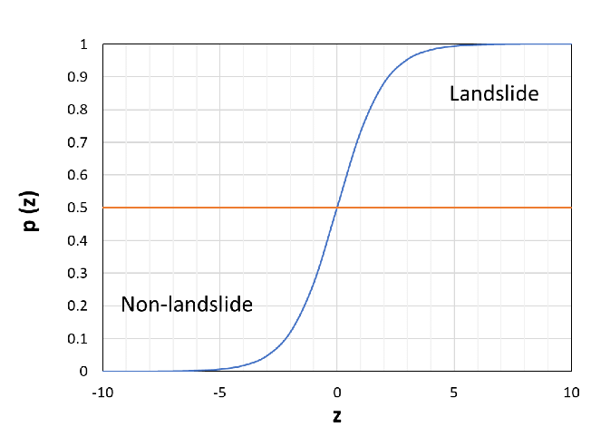

# 10 - 多层感知机

### 🎦 本节课程视频地址 👉[](https://www.bilibili.com/video/BV1hh411U7gn?spm_id_from=333.999.0.0)

## 感知机

最早的AI模型之一。
给定输入$\bf{x}$，权重$\bf{w}$，和偏移$b$，感知机输出：

$$o=\sigma(\langle{\bf{w}},{\bf{x}}\rangle+b)$$
$$\sigma(x)=\begin{cases}
1&if\ x\gt0\\-1&otherwise
\end{cases}$$

- **二分类**


线性回归输出实数；
Softmax回归输出概率（可以多分类）；

- **训练感知机**

**initialize** $w=0$ and $b=0$
**repeat**
    **if** $y_i[\langle{w,x_i}\rangle+b]\le0$ **then**
    $w\leftarrow w+y_ix_i$ and $b\leftarrow b+y_i$
    **end if**
**until** all classified correctly

等价于使用批量大小为1的梯度下降，并使用如下的损失函数

$$l(y,{\bf{x}},{\bf{w}})=max(0,-y\langle{\bf{w}},{\bf{x}}\rangle)$$

把每一个样本单独带入更新梯度。

- **收敛定理**

数据在半径$r$内

余量$\rho$分类两类

$$y({\bf{x}}_T{\bf{w}}+b)\ge\rho$$

对于$||{\bf{w}}||^2+b^2\le1$
感知机保证在${r^2+1}\over\rho^2$步后收敛。


- **XOR问题**(Minsky&Papert,1969)

感知机的分割面是线性的，所以不能分割XOR问题。

因此造成了第一次AI寒冬。

## 多层感知机(MLP)


既然一次学不了，就用简单函数的组合，层层嵌套，解决问题。


- **单隐藏层——单分类**


**Input Layer:** ${\bf{x}}\in{\mathbb R}^n$
**Hidden Layer:** ${\bf{W_1}}\in{\mathbb R}^{m\times n},{\bf{b_1}}\in{\mathbb R}^m$
**Output Layer:** ${\bf{w_2}}\in{\mathbb R}^m,{{b_2}}\in{\mathbb R}$

隐藏层的维度$n$是一个超参数。

${\bf{h}}=\sigma({\bf{W_1}}{\bf{x}}+{\bf{b_1}})$
$o={\bf{w}}_2^T{\bf{h}}+b_2$

$\sigma$是按元素的激活函数
激活函数必须是非线性的  
如果不：
$o=a{\bf{w_2^TW_1x}}+b\prime$
仍然是线性的，等于一个单层感知机。
- **常用激活函数**
**Sigmoid函数**

$$sigmoid(x)={1\over1+\exp(-x)}$$



**Tanh函数**

$$tanh(x)={1-\exp(-2x)\over1+\exp(-2x)}$$


**ReLU函数**

$$ReLU(x)=\max(x,0)$$


- **多类分类**

$$y_1,y_2,...,y_k=softmax(o_1,o_2,...,o_k)$$

**Input Layer:** ${\bf{x}}\in{\mathbb R}^n$
**Hidden Layer:** ${\bf{W_1}}\in{\mathbb R}^{m\times n},{\bf{b_1}}\in{\mathbb R}^m$
**Output Layer:** ${\bf{W_2}}\in{\mathbb R}^{m\times k},{\bf{b_2}}\in{\mathbb R}^k$

${\bf{h}}=\sigma({\bf{W_1}}{\bf{x}}+{\bf{b_1}})$
${\bf o}={\bf{W}}_2^T{\bf{h}}+\bf{b_2}$
${\bf y}=softmax({\bf o})$

- **多隐藏层**

${\bf{h_1}}=\sigma({\bf{W_1}}{\bf{x}}+{\bf{b_1}})$
${\bf{h_2}}=\sigma({\bf{W_2}}{\bf{x}}+{\bf{b_2}})$
${\bf{h_3}}=\sigma({\bf{W_3}}{\bf{x}}+{\bf{b_3}})$
${\bf o}={\bf{W}}_4{\bf{h_3}}+\bf{b_4}$
超参数：隐藏层数 $k$ 和每层隐藏层的大小$[m_1,m_2,...,m_k]$，一般大小是逐层递减的。
## 多层感知机的代码实现

- **导入包**

```
import torch
from torch import nn
from d2l import torch as d2l

batch_size = 256
train_iter, test_iter = d2l.load_data_fashion_mnist(batch_size)
```

-  **设置各层参数**

```
num_inputs, num_outputs, num_hiddens = 784, 10, 256

W1 = nn.Parameter(torch.randn(num_inputs, num_hiddens, requires_grad=True))
b1 = nn.Parameter(torch.zeros(num_hiddens, requires_grad=True))
W2 = nn.Parameter(torch.randn(num_hiddens, num_outputs, requires_grad=True))
b2 = nn.Parameter(torch.zeros(num_outputs, requires_grad=True))
#Parameters()指定input(Tensor)作为模型参数。
#randn(m.n)返回符合随机正态分布的m*n张量


params = [W1, b1, W2, b2]
```

- **定义ReLU激活函数**

```
def relu(X):
    a = torch.zeros_like(X)
    #_like(X)表示与输入X的形状相同
    return torch.max(X,a)
```

- **定义感知机网络和训练模型**

```
def net(X):
    X = X.reshape(-1, num_inputs)
    # X是batch_size*len=256*784
    H = (X @ W1 + b1)
    # W1=784*256, H=256*256
    return (H @ W2 + b2)
    # W2=256*10

loss = nn.CrossEntropyLoss()
```
- **训练**

```
num_epochs, lr = 10, 0.1
updater = torch.optim.SGD(params, lr=lr)
d2l.train_ch3(net, train_iter, test_iter, loss, num_epochs, updater)
```
- **简易实现**

```
net = nn.Sequential(nn.Flatten(), nn.Linear(784, 256), nn.ReLU(), nn.Linear(256, 10))

def init_weights(m):
    if type(m) == nn.Linear:
        nn.init.normal_(m.weight, std=0)
        
net.apply(init_weights);

trainer = torch.optim.SGD(net.parameters(), lr=lr)

num_epochs, lr = 10, 0.1
d2l.train_ch3(net, train_iter, test_iter, loss, num_epochs, trainer)
```