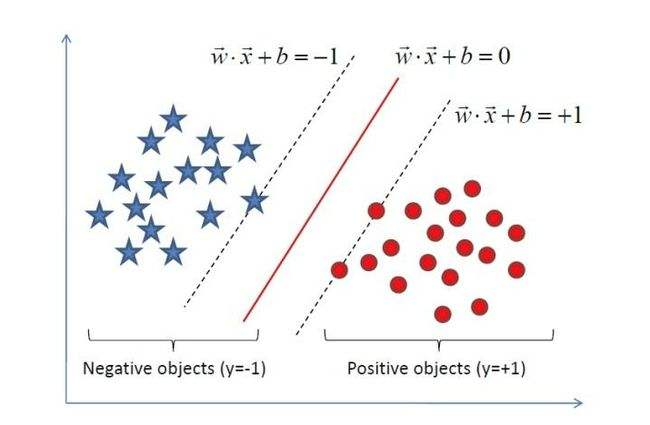
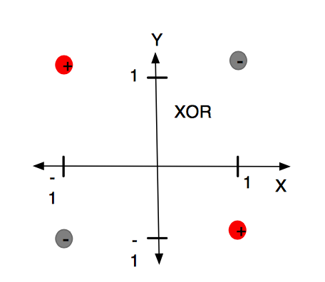
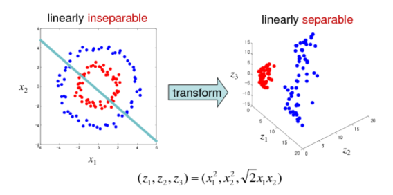
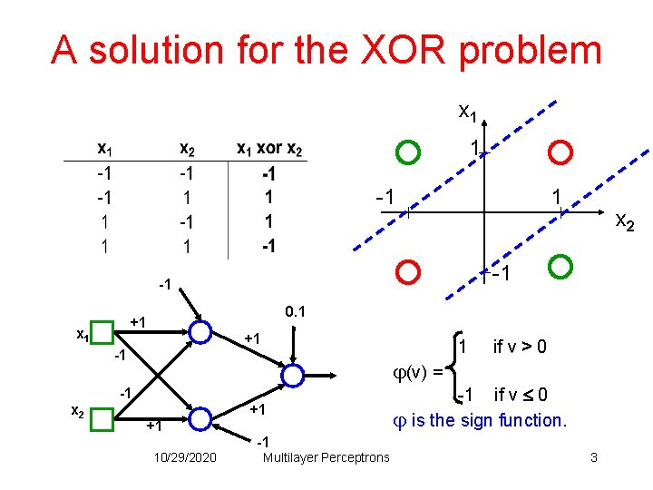
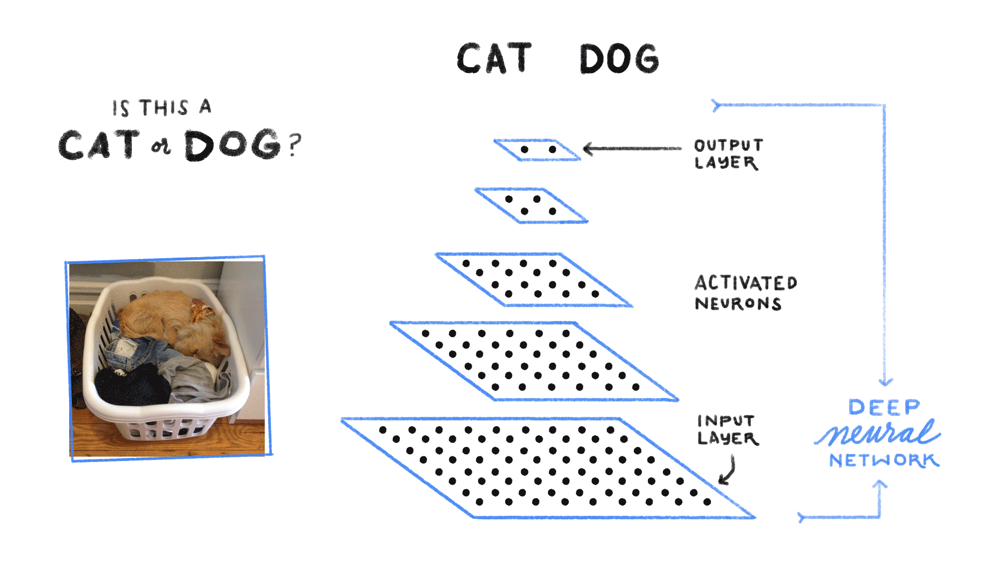
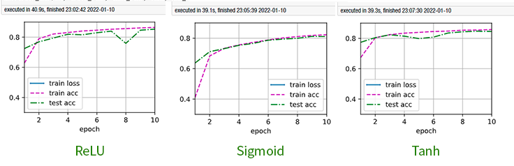

# 10 - 多层感知机

---

### 🎦 本节课程视频地址 👇

[](https://www.bilibili.com/video/BV1hh411U7gn?spm_id_from=333.999.0.0)

## 感知机（Perceptron）

最早的 AI 模型之一，相当于单层神经网络。给定输入向量$\bf{x}$，权重向量$\bf{w}$，和偏移$b$，感知机输出：

$$o=\sigma(\langle{\bf{w}},{\bf{x}}\rangle+b)$$

$$
\sigma(x)=\left \{
\begin{array}{l}
1\ , \sf{if} \ \it{x>0} \\
0\ , \sf{otherwise}
\end{array}
\right.
$$


- **二分类**：感知机输出离散的两类

  - VS 线性回归：输出实数；

  - VS Softmax 回归：输出置信度；

- **如何训练感知机**

```
initialize w=0 and b=0
repeat
    if y_i[<w,x_i>+b] <= 0 then:
        w <- w + y_i·x_i and b <- b + y_i
    end if
until all classified correctly
```

等价于使用批量大小为 1 的梯度下降，并使用如下的损失函数

把每一个样本单独带入更新梯度。

- **感知机收敛定理**

  - 数据在半径$r$内

  - 余量$\rho$分类两类

    $$y({\bf{x}}^T{\bf{w}}+b)\ge\rho, \rho>0$$

  - 对于$||{\bf{w}}||^2+b^2\le1$，感知机保证在${r^2+1}\over\rho^2$步后收敛。



- **XOR 问题**(Minsky&Papert,1969)

计算机科学家**Marvin Minsky**（后世人们称他为：人工智能之父）和 Seymour Papert 在其 1969 年的书《感知器》（Perceptrons）中提供了单层人工网络无法执行 XOR 的证据。



因为感知机的分割面是线性的，在上图中不管怎么做，都无法画出一条线可以完美分类红灰两种类别。这个结论是如此令人震惊，以至于许多计算机科学家将其归咎于神经网络研究在 1980 年代前的持续低迷状态，因此造成了第一次 AI 寒冬。


后来引入非线性激活函数（如“**核方法**”、“**支持向量机**（SVM）”等）、多层感知机后，对特征空间进行非线性扭曲变换，才使 XOR 之类问题转换为线性可分问题得以解决。




> 注：柏林洪堡大学等机构的研究者在 2020 年的研究证实，人类皮层上层中发现的一种新型电信号，皮层神经元树突臂中的微小区室每个都可以执行数学逻辑上的复杂操作，而不是像之前人们所认为的需要多层神经网络。例如连感知机都搞不定的异或运算，单个神经元即可轻松解决。
> 其论文[“Dendritic action potentials and computation in human layer 2/3 cortical neurons”](https://www.science.org/doi/10.1126/science.aax6239)刊登在《Science》，引发了广泛的关注。

## 多层感知机(MLP)



既然一层学不了，就用简单函数的组合，层层嵌套，解决问题。
### 单隐藏层——单分类


- **Input Layer:** ${\bf{x}}\in{\mathbb R}^n$
- **Hidden Layer:** ${\bf{W_1}}\in{\mathbb R}^{m\times n},{\bf{b_1}}\in{\mathbb R}^m$
- **Output Layer:** ${\bf{w_2}}\in{\mathbb R}^m,{{b_2}}\in{\mathbb R}$

> 隐藏层的维度$m$是一个超参数。$

单隐藏层感知机数学表达式为：

${\bf{h}}=\sigma({\bf{W_1}}{\bf{x}}+{\bf{b_1}})$

$o={\bf{w}}_2^T{\bf{h}}+b_2$

> 其中，${\bf{h}}$是单隐藏层的输出，$\sigma$ 是按元素的激活函数(activation function)，**激活函数必须是非线性的！**

> 如果激活函数为线性：则$o=a{\bf{w_2^TW_1x}}+b\prime$仍然是线性的，等于一个单层感知机。也就是说不论深度有多少层的线性感知机，都等价于单层感知机。

- **常用激活函数**
  - **Sigmoid 函数**（多用于二分类问题的Logistic回归）

  $$sigmoid(x)={{1}\over1+e^{-x}}$$

  

  - **Tanh 函数**

  $$tanh(x)={{1-e^{-2x}}\over1+e^{-2x}}$$
  
  - **ReLU 函数(Rectified Linear Unit)**

  $$ReLU(x)=\max(x,0)$$

  

  > ReLU激活函数应用广泛的主要原因是计算简便，求导方便，同时没有指数运算（一次指数运算在CPU上相当于上百次乘法运算😮）
### 多分类感知机——相当于在Softmax回归加入一层隐藏层

$$y_1,y_2,...,y_k=softmax(o_1,o_2,...,o_k)$$

- **Input Layer:** ${\bf{x}}\in{\mathbb R}^n$
- **Hidden Layer:** ${\bf{W_1}}\in{\mathbb R}^{m\times n},{\bf{b_1}}\in{\mathbb R}^m$
- **Output Layer:** ${\bf{W_2}}\in{\mathbb R}^{m\times k},{\bf{b_2}}\in{\mathbb R}^k$

  - ${\bf{h}}=\sigma({\bf{W_1}}{\bf{x}}+{\bf{b_1}})$
  - ${\bf o}={\bf{W}}_2^T{\bf{h}}+\bf{b_2}$
  - ${\bf y}=softmax({\bf o})$


> 以上图网络为例，$n=4,m=5,k=3$
### 多隐藏层感知机



> 上图卷积神经网络可大致看作是含有三个隐藏层的多层感知机。其中三个激活函数必须均为非线性函数

- ${\bf{h_1}}=\sigma({\bf{W_1}}{\bf{x}}+{\bf{b_1}})$
- ${\bf{h_2}}=\sigma({\bf{W_2}}{\bf{x}}+{\bf{b_2}})$
- ${\bf{h_3}}=\sigma({\bf{W_3}}{\bf{x}}+{\bf{b_3}})$
- ${\bf o}={\bf{W}}_4{\bf{h_3}}+\bf{b_4}$

> 超参数：
  > - 隐藏层数量 $k$ 
  > - 每层隐藏层的大小$[m_1,m_2,...,m_k]$

> 一般每个隐藏层大小是逐层递减的，此处一个可解释性是多层感知机相当于对信息做逐层“压缩”，即对知识做**蒸馏，Distillation**）

## 多层感知机的代码实现

- **导入包**

```
import torch
from torch import nn
from d2l import torch as d2l

batch_size = 256
train_iter, test_iter = d2l.load_data_fashion_mnist(batch_size)
```

- **设置各层参数**

> 一般选用2的幂次作为隐藏层数量，因为内存在硬件中的分配和寻址方式，这么做往往可以在计算上更高效。

> Parameters()指定input(Tensor)作为模型参数。
> 
> torch.randn(m.n)返回符合随机正态分布的m*n张量
```
num_inputs, num_outputs, num_hiddens = 784, 10, 256

W1 = nn.Parameter(torch.randn(num_inputs, num_hiddens, requires_grad=True))
b1 = nn.Parameter(torch.zeros(num_hiddens, requires_grad=True))
W2 = nn.Parameter(torch.randn(num_hiddens, num_outputs, requires_grad=True))
b2 = nn.Parameter(torch.zeros(num_outputs, requires_grad=True))

params = [W1, b1, W2, b2]
```

- **定义 ReLU 激活函数**

```
def relu(X):
    a = torch.zeros_like(X)   #_like(X)表示与输入X的形状相同
    return torch.max(X,a)
```

- **定义感知机网络和训练模型**

```
def net(X):
    X = X.reshape(-1, num_inputs)   # X是batch_size*len=256*784
    H = relu(X @ W1 + b1)   # W1=784*256, H=256*256
    return (H @ W2 + b2)    # W2=256*10

loss = nn.CrossEntropyLoss()
```

- **训练**

```
num_epochs, lr = 10, 0.1
updater = torch.optim.SGD(params, lr=lr)
d2l.train_ch3(net, train_iter, test_iter, loss, num_epochs, updater)
```

- **简易实现**

```
net = nn.Sequential(nn.Flatten(), nn.Linear(784, 256), nn.ReLU(), nn.Linear(256, 10))

def init_weights(m):
    if type(m) == nn.Linear:
        nn.init.normal_(m.weight, std=0)

net.apply(init_weights);

trainer = torch.optim.SGD(net.parameters(), lr=lr)

num_epochs, lr = 10, 0.1
d2l.train_ch3(net, train_iter, test_iter, loss, num_epochs, trainer)
```

## Pytorch 模块参考文档

- `torch.nn.ReLU`Pytorch基本神经网络组件ReLU层 🧐[中文](https://pytorch-cn.readthedocs.io/zh/latest/package_references/torch-nn/#torchnn) | [官方英文](https://pytorch.org/docs/stable/generated/torch.nn.ReLU.html#torch.nn.ReLU)

---

## Q&A🤓

**Q：如果在模型参数初始化时，对W不采用高斯随机分布`torch.randn()`，而是全零`torch.zeros()`或全1`torch.ones()`分布，会产生什么？**

**🙋‍♂️**：经过实验，对W、b采用全零或全1初始化，或W全零、b全1，或W全1、b全零，模型都无法训练，推测应该是以上四种初始化下，无法计算梯度，则无法进行参数更新。具体原因有待后续讨论。

**Q：如果将ReLU激活函数换成其他非线性函数，对结果有什么影响？**

**🙋‍♂️**：通过Benchmark，结果如图：



- 如果换成**Sigmoid**函数，收敛比ReLU、Tanh慢（ReLU差不多2个Epoch就基本收敛），训练时间相差不大，精度不如ReLU、Tanh；
- 如果换成**Tanh**函数，收敛速度与ReLU相当，训练时间相差不大，精度与ReLU相当

**Q：如果两个感知机模型复杂度相当，一个是浅层、每层神经元数量多的感知机，另一个是多层、每层神经元数量少的感知机，为什么都倾向于使用后者结构？**

**🙋‍♂️**：理论上来说，这两个模型在激活函数是非线性的情况下，是可以达到相似的精度（理想情况下，单隐藏层的非线性感知机理论上可以拟合任意函数）。但是更深的网络，模型训练起来更容易、收敛更快，浅层网络很难学习。多层感知机解决任务类似于“**化整为零、逐个击破**”策略。