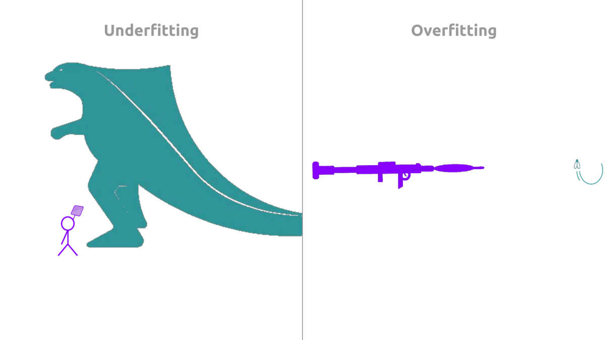
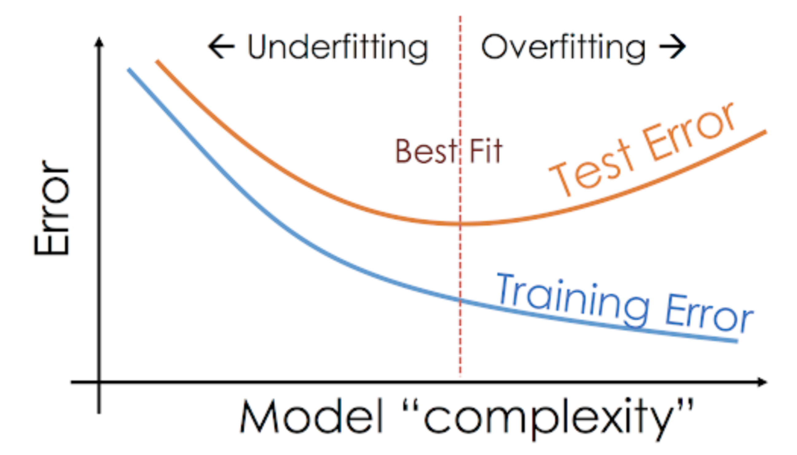
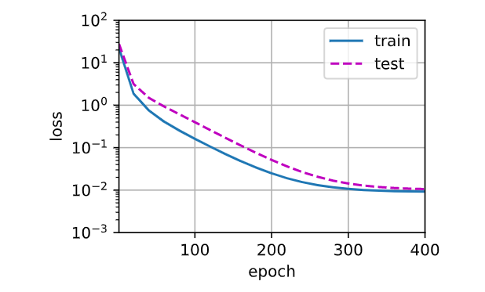
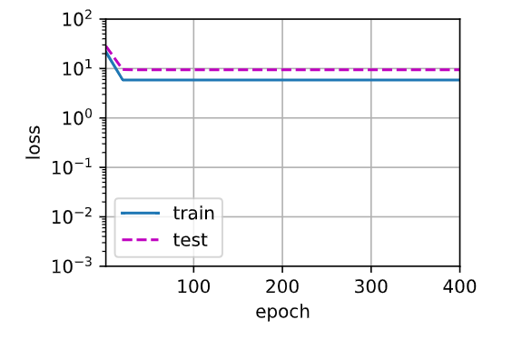
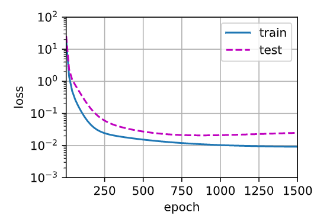

# 11 - 模型选择和过拟合欠拟合

---

🎦 本节课程视频地址 👉
[](https://www.bilibili.com/video/BV1kX4y1g7jp?spm_id_from=333.999.0.0)

## 模型选择

**训练误差**：模型在训练数据集上的误差。

**泛化误差**：模型在新数据集上的误差。

**验证数据集**：一个用来评估模型好坏的数据集。

**测试数据集**：只用一次的数据集。（不能用来调整超参数）

**K-则交叉验证**

如果没有足够的数据集，将训练数据集分割成 $K$ 块，
For $i=1,...,K$
使用第 $i$ 块作为验证数据集，其余的作为训练数据集。
报告 $K$ 个验证集训练的误差，
常用$K=5$或$10$

取精度最好对每个超参数进行调整。

## 过拟合和欠拟合(overfitting and underfitting)

|  模型复杂度\数据集 |简单   |复杂   |
|---|---|---|
| 低 | 正常  | 欠拟合  |
| 高 | 过拟合| 正常|

- **模型容量**

拟合各种函数的能力

低容量的模型难以拟合训练数据

高容量的模型可以记住所有的训练数据







要旨在于，首先保证模型容量，再控制精度，可能会承受一定的过拟合。

**估计模型容量**

难以在不同种类算法之间比较，例如树模型和神经网络。

给定一个模型种类，将有两个主要因素：

- 参数的个数
- 参数值的选择范围

**VC维**

统计学习理论的一个核心思想

对一个分类模型，VC维等于一个最大的数据集大小，不管如何给定标号，都存在一个模型来对它进行完美分类。= 能够完美地记住一个数据集。

Eg:2维输入的感知机， VC维=3，即能够分类任何三个点，但不是四个(XOR)。

支持N维输入的感知机VC维是N+1，
一些多层感知机的VC维是$O(Nlog_2N)$

提供了为什么一个模型好的理论依据，可以衡量训练误差和泛化误差之间的间隔。

但深度学习中很少使用：
- 衡量不是很准确
- 计算深度学习模型的VC维很困难

**数据复杂度**

- 样本个数
- 每个样本的元素个数（张量的维度和大小）
- 时间、空间结构（图片的空间结构、视频的时间空间维度）
- 多样性（如分几类）

模型容量需要匹配数据复杂度

统计学提供了一些理论依据，实际要靠训练/泛化误差对比

## 代码实例

对三阶多项式生成训练和测试数据：

$$y=5+1.2x-3.4{x^2\over2!}+5.6{x^3\over3!}+\epsilon\ where\ \epsilon\sim\aleph(0,0.1^2)$$

用阶乘作为分母抵消求导系数的影响。

- **创建数据集**

```
import numpy as np
import math
import torch
from torch import nn
from d2l import torch as d2l

max_degree = 20
n_train, n_test = 100, 1000
true_w = np.zeros(max_degree)
true_w[0:4] = np.array([5, 1.2, -3.4, 5.6])
#其余w=0，噪音项，即一个20维的向量，只有前四项有实值。

features = np.random.normal(size=(n_train + n_test, 1))
# np.random.normal的位置参数loc=0.0,scale=1.0定义了正态分布
# size=(1100, 1)返回一个长度1100的列向量
np.random.shuffle(features)
poly_features = np.power(features, np.arange(max_degree).reshape(1, -1))
# np.power(a,b)返回a**b,如果是两个不同维度的数组，则以行为广播法则。
# (1100,1)**(1,20)=(1100,20)
for i in range(max_degree):
    poly_features[:, i] /= math.gamma(i + 1)
    #对其进行gamma函数变换，可以视作阶乘gamma(z)=(z-1)!
labels = np.dot(poly_features, true_w)
# (1100,20)*(20,1)=(1100,1)
labels += np.random.normal(scale=.1, size=labels.shape)
# 偏差b, y = XwT + b
# 这1100个散点加上扰动(第5-20阶计算)与偏差之和，已经不完全服从原多项式，所以要先拟合出曲线。

true_w, features, poly_features, labels = [torch.tensor(x, dtype=torch.float32) for x in [true_w, features, poly_features, labels]]

features[:2], poly_features[:2, :], labels[:2]
```

- **训练**

```
def evaluate_loss(net, data_iter, loss):  
    metric = d2l.Accumulator(2)  
    for X, y in data_iter:
        out = net(X)
        y = y.reshape(out.shape)
        #把y和y_hat形状统一
        l = loss(out, y)
        metric.add(l.sum(), l.numel())
    return metric[0] / metric[1]
```
```
def train(train_features, test_features, train_labels, test_labels,
          num_epochs=400):
    #features-x;labels-y
    loss = nn.MSELoss(reduction='none')
    #损失不求平均
    input_shape = train_features.shape[-1]
    #train_features.shape是返回的是(m,n)的元组，所以-1代表列所对应元素n。
    #input是poly_features[:,:n],正常是4阶，欠拟合<4，过拟合>4
    net = nn.Sequential(nn.Linear(input_shape, 1, bias=False))
    #(n，1), y_hat = w1x1+w2x2+w3x3+w4x4，回归结果只考虑前四项。
    #如果欠拟合，就会漏项；如果过拟合，就会多考虑干扰项。
    batch_size = min(10, train_labels.shape[0])
    #labels是一个向量，只有一个维度，为1000，但是.shape()返回的是一个元组，所以必须提取元素。
    train_iter = d2l.load_array((train_features, train_labels.reshape(-1,1)),
                                batch_size)
    #.load_array/DataLoader都是一个迭代器，从提取(train_features, train_labels.reshape(-1,1)
    #两个数据源分别作为提取源，每次批量=batch_size
    #把labels变成二维矩阵，与features统一维度，从而提取。
    #is_train表示用于训练。
    test_iter = d2l.load_array((test_features, test_labels.reshape(-1,1)),
                               batch_size, is_train=False)
    trainer = torch.optim.SGD(net.parameters(), lr=0.001)
    animator = d2l.Animator(xlabel='epoch', ylabel='loss', yscale='log',
                            xlim=[1, num_epochs], ylim=[1e-3, 1e2],
                            legend=['train', 'test'])
    for epoch in range(num_epochs):
        d2l.train_epoch_ch3(net, train_iter, loss, trainer)
        if epoch == 0 or (epoch + 1) % 20 == 0:
            animator.add(epoch + 1, (evaluate_loss(net, train_iter, loss),
                                     evaluate_loss(net, test_iter, loss)))
            #大概就是说每20个epoch绘制一个数据点。
    print('weight:', net[0].weight.data.numpy())
    #net是一个Sequential()的模块打包元组，net[0]就是nn.Linear模块
    #用.data.numpy()将张量转化成数组
                         
```
- **正常拟合**

```
# 从多项式特征中选择前4个维度，即1,x,x^2/2!,x^3/3!
train(poly_features[:n_train, :4], poly_features[n_train:, :4],
      labels[:n_train], labels[n_train:])
#取前1000和后100作为训练/测试，并且只选择正确的前四阶。
#labels是所有扰动和形成的散点
```


- **欠拟合**
```
# 从多项式特征中选择前4个维度，即1,x,x^2/2!,x^3/3!
train(poly_features[:n_train, :4], poly_features[n_train:, :4],
      labels[:n_train], labels[n_train:])
#取前1000和后100作为训练/测试，并且只选择正确的前四阶。
#labels是所有扰动和形成的散点
```

- **过拟合**

```
# 从多项式特征中选取所有维度
train(poly_features[:n_train, :], poly_features[n_train:, :],
      labels[:n_train], labels[n_train:], num_epochs=1500)
```


关于机器学习模型有一个重点，因为计算是基于张量的矩阵运算，所以要明确每一个模块里输入输出的维度和数据类型，整体形状的统一，还有内置运算是否存在转置，建议每次定义/引用一个数据集时注释其维度，并在模块引用时注释相应的调入维度，使前后相匹配。