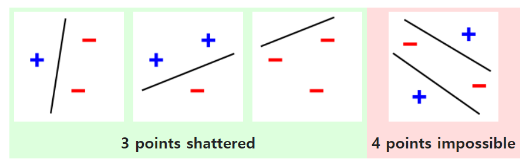

# 11 - 模型选择和过拟合欠拟合

---

### 🎦 本节课程视频地址 👇

[](https://www.bilibili.com/video/BV1kX4y1g7jp?spm_id_from=333.999.0.0)

## 模型选择

- 训练误差：模型在**训练数据**上的误差
- 泛化误差：模型在**新数据**上的误差
- 训练数据集（Training Dataset）：用于训练**模型参数**
- 验证数据集（Validation Dataset）：一个用来评估模型好坏的数据集。用来选择、调整模型**超参数**
  - 例如取出 50%的训练数据作为验证数据
  - 不要与训练数据**混用**（常犯错误），因为验证数据没有参与模型训练，可以反映出超参数好坏（当数据量不够时，可以采取下文的 k-折交叉验证来构造）
- 测试数据集（Testing Dataset）：只用**一次**的数据集。（不能用来调整超参数）

### K-折交叉验证（K-Fold Cross Validation）

如果**没有足够**的数据集，一般常用此权衡方法构造训练数据集和验证数据集：

- 将训练数据集分割成 $K$ 块，
- For $i=1,...,K$
  - 使用第 $i$ 块作为验证数据集，其余的作为训练数据集。
- 报告 $K$ 个验证集训练的误差，
- 常用$K=5$或$10$（小数据集），较大数据集可以$K=2、3$等

> 因为 K-折交叉验证要训练 K 次，所以目前大数据集任务上一般也不采用，只在中小数据集上使用。通过该方法不会提高模型参数训练质量，仅用于调整模型**超参数**。

## 过拟合和欠拟合(overfitting and underfitting)


|              | 简单数据 | 复杂数据 |
| ------------ | -------- | -------- |
| 低模型复杂度 | 正常     | 欠拟合   |
| 高模型复杂度 | 过拟合   | 正常     |

**模型复杂度**（即：**模型容量**）：拟合各种函数的能力

模型复杂度要与**数据复杂度**相匹配。

- 高模型复杂度的模型去训练简单数据，会造成特征过度提取，过分关注噪音，容易“记住”所有训练数据，而丧失泛化性；
- 低模型复杂度的模型去训练复杂数据，会造成无法提取有效特征


一般我们使用泛化误差和训练误差的差值作为模型是否欠拟合、过拟合的衡量


要旨在于，首先保证模型容量，再控制精度，可能会承受一定轻微的过拟合。

### 估计模型容量

- 难以在不同种类算法之间比较，例如树模型和神经网络。

- 给定一个模型种类，将有两个主要因素：
  - 参数的个数
  - 参数值的选择范围

### VC 维

- 统计学习理论的一个核心思想

- 对一个分类模型，VC 维等于一个最大的数据集大小，不管如何给定标号，都存在一个模型来对它进行完美分类。



> 例如，2 维输入的感知机， VC 维=3，即能够分类任何三个点，但不是四个(XOR)。

> 支持 N 维输入的感知机 VC 维是 N+1

> 一些多层感知机的 VC 维是$O(Nlog_2N)$

#### VC 维的用处

- 提供了为什么一个模型好的理论依据，可以衡量训练误差和泛化误差之间的间隔。
- 但深度学习中很少使用：
  - 衡量不是很准确
  - 计算深度学习模型的 VC 维很困难

### 数据复杂度

- 样本个数
- 每个样本的元素个数（张量的维度和大小）
- 时间、空间结构（图片的空间结构、视频的时间空间维度）
- 多样性（如分几类）

统计学提供了一些理论依据，实际要靠训练/泛化误差对比

## 代码实例

使用以下三阶多项式生成训练和测试数据：

$$y=5+1.2x-3.4{x^2\over2!}+5.6{x^3\over3!}+\epsilon\ where\ \epsilon\sim\aleph(0,0.1^2)$$

> 用阶乘作为分母抵消求导系数的影响。

- 创建数据集

```python
import numpy as np
import math
import torch
from torch import nn
from d2l import torch as d2l

max_degree = 20
n_train, n_test = 100, 100
true_w = np.zeros(max_degree)
true_w[0:4] = np.array([5, 1.2, -3.4, 5.6])
#其余w=0，噪音项，即一个20维的向量，只有前四项有实值。

# np.random.normal的位置参数loc=0.0,scale=1.0定义了正态分布
# size=(200, 1)返回一个长度200的列向量
features = np.random.normal(size=(n_train + n_test, 1))
np.random.shuffle(features)

# np.power(a,b)返回幂指数a^b,如果是两个不同维度的数组，使用广播法则。
# (200,1)^(1,20)=(200,20)
poly_features = np.power(features, np.arange(max_degree).reshape(1, -1))

for i in range(max_degree):
    #对其进行gamma函数变换，可以视作阶乘gamma(z)=(z-1)!
    poly_features[:, i] /= math.gamma(i + 1)

labels = np.dot(poly_features, true_w)  # (200,20)*(20,1)=(200,1)
labels += np.random.normal(scale=.1, size=labels.shape)

# 使用列表推导将所有数值转换为Tensor类型
true_w, features, poly_features, labels = [torch.tensor(x, dtype=torch.float32) for x in [true_w, features, poly_features, labels]]

features[:2], poly_features[:2, :], labels[:2]
```

- 训练

```python
def evaluate_loss(net, data_iter, loss):
    metric = d2l.Accumulator(2)
    for X, y in data_iter:
        out = net(X)
        y = y.reshape(out.shape)
        #把y和y_hat形状统一
        l = loss(out, y)
        metric.add(l.sum(), l.numel())
    return metric[0] / metric[1]
```

```python
def train(train_features, test_features, train_labels, test_labels,
          num_epochs=400):
    #features-x;labels-y
    loss = nn.MSELoss(reduction='none') #损失不求平均
    # 输入数据的维数,线性模型是4阶，欠拟合<4，过拟合>4
    input_shape = train_features.shape[-1] #.shape是返回的是(m,n)的元组，所以-1代表列所对应元素n。

    net = nn.Sequential(nn.Linear(input_shape, 1, bias=False))
    batch_size = min(10, train_labels.shape[0])

    # 两个数据源分别作为提取源，每次批量=batch_size
    # 把labels变成二维矩阵，与features统一维度，从而提取。
    # is_train表示用于训练。
    train_iter = d2l.load_array((train_features, train_labels.reshape(-1,1)),batch_size)
    test_iter = d2l.load_array((test_features, test_labels.reshape(-1,1)),batch_size, is_train=False)

    trainer = torch.optim.SGD(net.parameters(), lr=0.001)
    animator = d2l.Animator(xlabel='epoch', ylabel='loss', yscale='log',xlim=[1, num_epochs], ylim=[1e-3, 1e2],legend=['train', 'test'])

    for epoch in range(num_epochs):
        d2l.train_epoch_ch3(net, train_iter, loss, trainer)
        if epoch == 0 or (epoch + 1) % 20 == 0: #每20个epoch绘制一个数据点。
            animator.add(epoch + 1, (evaluate_loss(net, train_iter, loss),evaluate_loss(net, test_iter, loss)))
    print('weight:', net[0].weight.data.numpy())    # net[0]就是nn.Linear模块
```

- **正常拟合**：选取数据集前 4 列

```python
'''
定义完训练函数，接着从多项式特征数据中选择前4个维度进行训练，即1,x,x^2/2!,x^3/3!
'''
train(poly_features[:n_train, :4], poly_features[n_train:, :4],
      labels[:n_train], labels[n_train:])

```


- **欠拟合**：只选取数据集前两列

```python
# 从多项式特征中选择前2个维度，即1,x,x^2/2!,x^3/3!
train(poly_features[:n_train, :2], poly_features[n_train:, :2],
      labels[:n_train], labels[n_train:])
```


- **过拟合**：选取所有数据集

```python
# 从多项式特征中选取所有维度
train(poly_features[:n_train, :], poly_features[n_train:, :],
      labels[:n_train], labels[n_train:], num_epochs=1500)
```


> 关于机器学习模型有一个重点，因为计算是基于张量的矩阵运算，所以要明确每一个模块里输入输出的维度和数据类型，整体 Shape 的统一，还有内置运算是否存在转置，建议每次定义/引用一个数据集时注释其维度，并在模块引用时注释相应的调入维度，使前后相匹配。

---

## Q&A🤓

**Q：SVM（支持向量机）在分类任务中效果也可以，但为什么不如神经网络应用广泛？**

**🙋‍♂️**：一个原因是传统机器学习算法如 SVM（或者 kernal SVM）在小数据集上训练还是可以，但数据量大时，训练就会比较困难。而且 SVM 可调的超参数不多、Kernal 的不同选择对结果区别不明显。另一个原因如沐神所说，神经网络相当于一个“**语言**”，可以针对不同任务，进行灵活的组合变化，可编程性很强，目前大多数深度学习框架也都是“**图灵完备（Turing Complete）**”语言，可以解决所有的可计算问题。同时神经网络是一种“**端到端学习（End-to-End Learning）**”，比如对于图片分类任务，SVM 还需要专门设计特征提取器和分类器，而神经网络可以在一种架构下同时具备这两个功能。

**Q：一般训练、测试、验证三个数据集的划分标准是什么？**

**🙋‍♂️**：一般情况划分总数据的 30%作为测试数据，总数据的 70%作为训练数据，同时在训练数据上做 5-折交叉验证，如果数据足够大，可以五五开分割测试和训练数据集，同时在训练数据集做 k-折交叉验证。

**Q：对于分类问题，如果数据集中各类数量很不平衡，那么在构造验证数据集的时，各类数量应保持与原始数据集相似的不平衡比例，还是均衡各类比例？**

**🙋‍♂️**：在验证数据集上还是要均衡各类比例，这样可以避免模型存在“偏好”问题。（比如二分类问题，正负样本比例为 90%：10%，如果验证数据集保持 9：1 比例，则哪怕模型全部判正类，在此验证数据集上也会获得 90%的精度，这是不正确的）。

解决方法是首先评估数据集不平衡性和真实世界的情况是否吻合，如果真实世界也是如此不平衡，那模型专注于做好主流分类就 Ok；如果只是数据集采样导致不平衡，则可以通过增加少样本的权重来增大重要性（比如复制多份、在 Loss 函数里加权等等）。

**Q：沐神对于当下深度学习的感受经典定义**

**🙋‍♂️**：“大家希望深度学习是一门‘**科学**👨‍🎓’，但实际上是一门‘**工程**👨‍🔧’，其中 50%还是‘**艺术**👨‍🎨’”。
