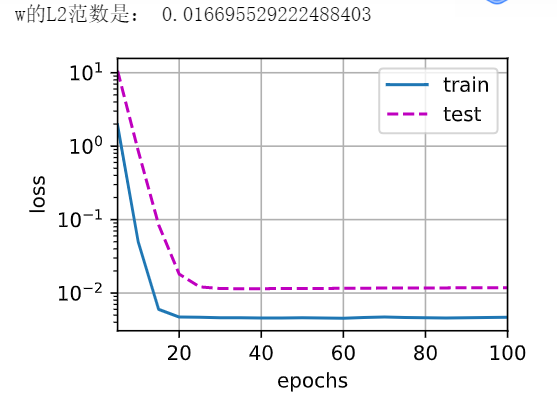

# 12 - 权重衰退（Weight Decay）

---

### 🎦 本节课程视频地址 👇

[](https://www.bilibili.com/video/BV1UK4y1o7dy?spm_id_from=333.999.0.0)

> 最常见的处理过拟合的方法。

## 如何控制模型容量？

### 使用均方范数作为硬性限制条件

通过限制参数值的选择范围来控制模型容量。

$$\min l({\bf w},b)\ \ \ \ subject\ to\ ||{\bf w}||^2\le\theta$$

> 意思就是每一个$w_i$的值都不能太大。

- 通常不限制偏移$b$，效果也不显著。
- 小的$\theta$相当于更强的正则项。

> 但一般不采用，因为该定义不好做优化（已有的优化算法无法处理这一硬性条件）

### 使用均方范数作为柔性限制

为解决上个方法不好优化的问题，可将硬性条件形式化到损失函数中。对于上面的每个$\theta$，都可以找到$\lambda$使得之前的目标函数等价于下式：

$$\min\  l({\bf w},b)+{\lambda\over2}||{\bf w}||^2$$

> 最后一项称之为**惩罚项（Penalty）**，可以通过拉格朗日乘子证明与上式等价。

超参数$\lambda$控制了正则项的重要程度

- $\lambda=0$：无作用；
- $\lambda\to\infty, {\bf w^*\to0}$

> 图片解释：同心圆代表损失函数的等高线，则等高线中心代表未加正则项的最小损失点，而正则项${\lambda\over2}||{\bf w}||^2$代表的等高线为图中以原点为圆心的阴影圆，其最小惩罚值在坐标轴原点。则在图中必存在一个平衡点，使得损失+正则惩罚值最小


### 参数更新法则

- 计算梯度

$${\partial\over\partial{\bf w}}(l({\bf w},b)+{\lambda\over2}||{\bf w}||^2)={\partial{l({\bf w},b)}\over\partial{\bf w}}+\lambda{\bf w}$$

- 时间$t$更新参数

$$
\begin{aligned}
    {\bf w_{t+1}}& = \bf w_t-\eta {\partial \it{l}\over\partial{\bf w_t}} \\
    &= (1-\eta\lambda){\bf w_t}-\eta{\partial{l({\bf w_t},b_t)}\over\partial{\bf w_t}}
\end{aligned}
$$

> 通常$\eta\lambda\lt1$，$0<1-\eta\lambda\lt1$，相当于每一次更新前先缩小当前的权重。在深度学习中叫**权重衰退（Weight Decay）**。

**权重衰退**通过 L2 正则项使得模型参数不会过大，从而控制模型复杂度。正则项权重$\lambda$是控制模型复杂度的超参数。

## 权重衰退的代码实现

首先生成一个人工数据集，依据：

$$y=0.05+\sum_{i=1}^d0.01x_i+\epsilon\ where\ \epsilon\in\aleph (0,0.01^2)$$

- 创建数据集

```
%matplotlib inline
import torch
from torch import nn
from d2l import torch as d2l

# 训练集n_train越小，越容易过拟合；同理，输入特征num_inputs越多，模型越复杂
n_train, n_test, num_inputs, batch_size = 20, 100, 200, 5

true_w, true_b = torch.ones((num_inputs, 1)) * 0.01, 0.05   #true_w=(200*1),b=0.05

# synthetic_data()函数返回y=wx+b+noise，n_train表示执行此任务的样本数量，这个函数已经考虑了噪音。
train_data = d2l.synthetic_data(true_w, true_b, n_train)
train_iter = d2l.load_array(train_data, batch_size)

test_data = d2l.synthetic_data(true_w, true_b, n_test)
test_iter = d2l.load_array(test_data, batch_size, is_train=False)
```

- 初始化模型参数和$L_2$惩罚

```
def init_params():
    w = torch.normal(0, 1, size=(num_inputs, 1), requires_grad=True)
    b = torch.zeros(1, requires_grad=True)
    return [w, b]
```

- 定义$L_2$范数惩罚

```
def l2_penalty(w):
    return torch.sum(w.pow(2)) / 2  # .pow()函数代表指数运算符
```

- 定义训练函数

```
def train(lambd):
    w, b = init_params()
    net, loss = lambda X: d2l.linreg(X, w, b), d2l.squared_loss
    num_epochs, lr = 100, 0.003
    animator = d2l.Animator(xlabel='epochs', ylabel='loss', yscale = 'log',xlim=[5, num_epochs], legend=['train', 'test'])
    for epoch in range(num_epochs):
        for X, y in train_iter:
            #with torch.enable_grad(): 新版不需要这么写
            l = loss(net(X), y) + lambd * l2_penalty(w)
            l.sum().backward() #求导已经包括对lambda项的求导
            d2l.sgd([w, b], lr, batch_size)
        if (epoch + 1) % 5 == 0:
            animator.add(epoch + 1, (d2l.evaluate_loss(net, train_iter, loss),d2l.evaluate_loss(net, test_iter, loss)))
    print('w的L2范数是：', torch.norm(w).item())    #Returns the matrix norm or vector norm of a given tensor
    #返回值是一个tensor，所以要用item()调用元素。
    #只有一维张量可以返回一个标量，因为本身就是一个标量，只是改了数据类型。
```

- 分不同$\lambda$训练

```
train(0) # 0代表没有dw

# 输出L2范数为：12.5628
```

> 由图形状可知，模型已严重过拟合


```
train(lambd=3)
# 输出L2范数为：0.3527
```

> 由图形状可知，模型过拟合程度减轻


```
train(lambd=20)
```
> 由图可知，此时模型拟合程度比较好



- 简洁实现

```
def train_concise(wd):
    net = nn.Sequential(nn.Linear(num_inputs, 1))   #在Linear已经设计了w,b的初值
    
    # 参数以正态分布初始化
    for param in net.parameters():
        param.data.normal_()
    loss = nn.MSELoss()
    num_epochs, lr = 100, 0.003
    
    trainer = torch.optim.SGD([{
        'params': net[0].weight, 
        'weight_decay':wd}, 
        {"params": net[0].bias}], lr=lr)
    #对w有wd，b没有，所以要用字典写，分别定义。
    #params=[w,b]
    animator = d2l.Animator(xlabel='epochs', ylabel='loss', yscale='log',
                           xlim=[5, num_epochs], legend=['test', 'train'])
    for epoch in range(num_epochs):
        for X, y in train_iter:
            trainer.zero_grad()
            l = loss(net(X), y)
            l.backward()
            trainer.step()
        if (epoch + 1) % 5 == 0:
            animator.add(epoch + 1, (d2l.evaluate_loss(net, train_iter, loss),
                                   d2l.evaluate_loss(net, test_iter, loss)))
    print('w的L2范数是：', net[0].weight.norm().item())
    #w是net[0]Sequential的第一个模块Linear的attr，求norm()后再提取成scalar。
```

- 训练

```
train_concise(0)
# 输出L2范数为：13.79
```


```
train_concise(3)
# 输出L2范数为：0.45
```


## Pytorch 模块参考文档

- `torch.norm(input,p=2)`Pytorch求输入的p范数（默认为L2范数，结果均为开根号） 🧐[中文](https://pytorch-cn.readthedocs.io/zh/latest/package_references/torch/#torchnorm) | [官方英文](https://pytorch.org/docs/stable/generated/torch.norm.html?highlight=norm#torch.norm)
- `torch.optim.SGD`Pytorch求输入的p范数（默认为L2范数，结果均为开根号） 🧐[中文](https://pytorch-cn.readthedocs.io/zh/latest/package_references/torch-optim/) | [官方英文](https://pytorch.org/docs/stable/generated/torch.optim.SGD.html?highlight=sgd)

---

## Q&A🤓

**Q：有一个现象，就是简洁实现收敛所需要的的 epoch 明显多于手动实现，而且收敛后也不是完全的平滑，这是什么原因？**

> 下图为Yuliang Zhu wd=5的简洁实现结果图


> 下图为Yuliang Zhu wd=5的从零实现结果图


**🙋‍♂️**：首先两次训练epoch不相等，会造成图形在相同宽度内横向拉伸压缩变形较多，很难进行形状走势的对比，无法判断收敛快慢。这里重新实现不同权重衰退、相同**epoch=300**的结果如下：

> 下图为wd=0,epoch=300的结果图（左：从零实现；右：简洁实现）


---

> 下图为wd=5,epoch=300的结果图（左：从零实现；右：简洁实现）


---

> 下图为wd=10,epoch=300的结果图（左：从零实现；右：简洁实现）


---

> 下图为wd=20,epoch=300的结果图（左：从零实现；右：简洁实现）


通过以上对比试验，发现的确存当$wd>0$时，从零实现版本要比简洁实现版本收敛速度更快；当不使用权重衰退时（$wd=0$），简洁实现收敛快于从零实现版本，且精度更高。确实很奇怪。

关于平滑性问题，在未使用权重衰退（$wd=0$）时，的确在训练后期看到较明显的精度震荡；使用权重衰退时，不平滑性的区别不是太明显。

通过分析发现，在相同$wd>0$取值下，两种实现的模型最后的参数L2范数相差较大（约2倍差距）。初步怀疑是简洁实现代码中，优化器参数指定一段：

```
trainer = torch.optim.SGD([{
        'params': net[0].weight, 
        'weight_decay':wd}, 
        {"params": net[0].bias}], lr=lr)
```

简洁实现将权重衰退加至优化器参数中，而从零实现代码加至损失函数中。可能造成最后L2范数不同？（待讨论）

目前排除以下原因：

- 参数初始化：两种实现模型参数初始化时均采用均值为零方差为一的方法（简洁实现中使用的`param.data.normal_()`默认也为0、1正态）