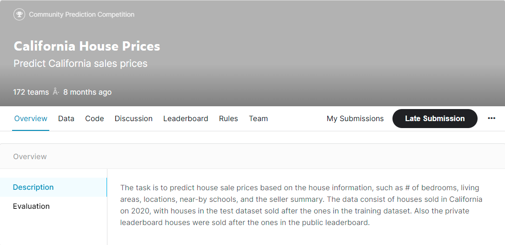

# 15 - Kaggle 加州房价预测实战

---

### 🎦 本节课程视频地址 👇

[](https://www.bilibili.com/video/BV1NK4y1P7Tu?spm_id_from=333.999.0.0)

之前几节我们学习了一些训练深度网络的基本工具和网络正则化的技术（如**权重衰减**、**暂退法**等）。 本节我们将通过 Kaggle 比赛，将所学知识付诸实践。 Kaggle 的房价预测比赛是一个很好的起点。 此数据集由 Bart de Cock 于 2011 年收集， 涵盖了 2006-2010 年期间亚利桑那州埃姆斯市的房价。 这个数据集是相当通用的，不会需要使用复杂模型架构。 它比哈里森和鲁宾菲尔德的波士顿房价数据集要大得多，也有更多的特征。

本节我们将详细介绍数据预处理、模型设计和超参数选择。 通过亲身实践，你将获得一手经验，这些经验将指导你数据科学家职业生涯。

> 该比赛项目网址：点击 👉[这里](https://www.kaggle.com/c/house-prices-advanced-regression-techniques/overview)，数据描述：点击 👉[这里](https://www.kaggle.com/c/house-prices-advanced-regression-techniques/data)

- 准备工作——定义数据下载函数

```python
import hashlib  # 导入散列计算包
#把任意长度的输入，通过某种hash算法，变换成固定长度的输出，

import os
import tarfile #TarFile类对于就是tar压缩包实例
import zipfile
import requests

DATA_HUB = dict()
DATA_URL = 'http://d2l-data.s3-accelerate.amazonaws.com/'

def download(name, cache_dir=os.path.join('..', 'data')):
    # os.path.join()路径拼接，相当于../data文件夹。

    assert name in DATA_HUB, f"{name} 不存在于 {DATA_HUB}"
    url, sha1_hash = DATA_HUB[name]
    os.makedirs(cache_dir, exist_ok=True)   #os.makedirs()y用于创建目录，exist_ok=True，默认为False,目标文件夹存在会报错
    fname = os.path.join(cache_dir, url.split('/')[-1]) #把url按照/拆分，提取最后一个字符串连接目录，作为文件名

    if os.path.exists(fname):   #os.path.exists()检测文件是否已下载
        sha1 = hashlib.sha1()   # 指定sha1散列算法
        with open(fname, 'rb') as f:    # 'rb'二进制只读方式
            while True: # 默认读取所有内容
                data = f.read(1048576)  # file.read([size])指定一次最多可读取的字符（字节）个数
                #size=1048576=1024*1024,每次的读取1Mb。

                if not data:    # 如过返回空，则停止读取
                    break
                sha1.update(data)   #update()合并与覆盖当前内容
        if sha1.hexdigest() == sha1_hash:
            return fname  # 如果计算的散列值与指定相等，则返回文件

    # 如果目录下没有文件，则进行下载
    print(f'正在从{url}下载{fname}...')
    r = requests.get(url, stream=True, verify=True) # 指定使用流式下载方式
    with open(fname, 'wb') as f:    # 'wb'二进制写入方式
        f.write(r.content)
    return fname
```

- 下载&解压函数

```python
def download_extract(name, folder=None):
    fname = download(name)
    base_dir = os.path.dirname(fname)   # 提取文件路径
    data_dir, ext = os.path.splitext(fname) # 分离文件名与扩展名

    if ext == '.zip':   # 解压zip格式文件
        fp = zipfile.ZipFile(fname, 'r')
    elif ext in ('tar', '.gz'): # 解压tar格式文件
        fp = tarfile.open(fname, 'r')
    else:
        assert False
    fp.extractall(base_dir) # 指定解压路径
    return os.path.join(base_dir, folder) if folder else data_dir

def download_all():
    for name in DATA_HUB:
        download(name)
```

- 下载并读取数据

```python
%matplotlib inline
import numpy as np
import pandas as pd
import torch
from torch import nn
from d2l import torch as d2l

DATA_HUB['kaggle_house_train'] = (
    DATA_URL + 'kaggle_house_pred_train.csv',
    '585e9cc93e70b39160e7921475f9bcd7d31219ce')

DATA_HUB['kaggle_house_test'] = (
    DATA_URL + 'kaggle_house_pred_test.csv',
    'fa19780a7b011d9b009e8bff8e99922a8ee2eb90')

train_data = pd.read_csv(download('kaggle_house_train'))
test_data = pd.read_csv(download('kaggle_house_test'))
```

- 数据预处理

```python
all_features = pd.concat((train_data.iloc[:, 1:-1], test_data.iloc[:, 1]))
# 默认按行连接纵向层叠（增加行数）训练数据和测试数据
# 刨去train_data第一列ID,和最后一列labels,test_data第一列ID


# 取出所有数值类型（非'object'）的特征索引
numeric_features = all_features.dtypes[all_features.dtypes != 'object'].index
# 对数值列进行normalization，均值为0，方差为1
all_features[numeric_features] = all_features[numeric_features].apply(
lambda x: (x - x.mean()) / (x.std()))
# 对缺失值补零
all_features[numeric_features] = all_features[numeric_features].fillna(0)

all_features = pd.get_dummies(all_features, dummy_na=True)  #get_dummies()进行one-hot编码
all_features.shape
```

> 此处对训练数据和测试数据合并一起计算均值和方差的方法仅适用于 Kaggle 比赛，因为比赛中会为提交的模型提供**新的**测试数据集。如果在实际项目中，须仅在训练数据集计算均值方差后，再应用到测试数据的归一化。否则在全数据集上计算，会导致一定程度的**特征泄露**（类似考试漏题），而造成测试精度虚高。

- 将数据转换为 Tensor

```python
# 获得训练数据和测试数据的切分点
n_train = train_data.shape[0]   # 1460
# 转换训练数据和测试数据
train_features = torch.tensor(all_features[:n_train].values,dtype=torch.float32)    # 1460*331
test_features = torch.tensor(all_features[n_train:].values,dtype=torch.float32)     # 1459*331
# 转换训练标签
train_labels = torch.tensor(train_data.SalePrice.values.reshape(-1, 1),dtype=torch.float32)     # 1460*1
```

- 创建神经网络

```python
# MSE损失函数
loss = nn.MSELoss()
in_features = train_features.shape[1]   # 331

# 定义一个单层神经网络做线性回归
def get_net():
    net = nn.Sequential(nn.Linear(in_features, 1))
    return net
```

- 重新定义损失函数

房价就像股票价格一样，我们关心的是相对数量，而不是绝对数量。因此，**我们更关心相对误差$\frac{y - \hat{y}}{y}$**，而不是绝对误差$y - \hat{y}$。

例如，如果我们在俄亥俄州农村地区估计一栋房子的价格时，假设我们的预测偏差了 10 万美元，然而那里一栋典型的房子的价值是 12.5 万美元，那么模型可能做得很糟糕。另一方面，如果我们在加州豪宅区的预测出现同样的 10 万美元的偏差，（在那里，房价中位数超过 400 万美元）这可能是一个不错的预测。

**解决这个问题的一种方法是用价格预测的对数来衡量差异**。事实上，这也是比赛中官方用来评价提交质量的误差指标。即将$\delta$ for $|\log y - \log \hat{y}| \leq \delta$
转换为$e^{-\delta} \leq \frac{\hat{y}}{y} \leq e^\delta$。这使得预测价格的对数与真实标签价格的对数之间出现以下均方根误差：

$$\sqrt{\frac{1}{n}\sum_{i=1}^n\left(\log y_i -\log \hat{y}_i\right)^2}.$$

```python
# log损失
def log_rmse(net, features, labels):
    # clamp(x, min, max)，钳制值在[min, max]
    clipped_preds = torch.clamp(net(features), 1, float('inf'))
    #Loss求均方损失，输出一个标量
    rmse = torch.sqrt(loss(torch.log(clipped_preds), torch.log(labels)))
    return rmse.item()

#tensor.item()=number
#Returns the value of this tensor as a standard Python number.
#This only works for tensors with one element（标量）.
```

- 训练函数

训练函数将借助**Adam 优化器**，而不是原来的**SGD 优化器**，并启用**权重衰减**（weight decay）。Adam 优化器的主要吸引力在于它对初始学习率不那么敏感。

```python
def train(net, train_features, train_labels, test_features, test_labels,
          num_epochs, learning_rate, weight_decay, batch_size):
    train_ls, test_ls = [], []
    train_iter = d2l.load_array((train_features, train_labels), batch_size)
    optimizer = torch.optim.Adam(net.parameters(),
                                lr=learning_rate,
                                weight_decay=weight_decay)
    for epoch in range(num_epochs):
        for X, y in train_iter:
            optimizer.zero_grad()
            l = loss(net(X), y)
            l.backward()
            optimizer.step()
        # 每个epoch计算训练集的rmse loss并添加到列表
        train_ls.append(log_rmse(net, train_features, train_labels))
        # 每个epoch计算测试集的rmse loss并添加到列表
        if test_labels is not None:
            test_ls.append(log_rmse(net, test_features, test_labels))
    return train_ls, test_ls    # 返回训练和测试损失的列表长度分别为epoch此处
```

- 定义 K-折交叉验证步骤

```python
# 对数据进行k-折交叉验证的划分，并返回第i折的训练数据数据和验证数据
def get_k_fold_data(k, i, X, y):
    assert k > 1
    fold_size = X.shape[0] // k     # “//”代表z整除，得到每折应有的样本数
    X_train, y_train = None, None

    for j in range(k):
         # slice(start, stop[, step])返回一个切片索引
        idx = slice(j * fold_size, (j + 1) * fold_size)
        # 每个循环切片出fold_size个子数据集j
        X_part, y_part = X[idx, :], y[idx]
        # 当循环至指定的第i块时，取出当作valid验证集
        if j == i:
            X_valid, y_valid = X_part, y_part
        # 否则当X_train为空时，取出第j块当作训练集
        elif X_train is None:
            X_train, y_train = X_part, y_part
        # 当训练集不为空时，纵向依次连结数据集
        else:
            X_train = torch.cat([X_train, X_part], 0)
            y_train = torch.cat([y_train, y_part], 0)
    # 返回的是第i个折为测试数据集集、其余为训练数据集的k-fold数据
    return X_train, y_train, X_valid, y_valid


# 定义k-折训练过程
def k_fold(k, X_train, y_train, num_epochs, learning_rate, weight_decay, batch_size):
    train_l_sum, valid_l_sum = 0, 0
    # 通过循环，依次取出k折的每一当前折的子集作为测试数据集，其余为训练数据集进行训练
    for i in range(k):
        # 以第i折为测试集，其余为训练集
        data = get_k_fold_data(k, i, X_train, y_train)
        net = get_net()
        # *data表示把其返回值元组(X_train, y_train, X_valid, y_valid)传参
        # i在epoch之前，表示对于每一折，进行epochs次训练
        train_ls, valid_ls = train(net, *data, num_epochs, learning_rate,
                                  weight_decay, batch_size)

        # 把每个k折训练结果的最后一个（也就是最精确）epoch的损失做累加，
        train_l_sum += train_ls[-1]
        valid_l_sum += valid_ls[-1]
        # 只画第一折的图
        if i == 0:
            d2l.plot(list(range(1, num_epochs + 1)), [train_ls, valid_ls],
                    xlabel='epoch', ylabel='rmse', xlim=[1, num_epochs],
                    legend=['train', 'valid'], yscale='log')
        print(f'折{i + 1}，训练log rmse{float(train_ls[-1]):f},'
             f'验证log rmse{float(valid_ls[-1]):f}')
    # 返回所有折的平均损失
    return train_l_sum / k, valid_l_sum / k
```

- 使用 k-折交叉验证进行训练
  > k=5，epoch=100，learning_rate=5，wd=0，batch_size=64

```python
k, num_epochs, lr, weight_decay, batch_size = 5, 100, 5, 0, 64
train_l, valid_l = k_fold(k, train_features, train_labels, num_epochs, lr,
                         weight_decay, batch_size)
#X_train: train_features.shape=(1459, 331), y_train: train_labels.shape=(1459, 1), k=5, batch_size=64
#data = get_k_fold_data(k, i, X_train, y_train)
#fold_size=1459//5=291
#i=0, X_part, y_part = X[(0:291), :], y[0:291]=X_valid, y_valid; X_train, y_train=X[(291:), :], y[291:]

print(f'{k}-折验证：平均训练log rmse:{float(train_l):f},'
     f'平均验证log rmse: {float(valid_l):f}')#表示小数定义精度，默认六位浮点数
#f'{}'是{}.format()的简易写法
```


接下来就需要**不断调整训练的超参数并重复上述 k-折交叉验证**，如 epoch、lr、wd、net 类型、参数初始化等等，通过比较不同超参数在 k-折交叉验证的验证损失大小，来确定一个最好的超参数选择。

确定好超参数后，在训练数据集上再训练一次，并在测试数据集上进行预测，将结果保存至 CSV 文件并提交。

- 预测测试集并保存输出

```python
def train_and_pred(train_features, test_feature, train_labels, test_data,
                  num_epochs, lr, weight_decay, batch_size):
    net = get_net()
    train_ls, _ = train(net, train_features, train_labels, None, None,
                       num_epochs, lr, weight_decay, batch_size)
    #传出的是每个epoch的loss，而test_ls=None
    d2l.plot(np.arange(1, num_epochs + 1), [train_ls], xlabel = 'epoch',
            ylabel='log rmse', xlim=[1, num_epochs], yscale='log')
    print(f'train log rmse {float(train_ls[-1]):f}')    #输出最后一个epoch的loss。

    preds = net(test_features).detach().numpy() #detach()将变量从计算图中分离并清除梯度
    test_data['SalePrice'] = pd.Series(preds.reshape(1, -1)[0])
    #(1, -1)排列为一行，并取出第0维作为test_data Dataframe对象的'SalePrice'列
    #pd.Series()转化为一个pandas Series对象
    submission = pd.concat([test_data['Id'], test_data['SalePrice']], axis=1)
    #把['Id']列和['labels']以列(axis=1)横向相连。
    submission.to_csv('submission.csv', index=False)
    #保存路径为./submission.csv
    #index=False，不保存索引列

train_and_pred(train_features, test_features, train_labels, test_data,
              num_epochs, lr, weight_decay, batch_size)
```


## 课后作业

本节课最后，李沐老师动员大家去 Kaggle 上做他为课程专门开设的一个小竞赛**California House Prices**，作为前期学习效果的实践巩固和检验。大家可以点击下图访问查看 👇。目前仍然可以提交成绩，整个数据集大小在 80Mb 左右，涉及 40 个特征，训练数据共 47439 条，测试数据共 31626 条。

[](https://www.kaggle.com/c/california-house-prices/overview)

## Python 模块参考文档

- `pandas.concat(objs, axis=0, join='outer', ignore_index=False, keys=None,levels=None, names=None, verify_integrity=False, copy=True)`Pandas Dataframe 合并连结操作 🧐[中文](http://www.pypandas.cn/docs/user_guide/merging.html#concatenating-objects) | [官方英文](https://pandas.pydata.org/pandas-docs/stable/reference/api/pandas.concat.html#pandas-concat)
- `Dataframe.iloc()`Pandas 索引选择器 🧐[中文](http://www.pypandas.cn/docs/user_guide/merging.html#concatenating-objects) | [官方英文](https://pandas.pydata.org/pandas-docs/stable/reference/api/pandas.concat.html#pandas-concat)
- `Dataframe.dtypes` Pandas 数据类型 🧐 [官方英文](https://pandas.pydata.org/pandas-docs/stable/user_guide/basics.html#dtypes)
- `Dataframe.apply()` Pandas Apply 函数 🧐[中文](http://www.pypandas.cn/docs/getting_started/10min.html#apply-%E5%87%BD%E6%95%B0) | [官方英文](https://pandas.pydata.org/pandas-docs/stable/reference/api/pandas.DataFrame.apply.html?highlight=apply#pandas.DataFrame.apply)
- `pandas.get_dummies(data, prefix=None, prefix_sep='_', dummy_na=False, columns=None, sparse=False, drop_first=False, dtype=None)` Pandas 对类别信息进行 one-hot 编码函数 🧐[中文](https://zhuanlan.zhihu.com/p/139144355) | [官方英文](https://pandas.pydata.org/pandas-docs/stable/reference/api/pandas.get_dummies.html?highlight=get_dummies#pandas.get_dummies)
- `hashlib`Python 标准库 hashlib 安全哈希与消息文档 🧐[官方中文](https://docs.python.org/zh-cn/3/library/hashlib.html) | [官方英文](https://docs.python.org/3/library/hashlib.html)
- `tarfile`Python 标准库 tarfile 读写 tar 归档文件文档 🧐[官方中文](https://docs.python.org/zh-cn/3/library/tarfile.html) | [官方英文](https://docs.python.org/3/library/tarfile.html)
- `zipfile`Python 标准库 zipfile 读写 zip 归档文件文档 🧐[官方中文](https://docs.python.org/zh-cn/3/library/zipfile.html) | [官方英文](https://docs.python.org/3/library/zipfile.html)
- `requests`“Requests，唯一的一个非转基因的 Python HTTP 库” 🧐[官方中文](https://docs.python-requests.org/zh_CN/latest/) | [官方英文](https://docs.python-requests.org/en/latest/)
- `torch.optim.Adam(params, lr=0.001, betas=(0.9, 0.999), eps=1e-08, weight_decay=0, amsgrad=False)`PyTorch 实现的 Adam 优化器文档 🧐[中文](https://pytorch-cn.readthedocs.io/zh/latest/package_references/torch-optim/) | [官方英文](https://pytorch.org/docs/stable/generated/torch.optim.Adam.html#torch.optim.Adam)
- `torch.cat(inputs, dimension=0)`PyTorch 对输入张量序列进行连接操作 🧐[中文](https://pytorch-cn.readthedocs.io/zh/latest/package_references/torch/#indexing-slicing-joining-mutating-ops) | [官方英文](https://pytorch.org/docs/stable/generated/torch.cat.html?highlight=cat#torch.cat)

---

## Q&A🤓

**Q：训练时在做数据特征化时，内存炸掉怎么办？**

**🙋‍♂️**：数据的特征化处理一直也是深度学习乃至机器学习很重要的一步，而一般对于 NLP 领域、CV 领域来说，数据量都很大，常常会遇到还没开始训练，仅特征化数据就炸内存/显存的问题。一般碰到硬件瓶颈时无非就两种途径：

1. 有钱任性上更好、更贵的硬件
2. 改进算法，使计算复杂度、空间复杂度降低

有时候，方法 1 我们心有余而力不足（🚫💰 没钱 or 已经达到当下硬件极限），大多都是通过方法 2 在现有硬件条件下，通过开动脑筋 🙇‍♂️，来达到我们的目的（纵观机器学习的发展史，各种著名的模型算法，如 word bag、word2vec、CNN、LSTM、Transformer 等，都是在现有硬件极限下，通过巧妙地设计，成功处理更大更复杂数据的范例）。

在传统机器学习中，**特征工程**是决定一项任务成败的关键一环，美国计算机科学家 Peter Norvig 的 2 句经典名言：

> 基于大量数据的简单模型优于基于少量数据的复杂模型。

这句说明了数据量的重要性。

> 更多的数据优于聪明的算法，而好的数据优于多的数据。

这句则是说的特征工程的重要性。

所以，如何基于给定数据来发挥更大的数据价值就是特征工程要做的事情。

在 16 年的一项调查中发现，数据科学家的工作中，有 80%的时间都在获取、清洗和组织数据。构造机器学习流水线的时间不到 20%。详情如下：


更多内容可参考 👉[这里](https://easyai.tech/ai-definition/feature-engineering/)
