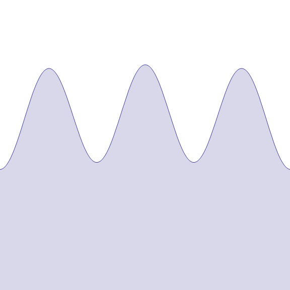
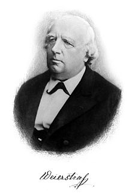

# 16 - Pytorch 神经网络基础

---

### 🎦 本节课程视频地址 👇

[](https://www.bilibili.com/video/BV1AK4y1P7vs)

## 层和块

**块**（block）可以描述单个层、由多个层组成的组件或整个模型本身。使用块进行抽象的一个好处是可以将一些块组合成更大的组件， 这一过程通常是递归的，如下图所示。 通过定义代码来按需生成任意复杂度的块， 我们可以**通过简洁的代码实现复杂的神经网络**。


从编程的角度来看，块由**类**（class）表示。 它的任何子类都必须定义一个将其输入转换为输出的前向传播函数， 并且必须存储任何必需的参数。

### 使用 Sequential 实现层

`nn.Sequential`定义了一种特殊的 Module，通过实例化 nn.Sequential 来构建我们的模型， 层的执行顺序是作为参数传递的。

```python
import torch
from torch import nn
from torch.nn import functional as F

net = nn.Sequential(nn.Linear(20, 256), nn.ReLU(), nn.Linear(256,10))

X = torch.rand(2, 20)
net(X)
```

### 使用 Block 实现块

任何一个层、神经网络都可以看作 Module 的一个子类。

```python
class MLP(nn.Module):
    # 必须先使用父类的init初始化，接下来可以定义各层
    def __init__(self):
        super().__init__()
        self.hidden = nn.Linear(20, 256)
        self.out = nn.Linear(256, 10)
    # 必须重新定义前馈过程
    def forward(self, X):
        return self.out(F.relu(self.hidden(X)))

net = MLP()
net(X)
```

### 自定义 Sequential 实现

```python
class MySequential(nn.Module):
    def __init__(self, *args):
        super().__init__()
        for idx, module in enumerate(args):
            # 这里，`module`是`Module`子类的一个实例。我们把它保存在'Module'类的成员
            # 变量`_modules` 中。`module`的类型是OrderedDict
            self._modules[str(idx)] = module

    def forward(self, X):
        # OrderedDict保证了按照成员添加的顺序遍历它们
        for block in self._modules.values():
            X = block(X)
        return X

net = MySequential(nn.Linear(20, 256), nn.ReLU(), nn.Linear(256, 10))
net(X)
```

### 自定义 Block 实现

```python
class FixedHiddenMLP(nn.Module):
    def __init__(self):
        super().__init__()
        #随机生成20*20不参与训练的权重
        self.rand_weight = torch.rand((20, 20), requires_grad=False)
        self.linear = nn.Linear(20, 20)

    def forward(self, X):
        X = self.linear(X)
        X = F.relu(torch.mm(X, self.rand_weight) + 1)   ##torch.mm()矩阵乘法，假设有一个偏移1
        X = self.linear(X)
        # 可以在前向计算中使用Python控制流来实现更复杂的过程
        while X.abs().sum() > 1:
            X /= 2
        return X.sum()

net = FixedHiddenMLP()
net(X)
```

> 在这个`FixedHiddenMLP`模型中，我们实现了一个隐藏层，
> 其权重（`self.rand_weight`）在实例化时被随机初始化，之后为常量。
> 这个权重不是一个模型参数，因此它永远不会被反向传播更新。
> 然后，神经网络将这个固定层的输出通过一个全连接层。
>
> 注意，在返回输出之前，模型做了一些不寻常的事情：
> 它运行了一个 while 循环，在$L_1$范数大于$1$的条件下，
> 将输出向量除以$2$，直到它满足条件为止。
> 最后，模型返回了`X`中所有项的和。
> 注意，此操作可能不会常用于在任何实际任务中，
> 我们只是向你展示如何将任意代码集成到神经网络计算的流程中。

### 混合 Sequential 和 Block 使用

```python
class NestMLP(nn.Module):
    def __init__(self):
        super().__init__()
        self.net = nn.Sequential(nn.Linear(20, 64), nn.ReLU(),
                                nn.Linear(64, 32), nn.ReLU())
        self.linear = nn.Linear(32, 16)

    def forward(self, X):
        return self.linear(self.net(X))

chimera = nn.Sequential(NestMLP(), nn.Linear(16, 20), FixedHiddenMLP())
chimera(X)
```

综上，块可以理解为能够实现一个或多个层的类，通过定义类的实例化来完成神经网络的运算。

## 参数管理

### 参数访问

我们从已有模型中访问参数。当通过`Sequential`类定义模型时，我们可以通过索引来访问模型的任意层。这就像模型是一个列表一样，每层的参数都在其属性中。如下所示，我们可以检查第二个全连接层的参数。

> `state_dict()` 查看字典形式的模型参数数值

```python
# 可以把Sequential看作一个list，可以用索引拿出每一层的参数。得到一个有序字典。
print(net[2].state_dict())
# Out：OrderedDict([('weight', tensor([[-0.0284,  0.0011, -0.2123,  0.2835,  0.3124,  0.0953, -0.2331, -0.2731]])), ('bias', tensor([-0.3001]))])
# module.state_dict().keys()=['weight','bias']
```

> 输出的结果告诉我们一些重要的事情：
> 首先，这个全连接层包含两个参数，分别是该层的权重和偏置。
> 两者都存储为单精度浮点数（float32）。
> 注意，参数名称允许唯一标识每个参数，即使在包含数百个层的网络中也是如此。

### 目标参数

每个参数都表示为 **参数类（Parameter）** 的一个实例。要对参数执行任何操作，首先我们需要访问底层的数值。有几种方法可以做到这一点。有些比较简单，而另一些则比较通用。下面的代码从第二个全连接层（即第三个神经网络层）提取偏置，提取后返回的是一个参数类实例，并进一步访问该参数的值。

> `nn.bias/.weight(.data/.grad)` 直接查看参数

```python
print(type(net[2].bias))
# Out:<class 'torch.nn.parameter.Parameter'>
print(net[2].bias)
# Out:Parameter containing:
# tensor([-0.3001], requires_grad=True)
print(net[2].bias.data)
# Out: tensor([-0.3001], requires_grad=True)
net[2].weight.grad == None  # .grad访问梯度
# Out: True
```

> 参数是复合的对象，包含值`.data`、梯度`.grad`和额外信息。 这就是我们需要显式参数值的原因。 除了值之外，我们还可以访问每个参数的梯度。

### 一次访问所有元素

当我们需要对所有参数执行操作时，逐个访问它们可能会很麻烦。 当我们处理更复杂的块（例如，嵌套块）时，情况可能会变得特别复杂， 因为我们需要递归整个树来提取每个子块的参数。 下面，我们将通过演示来比较访问第一个全连接层的参数和访问所有层。

> `.named_parameters()` 返回 iterator，用于循环，返回(参数名, 参数数值)。

```python
print(*[(name, param.shape) for name, param in net[0].named_parameters()])
print(*[(name, param.shape) for name, param in net.named_parameters()])
# *代表把list/tuple里的元素分开，而非整个输出
```

还提供了另一种访问网络参数的方式，通过名称（默认以`层数序号.weight or .bias`），如下所示。

```python
net.state_dict()['2.bias'].data
```

### 从嵌套块收集参数

> `.add_module(name, module`) 在当前模块添加含名称的子模块，相比较`Sequential()`而言可以指定各层名称（而不是默认的“0、1、2……”）

```python
def block1():
    return nn.Sequential(nn.Linear(4, 8), nn.ReLU(), nn.Linear(8, 4), nn.ReLU())

def block2():
    net = nn.Sequential()
    for i in range(4):
        net.add_module(f'block {i}', block1())
        #嵌套四个block1
        #add_module(name, module)
        #The module can be accessed as an attribute using the given name.
    return net

rgnet = nn.Sequential(block2(), nn.Linear(4, 1))
rgnet(X)
```

```python
print(rgnet)
'''
Out: Sequential(
  (0): Sequential(
    (block 0): Sequential(
      (0): Linear(in_features=4, out_features=8, bias=True)
      (1): ReLU()
      (2): Linear(in_features=8, out_features=4, bias=True)
      (3): ReLU()
    )
    (block 1): Sequential(
      (0): Linear(in_features=4, out_features=8, bias=True)
      (1): ReLU()
      (2): Linear(in_features=8, out_features=4, bias=True)
      (3): ReLU()
    )
    (block 2): Sequential(
      (0): Linear(in_features=4, out_features=8, bias=True)
      (1): ReLU()
      (2): Linear(in_features=8, out_features=4, bias=True)
      (3): ReLU()
    )
    (block 3): Sequential(
      (0): Linear(in_features=4, out_features=8, bias=True)
      (1): ReLU()
      (2): Linear(in_features=8, out_features=4, bias=True)
      (3): ReLU()
    )
  )
  (1): Linear(in_features=4, out_features=1, bias=True)
)
'''
```

因为层是分层嵌套的，所以我们也可以像通过嵌套列表索引一样访问它们。 下面，我们访问第一个主要的块中、第二个子块的第一层的偏置项。

```python
rgnet[0][1][0].bias.data
# Out: tensor([0.4441, 0.0795, 0.3999, 0.3522, 0.3384, 0.0372, 0.1860, 0.3830])
```

## 参数初始化

知道了如何访问参数后，现在我们看看如何正确地初始化参数。 我们在[14-数值稳定性&模型初始化&激活函数](14-数值稳定性&模型初始化&激活函数.md)中讨论了良好初始化的必要性。 深度学习框架提供**默认随机初始化**， 也允许我们创建自定义初始化方法， 满足我们通过其他规则实现初始化权重。

默认情况下，PyTorch 会**根据一个范围均匀地初始化权重和偏置矩阵**， 这个范围是根据输入和输出维度计算出的。 PyTorch 的 nn.init 模块提供了多种预置初始化方法。

### 内置初始化

- 使用正态分布初始化：`nn.init.normal(tensor, mean=0, std=1)`

```python
def init_normal(m):
    if type(m) == nn.Linear:
        nn.init.normal_(m.weight, mean=0, std=0.01)
        # _表示直接替换掉m.weight，而非返回值
        nn.init.zeros_(m.bias)

net.apply(init_normal)  #相当于一个for loop
net[0].weight.data[0], net[0].bias.data[0]
```

- 使用常数初始化：`torch.nn.init.constant(tensor, val)`

```python
def init_constant(m):
    if type(m) == nn.Linear:
        nn.init.constant_(m.weight, 1)
        nn.init.zeros_(m.bias)

net.apply(init_constant)
net[0].weight.data[0], net[0].bias.data[0]
```

> 实际深度学习训练中，不能把参数初始化为全1，会造成无法训练，具体可参考[10-多层感知机](10-多层感知机.md)QA章节中第一个问题

- 使用Xavier随机初始化：`torch.nn.init.xavier_uniform(tensor, gain=1)`

```python
def xavier(m):
    if type(m) == nn.Linear:
        nn.init.xavier_uniform_(m.weight)
        #uniform distribution
```

- 针对不同层使用不同初始化

```python
def init_42(m):
    if type(m) == nn.Linear:
        nn.init.constant_(m.weight, 42)
        #nn.init函数设置模块初始值

net[0].apply(xavier)
net[2].apply(init_42)
print(net[0].weight.data[0])
print(net[2].weight.data)
```

> 这里沐神讲了**42——宇宙的答案**这个数、Google Brain团队42号大楼的八卦😄
> 详细内容速来围观沐神在知乎上写的专栏👉[《博士这五年-李沐》](https://zhuanlan.zhihu.com/p/25099638)

### 自定义初始化

有时，深度学习框架没有提供我们需要的初始化方法。在下面的例子中，我们使用以下的分布为任意权重参数$w$定义初始化方法：

$$
\begin{aligned}
    w \sim \begin{cases}
        U(5, 10) & \text{ 可能性 } \frac{1}{4} \\
            0    & \text{ 可能性 } \frac{1}{2} \\
        U(-10, -5) & \text{ 可能性 } \frac{1}{4}
    \end{cases}
\end{aligned}
$$

同样，我们实现了一个`my_init`函数来应用到`net`：

```python
def my_init(m):
    if type(m) == nn.Linear:
        print("Init", *[(name, param.shape)
                        for name, param in m.named_parameters()][0])
        nn.init.uniform_(m.weight, -10, 10)
        m.weight.data *= m.weight.data.abs() >= 5

net.apply(my_init)
net[0].weight[:2]
```

- 简单粗暴的直接赋值方式

```python
net[0].weight.data[:] += 1
net[0].weight.data[0, 0] = 42
net[0].weight.data[0] #默认取行
```

- 参数绑定（共享权重）

```python
shared = nn.Linear(8, 8)
net = nn.Sequential(nn.Linear(4, 8), nn.ReLU(), shared, nn.ReLU(), shared,
                   nn.ReLU(), nn.Linear(8, 1))
net(X)
print(net[2].weight.data[0] == net[4].weight.data[0])
net[2].weight.data[0, 0] == 100
# 会同时修改两个shared, 相当于同一个实例的赋值
print(net[2].weight.data[0] == net[4].weight.data[0])
```

## 自定义层

深度学习成功背后的一个因素是神经网络的灵活性： 我们可以用创造性的方式组合不同的层，从而设计出适用于各种任务的架构。 例如，研究人员发明了专门用于处理图像、文本、序列数据和执行动态规划的层。 未来，你会遇到或要自己发明一个现在在深度学习框架中还不存在的层。 在这些情况下，你必须构建自定义层。在本节中，我们将向你展示如何构建。

### 不带参数的层

```python
class CenteredLayer(nn.Module):
    def __init__(self):
        super().__init__()

    def forward(self, X):
        return X - X.mean()

layer = CenteredLayer()
layer(torch.FloatTensor([1, 2, 3, 4, 5]))
# Out: tensor([-2., -1.,  0.,  1.,  2.])

net = nn.Sequential(nn.Linear(8, 128), CenteredLayer())

Y = net(torch.rand(4, 8))
Y.mean()
```

### 带参数的层

> nn.Parameter(tensor, required_grad=True) #把传入张量当作模块参数，可以对其求导的

```python
# 定义一个线性层
class MyLinear(nn.Module):
    def __init__(self, in_units, units):
        super().__init__()
        self.weight = nn.Parameter(torch.randn(in_units, units))
        self.bias = nn.Parameter(torch.randn(units,))
        #理论上torch.randn(units,)与torch.randn(units)没有区别
        #逗号后省略表示维度只有1
        #如果是randn(2, 1)，就是一个二维张量了。

    def forward(self, X):
        linear = torch.matmul(X, self.weight.data） + self.bias.data
        return F.relu(linear)

dense = MyLinear(5, 3)
dense.weight
```

- 使用自定义层进行正向传播计算

```python
linear(torch.rand(2, 5))
# Out: tensor([[0.0000, 0.3813, 1.3363],
#       [0.0000, 0.2262, 1.3676]])
```

- 使用自定义层构建模型

```python
net = nn.Sequential(MyLinear(64, 8), MyLinear(8, 1))
net(torch.rand(2, 64))
# Out: tensor([[10.6365],
#       [17.6410]])
```

## 读写文件

到目前为止，我们讨论了如何处理数据，以及如何构建、训练和测试深度学习模型。然而，有时我们希望保存训练的模型，以备将来在各种环境中使用（比如在部署中进行预测）。此外，当运行一个耗时较长的训练过程时，最佳的做法是定期保存中间结果，以确保在服务器电源被不小心断掉时，我们不会损失几天的计算结果。因此，现在是时候学习如何加载和存储权重向量和整个模型了。

Pytorch存储本质上使用的是Python实现的 **Pickle序列化（Serialization）** 操作，有关Pickel序列化的内容可以参考👉[这里](https://docs.python.org/zh-cn/3/library/pickle.html)

- 存储、读取矩阵

> torch.save(tensor, 'filename')
>
> torch.load('filename')

```python
#存储一个tensor
X = torch.arange(4)
torch.save(X, 'x-file')

X2 = torch.load('x-file')
X2
```

```python
#存储高维度
y = torch.zeros(4)
torch.save([X, y], 'x-files')
x2, y2 = torch.load('x-files')
(x2, y2)
```

```python
#存储字典
mydict = {'x': X, 'y': y}
torch.save(mydict, 'mydict')
mydict2 = torch.load('mydict')
mydict2
```

- 存储模型参数

> torch.save(net.state_dict(),'net.params')
>
> net.load_state_dict(torch.load('net.params'))

```python
class MLP(nn.Module):
    def __init__(self):
        super().__init__()
        self.hidden = nn.Linear(20, 256)
        self.output = nn.Linear(256, 10)

    def forward(self, X):
        return self.output(F.relu(self.hidden(X)))

net = MLP()
X = torch.randn(size=(2, 20))
Y = net(X)

torch.save(net.state_dict(), 'mlp.params') #存储的实际是模型参数而非模型本身

clone = MLP()
#先克隆原模型本身
clone.load_state_dict(torch.load('mlp.params'))
#再载入并重写克隆的模型
clone.eval()
#eval()设置一个模型参数为不可导，用于预测推理
Y_clone = clone(X)
Y_clone == Y   
# Out: True
```

> 如要存储模型结构定义，需要通过**TorchScript**存储，详见底部参考文档。

## Pytorch 模块参考文档

- `torch.nn.Module`Pytorch 所有网络的基类 Module 🧐[中文](https://pytorch-cn.readthedocs.io/zh/latest/package_references/torch-nn/#containers) | [官方英文](https://pytorch.org/docs/stable/generated/torch.nn.Module.html#torch.nn.Module)
- `torch.nn..Parameter`Pytorch 神经网络参数类 🧐[中文](https://pytorch-cn.readthedocs.io/zh/latest/package_references/torch-nn/#parameters) | [官方英文](https://pytorch.org/docs/stable/generated/torch.nn.parameter.Parameter.html#torch.nn.parameter.Parameter)
- `torch.nn.init`Pytorch 神经网络参数各种初始化方法 🧐[中文](https://pytorch-cn.readthedocs.io/zh/latest/package_references/nn_init/) | [官方英文](https://pytorch.org/docs/stable/nn.init.html)
- `torch.save(obj, f, pickle_module=pickle, pickle_protocol=DEFAULT_PROTOCOL, _use_new_zipfile_serialization=True)`Pytorch 对象存储函数 🧐[中文](https://pytorch-cn.readthedocs.io/zh/latest/package_references/torch/) | [官方英文](https://pytorch.org/docs/stable/generated/torch.save.html#torch.save)
- `torch.nn.load`Pytorch 对象载入函数 🧐[中文](https://pytorch-cn.readthedocs.io/zh/latest/package_references/torch/) | [官方英文](https://pytorch.org/docs/stable/generated/torch.load.html#torch.load)
- `TorchScript` 是 PyTorch 模型(`nn.Module`的子类）的中间表示形式 🧐[官方英文](https://pytorch.org/docs/stable/jit.html)

---

## Q&A🤓

**Q：Pytorch定义好模型后，若不指定初始化，则默认以什么规则进行初始化？**

**🙋‍♂️**：通过查看Pytorch源码，发现例如`nn.Linear`和`nn.ConvNd`是使用的是`init.kaiming_uniform_(tensor, a=0, mode='fan_in', nonlinearity='leaky_relu')`初始化，一种在论文Delving deep into rectifiers: Surpassing human-level performance on ImageNet classification - He, K. et al. (2015)提出的类似Xvair的初始化方法。

**Q：如果自定义激活函数是不可导的，Pytorch是否可以自动求导，还是说要事先定义导数？**

**🙋‍♂️**：在数值计算领域，几乎不存在处处不可导的函数，实际应用中不用考虑此种情况，深度学习框架均可解决。

**番外**：目前已知的一个“处处连续、处处不可导”的奇怪函数叫“**魏尔斯特拉斯函数（Weierstrass function）**”，定义如下：

$$
f(x)=\sum_{n=0}^\infty a^n cos(b^n\pi x) \qquad \text{where $0<a<1,b为奇数,ab>1+{3\over 2}\pi$}
$$

> 下图为魏尔斯特拉斯函数在区间 [−2， 2] 上的图。像其他分形一样，这个函数表现出自相似性：每个缩放（红色圆圈）都与全局图相似。


> 下图展示Weierstrass function当b从0.1增大到5时函数的图形变化



这个神奇的函数是由十九世纪的德国数学家卡尔·魏尔施特拉斯（Karl Theodor Wilhelm Weierstrass ; 1815–1897）提出的。



这在当时数学界引起不小的轰动，动摇了当时“只要是连续函数总可导”的观点，也推动了数学的发展。根据上图可看出，Weierstrass function是一个“分形”函数，它也推动了分形领域的发展。
