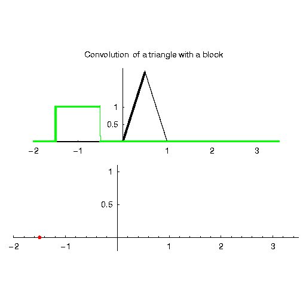
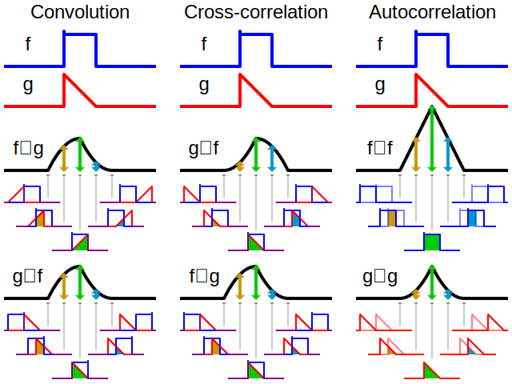

# 17 - 卷积神经网络（CNN）

---

### 🎦 本节课程视频地址 👇

[](https://www.bilibili.com/video/BV1L64y1m7Nh)

## 为什么需要卷积

举个 🌰，对于目前主流手机摄像头来说，至少拥有 1200 万像素摄像头，以此像素为例，拍摄一张照片，大概能产生 36M 像素的图片（RGB 三个通道，$3\times12M$），若使用之前章节介绍的拥有 100 个神经元的单隐藏层 MLP，输入 36M 特征，100 个神经元就有 $36M\times100=3.6B=14GB$ 参数，所以不适用。

我们仅仅通过将图像数据展平成一维向量而忽略了每个图像的空间结构信息，再将数据送入一个全连接的多层感知机中。 因为这些网络特征元素的顺序是不变的，因此最优的结果是**利用先验知识**，即**利用相近像素之间的相互关联性**，从图像数据中学习得到有效的模型。


上图为游戏“Waldo 在哪里”的示例图，要求在一幅图片中找特定的对象。可以引申出两点：

- 平移不变性（translation invariance）：分类器不因出现位置改变而改变识别标准。
- 局部性（locality）：只需要在局部寻找对象，而非要远处无关区域。

卷积神经网络（convolutional neural network，CNN）是一类强大的、为处理图像数据而设计的神经网络。 卷积神经网络需要的参数少于全连接架构的网络，而且卷积也很容易用 GPU 并行计算。 因此卷积神经网络除了能够高效地采样从而获得精确的模型，还能够高效地计算。

## 从全连接层到卷积

- 将输入和输出从向量变为**矩阵**（宽 × 高）
- 将权重从原来的二维矩阵变为为 **4-D 张量**$(h, w)$到$(h', w')$

$$
\begin{aligned}
    [\mathbf{H}]_{i,j}&=\sum_{k} \sum_{l} [\mathbf{W}]_{i,j,k,l}[\mathbf{X}]_{k,l}+ [\mathbf{U}]_{i,j} \\
    &=\sum_{a}\sum_{b}[\mathbf{V}]_{i,j,a,b}[\mathbf{X}]_{i+a,j+b}+[\mathbf{U}]_{i,j}
\end{aligned}
$$

> $[\mathbf{H}]_{i,j}$为隐藏表示中位置$(i,j)$处的像素；$[\mathbf{X}]_{k,l}$为输入图像位置$(i,j)$处的像素；$[\mathbf{U}]_{i,j}$为偏置参数
>
> $[\mathbf{W}]_{i,j,k,l}$为权重的 4D 张量，因为在这两个四阶张量的元素之间存在一一对应的关系。 我们只需重新索引下标使 $k=i+a,\ l=j+b$，由此可得$[\mathbf{V}]_{i,j,a,b}=[\mathbf{W}]_{i,j,ki+a,j+b}$，索引$a$和$b$通过在正偏移和负偏移之间移动覆盖了整个图像。

> 上式代表对于隐藏表示中任意给定位置$(i,j)$处的像素值$h_{i,j}$，可以通过在$x$中以$(i,j)$为中心对像素进行加权求和得到，加权使用的权重为$[\mathbf{V}]_{i,j,a,b}$

> 此处做按元素相乘的[哈马达积](05-线性代数.md)。

### 平移不变性

现在引用上述的第一个原则：平移不变性。按上文推导结果，可以得出：

- $\mathbf{X}$的空间平移（$i、j$的变化）应该仅导致隐藏表示$\mathbf{H}$的平移，也就是说$\mathbf{V}$和$\mathbf{U}$实际上不依赖$(i,j)$的值，即$[\mathbf{V}]_{i,j,a,b}=[\mathbf{V}]_{a,b}$，且$\mathbf{U}$是常数，定为$u$，因此上式可简化为：

$$
[\mathbf{H}]_{i,j}=\sum_{a} \sum_{b}[\mathbf{V}]_{a,b}[\mathbf{X}]_{i+a,j+b}+u
$$

以上操作，本质上是 2 维~~卷积~~ **互相关（cross-correlation）**（从前神经网络研究者将卷积和互相关的概念搞混了，如今将错就错了）我们是在使用系数 $[\mathbf{V}]_{a,b}$ 对位置$(i,j)$ 附近的像素 $(i+a,j+b)$ 进行加权得到 $[\mathbf{H}]i,j$ 。 注意， $[\mathbf{V}]_{a,b}$的系数比$[\mathbf{V}]_{i,j,a,b}$少很多，因为前者不再依赖于图像中的位置。这就是显著的进步！。

### 局部性

现引用第二原则：局部性指，当评估$[\mathbf{H}]_{i,j}$时，我们不应该用远离$x_{i,j}$的参数，即只需要聚焦于$x_{i,j}$附近像素即可。

解决方案：当$|a|,|b|\gt\Delta$时，使得$v_{a,b}=0$，也就是说权重只集中于一个小范围而不是全局。

$$
[\mathbf{H}]_{i,j}=\sum_{a=-\Delta}^\Delta\sum_{b=-\Delta}^\Delta [\mathbf{V}]_{a,b}[\mathbf{X}]_{i+a,j+b}+u
$$

上式的计算，代表是一个卷积层（convolutional layer），而卷积神经网络是包含卷积层的一类特殊的神经网络。

## 数学上的卷积[[1]](https://wiwiki.kfd.me/wiki/%E5%8D%B7%E7%A7%AF)运算

在进一步讨论之前，先简要回顾一下为什么上面的操作被称为“卷积”。在数学和信号处理领域中，两个函数（$f,g:\mathbb{R}^d\rightarrow \mathbb{R}$）之间的卷积定义为：

$$
(f*g)(\mathbf{x})=\int{f(\mathbf{z})g(\mathbf{x-z})d\mathbf{z}}
$$

也就是说，卷积是当把一个函数“翻转”并移位 x 时，测量 f 和 g 之间的重叠面积。以下动图展示的两个函数进行卷积计算的过程展示：



当为离散对象时，积分就变成求和。例如：对于由索引为 $\mathbb{Z}$ 的、平方可和的、无限维向量集合中抽取的向量，我们得到以下定义：

$$
(f*g)(i)=\sum_a f(a)g(i-a)
$$

对于二维张量，则为$f$的索引$(a,b)$和$g$的索引$(i-a,j-b)$上对应加和：

$$
(f*g)(i,j)=\sum_{a} \sum_{b} f(a,b)g(i-a,j-b)
$$

上式形式与上文“局部性”得到的公式类似。

> 数学中，卷积与互相关十分类似，区别就是运算时有没有“翻转”的操作。下图所示卷积与交叉相关、自相关的区别：



## 图像的通道

一般彩色图片包含有 R、G、B 三个通道（Channels），实际上不是一个二维张量，而是一个三维张量，前两个轴与像素的空间位置（Spatial）有关，**第三个轴可以看作是每个像素的多维表示**。因此，我们将 $\mathbf{X}$ 索引为 $[\mathbf{X}]_{i,j,k}$ 。由此卷积相应地调整为 $[\mathbf{V}]_{a,b,c}$ ，而不是 $[\mathbf{V}]_{a,b}$。

此外，由于输入图像是三维的，我们的隐藏表示 $\mathbf{H}$ 也最好采用三维张量。 换句话说，对于每一个空间位置，我们想要采用一组而不是一个隐藏表示。这样一组隐藏表示可以想象成一些互相堆叠的二维网格。 因此，我们可以把隐藏表示想象为一系列具有二维张量的通道（channel）。


这些通道有时也被称为**特征映射（feature maps）**，因为每个通道都向后续层提供一组空间化的学习特征。 直观上你可以想象在靠近输入的底层，一些通道专门识别边缘，而一些通道专门识别纹理。

为了支持输入$\mathbf{X}$和隐藏表示$\mathbf{H}$中的多个通道，可以在$\mathbf{V}$中添加第四个坐标 d，即$[V]_{a,b,c,d}$，综上：

$$
[\mathbf{H}]_{i,j,d}=\sum_{a=-\Delta}^\Delta\sum_{b=-\Delta}^\Delta \sum_c [\mathbf{V}]_{a,b,c,d}[\mathbf{X}]_{i+a,j+b,c}+u
$$

其中隐藏表示 $\mathbf{H}$ 中的索引 $d$ 表示输出通道，而随后的输出将继续以三维张量 $\mathbf{H}$ 作为输入进入下一个卷积层。 所以，上式可以定义具有多个通道的卷积层，而其中 $\mathbf{V}$ 是该卷积层的权重。

## 总结

对全连接层使用平移不变性和局部性得到卷积层。

在深度学习研究社区中， $V$ 被称为卷积核（convolution kernel）或者滤波器（filter），它仅仅是可学习的一个层的权重。 当图像处理的局部区域很小时，卷积神经网络与多层感知机的训练差异可能是巨大的：以前，多层感知机可能需要数十亿个参数来表示网络中的一层，而现在卷积神经网络通常只需要几百个参数，而且不需要改变输入或隐藏表示的维数。

参数大幅减少的代价是，**我们的特征现在是平移不变的，并且当确定每个隐藏活性值时，每一层只包含局部的信息**。 以上所有的权重学习都将依赖于归纳偏置。当这种偏置与现实相符时，我们就能得到样本有效的模型，并且这些模型能很好地泛化到未知数据中。 但如果这偏置与现实不符时，比如当图像不满足平移不变时，我们的模型可能难以拟合我们的训练数据。

## 卷积层


### 二维卷积层（二维交叉相关）


- 输入$\bf X$：$n_h\times n_w$
- 核（kernel）$\bf W$：$k_n\times k_w$
- 偏差$b\in \mathbb{R}$
- 输出$\bf Y$：$(n_h-k_h+1)\times(n_w-k_w+1)$

$$
{\bf Y}={\bf X* \bf W}+b
$$

> $\bf W$ 和 $b$ 是可学习的参数。在计算机视觉和数字图像处理领域，有许多人为设计好的核参数（在 CNN 还未出现前，需要手工设计，属于图像特征工程的内容），比如用于特征检测[2]、模糊、锐化的各类核参数。在 Photoshop 中的滤镜库中就集成了许多和不同用途的核参数。


### 交叉相关 vs 卷积

- 二维交叉相关

$$y_{i,j}=\sum_{a=1}^h\sum_{b=1}^w w_{a,b}x_{i+a,j+b}$$

- 二维卷积

$$y_{i,j}=\sum_{a=1}^h\sum_{b=1}^w w_{-a,-b}x_{i+a,j+b}$$

> 由于对称性，在实际使用中没有区别。

### 一维和三维交叉相关

- 一维

$$y_i=\sum_{a=1}^hw_ax_{i+a}$$

> 多用于文本、语言、时序序列

- 三维（与 RGB 通道卷积表达式类似）

$$y_{i,j,k}=\sum_{a=1}^h\sum_{b=1}^w \sum_{c=1}^dw_{a,b,c}x_{i+a,j+b,k+c}$$

> 多用于含时间维度的视频、气象地图、空间维度医学图像（CT）

### 总结

- 卷积层将输入和核矩阵进行交叉相关，加上偏移后得到输出
- 核矩阵和偏移是可学习的参数
- 核矩阵的大小是超参数，其大小控制卷积层的局部性

### 代码实现

- 实现互相关运算

```python
import torch
from torch import nn
from d2l import torch as d2l

def corr2d(X, K):
    h, w = K.shape
    Y = torch.zeros((X.shape[0] - h +1, X.shape[1] - w + 1))
    for i in range(Y.shape[0]):
        for j in range(Y.shape[1]):
            Y[i, j] = (X[i:i + h, j:j + w] * K).sum()
    return Y
```

- 实现二维卷积层

```python
class Conv2D(nn.Module):
    def __init__(self, kernel_size):
        super().__init__()
        # 使用nn.Parameter使参数可导，可以进行学习
        self.weight = nn.Parameter(torch.rand(kernel_size))
        self.bias = nn.Parameter(torch.zeros(1))

    def forward(self, x):
        return corr2d(x, self.weight) + self.bias
```

- 通过梯度下降来学习核参数

```python
#直接调用nn.Conv2d,input channel=1,outputchannel=1
conv2d = nn.Conv2d(1, 1, kernel_size=(1, 2), bias=False)

# (channal_num, batch_num, height, width)
X = X.reshape((1, 1, 6, 8))
Y = Y.reshape((1, 1, 6, 7))
#增加两个维度，通道维度和批量大小维度

for i in range(10):
    Y_hat = conv2d(X)
    # 计算损失
    l = (Y_hat - Y)**2
    conv2d.zero_grad()
    # 梯度反传
    l.sum().backward()
    # 手动优化参数
    conv2d.weight.data[:] -= 3e-2 * conv2d.weight.grad
    if (i + 1) % 2 == 0:
        print(f'batch {i+1}, loss {l.sum():.3f}')
```

## 参考资料

[1][卷积-维基百科](https://wiwiki.kfd.me/wiki/%E5%8D%B7%E7%A7%AF)

[2][特征检测-维基百科](https://wiwiki.kfd.me/wiki/%E7%89%B9%E5%BE%81%E6%A3%80%E6%B5%8B)

---

## Q&A🤓

**Q：卷积层的感受野（kernel size）不应该越大越好吗？为什么实际中常见的都是3x3、5x5等小尺寸？**

**🙋‍♂️**：与 MLP 类似，很宽的隐藏层（非常多神经元）不如多层窄一些的隐藏层好训练，与之类似，在 CNN 中，尺寸很大的卷积层不如一组尺寸更小但层数更多的卷积层好训练。研究表明，由简单的神经元构成的多层结构，有助于将复杂特征的抽取任务“**分而治之，层层击破**”，先有底层卷积抽取低级特征（纹理、线条等），再通过层叠结构，越高层的卷积的间接作用范围会随着层数增长而逐渐扩大，最终获得大尺寸下的特征。

具体可参考吴恩达课程👉[《为什么使用深层表示》]((https://www.bilibili.com/video/BV16r4y1Y7jv?p=38))
