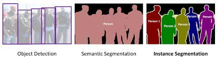

# 20 - 池化层

### 🎦 本节课程视频地址 👉[](https://www.bilibili.com/video/BV1EV411j7nX)
## 池化层 （Pooling）

**Problem**
卷积层的积对位置敏感，检测垂直边缘

因此需要一定程度的平移不变性（照明、物体位置、比例、外观等等因素）

## 二维最大池化



和卷积层类似，也有填充和步幅，但没有可学习的参数

在每个输入通道应用池化层以获得相应的输出通道
输出通道数=输入通道数

输出每个窗口最强的信号

## 平均池化层


**总结**

池化层缓解了卷积层的位置敏感性，通常位于卷积层之后，使边界效果得到强化。


## 代码实现

```
#手动实现
import torch
from torch import nn
from d2l import torch as d2l

def pool2d(X, pool_size, mode='max'):
    p_h, p_w = pool_size
    Y = torch.zeros((X.shape[0] - p_h + 1, X.shape[1] - p_w + 1))
    for i in range(Y.shape[0]):
        for j in range(Y.shape[1]):
            if mode == 'max':
                Y[i, j] == X[i:i + p_h, j:j + p_w].max()
                #j取最大值，从X.shape[1]-p_w到X.shape[1]，范围刚刚好
    
            elif mode == 'avg':
                Y[i, j] == X[i:i + p_h, j:j + p_w].mean()
    return Y

#调用模块
pool2d = nn.MaxPool2d(3)
#kernel_size=3
#stride： Default value is kernel_size.
pool2d(X)

#多通道
X = torch.cat((X, X + 1), 1)
#dim=1
X.shape

pool2d = nn.MaxPool2d(3, padding=1, stride=2)
pool2d(X).shape
```