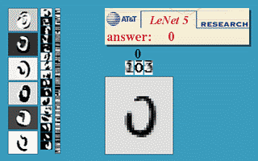

# 21 - 经典卷积神经网络 LeNet

---

### 🎦 本节课程视频地址 👇

[](https://www.bilibili.com/video/BV1t44y1r7ct)

## LeNet

之前我们将[softmax 回归模型](09-Softmax回归.md)和[多层感知机模型](10-多层感知机.md)应用于 Fashion-MNIST 数据集中的服装图片。 为了能够应用 softmax 回归和多层感知机，我们首先将每个大小为 $(28 \times 28)$ 的图像展平为一个 784 维的固定长度的一维向量，然后用全连接层对其进行处理。 而现在，我们已经掌握了卷积层的处理方法，我们可以在图像中保留空间结构。 同时，用卷积层代替全连接层的另一个好处是：模型更简洁、所需的参数更少。



在本节中，我们将介绍**LeNet**，它是最早发布的卷积神经网络之一，因其在计算机视觉任务中的高效性能而受到广泛关注。 这个模型是由 AT&T 贝尔实验室的研究员 Yann LeCun 在 1989 年提出的（并以其命名），目的是识别图像 [LeCun et al., 1998[1]](https://axon.cs.byu.edu/~martinez/classes/678/Papers/Convolution_nets.pdf)中的手写数字。 当时，Yann LeCun 发表了第一篇通过反向传播成功训练卷积神经网络的研究，这项工作代表了十多年来神经网络研究开发的成果。

当时，LeNet 取得了与支持向量机（SVM,support vector machines）性能相媲美的成果，成为监督学习的主流方法。 LeNet 被广泛用于自动取款机（ATM）机中，帮助识别处理支票的数字。 时至今日，一些自动取款机仍在运行 Yann LeCun 和他的同事 Leon Bottou 在上世纪 90 年代写的代码呢！


每个卷积块中的基本单元是一个**卷积层**、一个**sigmoid 激活函数**和**平均汇聚层**。请注意，虽然 ReLU 和最大汇聚层更有效，但它们在 20 世纪 90 年代还没有出现。每个卷积层使用$(5\times 5)$卷积核和一个 sigmoid 激活函数。这些层将输入映射到多个二维特征输出，通常同时增加通道的数量。第一卷积层有 6 个输出通道，而第二个卷积层有 16 个输出通道。每个$(2\times2)$池操作（步骤 2）通过空间下采样将维数减少 4 倍。卷积的输出形状由批量大小、通道数、高度、宽度决定。

为了将卷积块的输出传递给稠密块，我们必须在小批量中展平每个样本。换言之，我们将这个四维输入转换成全连接层所期望的二维输入。这里的二维表示的第一个维度是索引小批量中的样本，第二个维度是给出每个样本的平面向量表示。LeNet 的稠密块有三个全连接层，分别有 120、84 和 10 个输出。因为我们在执行分类任务，所以输出层的 10 维对应于最后输出结果的数量。

## 总结

- 是早期成功的神经网络
- 先使用卷积层来学习图片的空间信息
- 然后使用全连接层来转换到类别空间。

## 代码实现

- 定义网络

```python
import torch
from torch import nn
from d2l import torch as d2l

class Reshape(torch.nn.Module):
    def forward(self, x):
        return x.view(-1, 1, 28, 28)
        #Returns a new tensor with the same data as the self tensor
        #but of a different shape
        #批量不变，通道唯一，

net = torch.nn.Sequential(
    Reshape(), nn.Conv2d(1, 6, kernel_size=5, padding=2), nn.Sigmoid(),
    nn.AvgPool2d(kernel_size=2, stride=2),
    nn.Conv2d(6, 16, kernel_size=5), nn.Sigmoid(),
    nn.AvgPool2d(kernel_size=2, stride=2),
    # nn.Flatten()默认从第1维到最后一维展平，保留第0维批量维
    nn.Flatten(),
    nn.Linear(16 * 5 * 5, 120), nn.Sigmoid(),
    nn.Linear(120, 84), nn.Sigmoid(),
    nn.Linear(84, 10))
```

- 测试

```python
X = torch.rand(size=(1, 1, 28, 28), dtype=torch.float32)
for layer in net:
    X = layer(X)
    print(layer.__class__.__name__, 'output shape: \t', X.shape)
    #调用layer的名字

```

- 训练

```python
batch_size = 256
train_iter, test_iter = d2l.load_data_fashion_mnist(batch_size=batch_size)

def evaluate_accuracy_gpu(net, data_iter, device=None):
    if isinstance(net, torch.nn.Module):
        net.eval()
        if not device:
            device = next(iter(net.parameters())).device
            #查看存储设备
        metric = d2l.Accumulator(2)
        for X, y in data_iter:
            if isinstance(X, list):
                X = [x.to(device) for x in X]
            else:
                X = X.to(device)
            y = y.to(device)
            metric.add(d2l.accuracy(net(X), y), y.numel())
        return metric[0] / metric[1]

```

- 训练函数

```python
def train_ch6(net, train_iter, test_iter, num_epochs, lr, device):
    def init_weights(m):
        if type(m) == nn.Linear or type(m) == nn.Conv2d:
            nn.init.xavier_uniform_(m.weight)
    net.apply(init_weights)
    print('training on', device)
    net.to(device)
    optimizer = torch.optim.SGD(net.parameters(), lr=lr)
    loss = nn.CrossEntropyLoss()
    #默认取平均损失
    animator = d2l.Animator(xlabel='epoch', xlim=[1, num_epochs],
                           legend=['train loss', 'train acc', 'test acc'])
    timer, num_batches = d2l.Timer(), len(train_iter)
    for epoch in range(num_epochs):
        metric = d2l.Accumulator(3)
        # metric.data=[0.,0.,0.]
        net.train()
        for i, (X, y) in enumerate(train_iter):
            # X.shape=(256,1,28,28)
            timer.start()
            optimizer.zero_grad()
            X, y = X.to(device), y.to(device)
            y_hat = net(X)
            l = loss(y_hat, y)
            l.backward()
            optimizer.step()
            metric.add(l * X.shape[0], d2l.accuracy(y_hat, y), X.shape[0])
            #返回三个标量，l*256,accuracy,256

            timer.stop()
            train_l = metric[0] / metric[2]
            #平均损失
            train_acc = metric[1] / metric[2]
            #正确率
            if (i + 1) % (num_batches // 5) == 0 or i == num_batches - 1:
                animator.add(epoch + (i + 1) / num_batches,
                             (train_l, train_acc, None))
        test_acc = evaluate_accuracy_gpu(net, test_iter)
        animator.add(epoch + 1, (None, None, test_acc))
    print(f'loss {train_l:.3f}, train acc {train_acc:.3f}, '
          f'test acc {test_acc:.3f}')
    print(f'{metric[2] * num_epochs / timer.sum():.1f} examples/sec '
          f'on {str(device)}')

```

```python
lr, num_epochs = 0.9, 10
train_ch6(net, train_iter, test_iter, num_epochs, lr, d2l.try_gpu())
```


## 参考资料

[1][lecun, y., bottou, l., bengio, y., haffner, p., & others. (1998). gradient-based learning applied to document recognition. proceedings of the ieee, 86(11), 2278–2324.](https://axon.cs.byu.edu/~martinez/classes/678/Papers/Convolution_nets.pdf)

[2][cnn explianer](https://poloclub.github.io/cnn-explainer/)：一个卷积神经网络可视化 Demo

---

## Q&A🤓

**Q：max pooling 和 average pooling 哪个用的更多？**

**🙋‍♂️**：二者差别不大（可能在具体问题有细微差别），一般来说 max pooling 用的更多，因为 max pooling 得到的数值更大，相对梯度比 average 也个更大，更好训练。
