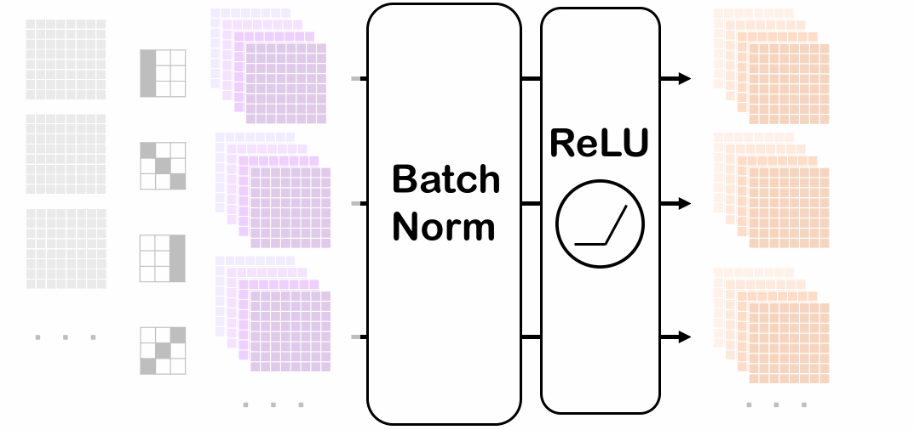

## 批量归一化

- 损失出现在最后，后面的层训练较快
  - 梯度越往下传递越小（小数相乘）
- 数据在最底部
  - 底部的层训练较慢
  - 底部层一变化，所有都得跟着变
  - 顶部的那些层需要重新学习多次
    - 相当于训练好了因为底部特征变化重来
  - 导致收敛变慢
- 我们可以在学习底部层的时候避免变化顶部层吗？

固定小批量（在不同层输出）里面的均值和方差：

$$\begin{array}{l}\mu_B={1\over|B|}\sum_{i\in B}x_i\\
\sigma_B^2={1\over|B|}\sum_{i\in B}
(x_i-\mu_B)^2\end{array}$$

然后再做额外的调整：

$$BN(x_i)=\gamma{x_i-\mu_B\over\sqrt{\sigma_B^2+\epsilon}}+\beta$$

- 比例${\gamma}$和偏移系数${\beta}$是学习出来的，或者说是学到的均值和方差
- 作用在
  - 全连接层和卷积层输出上，激活函数之前
    - relu变成正数，所以不能再带回正负各异的状态
  - 全连接层和卷积层输入上
- 对于全连接层，作用在特征维
- 对于卷积层，作用于通道维（同一个通道所有元素的BN）

**它的作用**

- 最初的论文表示可以减少内部协变量转移
- 后续论文指出在小批量里增加噪音$\mu,\sigma$，随机偏移和缩放
- 没必要和丢弃法混合使用


**总结**

- 固定一个小批量的均值和方差，然后学习出适合的偏移和缩放；
- 可以加速收敛（更大的学习率），但不改变模型的精度

### 代码实现

在测试的时候，样本一个一个进入网络，没有区域均值、方差可求。可以用测试集得到均值、方差作为初值。

全局期望的更新要借助**Karlman滤波**

对同一个目标，多次测量值$z_1,z_2,z_3,...,z_k$，其期望$x_1, x_2,...,x_k$

$$\begin{equation}\begin{split}
\hat x_k&={1\over k}(z_1+z_2+z_3+...+z_{k-1}+z_k)\\
&={1\over k}(z_1+z_2+z_3+...+z_{k-1})+{1\over k}z_k\\
&={1\over k}{k-1\over k-1}(z_1+z_2+z_3+...+z_{k-1})+{1\over k}z_k\\
&={k-1\over k}\hat x_{k-1}+{1\over k}z_k\\
&=\hat x_{k-1}-{1\over k}\hat x_{k-1}+{1\over k}z_k\\
&=\hat x_{k-1}+{1\over k}(z_k-\hat x_{k-1})
\end{split}\end{equation}$$

$$k\uparrow, {1\over k}\rightarrow0,\hat x_{k-1}\rightarrow\hat x_{k}$$

随着$k$的增加，测量值就不再重要

$$\hat x_k=\hat x_{k-1}+k_k(z_k-\hat x_{k-1})$$

$k_k$: Karlman Gain

当前估计值=上一次的估计值+系数×(当前测量值-上一次的估计值)


- 只与上一次的估计值有关，递归算法。

估计误差：$e_e$
测量误差：$e_m$

$$k_k={e_e\over e_e+e_m}$$

   - $e_e\gt\gt e_m: k_k\rightarrow1\quad \hat x_k=\hat x_{k-1}+z_k-\hat x_{k-1}=z_k$，当估计误差远大于测量误差时，以测量值为准
   - $e_e\lt\lt e_m: k_k\rightarrow0\quad \hat x_k=\hat x_{k-1}$当估计误差远小于测量误差时，以估计值为准

**代码实现**

```
import torch
from torch import nn
from d2l import torch as d2l
#定义batch_norm算法
def batch_norm(X, gamma, beta, moving_mean, moving_var, eps, momentum):
    #实现batch_norm功能 
    #moving_mean/var全局的期望和方差，近似于整个数据集上，做推理
    #eps避免出零，很重要
    #momentum，用于更新moving，通常取固定值
    if not torch.is_grad_enabled():
    #做inference而非train，所以不求梯度
        X_hat = (X - moving_mean) / torch.sqrt(moving_var + eps)
        #eps干扰项避免了0值
    else:
        assert len(X.shape) in (2, 4)
        #判断2-D/4-Dtensor
        if len(X.shape) == 2:
        #按特征求均值和方差
            mean = X.mean(dim=0)
            # 对行求均值,各个行同一列的元素
            # 每个列都是一个特征，每个行是一个样本的不同特征
            var = ((X - mean)**2).mean(dim=0)
            # X-mean是按行的广播
        else:
            mean = X.mean(dim=(0, 2, 3), keepdim=True)
            # 对每一个通道的全部元素求均值
            var = ((X - mean)**2).mean(dim=(0, 2, 3), keepdim=True)
        X_hat = (X - mean) / torch.sqrt(var + eps)
        #对X里每个通道的全部元素去求平均
        moving_mean = momentum * moving_mean + (1.0 - momentum) * mean
        moving_var = momentum * moving_var + (1.0 - momentum) * var
    Y = gamma * X_hat + beta
    return Y, moving_mean.data, moving_var.data
    #得到normalize过的Y和更新过的moving
```
```
#定义batchnorm块
class BatchNorm(nn.Module):
    def __init__(self, num_features, num_dims):
        super().__init__()
        if num_dims == 2:
            shape = (1, num_features)
            #作用于特征
        else:
            shape = (1, num_features, 1, 1)
            #作用于通道
        self.gamma = nn.Parameter(torch.ones(shape))
        self.beta = nn.Parameter(torch.zeros(shape))
        #gamma和beta是要参数学习的
        self.moving_mean = torch.zeros(shape)
        self.moving_var = torch.ones(shape)
        #moving是迭代的
        
    def forward(self, X):
        if self.moving_mean.device != X.device:
            self.moving_mean = self.moving_mean.to(X.device)
            self.moving_var = self.moving_var.to(X.device)
        
        Y, self.moving_mean, self.moving_var = batch_norm(
            X, self.gamma, self.beta, self.moving_mean,
            self.moving_var, eps=1e-5, momentum=0.9)
        return Y
    # 相当于Batchnorm定义了并初始化两个超参数gamma和beta
    # 初始化了moving_mean & var

```
```
#嵌套进一个LeNet神经网络
net = nn.Sequential(
    nn.Conv2d(1, 6, kernel_size=5), BatchNorm(6, num_dims=4),
    nn.Sigmoid(), nn.MaxPool2d(kernel_size=2, stride=2),
    nn.Conv2d(6, 16, kernel_size=5), BatchNorm(16, num_dims=4),
    nn.Sigmoid(), nn.MaxPool2d(kernel_size=2, stride=2),
    nn.Flatten(), nn.Linear(16 * 4 * 4, 120),
    BatchNorm(120, num_dims=2), nn.Sigmoid(),
    nn.Linear(120, 84), BatchNorm(84, num_dims=2),
    nn.Sigmoid(), nn.Linear(84, 10))
#对线性层只有(256，16*4*4)矩阵的norm
```
```
#训练
lr, num_epochs, batch_size = 1.0, 10, 256
train_iter, test_iter = d2l.load_data_fashion_mnist(batch_size)
d2l.train_ch6(net, train_iter, test_iter, num_epochs, lr, d2l.try_gpu())
```
```
net[1].gamma.reshape((-1,)), net[1].beta.reshape((-1,))
#自动计算行，所以默认填充所有列
```
```
#简明实现
net = nn.Sequential(
    nn.Conv2d(1, 6, kernel_size=5), nn.BatchNorm2d(6),
    nn.Sigmoid(), nn.MaxPool2d(kernel_size=2, stride=2),
    nn.Conv2d(6, 16, kernel_size=5), nn.BatchNorm2d(16),
    nn.Sigmoid(), nn.MaxPool2d(kernel_size=2, stride=2),
    nn.Flatten(), nn.Linear(16 * 4 * 4, 120),
    nn.BatchNorm1d(120), nn.Sigmoid(),
    nn.Linear(120, 84), nn.BatchNorm1d(84),
    nn.Sigmoid(), nn.Linear(84, 10))
#注意1d与2d的区别。
```
```
nn.Flatten()
#默认从第1个维度（而不是第0维）开始拉平直至最后一个维度
#所以Flatten()一个二维矩阵不发生任何形状变化。
```