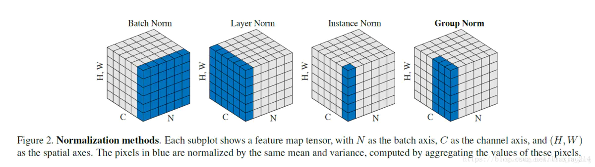
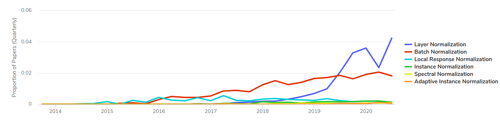
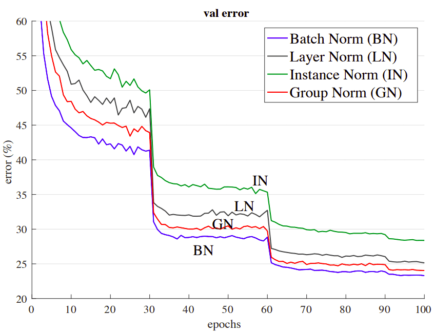

# 26 - 批量归一化

---

### 🎦 本节课程视频地址 👇

[](https://www.bilibili.com/video/BV1X44y1r77r)

## 网络越深产生的问题

- 反向传播，损失的梯度从输出层向后传，靠近输出的层训练较快
  - 梯度越往下传递越小（小数相乘）
- 数据在最底部
  - 靠近数据的底部层训练较慢
  - 底部层一变化，所有都得跟着变，相当于低层特征改变，不断抽象得到的高层特征也会随之改变
  - 顶部的那些层需要重新学习多次
  - 导致收敛变慢

## 如何解决

对于典型的多层感知机或卷积神经网络。当我们训练时，中间层中的变量（例如，多层感知机中的仿射变换输出）可能具有更广的变化范围：不论是沿着从输入到输出的层，跨同一层中的单元，或是随着时间的推移，模型参数的随着训练更新变幻莫测。 批量规范化的发明者非正式地假设，这些变量分布中的这种偏移可能会阻碍网络的收敛。 直观地说，我们可能会猜想，如果一个层的可变值是另一层的 100 倍，这可能需要对学习率进行补偿调整。

同时，更深层的网络很复杂，容易过拟合。 这意味着正则化变得更加重要。


批量规范化应用于单个可选层（也可以应用到所有层），其原理如下：在每次训练迭代中，我们首先规范化输入，即通过减去其均值并除以其标准差，其中两者均基于当前小批量处理。 接下来，我们应用比例系数和比例偏移。 正是由于这个基于批量统计的标准化，才有了批量归一化的名称。

固定小批量（在不同层输出）里面的均值和方差：

$$
\mu_B={1 \over |B|} \sum_{i \in B} x_i \\

\sigma_B^2={1 \over |B|} \sum_{i \in B} (x_i-\mu_B)^2 + \epsilon
$$

> 其中$B$指一个批量 Batch，$\epsilon$为一个很小的数，防止方差为零，在下文无法进行除零运算


然后再通过下式对每个批量在不同层的输出值数据做额外的调整，将每层输出值固定为均值为${\beta}$、方差为${\gamma}$的分布：

$$
x_{i+1}=\gamma{x_i-\mu_B \over \sigma_B} + \beta
$$

- 比例${\gamma}$和偏移系数${\beta}$是学习出来的
- 批量归一化是一个线性变换
- 作用位置
  - 全连接层和卷积层输出上，激活函数之前
    > 因为一般激活函数（如 relu） 会将数据映射为正数，所以不能再带回正负各异的状态
  - 全连接层和卷积层输入上
- 对于全连接层，作用在**特征维**（独立改变每个特征的分布）
- 对于卷积层，作用于**通道维**（即一个滑动窗口里像素的特征）
- 只有**批量足够大**时批量归一化效果才能有效且稳定（比如极端情况 batch_size=1 时，normalization 后隐藏层输出将为零），批量大小超参数的选择甚至比没有批量归一化更重要

## 批量归一化的作用

- 可以**加速收敛并让训练更稳定**（可以使用更大的学习率，而防止学习率过大造成的无法收敛抖动或者靠近输出层梯度爆炸的问题）
- 一般不改变模型的精度


> 上图以使用 VGG 网络为例展示 BatchNorm 的效果，橙色代表标准结构，蓝色代表增加了 BatchNorm 的对比结构，品红色代表增加了“Noisy BatchNorm”的对比结构。从左侧图可看出加入 BatchNorm 后，训练精读收敛得更快，同时抖动更小（但不改变最终的精度）；从右侧图可看出加入 BatchNorm 后，各层输出分布更加“均衡”。


> 通过上图对比实验，可以看出使用 BN 后，损失下降更快更平稳，梯度抖动更稳定。

## 批量归一化作用的原理

- 最初的论文表示可以减少内部协变量转移
- 后续论文指出 batch normalization 相当于在小批量里**增加噪音**$\mu,\sigma$，对数据进行了随机偏移和缩放（目前还没有一个统一的结论）
- **没必要和丢弃法混合使用**（在[番外 04-Kaggle 竞赛实践经验](番外篇/番外04-Kaggle竞赛实践经验.md)一篇中有相关实践证明）

## BatchNorm、LayerNorm、InstanceNorm、GroupNorm 区别

目前常用的有**BatchNorm、LayerNorm、InstanceNorm、GroupNorm**四种归一化方法。



> 上图中每个立方体代表一个 Batch 的数据，其中 C 代表 Channel 通道维，N 代表 batch 维，(H,W)代表一个空间维（例如二维图像）

> 蓝色代表正则化的作用范围，BatchNorm 作用于每个 Channal 维；LayerNorm 作用于一个 batch 中一个样本（如一张图的所有通道）；InstanceNorm 作用于一个样本的一个通道；GroupNorm 作用于一个样本的多个通道

- **BatchNorm**： 是在 batch 上，多用于 CNN，对小 batchsize 效果不好；
- **LayerNorm**： 在通道方向上，主要对 RNN 作用明显，现多用于 Transformer，可参考笔记 👉[56-Transformer](56-Transformer.md)；
- **InstanceNorm**： 在图像像素上，多用在风格化迁移；
- **GroupNorm**： 将 channel 分组，然后再做归一化, 在 batchsize<16 的时候, 可以使用这种归一化。



> 上图展示了各种 Normalization 的论文使用率，可看出随着 Transformer 及其变种的广泛应用，LayerNorm 使用率逐年增高；主流方法还是 BatchNorm 与 LayerNorm



> 上图展示了在相同 ResNet-50 网络架构下，不同归一化方法的验证误差比较图（batch size=64 images）

具体关于四种归一化的综述，可以参考 AISummer 这篇文章 👉[[1]](https://theaisummer.com/normalization/)和这篇[知乎](https://zhuanlan.zhihu.com/p/395855181)

## 卡尔曼滤波[[2]](https://wiwiki.kfd.me/wiki/%E5%8D%A1%E5%B0%94%E6%9B%BC%E6%BB%A4%E6%B3%A2)

在测试的时候，样本一个一个进入网络，没有区域均值、方差可求。可以用测试集得到均值、方差作为初值。

全局期望的更新要借助**Karlman 滤波**，可点击下图参考 Matlab 官方制作的优秀科普视频 👇

[](https://www.bilibili.com/video/BV1V5411V72J)

对同一个目标，多次测量值$z_1,z_2,z_3,...,z_k$，其期望$x_1, x_2,...,x_k$

$$
\begin{aligned}
\hat x_k&={1\over k}(z_1+z_2+z_3+...+z_{k-1}+z_k)\\
&={1\over k}(z_1+z_2+z_3+...+z_{k-1})+{1\over k}z_k\\
&={1\over k}{k-1\over k-1}(z_1+z_2+z_3+...+z_{k-1})+{1\over k}z_k\\
&={k-1\over k}\hat x_{k-1}+{1\over k}z_k\\
&=\hat x_{k-1}-{1\over k}\hat x_{k-1}+{1\over k}z_k\\
&=\hat x_{k-1}+{1\over k}(z_k-\hat x_{k-1})
\end{aligned}
$$

随着$k$的增加，测量值$z_k$就不再重要

$$\hat x_k=\hat x_{k-1}+k_k(z_k-\hat x_{k-1})$$

$k_k$: Karlman Gain

当前估计值=上一次的估计值+系数 ×(当前测量值-上一次的估计值)

- 只与上一次的估计值有关，递归算法。

$$k_k={e_e\over e_e+e_m}$$

> 估计误差：$e_e$，测量误差：$e_m$

- $e_e\gt\gt e_m: k_k\rightarrow1\quad \hat x_k=\hat x_{k-1}+z_k-\hat x_{k-1}=z_k$，当估计误差远大于测量误差时，以测量值为准
- $e_e\lt\lt e_m: k_k\rightarrow0\quad \hat x_k=\hat x_{k-1}$当估计误差远小于测量误差时，以估计值为准

## 代码实现

- 定义 batch_norm 运算

```python
import torch
from torch import nn
from d2l import torch as d2l

def batch_norm(X, gamma, beta, moving_mean, moving_var, eps, momentum):
    # moving_mean/var全局的期望和方差，近似于整个数据集上
    # eps：很小的固定值，避免除零，很重要
    # momentum：用于更新moving的动量，通常取固定值
    if not torch.is_grad_enabled(): #做inference而非train，所以不求梯度
        # 使用整个数据集的均值和方差计算
        X_hat = (X - moving_mean) / torch.sqrt(moving_var + eps)
    else:
        # X.shape输入要么为2（代表全连接层）要么为4（2D卷积层，(batch_samples,channals,w,h)）
        assert len(X.shape) in (2, 4)
        # 当为全连接层时
        if len(X.shape) == 2:
        #按特征求均值和方差
            mean = X.mean(dim=0)    # 按行求均值，将不同行求均值后压缩到一行，
            var = ((X - mean)**2).mean(dim=0)
        # 当为2D卷积层时
        else:
            # 对每一个通道的全部元素求均值方差，得到一个(1,channal_num,1,1)的矩阵
            mean = X.mean(dim=(0, 2, 3), keepdim=True)
            var = ((X - mean)**2).mean(dim=(0, 2, 3), keepdim=True)

        # 对X每个元素进行归一化
        X_hat = (X - mean) / torch.sqrt(var + eps)
        #
        moving_mean = momentum * moving_mean + (1.0 - momentum) * mean
        moving_var = momentum * moving_var + (1.0 - momentum) * var
    Y = gamma * X_hat + beta
    return Y, moving_mean.data, moving_var.data
    #得到normalize过的Y和更新过的moving
```

- 定义 BatchNorm 块

```python
class BatchNorm(nn.Module):
    def __init__(self, num_features, num_dims):
        super().__init__()
        if num_dims == 2:   #全连接层
            shape = (1, num_features)

        else:   #2D卷积层
            shape = (1, num_features, 1, 1)
        self.gamma = nn.Parameter(torch.ones(shape))
        self.beta = nn.Parameter(torch.zeros(shape))
        #gamma和beta是需要参数学习的参数，使用Parameter存储梯度
        self.moving_mean = torch.zeros(shape)
        self.moving_var = torch.ones(shape)

    def forward(self, X):
        # 检测moving_mean/var所在设备
        if self.moving_mean.device != X.device:
            self.moving_mean = self.moving_mean.to(X.device)
            self.moving_var = self.moving_var.to(X.device)

        Y, self.moving_mean, self.moving_var = batch_norm(
            X, self.gamma, self.beta, self.moving_mean,
            self.moving_var, eps=1e-5, momentum=0.9)
        return Y
    # 相当于Batchnorm定义了并初始化两个超参数gamma和beta
    # 初始化了moving_mean & var

```

- 嵌套进一个 LeNet 神经网络

```python
net = nn.Sequential(
    nn.Conv2d(1, 6, kernel_size=5), BatchNorm(6, num_dims=4),
    nn.Sigmoid(), nn.MaxPool2d(kernel_size=2, stride=2),
    nn.Conv2d(6, 16, kernel_size=5), BatchNorm(16, num_dims=4),
    nn.Sigmoid(), nn.MaxPool2d(kernel_size=2, stride=2),
    nn.Flatten(), nn.Linear(16 * 4 * 4, 120),
    BatchNorm(120, num_dims=2), nn.Sigmoid(),
    nn.Linear(120, 84), BatchNorm(84, num_dims=2),
    nn.Sigmoid(), nn.Linear(84, 10))
#对线性层只有(256，16*4*4)矩阵的norm
```

- 训练

```python
lr, num_epochs, batch_size = 1.0, 10, 256
train_iter, test_iter = d2l.load_data_fashion_mnist(batch_size)
d2l.train_ch6(net, train_iter, test_iter, num_epochs, lr, d2l.try_gpu())
```

```python
net[1].gamma.reshape((-1,)), net[1].beta.reshape((-1,))
#自动计算行，所以默认填充所有列
```

- 简明实现

```python
#注意1d与2d的区别。
net = nn.Sequential(
    nn.Conv2d(1, 6, kernel_size=5), nn.BatchNorm2d(6),
    nn.Sigmoid(), nn.MaxPool2d(kernel_size=2, stride=2),
    nn.Conv2d(6, 16, kernel_size=5), nn.BatchNorm2d(16),
    nn.Sigmoid(), nn.MaxPool2d(kernel_size=2, stride=2),
    nn.Flatten(), nn.Linear(16 * 4 * 4, 120),
    nn.BatchNorm1d(120), nn.Sigmoid(),
    nn.Linear(120, 84), nn.BatchNorm1d(84),
    nn.Sigmoid(), nn.Linear(84, 10))
```

```python
nn.Flatten()
#默认从第1个维度（而不是第0维）开始拉平直至最后一个维度
#所以Flatten()一个二维矩阵不发生任何形状变化。
```

## 参考资料

[1][in-layer normalization techniques for training very deep neural networks](https://theaisummer.com/normalization/)

[2][卡尔曼滤波-维基百科](https://wiwiki.kfd.me/wiki/%E5%8D%A1%E5%B0%94%E6%9B%BC%E6%BB%A4%E6%B3%A2)
