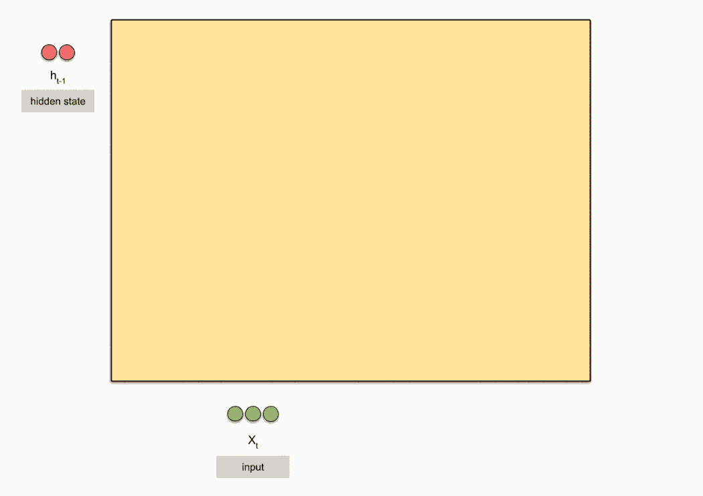

## 门控循环单元(GRU, gated recurrent unit)



关注一个序列

- 不是每个观察值都同等重要
- 想只记住相关的观察需要，通过一些控制单元：
  - 能关注的机制（更新门）
  - 能遗忘的机制（重置门）

### 门

$$
\begin{split}
\bf R_t=\sigma(X-tW_{xr}+H_{t-1}W_{hr}+b_r)\\
\bf Z_t=\sigma(X-tW_{xz}+H_{t-1}W_{hz}+b_z)
\end{split}$$


经过 $\sigma()$， $\bf R_t$ 和 $\bf Z_t$ 的值都在 $0-1$ 之间。

$\bf R_t$，$\bf Z_t$ 和 $\bf H_t$ 形状相同。

### 候选隐状态

$${\bf \~H_t}=tanh(\bf X_tW_{xh}+(R_t⊙ H_{t-1})W_{hh}+b_h)$$

符号 ⊙ 是Hadamard积运算符

如果 $R_t$ 里的元素接近 0，那么 $R_t⊙ H_{t-1}$ 也接近 0， 就是遗忘上一个时间的隐藏状态；相反，如果全为 1，就是上一刻状态的复现。

$\bf R_t$ 可以学习

### 隐状态

$$\bf H_t=Z_t⊙ H_{t-1}+(1-\bf Z_t)⊙\~H_t$$

$\bf Z_t = 1$ 时，直接用前一时刻状态，舍弃当前状态
$\bf Z_t = 0$ 时，不起作用；如果配合 $\bf R_t = 1$，就是RNN。


### 代码实现

和RNN的实现相比，只是增加了运算和对应权重，其他都保持一致。

```
import torch
from torch import nn
from d2l import torch as d2l

batch_size, num_steps = 32, 35
train_iter, vocab = d2l.load_data_time_machine(batch_size, num_steps)
```
```
def get_params(vocab_size, num_hiddens, device):
    num_inputs = num_outputs = vocab_size

    def normal(shape):
        return torch.randn(size=shape, device=device)*0.01

    def three():
        return (normal((num_inputs, num_hiddens)),
                normal((num_hiddens, num_hiddens)),
                torch.zeros(num_hiddens, device=device))

    W_xz, W_hz, b_z = three()  # 更新门参数
    W_xr, W_hr, b_r = three()  # 重置门参数
    #以上两个是GRU多出的参数
    W_xh, W_hh, b_h = three()  # 候选隐状态参数
    # 输出层参数
    W_hq = normal((num_hiddens, num_outputs))
    b_q = torch.zeros(num_outputs, device=device)
    # 附加梯度
    params = [W_xz, W_hz, b_z, W_xr, W_hr, b_r, W_xh, W_hh, b_h, W_hq, b_q]
    for param in params:
        param.requires_grad_(True)
    return params

def init_gru_state(batch_size, num_hiddens, device):
    return (torch.zeros((batch_size, num_hiddens), device=device), )
```
```
def gru(inputs, state, params):
    W_xz, W_hz, b_z, W_xr, W_hr, b_r, W_xh, W_hh, b_h, W_hq, b_q = params
    H, = state
    outputs = []
    for X in inputs:
        Z = torch.sigmoid((X @ W_xz) + (H @ W_hz) + b_z)
        # @就是矩阵乘法matmul()
        R = torch.sigmoid((X @ W_xr) + (H @ W_hr) + b_r)
        H_tilda = torch.tanh((X @ W_xh) + ((R * H) @ W_hh) + b_h)
        H = Z * H + (1 - Z) * H_tilda
        Y = H @ W_hq + b_q
        outputs.append(Y)
    return torch.cat(outputs, dim=0), (H,)
```
```
vocab_size, num_hiddens, device = len(vocab), 256, d2l.try_gpu()
num_epochs, lr = 500, 1
model = d2l.RNNModelScratch(len(vocab), num_hiddens, device, get_params,
                            init_gru_state, gru)
#把RNN的模型转换为了GRU
d2l.train_ch8(model, train_iter, vocab, lr, num_epochs, device)
```
