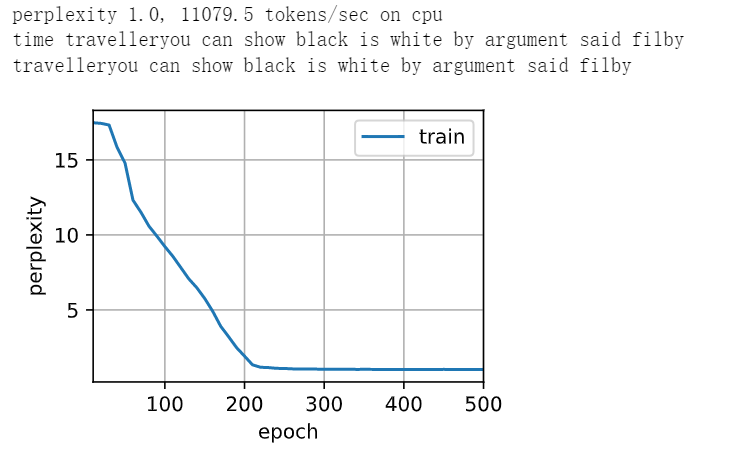

问：如何获得更多的非线性性？
答：多隐藏层


$$\begin{split}
&{\bf H_t^1}=f_1(\bf H_{t-1}^1,X_t)\\
&{\bf H_t^2}=f_2(\bf H_{t-1}^2,H_t^1)\\
&...\\
&{\bf H_t^j}=f_j(\bf H_{t-1}^j,H_t^{j-1})\\
&...\\
&{\bf O_t}=g(\bf H_t^L)
\end{split}$$

- 每层模型里打包了非线性函数

**总结**

- 深度循环神经网络使用多个隐藏层来获得更多的非线性性

### 代码实现

```
import torch
from torch import nn
from d2l import torch as d2l

batch_size, num_steps = 32, 35
train_iter, vocab = d2l.load_data_time_machine(batch_size, num_steps)

vocab_size, num_hiddens, num_layers = len(vocab), 256, 2
num_inputs = vocab_size
device = d2l.try_gpu()
lstm_layer = nn.LSTM(num_inputs, num_hiddens, num_layers)
#所有模型都有kw,num_layers，因为 hidden layers 的大小数量不变，所以直接设置层数（默认初始化权重全零）就可以
#模型每层都用tanh（）做了非线性
model = d2l.RNNModel(lstm_layer, len(vocab))
model = model.to(device)
```

```
num_epochs, lr = 500, 2
d2l.train_ch8(model, train_iter, vocab, lr, num_epochs, device)

#计算慢了，收敛快了，记住了文本，perplexity=1
```
