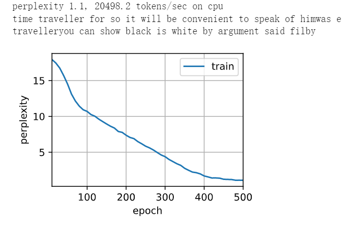

作者与深度学习三巨有矛盾。

### 长短期记忆网络

- 忘记门：将值朝0减少
- 输入门：决定不是忽略掉输入数据
- 输出门：决定是不是使用隐状态


**门**

$$
\begin{split}
&{\bf I}_t=\sigma({\bf X}_t{\bf W}_{xi}+{\bf H}_{t-1}{\bf W}_{hi}+{\bf b}_i)\\
&{\bf F}_t=\sigma({\bf X}_t{\bf W}_{xf}+{\bf H}_{t-1}{\bf W}_{hf}+{\bf b}_f)\\
&{\bf O}_t=\sigma({\bf X}_t{\bf W}_{xo}+{\bf H}_{t-1}{\bf W}_{ho}+{\bf b}_o)
\end{split}
$$

**候选记忆单元**

$${\bf \~C}_t=tanh({\bf X}_t{\bf W}_{xc}+{\bf H}_{t-1}{\bf W}_{hc}+{\bf b}_c)$$

- RNN的输出
- ${\bf C, \~C}$ 与 $\bf H$ 形状相同

**记忆单元**

$${\bf C}_t={\bf F}_t⊙{\bf C}_{t-1}+{\bf I}_t⊙{\bf\~C}_t$$

- $F=0$，舍去上一个记忆单元
- $I=0$，舍弃当下的记忆单元
- 两者相加，${\bf C}_{t-1}$ 和 ${\bf\~C}_t$ 都经过非线性变换，在 $0-1$ 之间，所以${\bf C}_{t}$ 在 $0-2$ 之间
  - 仔细想来，$\bf C$ 没有经过非线性，可以叠加出比较大的值 
   
**隐状态**

$${\bf H}_t={\bf O}_t⊙tanh({\bf C}_t)$$
- 所以要再次非线性把 ${\bf C}_t$ clamp住。
- ${\bf O}_t=0$，把输入和前一刻状态都舍弃，相当于重置 ${\bf H}_t$
- ${\bf O}$ 是对 ${\bf H}$ 的保存与否
- 相当于 ${\bf C}$ 是对 ${\bf H}$ 状态的中间量

**输出**

${\bf O}_t=\phi({\bf W}_{ho}{\bf H}_t+{\bf b}_o)$

- 与RNN最后形式相同


### 代码实现

LSTM、GRU和RNN只是矩阵运算的forward函数上略有不同。

```
import torch
from torch import nn
from d2l import torch as d2l

batch_size, num_steps = 32, 35
train_iter, vocab = d2l.load_data_time_machine(batch_size, num_steps)
```
```
def get_lstm_params(vocab_size, num_hiddens, device):
    num_inputs = num_outputs = vocab_size

    def normal(shape):
        return torch.randn(size=shape, device=device)*0.01

    def three():
        return (normal((num_inputs, num_hiddens)),
                normal((num_hiddens, num_hiddens)),
                torch.zeros(num_hiddens, device=device))

    W_xi, W_hi, b_i = three()  # 输入门参数
    W_xf, W_hf, b_f = three()  # 遗忘门参数
    W_xo, W_ho, b_o = three()  # 输出门参数
    W_xc, W_hc, b_c = three()  # 候选记忆元参数
    # 输出层参数
    W_hq = normal((num_hiddens, num_outputs))
    b_q = torch.zeros(num_outputs, device=device)
    # 附加梯度
    params = [W_xi, W_hi, b_i, W_xf, W_hf, b_f, W_xo, W_ho, b_o, W_xc, W_hc,
              b_c, W_hq, b_q]
    for param in params:
        param.requires_grad_(True)
        #tensor才有requires_grad属性
    return params
```
```
def init_lstm_state(batch_size, num_hiddens, device):
    return (torch.zeros((batch_size, num_hiddens), device=device),#H初始化
            torch.zeros((batch_size, num_hiddens), device=device)) # C初始化
```
```
def lstm(inputs, state, params):
    [W_xi, W_hi, b_i, W_xf, W_hf, b_f, W_xo, W_ho, b_o, W_xc, W_hc, b_c,
     W_hq, b_q] = params
    (H, C) = state
    outputs = []
    for X in inputs:
        I = torch.sigmoid((X @ W_xi) + (H @ W_hi) + b_i)
        F = torch.sigmoid((X @ W_xf) + (H @ W_hf) + b_f)
        O = torch.sigmoid((X @ W_xo) + (H @ W_ho) + b_o)
        C_tilda = torch.tanh((X @ W_xc) + (H @ W_hc) + b_c)
        C = F * C + I * C_tilda
        H = O * torch.tanh(C)
        Y = (H @ W_hq) + b_q
        #输出还是在H上
        outputs.append(Y)
    return torch.cat(outputs, dim=0), (H, C)
```
```
vocab_size, num_hiddens, device = len(vocab), 256, d2l.try_gpu()
num_epochs, lr = 500, 1
model = d2l.RNNModelScratch(len(vocab), num_hiddens, device, get_lstm_params,
                            init_lstm_state, lstm)
d2l.train_ch8(model, train_iter, vocab, lr, num_epochs, device)
```
