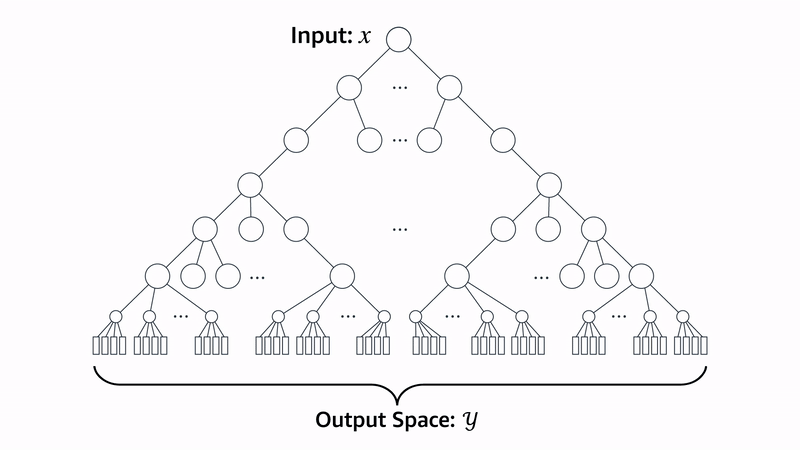

# 51 - 束搜索

---

### 🎦 本节课程视频地址 👉

## 束搜索

**贪心搜索(greedy search)**

- 在seq2seq中我们使用了贪心搜索来预测序列
  - 将当前时刻预测概率最大的词输出
- 但贪心很可能不是最优的：

**穷举搜索(exhausitive search)**

- 最优算法：对所有可能的序列，计它的概率，然后选最好的那个
- 如果输出字典大小为 $n$， 序列最长为 $T$，那么我们需要遍历 $n^T$ 个序列
  - $n=10000,\ T=10:\quad n^T=10^{40}$
  - 计算上不可行
  
**束搜索(beam search)**

- 贪心最快最劣，穷举最好最慢，所以走中见道
- 保存最好的 $k$ 个候选
- 在每个时刻，对每个候选新加一项($n$ 种可能)，在 $kn$ 个选项中选出最好的 $k$ 个
  

- 时间复杂度 $O(knT)$
  - $k=5,\ n=10000,\ T=10:\quad knT=5\times10^{5}$
- 每个候选的最终分数是：
  $${1\L^\alpha}\log p(y1,...,y_L)={1\L^\alpha}\sum_{t'=1}^L\log p(y_{t'}|y_1,...,y_{t'-1})$$
  - 通常 $\alpha=0.75$
  - 对长句子的加权，因为长句子与短句子相比没有竞争优势
  - 短句子遇到<eos>就会停止

**总结**

- 束搜索在每次搜索时保存 $k$ 个最好的候选
  - $k=1$ 时是贪心搜索
