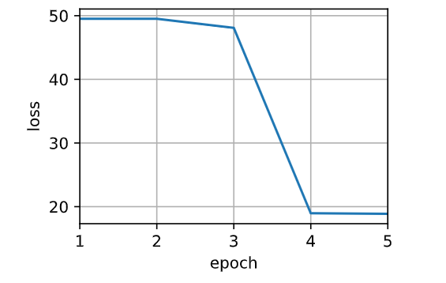
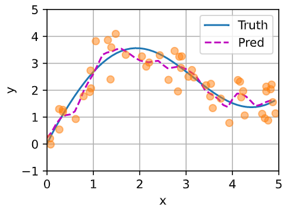
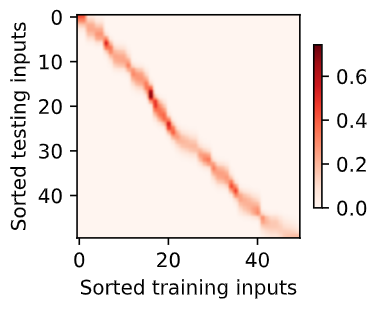

## 注意力机制

——可以算是深度学习近十年的突破

**心理学**

- 动物需要在复杂环境下有效关注值得关注的点
- 心理学框架：人类根据随意线索和不随意线索选择注意点
  - 称之为随意不太合适，应该说是有用意的线索；反之，不随意线索是无用意的线索

**注意力机制**

- 卷积、全连接、池化层都只考虑不随意线索
  - 比较容易抽取的特征，如纹理、颜色
- 注意力机制则显示的考虑随意线索
  - 确定想要有个想法
  - 随意线索被称之为查询(query)
  - 每个输入是一个值(value)和不随意线索(key)的键值对
  - 通过注意力池化层来有偏向性地选择某些输入

**非参注意力池化层**

- 非参表示不学习参数
- 给定数据 $(x_i,y_i),\ i=1,...,n$
  - 代表每一组候选的键值对
- 平均池化是最简单的方案：$f(x)={1\over n}\sum_i y_i$
  - $x$ 代表 query
  - 无论 key 是什么，把所有 value 做平均返回
- 更好的方案是60年代提出来的Nadaraya-Watson核回归
  $f(x)=\sum_{i=1}^n{K(x-x_i)\over \sum_{j=1}^n K(x-x_j)}y_i$
  - 核 $K$ 用于衡量 query 与每个 key 之间的距离
  - 分母对其求和，整个分式代表每一项 key 的相对重要性
  - 再用所得相对重要性对值加权求和
  - 也就是选择和目标相近的数据

**Nadaraya-Watson核回归**

- 使用高斯核 $K(u)={1\over \sqrt{2\pi}}\exp(-{u^2\over 2})$
- 那么
  $$
  \begin{split}
  f(x)&=\sum_{i=1}^n{\exp\left(-{1\over2}(x-x_i)^2\right)\over\sum_{j=1}^n\exp\left(-{1\over2}(x-x_i)^2\right)}y_i\\
  &=\sum_{i=1}^nsoftmax\left(-{1\over2}(x-x_i)^2\right)y_i
  \end{split}$$

**参数化的注意力机制**

- 在之前基础上引入可以学习的 $w$
  $f(x)=\sum_{i=1}^nsoftmax\left(-{1\over2}((x-x_i)w)^2\right)y_i$

**总结**

- 心理学认为人通过线索和不随意线索选择注意点
- 注意力机制中，通过 query（随意线索）和 key（不随意线索）来有偏向性地选择输入
  - 可以一般的写作 $f(x)=\sum_i\alpha(x,x_i)y_i$，这里 $\alpha(x,x_i)$ 是注意力权重
  - 早在60年代就有非参数的注意力机制
  - 接下来我们会介绍多个不同的权重设计

### 代码实现

**创造数据集**

- 训练集是一个个键值对
- 测试集是 query
```
import torch
from torch import nn
from d2l import torch as d2l
import numpy as np

"""
x_train，y_train就是键值对
x_test是quary
"""
n_train = 50  # 训练样本数
x_train, _ = torch.sort(torch.rand(n_train) * 5)   # 排序后的训练样本
#torch.sort()的另一个返回值是索引的排序
def f(x): #真实的数据表现
    return 2 * torch.sin(x) + x**0.8

y_train = f(x_train) + torch.normal(0.0, 0.5, (n_train,))
# 训练样本的输出，加噪音
x_test = torch.arange(0, 5, 0.1)  # 测试样本
y_truth = f(x_test)  # 测试样本的真实输出
n_test = len(x_test)  # 测试样本数
n_test

def plot_kernel_reg(y_hat):
    d2l.plot(x_test, [y_truth, y_hat], 'x', 'y', legend=['Truth', 'Pred'],
             xlim=[0, 5], ylim=[-1, 5])
    d2l.plt.plot(x_train, y_train, 'o', alpha=0.5);

y_hat = torch.repeat_interleave(y_train.mean(), n_test)
#torch.repeat_interleave()
#Repeated tensor which has the same shape as input, except along the given axis.
#默认是铺平元素复制，返回成一维向量
#把y_train的平均复制n_test遍


plot_kernel_reg(y_hat)
```


**非参数化的注意力机制**

```
X_repeat = x_test.repeat_interleave(n_train).reshape((-1, n_train))
# X_repeat的形状:(n_test,n_train),
# 每一行都包含着相同的测试输入（也就是同样的查询）
attention_weights = nn.functional.softmax(-(X_repeat - x_train)**2 / 2, dim=1)
# x_train包含着键。attention_weights的形状：(n_test,n_train)
# 每一个quary都和所有的键做运算，求softmax
# 每一行都包含着要在给定的每个查询的值（y_train）之间分配的注意力权重
# shape=(n_test,n_train)
y_hat = torch.matmul(attention_weights, y_train)
plot_kernel_reg(y_hat)
#相当于平滑的回归
```


```
d2l.show_heatmaps(attention_weights.unsqueeze(0).unsqueeze(0),
                  xlabel='Sorted training inputs',
                  ylabel='Sorted testing inputs')
```


**参数化注意力机制**

```
#带有batch_size的矩阵X(n,a,b)和Y(n,b,c)按照批量相乘
#return (n,a,c)
X = torch.ones((2, 1, 4))
Y = torch.ones((2, 4, 6))
torch.bmm(X, Y).shape

weights = torch.ones((2, 10)) * 0.1
values = torch.arange(20.0).reshape((2, 10))
torch.bmm(weights.unsqueeze(1), values.unsqueeze(-1))

class NWKernelRegression(nn.Module):
    def __init__(self, **kwargs):
        super().__init__(**kwargs)
        self.w = nn.Parameter(torch.rand((1,), requires_grad=True))
        #(1,)表示只有一个元素的一维张量
    def forward(self, queries, keys, values):
        # queries和attention_weights的形状为(查询个数，“键－值”对个数)
        queries = queries.repeat_interleave(keys.shape[1]).reshape((-1, keys.shape[1]))
        self.attention_weights = nn.functional.softmax(
            -((queries - keys) * self.w)**2 / 2, dim=1)
        return torch.bmm(self.attention_weights.unsqueeze(1),
                         values.unsqueeze(-1)).reshape(-1)
        # (x_test, 1, x_train) * (1, y_train, 1)

X_tile = x_train.repeat((n_train, 1))
# (n_train，n_train)
Y_tile = y_train.repeat((n_train, 1))
# (n_train，n_train)
keys = X_tile[(1 - torch.eye(n_train)).type(torch.bool)].reshape((n_train, -1))
#('n_train'，'n_train'-1)
#把X_tiles对角线的元素拿掉
values = Y_tile[(1 - torch.eye(n_train)).type(torch.bool)].reshape((n_train, -1))
# ('n_train'，'n_train'-1)
#把Y_tiles对角线的元素拿掉
#也就是说每一个train里的元素不和其本身求高斯
```
```
net = NWKernelRegression()
loss = nn.MSELoss(reduction='none')
trainer = torch.optim.SGD(net.parameters(), lr=0.5)
animator = d2l.Animator(xlabel='epoch', ylabel='loss', xlim=[1, 5])

for epoch in range(5):
    trainer.zero_grad()
    l = loss(net(x_train, keys, values), y_train)
    l.sum().backward()
    trainer.step()
    print(f'epoch {epoch + 1}, loss {float(l.sum()):.6f}')
    animator.add(epoch + 1, float(l.sum()))

"""
net(x_train, keys, values)
queries.shape=(n_test,n_train'-1)
keys.shape=('n_train'，'n_train'-1)
values.shape=(n_train'，'n_train'-1)
self.attention_weights.shape=(n_train'，'n_train'-1)
self.attention_weights.unsqueeze(1).shape=(n_train'，1,'n_train'-1)
values.unsqueeze(-1).shape=(n_train'，'n_train'-1, 1)
torch.bmm().reshape(-1).shape=(1, n_train')
"""
```


```
# keys的形状:(n_test，n_train)，每一行包含着相同的训练输入（例如，相同的键）
keys = x_train.repeat((n_test, 1))
# value的形状:(n_test，n_train)
values = y_train.repeat((n_test, 1))
y_hat = net(x_test, keys, values).unsqueeze(1).detach()
plot_kernel_reg(y_hat)
```


```
d2l.show_heatmaps(net.attention_weights.unsqueeze(0).unsqueeze(0),
                  xlabel='Sorted training inputs',
                  ylabel='Sorted testing inputs')
```
