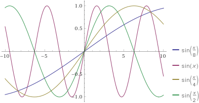

## 自注意力 (Self Attention)

### 理论部分

- 给定一个序列 ${\bf x_1},...,{\bf x_n},\forall {\bf x_i}\in \mathbb R^d$
- 自注意力池化层将 ${\bf x_i}$ 同时当作 key, value, query 来对序列抽取特征得到 ${\bf y_1},...,{\bf y_n}$，这里
  ${\bf y_i}=f({\bf x_i},({\bf x_1},{\bf x_1}),...,({\bf x_n},{\bf x_n}))\in \mathbb R^n$
  - 不需要额外的 key, value, query
  - 不需要 encode-decode 来处理序列


**跟CNN, RNN对比**

- CNN也可以处理序列，把一个序列看作一维张量，1-d 卷积，将每个 step 的特征 (word2vec) 作为 channel

|   | CNN  |  RNN | 自注意力  |
|---|---|---|---|
| 计算复杂度  | O(knd^2)  | O(nd^2)  | O(n^2d)  |
| 并行度  | O(n)  | O(1)  | O(n)  |
| 最长路径  | O(n/k)  | O(k)  | O(1)  |
  - n: num_steps
  - d: emd_sizes
  - k: kernel_size
  - 最长路径也叫做视野 (field)：相当于从把 step_1 的信息传递 step_n 需要的计算步数
  - RNN 有非常强的时序性；而自注意力对序列长度更敏感，并行度非常好
  - 自注意力机制适合长文本，因为视野宽，代价是计算复杂度高

计算复杂度的算法：

- CNN: 相当于每个输入通道 $d$ 做 $k \times n$ 的卷积后叠加，做输出通道数 $d$ 组卷积；
- RNN: 每一步的隐层是 $d\times d$ 的矩阵乘法，做 $n$ 步；
- 自注意力：每个 query 和所有 k-v pairs 做长度为 $d$ 的向量点乘

**位置编码**

- 跟 CNN/RNN 不同，自注意力并没有记录位置信息
- 位置编码将位置信息注入到输入里
  - 假设长度为 $n$ 的序列是 ${\bf X}\in\mathbb R^{n \times d}$，那么使用位置编码矩阵 ${\bf P}\in \mathbb R^{n \times d}$ 来输出 ${\bf X} + {\bf P}$ 作为自编码输入
- $\bf P$ 的元素如下计算：
  $p_{i,2j}=\sin\left({i\over 10000^{2j/d}}\right)$，$p_{i,2j+1}=\cos\left({i\over10000^{2j/d}}\right)$
  - 奇数列和偶数列分别是周期不同的正弦余弦函数
  - 列越靠后周期越长



**绝对位置信息**

- 计算机使用二进制编码
  - 0-1 的编码不断条约
  - 越靠前的行/列频率变化越快


**相对位置信息**

- 位置于 $i+\delta$ 处的位置编码可以线性投影位置 $i$ 处的位置编码来表示
- 记 $\omega_j=1/10000^{2j/d}$，那么


  
  $$
  \begin{bmatrix}
  \cos(\delta\omega_j)&\sin(\delta\omega_j)\\-\sin(\delta\omega_j)&\cos(\delta\omega_j)
  \end{bmatrix}
  \begin{bmatrix} 
  p_{i+,2j}\\ p_{i,2j+1}
  \end{bmatrix}=
  \begin{bmatrix} 
  p_{i+\delta,2j}\\ p_{i+\delta,2j+1}
  \end{bmatrix}
  $$
  - 投影矩阵跟 $i$ 无关

**总结**

- 自注意力池化层将 $x_i$ 当做 key, value, query 来对序列抽取特征
- 完全并行、最长序列为 1、但对长序列计算复杂度高
- 位置编码在输入中加入位置信息，使得子注意力能够记忆位置信息

### 代码实现

定义一个类，把公式写进去

```
import math
import torch
from torch import nn
from d2l import torch as d2l

num_hiddens, num_heads = 100, 5
attention = d2l.MultiHeadAttention(num_hiddens, num_hiddens, num_hiddens,
                                   num_hiddens, num_heads, 0.5)
attention.eval()

#实现一个功能定义函数，创建一类数据集用类
class PositionalEncoding(nn.Module):
    """位置编码"""
    #max_len是最长的序列长度
    def __init__(self, num_hiddens, dropout, max_len=1000):
        super(PositionalEncoding, self).__init__()
        self.dropout = nn.Dropout(dropout)
        # 创建一个足够长的P
        # d=num_hiddens=emd_size
        self.P = torch.zeros((1, max_len, num_hiddens))
        # i/10000^(2j/d)
        X = torch.arange(max_len, dtype=torch.float32).reshape(
            -1, 1) / torch.pow(10000, torch.arange(
            0, num_hiddens, 2, dtype=torch.float32) / num_hiddens)
        self.P[:, :, 0::2] = torch.sin(X)
        self.P[:, :, 1::2] = torch.cos(X)
    #把位置编码和输入相加
    def forward(self, X):
        #X.shape[1]表示实际传入的行数
        X = X + self.P[:, :X.shape[1], :].to(X.device)
        #用丢弃法弱化对位置P的敏感度
        return self.dropout(X)

encoding_dim, num_steps = 32, 60
pos_encoding = PositionalEncoding(encoding_dim, 0)
pos_encoding.eval()
X = pos_encoding(torch.zeros((1, num_steps, encoding_dim)))
P = pos_encoding.P[:, :X.shape[1], :]
d2l.plot(torch.arange(num_steps), P[0, :, 6:10].T, xlabel='Row (position)',
         figsize=(6, 2.5), legend=["Col %d" % d for d in torch.arange(6, 10)])
```
