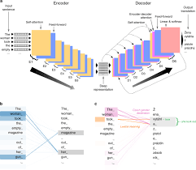

## Transformer

### 理论学习

- 基于编码器-解码器架构来处理序列对
- 跟使用注意力的seq2seq不同，Transformer是纯基于注意力

**多头注意力**

- 对同一 key, value, query, 希望抽取不同的信息
  - 例如短距离关系和长距离关系
    - 通过全连接层变成长度小的 $d$
    - 分别进入各自的注意力机制头
- 多头注意力使用 $h$ 个独立的注意力池化
  - 合并 (Concat) 各个头 (head) 输出得到最终输出
  - 最后经过一个全连接层获得输出的维度

- query ${\bf q}\in\mathbb R^{d_q}$，key ${\bf k}\in \mathbb R^{d_k}$，value ${\bf v}\in\mathbb R^{d_v}$
- 头 $i$ 的可学习参数 ${\bf W}_i^{(q)}\in\mathbb R^{p_q\times d_q}$，${\bf W}_i^{(k)}\in\mathbb R^{p_k\times d_k}$，${\bf W}_i^{(v)}\in\mathbb R^{p_v\times d_v}$
- 头 $i$ 的输出 ${\bf h}_i=f({\bf W}_i^{(q)}{\bf q},{\bf W}_i^{(k)}{\bf k},{\bf W}_i^{(v)}{\bf v})$
- 输出的可学习参数 ${\bf W}_o\in\mathbb R^{p_o\times hp_v}$
- 多头注意力的输出
  ${\bf W_o}
  \begin{bmatrix}
  {\bf h}_1\\\vdots\\{\bf h}_h
  \end{bmatrix}\in\mathbb R^{p_o}
  $


**有掩码的多头注意力**

- 解码器对序列中一个元素输出时，不应该考虑该元素之后的元素
  - Attention 的视野可以看到全部的元素
  - 编码器可以，解码器不行
- 可以通过掩码来实现
  - 也就是计算 ${\bf x_i}$ 输出时，假装当前序列长度为 ${\bf i}$
    - 在实现上做softmax时不给后面的元素权重

**基于位置的前馈网络**

- 将输入形状由 $(b,n,d)$ 变换成 $(bn,d)$
  - $n$ 是序列长度，与模型无关，会发生改变
  - 所以对序列里每个元素做全连接
- 作用两个全连接层
- 输出形状由 $(bn,d)$ 变化回 $(b,n,d)$
- 等价于两层核窗口为 $1$ 的一维卷积层

**层归一化**

- 批量归一化对每个特征/通道里元素进行归一化
  - 不适合序列长度会变的NLP应用
  - 也就是 $d$ 对 $b \times n$ 做归一化
- 层归一化对每个样本里的元素进行归一化


**ResNet**

- 每一模块会用ResNet合并模块输出一同做归一化
- 因此输出的自注意力模块的输出 dim 与输入相同 

**信息传递**

- 编码器中的输出 ${\bf y_1},...,{\bf y_n}$
- 将其作为解码中第 $i$ 个 Transformer 块中多头注意力的 key 和 value
  - 它的 query 来自目标序列
  - 解码器的每一层（除了第一层SelfAttention以外）都加
- 意味着编码器和解码器中块的个数和输出维度都是一样的
  - 简单对称
  - 也就是贯穿始终的 $d$ 不变性了，非常优秀


**预测**

- 预测第 $t+1$ 个输出时
- 解码器中输入前 $t$ 个预测值
  - 在子注意力中，前 $t$ 个预测值作为 key 和 value，第 t 个预测值还作为 query
  - 还是顺序进行的

**总结**

- Transformer是一个纯使用注意力的编码-解码器
- 编码器和解码器都有 $n$ 个transformer块
- 每个块里使用多头（自）注意力，基于位置的前馈网络，和层归一化

### 代码实现

**多头注意力**

```
import math
import torch
from torch import nn
from d2l import torch as d2l

class MultiHeadAttention(nn.Module):
    """多头注意力"""
    def __init__(self, key_size, query_size, value_size, num_hiddens,
                 num_heads, dropout, bias=False, **kwargs):
        super(MultiHeadAttention, self).__init__(**kwargs)
        self.num_heads = num_heads
        #没有学注意力分数权重
        self.attention = d2l.DotProductAttention(dropout)
        # nn.Linear()有一个特性，做变换的张量可以是任意维度，只要最后一个维度H_in与模块的H_in相同就可以，并保留其他所有维度
        self.W_q = nn.Linear(query_size, num_hiddens, bias=bias)
        self.W_k = nn.Linear(key_size, num_hiddens, bias=bias)
        self.W_v = nn.Linear(value_size, num_hiddens, bias=bias)
        self.W_o = nn.Linear(num_hiddens, num_hiddens, bias=bias)
```
${\bf W_q}\in\mathbb R^{q\times d},{\bf W_k}\in\mathbb R^{k\times d},{\bf W_v}\in\mathbb R^{v\times d},{\bf W_o}\in\mathbb R^{d\times d}$
$q=k=v$
${\bf Q}\in\mathbb R^{b\times q\times d},{\bf K}\in\mathbb R^{b\times k\times d},{\bf V}\in\mathbb R^{b\times v\times d}$
${\bf Q_{self}}={\bf Q}{\bf W_q}\in\mathbb R^{b\times q\times d}\\
{\bf K_{self}}={\bf K}{\bf W_k}\in\mathbb R^{b\times k\times d}\\
{\bf V_{self}}={\bf V}{\bf W_v}\in\mathbb R^{b\times v\times d}$
- 经过全连接层形状不发生改变

$Attetion=f=softmax(a({\bf Q,K})){\bf V}\in\mathbb R^{b\times v \times d}$

- 经过自注意力层形状也不发生改变
- 按 batch 相乘
  
```
    def forward(self, queries, keys, values, valid_lens):
        # queries，keys，values的形状(自注意力是同一个东西):
        # (batch_size，num_kv，num_hiddens(d))
        # valid_lens　的形状:
        # (batch_size，)或(batch_size，查询的个数)
        # 经过变换后，输出的queries，keys，values　的形状:
        # (batch_size*num_heads，num_kv，num_hiddens/num_heads)
        queries = transpose_qkv(self.W_q(queries), self.num_heads)
        keys = transpose_qkv(self.W_k(keys), self.num_heads)
        values = transpose_qkv(self.W_v(values), self.num_heads)

        if valid_lens is not None:
            # 在轴0，将第一项（标量或者矢量）复制num_heads次，
            # 输出形状：(batch_size * num_heads,)
            # or (batch_size * num_heads, 1)
            valid_lens = torch.repeat_interleave(
                valid_lens, repeats=self.num_heads, dim=0)

        # output的形状:(batch_size*num_heads，num_kv，num_hiddens/num_heads)
        output = self.attention(queries, keys, values, valid_lens)

        # output_concat的形状:(batch_size，查询的个数，num_hiddens)
        output_concat = transpose_output(output, self.num_heads)
        return self.W_o(output_concat)
```
${\bf Q_t}\in\mathbb R^{bn\times q\times d/n},{\bf K_t}\in\mathbb R^{bn\times k\times d/n},{\bf V_t}\in\mathbb R^{bn\times v\times d/n}$
- 相当于对 query, key, value 做完线性变换后，按头数 $n$ 放缩长度 $d$，得到 $n$ 组特征变短的 query, key, value，总计 $nb$ 个 batches
  
${\bf O}=f({\bf Q_t},{\bf K_t},{\bf V_t})\in\mathbb R^{b\times v \times d}$
- 对每一个组分别做点积性注意力，相当于分别在 $n$ 个不同的头里
  
${\bf O}{\bf W_o}\in\mathbb R^{b\times v \times d}$

- 整体按列再合并到三维长度为 $d$ 的张量做全连接输出
- 而不是按列堆积与一个 ${\bf W}\in\mathbb R^{(d \times bn)}$ 的权重做全连接


综上，省略了一个 for loop 的计算量 $O(n)$，且用更短的维度 $d/n$ 取代 $d$ 做自注意力，以及用两个方阵做全连接输出而非与一个连接的长矩阵做乘法。换句话说，每个头里都拿出部分特征做自注意力，最终整合在一起再通过全连接

```
def transpose_qkv(X, num_heads):
    """为了多注意力头的并行计算而变换形状"""
    # 输入X的形状:(batch_size，num_kv，num_hiddens)
    # 输出X的形状:(batch_size，num_kv，num_heads，num_hiddens/num_heads)
    X = X.reshape(X.shape[0], X.shape[1], num_heads, -1)

    # 输出X的形状:(batch_size，num_heads，num_kv, num_hiddens/num_heads)
    X = X.permute(0, 2, 1, 3)

    # 最终输出的形状:(batch_size*num_heads, num_kv, num_hiddens/num_heads)
    return X.reshape(-1, X.shape[2], X.shape[3])

def transpose_output(X, num_heads):
    """逆转transpose_qkv函数的操作"""
    # 输出X的形状：(batch_size, num_heads, num_kv, num_hiddens/num_heads)
    X = X.reshape(-1, num_heads, X.shape[1], X.shape[2])
    # 输出X的形状：(batch_size, num_kv, num_heads, num_hiddens/num_heads)
    X = X.permute(0, 2, 1, 3)
    # 输出X的形状：(batch_size, num_kv, num_hiddens)
    return X.reshape(X.shape[0], X.shape[1], -1)
```

**前馈网络**

```
import math
import pandas as pd
import torch
from torch import nn
from d2l import torch as d2l

class PositionWiseFFN(nn.Module):
    """基于位置的前馈网络"""
    def __init__(self, ffn_num_input, ffn_num_hiddens, ffn_num_outputs,
                 **kwargs):
        super(PositionWiseFFN, self).__init__(**kwargs)
        self.dense1 = nn.Linear(ffn_num_input, ffn_num_hiddens)
        self.relu = nn.ReLU()
        self.dense2 = nn.Linear(ffn_num_hiddens, ffn_num_outputs)

    def forward(self, X):
        return self.dense2(self.relu(self.dense1(X)))
```
**层归一化**

```
ln = nn.LayerNorm(2)
# batch_norm对于整个特征归一化，所以是最后一个维度（每列）
bn = nn.BatchNorm1d(2)
# layer_norm对于批量进行特征归一化，就是第一个维度（每行）
X = torch.tensor([[1, 2], [2, 3]], dtype=torch.float32)
# 在训练模式下计算X的均值和方差
print('layer norm:', ln(X), '\nbatch norm:', bn(X))
```

**残差规范化**

```
class AddNorm(nn.Module):
    """残差连接后进行层规范化"""
    def __init__(self, normalized_shape, dropout, **kwargs):
        super(AddNorm, self).__init__(**kwargs)
        self.dropout = nn.Dropout(dropout)
        self.ln = nn.LayerNorm(normalized_shape)

    def forward(self, X, Y):
        #相加做ResNet
        return self.ln(self.dropout(Y) + X)
```

**编码器块**

```
class EncoderBlock(nn.Module):
    """transformer编码器块"""
    def __init__(self, key_size, query_size, value_size, num_hiddens,
                 norm_shape, ffn_num_input, ffn_num_hiddens, num_heads,
                 dropout, use_bias=False, **kwargs):
        super(EncoderBlock, self).__init__(**kwargs)
        #输出形状：(batch_size, num_kv, num_hiddens)
        self.attention = d2l.MultiHeadAttention(
            key_size, query_size, value_size, num_hiddens, num_heads, dropout,
            use_bias)
        #输出形状依旧是(batch_size, num_kv, num_hiddens)
        self.addnorm1 = AddNorm(norm_shape, dropout)
        #输出形状依旧是(batch_size, num_kv, num_hiddens)
        self.ffn = PositionWiseFFN(
            ffn_num_input, ffn_num_hiddens, num_hiddens)
        #输出形状依旧是(batch_size, num_kv, num_hiddens)
        self.addnorm2 = AddNorm(norm_shape, dropout)

    def forward(self, X, valid_lens):
        Y = self.addnorm1(X, self.attention(X, X, X, valid_lens))
        return self.addnorm2(Y, self.ffn(Y))
```

**编码器块**

```
# 在编码器里是所有对所有的注意力机制
class TransformerEncoder(d2l.Encoder):
    """transformer编码器"""
    def __init__(self, vocab_size, key_size, query_size, value_size,
                 num_hiddens, norm_shape, ffn_num_input, ffn_num_hiddens,
                 num_heads, num_layers, dropout, use_bias=False, **kwargs):
        super(TransformerEncoder, self).__init__(**kwargs)
        self.num_hiddens = num_hiddens
        self.embedding = nn.Embedding(vocab_size, num_hiddens)
        self.pos_encoding = d2l.PositionalEncoding(num_hiddens, dropout)
        self.blks = nn.Sequential()
        #把所有的自Encoder块串联起来
        #add_module(name, module)，传入字符串作为子模块名
        for i in range(num_layers):
            self.blks.add_module("block"+str(i),
                EncoderBlock(key_size, query_size, value_size, num_hiddens,
                             norm_shape, ffn_num_input, ffn_num_hiddens,
                             num_heads, dropout, use_bias))

    def forward(self, X, valid_lens, *args):
        # 因为位置编码值在-1和1之间，
        # 因此嵌入值乘以嵌入维度的平方根进行放大，
        # 然后再与位置编码相加。
        X = self.pos_encoding(self.embedding(X) * math.sqrt(self.num_hiddens))
        # 为了后续热力图
        self.attention_weights = [None] * len(self.blks)
        for i, blk in enumerate(self.blks):
            X = blk(X, valid_lens)
            self.attention_weights[
                i] = blk.attention.attention.attention_weights
        #返回每层最后输出的values
        return X
```

**解码器块**

```
#在解码器中，训练时，是所有对所有的自注意力；预测时，是当前对过去全部的自注意力
#解码器在训练时的 batch_size 和 词嵌入维度与编码器相同
class DecoderBlock(nn.Module):
    """解码器中第i个块"""
    def __init__(self, key_size, query_size, value_size, num_hiddens,
                 norm_shape, ffn_num_input, ffn_num_hiddens, num_heads,
                 dropout, i, **kwargs):
        super(DecoderBlock, self).__init__(**kwargs)
        # 用于存储上一个时刻的输出
        self.i = i
        self.attention1 = d2l.MultiHeadAttention(
            key_size, query_size, value_size, num_hiddens, num_heads, dropout)
        self.addnorm1 = AddNorm(norm_shape, dropout)
        self.attention2 = d2l.MultiHeadAttention(
            key_size, query_size, value_size, num_hiddens, num_heads, dropout)
        self.addnorm2 = AddNorm(norm_shape, dropout)
        self.ffn = PositionWiseFFN(ffn_num_input, ffn_num_hiddens,
                                   num_hiddens)
        self.addnorm3 = AddNorm(norm_shape, dropout)

    def forward(self, X, state):
        # 传入编码器输出，有效长度
        enc_outputs, enc_valid_lens = state[0], state[1]
        # 训练阶段，输出序列的所有词元都在同一时间处理，
        # 因此state[2][self.i]初始化为None。
        # 预测阶段，输出序列是通过词元一个接着一个解码的，
        # 因此state[2][self.i]包含着直到当前时间步第i个块解码的输出表示
        if state[2][self.i] is None:
            key_values = X
        # 预测时按行叠加状态
        else:
            key_values = torch.cat((state[2][self.i], X), axis=1)
        # 这里对state[2][i]进行了填充，训练就是X本身，预测就是以往和当前并联
        # 每个块输出的X都不一样，第一块是原始词嵌入
        state[2][self.i] = key_values
        # 训练时需要当作后面的看不到，所以把后面的权重遮掉，预测时不需要这样做
        if self.training:
            batch_size, num_steps, _ = X.shape
            # dec_valid_lens的开头:(batch_size,num_steps),
            # 其中每一行是[1,2,...,num_steps]
            dec_valid_lens = torch.arange(
                1, num_steps + 1, device=X.device).repeat(batch_size, 1)
        else:
            dec_valid_lens = None

        # 自注意力
        X2 = self.attention1(X, key_values, key_values, dec_valid_lens)
        Y = self.addnorm1(X, X2)
        # 编码器－解码器注意力。
        # enc_outputs的开头:(batch_size,num_steps,num_hiddens)
        Y2 = self.attention2(Y, enc_outputs, enc_outputs, enc_valid_lens)
        Z = self.addnorm2(Y, Y2)
        return self.addnorm3(Z, self.ffn(Z)), state

```

**解码器**

```
#解码器只拿编码器最终的输出传入每个块里
class TransformerDecoder(d2l.AttentionDecoder):
    def __init__(self, vocab_size, key_size, query_size, value_size,
                 num_hiddens, norm_shape, ffn_num_input, ffn_num_hiddens,
                 num_heads, num_layers, dropout, **kwargs):
        super(TransformerDecoder, self).__init__(**kwargs)
        self.num_hiddens = num_hiddens
        self.num_layers = num_layers
        self.embedding = nn.Embedding(vocab_size, num_hiddens)
        self.pos_encoding = d2l.PositionalEncoding(num_hiddens, dropout)
        self.blks = nn.Sequential()
        for i in range(num_layers):
            self.blks.add_module("block"+str(i),
                DecoderBlock(key_size, query_size, value_size, num_hiddens,
                             norm_shape, ffn_num_input, ffn_num_hiddens,
                             num_heads, dropout, i))
        self.dense = nn.Linear(num_hiddens, vocab_size)
    # 预测可以看作是一个 RNN，所以要从encoder拿初状态
    # 初状态的state[2][i]都是None
    def init_state(self, enc_outputs, enc_valid_lens, *args):
        return [enc_outputs, enc_valid_lens, [None] * self.num_layers]

    def forward(self, X, state):
        X = self.pos_encoding(self.embedding(X) * math.sqrt(self.num_hiddens))
        self._attention_weights = [[None] * len(self.blks) for _ in range (2)]
        for i, blk in enumerate(self.blks):
            X, state = blk(X, state)
            # 解码器自注意力权重
            self._attention_weights[0][
                i] = blk.attention1.attention.attention_weights
            # “编码器－解码器”自注意力权重
            self._attention_weights[1][
                i] = blk.attention2.attention.attention_weights
        return self.dense(X), state

    @property
    def attention_weights(self):
        return self._attention_weights

```
- 在解码的时候，模型已经训练好了，编码器传入一句话，其输出的 state 作为解码器的初状态，解码器从第一个<bos>开始，每个词对前面的预测做注意力机制，第一个就和<bos>做，最终实现解码

**训练**

```
num_hiddens, num_layers, dropout, batch_size, num_steps = 32, 2, 0.1, 64, 10
lr, num_epochs, device = 0.005, 200, d2l.try_gpu()
ffn_num_input, ffn_num_hiddens, num_heads = 32, 64, 4
key_size, query_size, value_size = 32, 32, 32
norm_shape = [32]

train_iter, src_vocab, tgt_vocab = d2l.load_data_nmt(batch_size, num_steps)

encoder = TransformerEncoder(
    len(src_vocab), key_size, query_size, value_size, num_hiddens,
    norm_shape, ffn_num_input, ffn_num_hiddens, num_heads,
    num_layers, dropout)
decoder = TransformerDecoder(
    len(tgt_vocab), key_size, query_size, value_size, num_hiddens,
    norm_shape, ffn_num_input, ffn_num_hiddens, num_heads,
    num_layers, dropout)
net = d2l.EncoderDecoder(encoder, decoder)
d2l.train_seq2seq(net, train_iter, lr, num_epochs, tgt_vocab, device)
```


**预测**

```
engs = ['go .', "i lost .", 'he\'s calm .', 'i\'m home .']
fras = ['va !', 'j\'ai perdu .', 'il est calme .', 'je suis chez moi .']
for eng, fra in zip(engs, fras):
    translation, dec_attention_weight_seq = d2l.predict_seq2seq(
        net, eng, src_vocab, tgt_vocab, num_steps, device, True)
    print(f'{eng} => {translation}, ',
          f'bleu {d2l.bleu(translation, fra, k=2):.3f}')
```

**总结**

- Transformer 是一个全长度并行的网络
- 训练时，要对解码器进行掩码
  - 编解码器的 batch_size, num_kvpairs 和 num_dim 一致
  - 模型只用了编码器最后一个块的输出作为解码器的 key-value
- 预测时，顺序进行
  - 在已知范围内做全长度的并行

