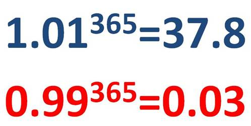
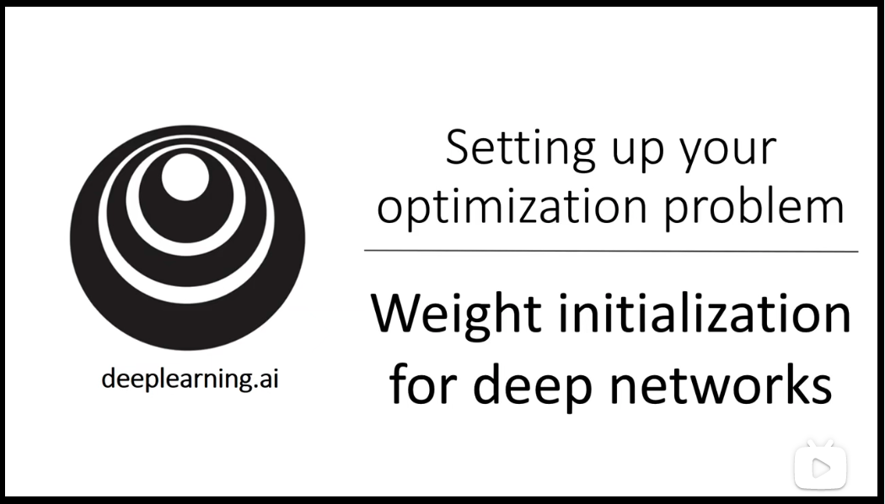

# 14 - 数值稳定性 + 模型初始化 + 激活函数

---

### 🎦 本节课程视频地址 👇

## 神经网络的梯度

考虑一个有 d 层的神经网络：

$$
{\bf h^t}=f_t({\bf h^{t-1}})\quad and\quad y=l\circ f_d\circ...\circ f_1({\bf x})
$$

计算损失 $l$ 关于参数 ${\bf W_t}$ 的梯度

$${\partial l\over\partial{\bf W^t}}={\partial l\over\partial{\bf h^d}}{\partial {\bf h^d}\over\partial{\bf h^{d-1}}}...{\partial {\bf h^{t+1}}\over\partial{\bf h^t}}{\partial {\bf h^t}\over\partial{\bf W^t}}$$

> 由笔记[《06-矩阵计算》](06-矩阵计算.md)可知，向量关于向量的导数是一个矩阵，所以上式中间相当于有$d-t$次矩阵乘法。因为做了太多的矩阵乘法，会带来数值稳定的常见两个问题：
>
> - 梯度爆炸
> - 梯度消失

> 类似大家都听过的一个鸡汤公式，随着神经网络更深，梯度增长或消失的速度将是指数级

### 例子：MLP

- 假如有如下 MLP（为了简单省略了偏移）

$$f_t({\bf h^{t-1}})=\sigma(\bf W^th^{t-1})$$
$${\partial{\bf h_t}\over\partial{\bf h^{t-1}}}=diag\left(\sigma\prime(\bf W^th^{t-1})\right)(\bf W^t)^T$$

$$\prod_{i=t}^{d-1}{\partial{\bf h^{i+1}}\over\partial\bf h^i}=\prod_{i=t}^{d-1}diag\left(\sigma\prime({\bf W^ih^{i-1})}\right)(\bf W^i)^T$$

> $\sigma(x)$激活函数对每个元素做运算，输入一个个向量，求导打包为对角矩阵。

### 梯度爆炸

使用 ReLU 作为激活函数：

$$\sigma(x)=\max(0,x)$$

$$
\sigma \prime (x)=
\begin{cases}
  1 & \text{if} \quad x\gt0 \\
  0 & \text{otherwise}
\end{cases}
$$

$$
\prod_{i=t}^{d-1}{\partial{\bf h^{i+1}}\over\partial{\bf h^i}}=\prod_{i=t}^{d-1}diag(\sigma\prime({\bf {W^ih^{i-1}}}))(\bf W^i)^T
$$

其中一些元素来自于${\prod_{i=t}^{d-1}\bf (W^i)^T}$，如果$\bf W$有很大的元素，$d-t$很大，那么乘积就会很大。

#### 梯度爆炸的问题

- 值超出值域(infinity)：造成**浮点上溢**[[1]](https://baike.baidu.com/item/%E7%AE%97%E6%9C%AF%E6%BA%A2%E5%87%BA/22785793)
  - 对于 16 位浮点数（torch.HalfTensor）尤为严重（数值区间 6e-5 - 6e4）
- 对学习率敏感
  - 如果学习率太大->大参数值->更大的梯度
  - 如果学习率太小->训练无进展
  - 我们可能需要在训练过程中不断调整学习率

### 梯度消失

- 若使用 Sigmoid 作为激活函数

$$\sigma(x)={1\over{1+e^{-x}}}$$
$$\sigma\prime(x)=\sigma(x)(1-\sigma(x))$$

- 由导函数和图可知，在远离原点的两端，梯度逐渐逼近于零，$\prod_{i=t}^{d-1}{\partial{\bf h^{i+1}}\over\partial{\bf h^i}}=\prod_{i=t}^{d-1}diag(\sigma\prime({\bf {W^ih^{i-1}}}))(\bf W^i)^T$的元素值是$d-t$个小数值的乘积

#### 梯度消失的问题

- 梯度值变为 0：**浮点下溢**[[1]](https://baike.baidu.com/item/%E7%AE%97%E6%9C%AF%E6%BA%A2%E5%87%BA/22785793)
  - 对 16 位浮点数尤为严重
- 训练没有进展
  - 不管如何选择学习率
- 对于靠近输出的底部层尤为严重
  - 仅仅靠近顶部的层（靠近输出层）训练的较好（因为梯度更新是反向传播，自顶向下）
  - 无法让神经网络更深

### 总结

- 当梯度数值过大或过小会导致数值问题
- 常发生在深度模型中，因为会对 $n$ 个数累乘。

## 数值稳定性——可让训练更加稳定

目标：让梯度值在合理的范围内（例如$[1e-6,1e3]$），以保证训练过程更加平滑，减少梯度爆炸和梯度消失的可能性。目前主要方法有：

- 将乘法变加法：[ResNet](27-残差网络ResNet.md)、[LSTM](<47-长短期记忆网络(LSTM).md>)
- 归一化：梯度归一化（Normalize，参考[批量归一化](26-批量归一化.md)），梯度剪裁（Clipping）
- **合理的权重初始和激活函数**（本节内容）

### 让每层的方差是一个常数

将每层的输出和梯度都看做随机变量，让每一层的**均值和方差都保持一致**。

$$
正向：
    {\mathbb E[h_i^t]=0}\quad
    {Var[h_i^t]=a}\quad \forall i,t
$$

$$
反向：\mathbb E\left[{\partial l\over \partial h_i^t}\right]=0\quad
Var\left[{\partial l\over \partial h_i^t}\right]=b \quad \forall i,t
$$

> a、b 为常数

即损失函数对每层的每个元素的梯度的期望和偏差也服从恒定，这样可以使训练过程中，可以使梯度下降时更稳定，不至于剧烈波动。

### 权重初始化

- 在合理值区间里随机初始参数
- 在训练开始的时候更容易有数值不稳定（梯度大）
  - 远离最优解的地方损失函数表面那可能很复杂
  - 最优解附近表面会比较平
- 使用$\mathscr{N}(0, 0.01)$来初始可能对小网络没问题，但不能保证深度神经网络也适用

### 1. 以无激活函数的 MLP 为例，在神经网络第$t$层：

- **假设 1：** $w^t_{i,j}$是遵从独立同分布的（i.i.d），令$\mathbb E[w^t_{i,j}]=0$，$Var[w^t_{i,j}]=\gamma_t$
- **假设 2：** $h^{t-1}_i$独立于${w_{i,j}^t}$（即当前层的输入独立于当前层的权重）
- **假设 3：** 为推导简便，假设没有激活函数，则$\bf h^t=W^th^{t-1}$，${\bf W^t}\in\mathbb R^{n_t\times n_{t-1}}$，其中维数$n_t$代表该层输出个数，维数$n_{t-1}$代表该层输入个数

#### 正向传播时输出的均值与方差

- 正向传播每层输出的期望

$$
\begin{aligned}
  \mathbb E[h_i^t]&=\mathbb E\left[\sum_j w_{i,j}^t h_j^{t-1}\right] \qquad \\
  &=\sum_j \mathbb E[w_{i,j}^t h_j^{t-1}] \\
  &=\sum_j \mathbb E[w_{i,j}]\mathbb E[h_j^{t-1}] \quad \quad(14.1) \\
  &=0
\end{aligned}
$$

> 上式中，$j$代表第$t$层的第$j$个神经元，求和符号$\sum_j$代表对该层的所有神经元做累加
>
> (14.1)式的推导结果是由假设 2 可知，乘积的期望等于期望的乘积。
>
> 以上推导表明，**当每层参数的期望$\mathbb E[w^t_{i,j}]=0$时，每层输出的期望$\mathbb E[h_i^t]=0$**。

- 正向传播每层输出的方差

$$
\begin{aligned}
  Var[h_i^t]&=\mathbb E[(h_i^t)^2]-\mathbb E[h_i^t]^2 \\
  &=\mathbb E\left[\left(\sum_j w_{i,j}^t h_j^{t-1}\right)^2\right]  \quad \quad(14.2)\\
  &=\mathbb E\left[\sum_j\left(w_{i,j}^t\right)^2\left(h_j^{t-1}\right)^2+\sum_{j\ne k}w_{i,j}^tw_{i,k}^th_j^{t-1}h_k^{t-1}\right]  \quad \quad(14.3)\\
  &=\sum_j \mathbb{E} \left[(w_{i,j}^t)^2\right] \mathbb{E} \left[(h_{j}^{t-1})^2\right]  \quad \quad(14.4) \\
  &=\sum_j \left( Var[w_{i,j}^t]+\mathbb{E}[w_{i,j}^t]^2\right)\left(Var[h_{i}^t]+\mathbb{E}[h_{i}^t]^2 \right)\\
  &=\sum_j Var[w_{i,j}^t] Var[h_j^{t-1}] \\
  &=n_{t-1}\gamma_tVar[h_j^{t-1}]
\end{aligned}
$$

> (14.2)式的推导结果源于上个推导$\mathbb E[h_i^t]=0$。
>
> (14.4)式的推导结果源于(14.3)式中，$w_{i,j}^t w_{i,k}^t h_j^{t-1} h_k^{t-1}=w_{i,j}^t h_j^{t-1} w_{i,k}^th_k^{t-1}$，由(14.1)式可得结果为零。
>
> 由以上推导可知，如果要保证**输入方差与输出方差**也相等，即$Var[h_i^t]=Var[h_j^{t-1}]$，则：$n_{t-1}\gamma_t=1$。

#### 反向传播时输出的均值与方差

与正向传播情况类似

$$
{\partial l\over\partial{\bf {h}^{t-1}}}={{\partial l} \over {\partial{{\bf h^t}}}}{\bf W^t}\quad \rightarrow \quad \left({\partial l\over\partial{\bf h^{t-1}}}\right)^T=({\bf W^t})^T\left({\partial l\over\partial{\bf h^t}}\right)^T
$$

- 反向传播的输出期望

$$
\begin{aligned}
  \mathbb E\left[{\partial l\over\partial{h_i^{t-1}}}\right]
  &=\mathbb E\left[\left({\partial l\over\partial{h_i^t}}\right)\left({\partial {h_i^t}\over\partial{h_i^{t-1}}}\right)\right] \\
  &=\mathbb E\left[\left({\partial l\over\partial{h_i^t}}\right)\left({\partial \sum_j {w_{i,j}^{t} h_j^{t-1}}\over\partial{h_i^{t-1}}}\right)\right]\\
  &=\mathbb E\left[\left({\partial l\over\partial{h_i^t}}\right) \right] \mathbb E\left[w_{i,j}^{t} \right] \quad \quad(14.5) \\
  &=0
\end{aligned}
$$

> 由假设 1 可知，(14.5)式中$\mathbb E[w_{i,j}^{t}]=0$
>
> 以上结果可推导出**反向传播时每层输出${h_i^t}$的期望都恒定且为零**。

- 反向传播的输出方差

$$
\begin{aligned}
  Var\left[{\partial l\over\partial{h_i^{t-1}}}\right]&=Var\left[\left({\partial l\over\partial{h_i^t}}\right)\left({\partial {h_i^t}\over\partial{h_i^{t-1}}}\right)\right] \\
  &=Var\left[\left({\partial l\over\partial{h_i^t}}\right)\left({\partial \sum_j {w_{i,j}^{t}h_j^{t-1}}\over\partial{h_i^{t-1}}}\right)\right]\\
  &=Var \left[{\partial l\over\partial{h_i^t}}\right] Var\left[\sum_j w_{i,j}^{t} \right] \quad (14.6) \\
  &=Var \left[{\partial l\over\partial{h_i^t}}\right] \sum_jVar[w_{i,j}^{t}] \quad (14.7)\\
  &=n_t \gamma_tVar\left[{\partial l\over\partial{h_i^t}}\right] \quad
  \rightarrow n_t\gamma_t=1 \\
\end{aligned}
$$

> 由假设 1 可知，$w^t_{i,j}$遵从独立同分布（i.i.d），则$Var\left[\sum_j w_{i,j}^{t} \right]=\sum_jVar[w_{i,j}^{t}]= \sum_{j=1}^t \gamma_t =n_t \gamma_t$

> 要使每层梯度的方差相等，根据以上推导可知，须令$n_t\gamma_t=1$

综上，要想满足每层神经网络**输出**和**梯度**的方差均为常数，权重初始化要满足：

- $n_{t-1}\gamma_t=1$（即每层前向输出方差保持一致的条件）
- $n_t\gamma_t=1$（即每层反向传播梯度方差保持一致的条件）

### 达到以上目的的方法——Xavier 初始化（随机初始化）

由以上推导可知，要想满足每层神经网络输出和梯度的方差均为常数，则初始化权重时设置的方差$\gamma_t$的选择是根据输入维度$n_{t-1}$和输出维度$n_t$来确定的。

但是难以取得一个方差$\gamma_t$，使之同时满足$n_{t-1}\gamma_t=1$和$n_t\gamma_t=1$。因为$n_{t-1}$和$n_t$的值是不可控制的。除非输入维度等于输出维度。

这里提出一个折中的方法——**Xavier**：

- 首先令：${(n_{t-1}+n_t)\gamma_t\over2}=1\ \rightarrow \gamma_t={2\over(n_{t-1}+n_t)}$

  - 在初始化第$t$层时，权重采用正态分布 $\mathscr{N}(0,\sqrt{2/(n_{t-1}+n_t)})$
  - 或采用均匀分布 $\mathscr {U}\left(-\sqrt{6/(n_{t-1}+n_t)},\sqrt{6/(n_{t-1}+n_t)}\right)$

    > 分布$\mathscr {U}[-a,a]$的方差是$a^2/3$

- 适配权重形状变换，特别是$n_t$。

### 2. 假如 MLP 包含线性激活函数

假设激活函数为$\sigma(x)=\alpha x+\beta$，要使激活函数前后的均值(0)、方差不变(1)

#### 正向传播时输出的期望和方差

$${\bf h'}={\bf W^th^{t-1}}$$

$$
{\bf h^t}=\sigma({\bf h'})
$$

$$
\begin{aligned}
  \mathbb{E}[h_i^t]&=\mathbb{E}[\alpha h_i^\prime+\beta] \\
  &=\beta \quad \rightarrow \quad  \beta=0
\end{aligned}
$$

> 上式推导表明，输入经过线性函数后，期望会平移$\beta$个单位，要使激活函数不改变输入、输出的期望，则需保证$\beta=0$

$$
\begin{aligned}
  Var[h_i^t]&=\mathbb{E}[(h_i^t)^2]-\mathbb{E}[h_i^t]^2 \\
  &=\mathbb{E}[(\alpha h_i^\prime+\beta)^2]-\beta^2 \\
  &=\mathbb{E}[\alpha^2 (h_i')^2+2\alpha\beta h_i'+\beta^2]-\beta^2 \\
  &=\alpha^2Var[h_i^\prime] \quad \rightarrow \quad \alpha=1
\end{aligned}
$$

> 上式推导表明，输入经过线性函数后伸缩$\alpha$倍，方差伸缩$\alpha^2$倍，要使激活函数不改变输入、输出的方差，则需保证$\alpha=1$

#### 反向传播时输出的期望和方差

$$
{\partial l\over\partial\bf h'}={\partial l\over\partial\bf h^t}{(\bf W^t)}^T\quad and\quad {\partial l\over\partial\bf h^{t-1}}=\alpha{\partial l\over\partial\bf h'}
$$

$$
\begin{aligned}
  \mathbb E\left[\partial l\over\partial h_i^{t-1}\right]&=\mathbb E\left[\left(\partial l\over\partial h_i^t\right)\left(\partial h_i^t\over\partial h_i^{t-1}\right)\right] \\
  &=\mathbb E\left[\left(\partial l\over\partial \sigma(h_i')\right)\left(\partial \sigma(h_i')\over\partial h_i^{t-1}\right)\right] \\
  &=0\\
  &\rightarrow \beta=0
\end{aligned}
$$

> 上式推导表明，要保证反向传播时输出的期望为零，则：$\beta=0$。
>
> 只有$\beta=0$，才可以线性求导，使下式成立:

$${\partial l\over\partial\bf h^{t-1}}=\alpha{\partial l\over\partial\bf h'}$$

$$
\begin{aligned}
  Var\left[\partial l\over\partial h_i^{t-1}\right]&=Var\left[\alpha\left(\partial l\over\partial h_i'\right)\right]\\
  &=\mathbb E\left[\alpha^2\left(\partial l\over\partial h_i'\right)^2\right]-\mathbb E\left[\alpha\left(\partial l\over\partial h_i'\right)\right]^2\\
  &=\alpha^2Var\left[\partial l\over\partial h_i'\right] \\
  &\rightarrow \alpha=1
\end{aligned}
$$

> 上式推导表明，要保证反向传播时输出的方差相等，则：$\alpha=1$。

> 综上，$\alpha=1，\beta=0$，选取的线性激活函数必须为$f(x)=x$形式。

### 3. 假设 MLP 包含非线性激活函数

首先使用泰勒级数[[2]](https://www.bilibili.com/video/BV1Gx411Y7cz)展开常用的非线性激活函数：

$$sigmoid(x)={1\over2}+{x\over4}-{x^3\over48}+O(x^5)$$

$$tanh(x)=0+x-{x^3\over3}+O(x^5)$$

\$\$relu(x)=0+x\quad \text{for \$x\ge0\$}\$\$

> 蓝色线代表的`scaled sigmoid`函数，是通过下列变换得到：
> $$\text{scaled sigmoid}(x)=4\times\sigma(x)-2$$

$tanh(x),relu(x)$在零点附近，存在近似区间使得$f(x)=x$，而$sigmoid(x)$则不行。

通过线性变换（伸缩、平移）得到`scaled sigmoid`函数，可以使 sigmoid 在零点附近近似成恒等函数，此时 sigmoid 函数相比其他激活函数原有的缺点将得到改善。

综上，使用非线性激活函数时，如果要使得神经网络正向输出和反向梯度满足均值为零，方差为定值的要求，就得采用那些**经泰勒级数展开后，一阶项系数为 1 的函数**（比如 ReLU、TanH、Scaled-Sigmoid），此时该激活函数在原点附近可以近似看作是**恒等函数**（Identity Function）。但超出了零点附近区间，会使其均值、方差发生变化。

## 总结

- 合理的权重初始值和激活函数的选取可以提升数值稳定性
- 还可参考吴恩达相关课程作为补充，点击下图播放 ▶
  

## 参考资料

> [1][算术溢出（arithmetic overflow）](https://baike.baidu.com/item/%E7%AE%97%E6%9C%AF%E6%BA%A2%E5%87%BA/22785793)
>
> [2]泰勒级数（3blue1brown 大神超棒讲解视频），点击下图播放 ▶
>
> 

---

## Q&A🤓

**Q：训练时出现的`nan`、`inf`是什么原因？**

**🙋‍♂️**：出现`inf`一般代表学习率设定过大，或者权重初始值过大，导致梯度爆炸；出现`nan`一般表示出现除法除零，可能出现梯度消失。

**Q：本篇笔记中，算式(14.6)到(14.7)如何推导？**

**🙋‍♂️**：已完成推导，详见内容。
