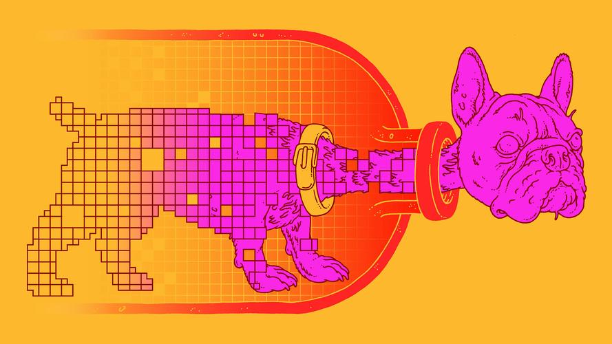

# 18 - 卷积层中的填充和步幅

---

### 🎦 本节课程视频地址 👇

[](https://www.bilibili.com/video/BV1Th411U7UN)

## 填充和步幅

假设输入形状为 $n_h \times n_w$ ，卷积核形状为 $k_h\times k_w$ ，那么输出形状将是 $(n_h−k_h+1)\times(n_w−k_w+1)$ 。 因此，卷积的输出形状取决于输入形状和卷积核的形状。

除了以上的两个因素外，**填充（padding）** 和 **步幅（stride）** 也会影响大小。

给定$(32\times32)$像素的输入图像，应用$(5\times5)$卷积核

- 第$1$层得到输出大小$28\times28$
- 第$7$层得到输出大小$4\times4$。

更大的卷积核可以更快地减小输出大小：形状从$n_k\times n_w$减小到$(n_h-n_k+1)\times(n_w-k_w+1)$，如果需要做更深的神经网络，那么就需要别的方法降低缩小作用。

### 填充（Padding）：增大输出尺寸

假如我们不想让输出变小（甚至扩大），一种方法可以在输入周围添加额外的行和列。


如填充$p_h$行和$p_w$列全 0 元素，则输出形状为：

$$(n_h-k_h+p_h+1)\times(n_w-k_w+p_w+1)$$

通常取$p_h=k_h-1$，$p_w=k_w-1$，使输入输出形状相同；

- 当$k_h$为奇数：在上下左右各填充$p_h/2$
- 当$k_h$为偶数：在上侧填充$\lceil p_h/2\rceil$，下侧填充$\lfloor p_h/2\rfloor$

### 步幅（Stride）：减小输出尺寸


填充减小的输出大小与层数线性相关：

- 给定输入大小$224\times 224$，在使用$5\times5$卷积核的情况下，需要 55 个卷积层
- 需要大量计算才能得到较小的输出


步幅是指行、列的滑动补偿。默认步幅为 1，就是卷积核依次一列列滑动，不进行跳跃。

- 给定高度$s_h$和宽度$s_w$的步幅，输出形状是：

$$\lfloor(n_h-k_h+p_h+s_h)/s_h\rfloor\times\lfloor(n_w-k_w+p_w+s_w)/s_w\rfloor$$

- 如果$p_h=k_h-1$，$p_w=k_w-1$

$$\lfloor(n_h+s_h-1)/s_h\rfloor\times\lfloor(n_w+s_w-1)/s_w\rfloor$$

- 如果输入高度和宽度可以被步幅整除（步幅与卷积核大小相当）

$$(n_h/s_h)\times(n_w/s_w)$$

### 总结

- 填充和步幅使卷积层的超参数；
- 填充在输入周围添加额外的行、列，来控制输出形状的减少量；
- 步幅是每次滑动核窗口时的行、列步长，可以成倍地减少输出形状。

## 代码实现

- Padding

```python
import torch
from torch import nn

def comp_conv2d(conv2d, X):
    # (1，1)代表input_channel=1, batch_size=1
    X = X.reshape((1, 1) + X.shape) # .shape+[tuple] 作用是按维度连接
    Y = conv2d(X)
    return Y.reshape(Y.shape[2:])
    #Y.shape returns tensor(1,1,8,8), slice[2:] returns tensor(8,8)

conv2d = nn.Conv2d(1, 1, kernel_size=3, padding=1)
#3*3
#padding=1表示上下左右各填充1, 10*10
X = torch.rand(size=(8, 8))
comp_conv2d(conv2d, X).shape
# Out: torch.size([8,8])
```

```python
conv2d = nn.Conv2d(1, 1, kernel_size=(5, 3), padding=(2, 1))
#12*10
comp_conv2d(conv2d, X).shape
#8*8
```

- Stride

```python
conv2d = nn.Conv2d(1, 1, kernel_size=3, padding=1, stride=2)
##10*10
comp_conv2d(conv2d, X).shape
##(10-3)/2+1=4.5, 4*4
```

```python
conv2d = nn.Conv2d(1, 1, kernel_size=(3, 5), padding=(0, 1), stride=(3, 4))
### 8*10 3*5 3*4
### floor[（8-3）/3+1]=2 florr[(10-5)/4+1]=2
comp_conv2d(conv2d, X).shape
```

## 参考资料

[1] Convolution arithmetic - 各种卷积 Padding、Stride 的动画演示 👉[Github](https://github.com/vdumoulin/conv_arithmetic)👉[中文镜像](https://gitcode.net/mirrors/vdumoulin/conv_arithmetic)

[2] [Deep Learning and the Information Bottleneck Principle. Naftali Tishby, 2015](https://arxiv.org/abs/1503.02406)

[3] [Opening the Black Box of Deep Neural Networks via Information. Ravid Shwartz-Ziv, Naftali Tishby, 2017](https://arxiv.org/abs/1703.00810)

[4] [“信息瓶颈”理论揭示深度学习本质，Hinton说他要看1万遍](https://zhuanlan.zhihu.com/p/29579424)

---

## Q&A🤓

**Q：卷积操作会造成特征丢失吗？**

**🙋‍♂️**：其实深度学习的一种可解释性理论提出者 Tishby 认为，神经网络相当于一个**Information Bottleneck（信息瓶颈）**[2][3]，本质上是在对特征数据进行“**有损压缩**”得到最终抽象的结果。（Hinton老爷子看了后惊呼“要读一万遍”[4]）下图特别巧妙地表现了这个理论👇



感兴趣的童鞋这里还找到了两个Tishby教授关于本主题的演讲视频🎬可供参考👇

[](https://www.bilibili.com/video/BV1zx411u7oG/)

[](https://www.bilibili.com/video/BV1Rx411t7CU)
