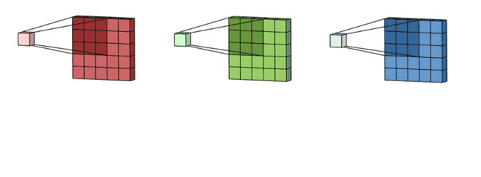
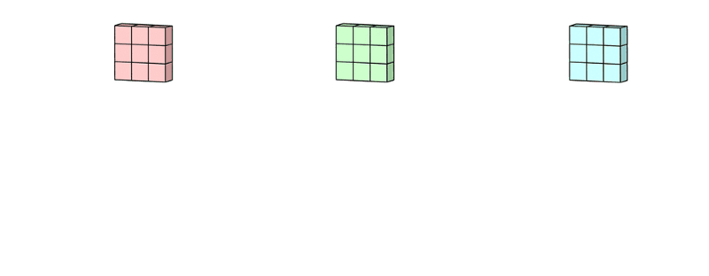

# 19 - 卷积层里的多输入多输出通道

---

### 🎦 本节课程视频地址 👇

[](https://www.bilibili.com/video/BV1MB4y1F7of)

## 多个输入通道


彩色图像可能有 **R、G、B** 三个通道（有的格式如 PNG 还包含 4 通道，多一个透明度 Alpha 通道、RGB-D 图像多一个深度信息通道等），如果使用上一节单通道卷积层，就要转换为灰度图，这样会丢失很多特征信息。

当输入包含多个通道时，需要构造一个与输入数据具有相同输入通道数的卷积核，以便与输入数据进行互相关运算。

为解决这个问题，我们可以给每个通道一个卷积核，输出是**所有通道卷积结果的和**。下图表示一个两通道输入的例子 👇


下图表示在 RGB 三输入通道做卷积的过程 👇





公式化表示：

- 输入$\bf X$：$c_i\times n_h\times n_w$
- 核$\bf W$：$c_i\times k_h\times k_w$
- 输出$\bf Y$：$m_h\times m_w$

$$\bf Y=\sum_{i=0}^{c_i}X_{i,:,:}\star W_{i,:,:}$$

> 其中，$c_i$ 表示输入的通道维

## 多个输出通道

在最流行的神经网络架构中，随着神经网络层数的加深，我们常会增加输出通道的维数，通过减少空间分辨率以获得更大的通道深度。直观地说，我们可以将**每个通道看作是对不同特征的响应**。而现实可能更为复杂一些，因为每个通道不是独立学习的，而是为了共同使用而优化的。因此，多输出通道并不仅是学习多个单通道的检测器。

我们可以有多个三维卷积核，每个核生成一个输出通道，输出时便可叠加为多输出的通道；

公式化表示：

- 输入$\bf X$：$c_i\times n_h\times n_w$
- 核$\bf W$：$c_o\times c_i\times k_h\times k_w$
- 输出$\bf Y$：$c_o\times m_h\times m_w$

$$
\bf Y_{i,:,:}=X\star W_{i,:,:,:} \quad \text{for $i=1,…,c_0$}
$$

> 其中，$c_o$ 表示输出的通道维

## $1\times 1$卷积层——多通道的全连接层


$1\times 1$卷积层，即$k_h=k_w=1$看起来似乎没有多大意义，失去了卷积层的特的在高度和宽度维度上，识别相邻元素间相互作用的能力。但实际是一个受欢迎的选择，它不识别空间模式，只是**融合输入通道的信息**。


> 上图展示了使用 1×1 卷积核与 3 个输入通道和 2 个输出通道的互相关计算。 这里输入和输出具有相同的高度和宽度，**输出中的每个元素都是从输入图像中同一位置的元素的线性组合。 我们可以将 1×1 卷积层看作是在每个像素位置应用的全连接层**，以 ci 个输入值转换为 co 个输出值。 因为这仍然是一个卷积层，所以跨像素的权重是一致的。 同时， 1×1 卷积层需要的权重维度为 co×ci ，再额外加上一个偏置。

## 二维卷积层

- 输入$\bf X$：$c_i\times n_h\times n_w$
- 核$\bf W$：$c_o\times c_i\times k_h\times k_w$
- 偏差$\bf B$：$c_o\times c_i$
- 输出$\bf Y$：$c_o\times m_h\times m_w$

$$\bf Y=X\star W+B$$

- 计算复杂度（浮点计算数 FLOP）：$O(c_ic_ok_hk_wm_hm_w)$

$$
\begin{aligned}
    c_i&=c_o=100\\
    k_h&=h_w=5 \qquad \rightarrow \text{1GFLOP}\\
    m_h&=m_w=64
\end{aligned}
$$

> 假设有 10 层这样的卷积神经网络，1M（百万）样本，则总的计算复杂度为 10PFlops，一般 CPU 计算能力为 0.15TFLOPS/s，该神经网络使用 CPU 前向计算时间则为 18h；一般 GPU 计算能力为 12TF/s，则 GPU 需要 14min。CNN 相当于用计算量换存储成本。

## 总结

以 RGB 三通道输入、多输出为例：

- 输出通道数是该层卷积层的超参数
- 每个输入通道有独立的二维卷积核，所有通道结果相加得到一个输出通道结果
- 每个输出通道有独立的三维卷积核

## 代码实现

- 多输入多输出通道互相关运算

```python
import torch
from d2l import torch as d2l
#多输入
def corr2d_multi_in(X, K):
    # 先遍历 “X” 和 “K” 的第0个维度（通道维度），再把它们加在一起
    return sum(d2l.corr2d(x, k) for x, k in zip(X, K))

# 验证，构造一个(2x3x3)的输入，(2,2,2)的卷积核
X = torch.tensor([[[0.0, 1.0, 2.0], [3.0, 4.0, 5.0], [6.0, 7.0, 8.0]],
                  [[1.0, 2.0, 3.0], [4.0, 5.0, 6.0], [7.0, 8.0, 9.0]]])
K = torch.tensor([[[0.0, 1.0], [2.0, 3.0]], [[1.0, 2.0], [3.0, 4.0]]])
K.shape
# Out: torch.Size([2, 2, 2])

corr2d_multi_in(X, K)
# Out: tensor([[ 56.,  72.],
#              [104., 120.]])

#多输入多输出
def corr2d_multi_in_out(X, K):
    # 迭代“K”的第0个维度，每次都对输入“X”执行互相关运算。
    # 最后将所有结果都叠加在一起
    return torch.stack([corr2d_multi_in(X, k) for k in K], dim=0)
# stack():Concatenates a sequence of tensors along a new dimension.
# All tensors need to be of the same size.
# dim=0

# 使用原有的K创建一个拥有三个输出通道的核K，核参数依次增1
K = torch.stack((K, K + 1, K + 2), dim=0)
K.shape
# Out: torch.size([3,2,2,2])

corr2d_multi_in_out(X, K)
# Out:tensor([[[ 56.,  72.],
#              [104., 120.]],
#
#             [[ 76., 100.],
#              [148., 172.]],
#
#             [[ 96., 128.],
#              [192., 224.]]])
```

- 1x1 卷积

```python
def corr2d_multi_in_out_1x1(X, K):
    c_i, h, w = X.shape
    c_o = K.shape[0]
    #拉成一个矩阵
    X = X.reshape((c_i, h * w))
    #拉成一个矩阵
    K = K.reshape((c_o, c_i))
    #矩阵乘法
    Y = torch.matmul(K, X)
    #返回三维
    return Y.reshape((c_o, h, w))

X = torch.normal(0, 1, (3, 3, 3))
K = torch.normal(0, 1, (2, 3, 1, 1))

Y1 = corr2d_multi_in_out_1x1(X, K)
Y2 = corr2d_multi_in_out(X, K)
assert float(torch.abs(Y1 - Y2).sum()) < 1e-6
```

- 简明实现

```python
nn.Conv2d(input_channel, output_channel, kernel_size=n, padding, stride)
```

## Pytorch 模块参考文档

- `torch.nn.Conv2d(in_channels, out_channels, kernel_size, stride=1, padding=0, dilation=1, groups=1, bias=True, padding_mode='zeros', device=None, dtype=None)`Pytorch 2D卷积模块 🧐[中文](https://pytorch-cn.readthedocs.io/zh/latest/package_references/torch-nn/#_1) | [官方英文](https://pytorch.org/docs/stable/generated/torch.nn.Conv2d.html#torch.nn.Conv2d)

---

## Q&A🤓

**Q：一般卷积的尺寸和输出通道该怎么设计？**

**🙋‍♂️**：一般如果卷积使得原有输入高宽减半，那么需要将通道数增加为原来的 2 倍，以防止因压缩过多而丢失重要信息。可以近似看作压缩了空间尺度（高、宽），则需要更多的语义尺度（通道数）来表示提取的特征。

**Q：卷积层中的 bias 对结果影响大吗？怎样理解 bias 的作用？**

**🙋‍♂️**：bias 的作用相当于对数据的分布做平移，其实在后期随着各种归一化方法的使用（如 BatchNorm 等），bias 的作用越来越小，因为 bias 等价于输入数据均值的负数，虽然不要 bias 也可以，但其实计算成本来说可以忽略不计，加上也无妨。
