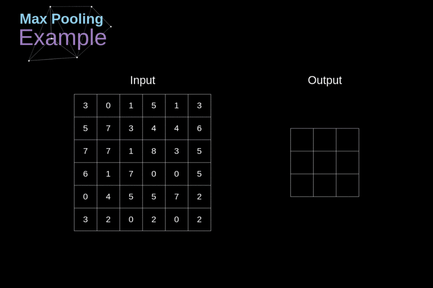
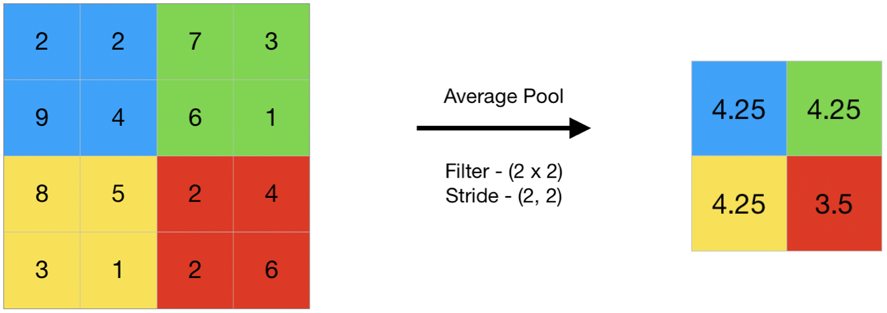
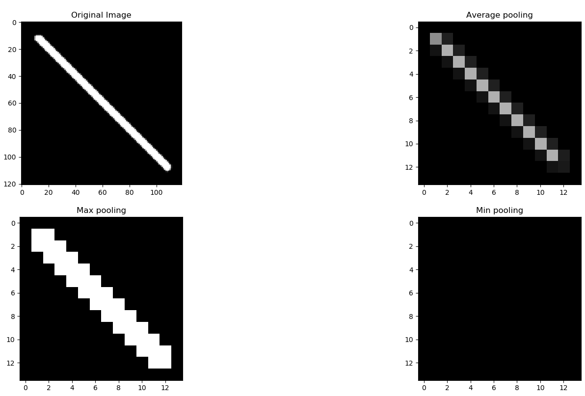

# 20 - 池化层

---

### 🎦 本节课程视频地址 👇

[](https://www.bilibili.com/video/BV1EV411j7nX)

## 池化层 （Pooling）

通常当我们处理图像时，我们希望逐渐降低隐藏表示的空间分辨率、聚集信息，这样随着我们在神经网络中层叠的上升，每个神经元对其敏感的感受野（输入）就越大。

而我们的机器学习任务通常会跟全局图像的问题有关（例如，“图像是否包含一只猫呢？”），所以我们最后一层的神经元应该对整个输入的全局敏感。通过逐渐聚合信息，生成越来越粗糙的映射，最终实现学习全局表示的目标，同时将卷积图层的所有优势保留在中间层。

当检测较底层的特征时，我们通常希望这些特征保持某种程度上的平移不变性。

### 二维最大池化



- 和卷积层类似，也有填充和步幅，但没有可学习的参数
- 在每个输入通道应用池化层以获得相应的输出通道
- 输出通道数=输入通道数
- 输出每个窗口最强的信号

### 平均池化层





### 总结

- 对于给定输入元素，最大池化层会输出该窗口内的最大值，平均池化层会输出该窗口内的平均值。
- 池化层的主要优点之一是减轻卷积层对位置的过度敏感。
- 我们可以指定池化层的填充和步幅。
- 使用最大池化层以及大于 1 的步幅，可减少空间维度（如高度和宽度）。
- 池化层的输出通道数与输入通道数相同。

## 代码实现

- 从零实现

```python
import torch
from torch import nn
from d2l import torch as d2l

def pool2d(X, pool_size, mode='max'):
    p_h, p_w = pool_size
    Y = torch.zeros((X.shape[0] - p_h + 1, X.shape[1] - p_w + 1))
    for i in range(Y.shape[0]):
        for j in range(Y.shape[1]):
            if mode == 'max':
                Y[i, j] == X[i:i + p_h, j:j + p_w].max()
            elif mode == 'avg':
                Y[i, j] == X[i:i + p_h, j:j + p_w].mean()
    return Y
```

- 简洁实现

```python
#kernel_size=3
#池化层默认的stride=kernel size
pool2d = nn.MaxPool2d(3)
pool2d(X)

#多通道
X = torch.cat((X, X + 1), 1)
#dim=1
X.shape

pool2d = nn.MaxPool2d(3, padding=1, stride=2)
pool2d(X).shape
```

## Pytorch 模块参考文档

- `torch.nn.MaxPool2d(kernel_size, stride=None, padding=0, dilation=1, return_indices=False, ceil_mode=False)`Pytorch 2D 最大池化层 🧐[中文](https://pytorch-cn.readthedocs.io/zh/latest/package_references/torch-nn/#_2) | [官方英文](https://pytorch.org/docs/stable/generated/torch.nn.MaxPool2d.html#torch.nn.MaxPool2d)
- `torch.nn.AvgPool2d(kernel_size, stride=None, padding=0, ceil_mode=False, count_include_pad=True, divisor_override=None)`Pytorch 2D 平均池化层 🧐[中文](https://pytorch-cn.readthedocs.io/zh/latest/package_references/torch-nn/#_2) | [官方英文](https://pytorch.org/docs/stable/generated/torch.nn.AvgPool2d.html#torch.nn.AvgPool2d)

---

## Q&A🤓

**Q：为什么现在用池化层比较少？**

**🙋‍♂️**：沐神认为，一方面现在多用卷积层加 stride 来减小计算量，另一方面目前也使用了许多数据增强（Argument）的方法，效果与池化类似。
