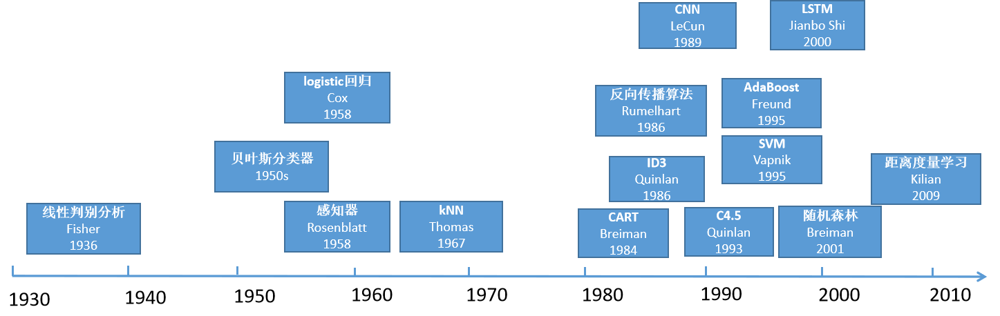
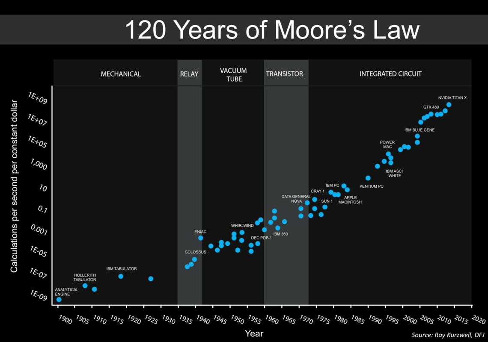
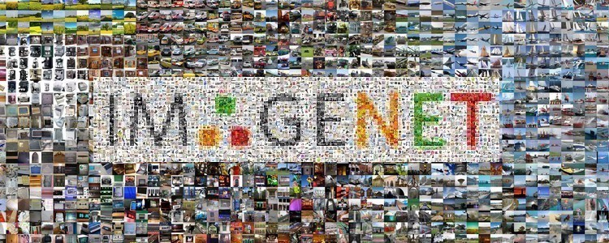
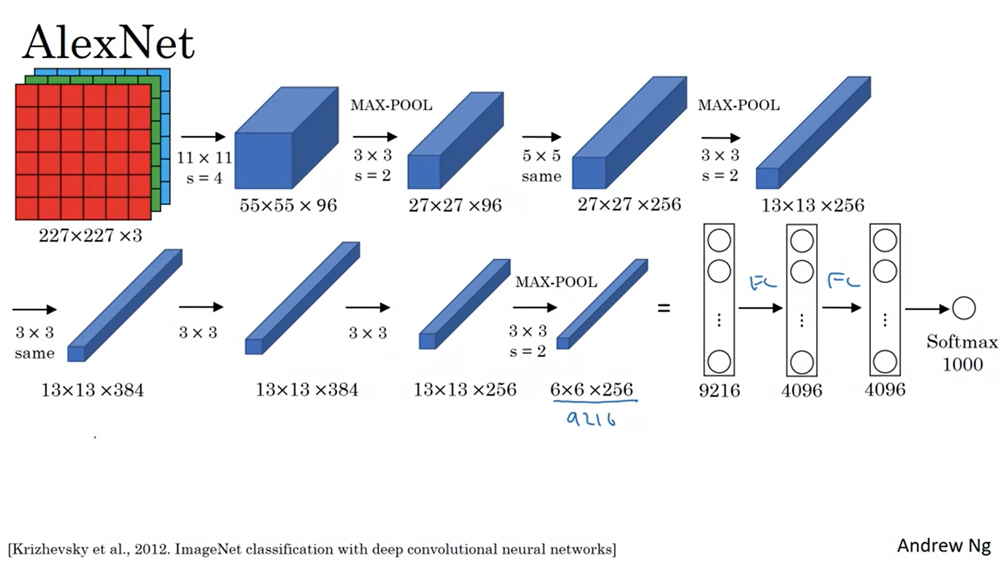

# 22 - 深度卷积神经网络 AlexNet

---

### 🎦 本节课程视频地址 👇

[](https://www.bilibili.com/video/BV1h54y1L7oe)

## 机器学习发展历程

### 机器学习理论的发展



- 2000 年前后：**核方法**，有一套完整的数学模型，如 SVM
- 2000 年前后：**几何学**，把计算机视觉的问题描述成几何问题，如经典 CV 算法
- 2010 前后： **特征工程**：如何抽取图片的特征，如 SIFT、视觉词袋

### 计算机硬件的快速发展



摩尔定律展示了半导体技术进步带来的计算能力的突飞猛进。

### 互联网的发展带来数据量的增长

- ImageNet(2010)



自然物体的彩色图: 469X387;
样本数：1.2M
类数：1000

## AlexNet

Alex Krizhevsky、Ilya Sutskever 和 Geoff Hinton 提出了一种新的卷积神经网络变体 AlexNet。在 2012 年 ImageNet 挑战赛中取得了轰动一时的成绩。

- 赢了 2012 年的 ImageNet 竞赛；
- 更深更大的 LeNet；
- 主要改进：
  - 丢弃法
  - ReLU（减缓梯度消失）
  - MaxPooling（增大输出值，带来更大的梯度）
  - 使用了**数据增强**（Data Arguments）
- **计算机视觉方法论的改变**：从人工提取特征（SVM）到通过CNN学习获得特征，端到端学习；并且构造 CNN 简单高效——从原始数据（字符串、像素）到最终学习结果。

### 基本架构



- AlexNet与LeNet架构对比


### 复杂度

| |参数个数| |FLOP| |
|--|--|--|--|--|
|  |**AlexNet**|**LeNet**|**AlexNet**|**LeNet**|
|Cov1|35K|150|101M|1.2M|
|Cov2|614K|2.4K|415M|2.4M|
|Cov3-5|3M||445M||
|Dense1|26M|0.48M|26M|0.48M|
|Dense2|16M|0.1M|16M|0.1M|
|**Total**|**46M**|**0.6M**|**1G**|**4M**|
|**Increase**|**76x**|1x(baseline)|**250x**|1x(baseline)|

### 总结

- AlexNet 是更大更深的 LeNet，10x 参数个数，260x 计算复杂度；
- 新加入了丢弃法、LeRU、最大池化层和数据增强；
- AlexNet 当赢下了 2012ImageNet 竞赛后，标志着新的一轮神经网络热潮的开始。

## 代码实现

- 定义网络结构

```python
import torch
from torch import nn
from d2l import torch as d2l

net = nn.Sequential(
    # 因为课程使用的FashioMNIST数据集，为灰度单通道图像
    nn.Conv2d(1, 96, kernel_size=11, stride=4, padding=1), nn.ReLU(),
    nn.MaxPool2d(kernel_size=3, stride=2),
    nn.Conv2d(96, 256, kernel_size=5, padding=2), nn.ReLU(),
    nn.MaxPool2d(kernel_size=3, stride=2),
    nn.Conv2d(256, 384, kernel_size=3, padding=1), nn.ReLU(),
    nn.Conv2d(384, 384, kernel_size=3, padding=1), nn.ReLU(),
    nn.Conv2d(384, 256, kernel_size=3, padding=1), nn.ReLU(),
    nn.MaxPool2d(kernel_size=3, stride=2), nn.Flatten(),
    nn.Linear(6400, 4096), nn.ReLU(), nn.Dropout(p=0.5),
    nn.Linear(4096, 4096), nn.ReLU(), nn.Dropout(p=0.5),
    nn.Linear(4096,10)
)
```

- 测试各层输出

```python
X = torch.randn(1, 1, 224, 224)
for layer in net:
    X = layer(X)
    print(layer.__class__.__name__, 'Output shape:\t', X.shape)

# Out: 
# Conv2d output shape:         torch.Size([1, 96, 54, 54])
# ReLU output shape:   torch.Size([1, 96, 54, 54])
# MaxPool2d output shape:      torch.Size([1, 96, 26, 26])
# Conv2d output shape:         torch.Size([1, 256, 26, 26])
# ReLU output shape:   torch.Size([1, 256, 26, 26])
# MaxPool2d output shape:      torch.Size([1, 256, 12, 12])
# Conv2d output shape:         torch.Size([1, 384, 12, 12])
# ReLU output shape:   torch.Size([1, 384, 12, 12])
# Conv2d output shape:         torch.Size([1, 384, 12, 12])
# ReLU output shape:   torch.Size([1, 384, 12, 12])
# Conv2d output shape:         torch.Size([1, 256, 12, 12])
# ReLU output shape:   torch.Size([1, 256, 12, 12])
# MaxPool2d output shape:      torch.Size([1, 256, 5, 5])
# Flatten output shape:        torch.Size([1, 6400])
# Linear output shape:         torch.Size([1, 4096])
# ReLU output shape:   torch.Size([1, 4096])
# Dropout output shape:        torch.Size([1, 4096])
# Linear output shape:         torch.Size([1, 4096])
# ReLU output shape:   torch.Size([1, 4096])
# Dropout output shape:        torch.Size([1, 4096])
# Linear output shape:         torch.Size([1, 10])
```

- 训练

```python
batch_size = 128
train_iter, test_iter = d2l.load_data_fashion_mnist(batch_size, resize=224)

lr, num_epochs = 0.01, 10
d2l.train_ch6(net, train_iter, test_iter, num_epochs, lr, d2l.try_gpu())
```


---

## Q&A🤓

**Q：使用GPU训练AlexNet时，报错`CUDA error: CUBLAS_STATUS_NOT_INITIALIZED when calling cublasCreate(handle)`是什么原因？**

**🙋‍♂️**：一般是显卡显存不够了，可以尝试将`batch_size`调小一些试试。

**Q：一般CNN要求输入图像是固定尺寸，实际应用中，数据尺寸不一，会怎样处理？强行`resize`吗？**

**🙋‍♂️**：一般不会强行resize，否则会改变图像特征，而是保持长宽比不变的resize，在其中crop出符合要求的尺寸来。
