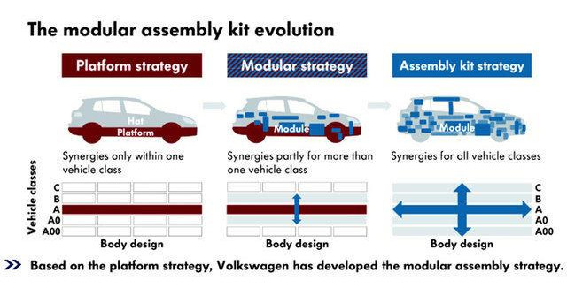
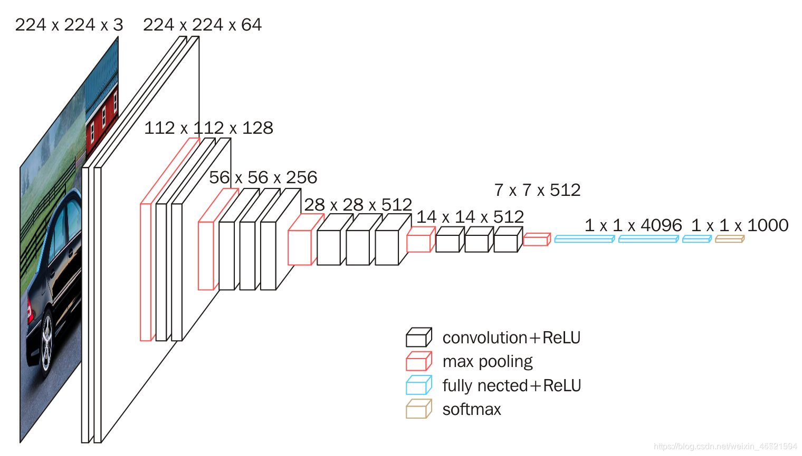
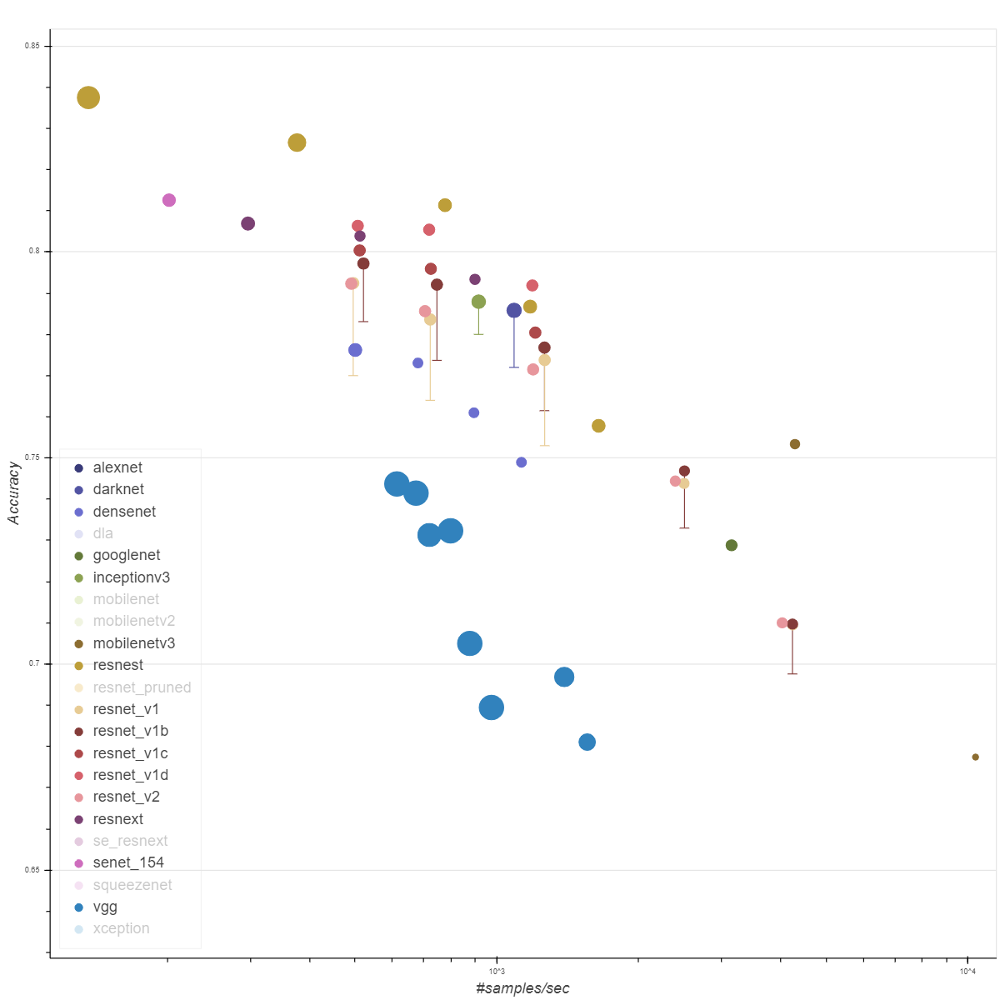

# 23 - 使用块的网络 VGG

---

### 🎦 本节课程视频地址 👇

[](https://www.bilibili.com/video/BV1Ao4y117Pd)

## 构想缘由——模块化思想

因为 AlexNet 比 LeNet 更深更大而获得更好的精度，那么能不能更深更大？有以下几种途径：

> 更多的全连接层（占存储空间，成本高）
>
> 更多的卷积层（不好标准化）
>
> 将卷积层组合成快 √

虽然 AlexNet 证明深层神经网络卓有成效，但它没有提供一个通用的模板来指导后续的研究人员设计新的网络。

与新能源汽车模块化生产、芯片设计中工程师从放置晶体管到逻辑元件再到逻辑块的过程类似，神经网络架构的设计也逐渐变得更加抽象。研究人员开始从单个神经元的角度思考问题，发展到整个层，现在又转向块，重复层的模式。



使用块的想法首先出现在牛津大学的[视觉几何组（Visual Geometry Group，VGG）](http://www.robots.ox.ac.uk/~vgg/)的 VGG 网络中。通过使用循环和子程序，可以很容易地在任何现代深度学习框架的代码中实现这些重复的架构。



## VGG 块


每个 VGG 块由以下组件组成：

- n 个 3x3 卷积层，填充 padding=1（可重复 n 层，m 通道，输入通道等于输出通道）
- 2x2 最大池化层（步幅 stride=2）

> 作者实验证明，更深的 3x3 效果好于浅的 5x5；由于有步幅的存在，每个块的输出尺寸减半，一般使用时每个块设定使通道数翻倍，空间尺寸减半。

## VGG 架构

将多个 VGG 块串连后接全连接层，不同次数的重复块得到不同的架构，如：VGG-16，VGG-19……


## 总结



> 上图展示不同神经网络架构的 Benchmark[1]，横轴代表模型预测速度，纵轴代表准确率，圆圈大小代表模型存储空间大小

- VGG 使用可重复使用的卷积块来构建深度卷积神经网络（模块化）
- 不同的卷积块和超参数可以得到不同复杂度的变种以适应不同需求（类似车辆高低配）

## 代码实现

- 实现 VGG 块

```python
import torch
from torch import nn
from d2l import torch as d2l

def vgg_block(num_convs, in_channels, out_channels):
    layers = []
    for _ in range(num_convs):  # 使用"_"匿名变量
        layers.append(nn.Conv2d(
            in_channels, out_channels, kernel_size=3, padding=1))
        layers.append(nn.ReLU())
        in_channels = out_channels
    layers.append(nn.MaxPool2d(kernel_size=2, stride=2))
    return nn.Sequential(*layers)   # 使用*符号解包列表元素
```

- 实现VGG11

```python
conv_arch = ((1, 64), (1, 128), (2, 256), (2, 512), (2, 512))
#分别是卷积层数输出通道数,VGG11
#经典设计，高宽减半，通道数翻一倍

def vgg(conv_arch):
    conv_blks = []
    in_channels = 1
    #在函数的顺序结构里被改变了
    for (num_convs, out_channels) in conv_arch:
        conv_blks.append(vgg_block(
            num_convs, in_channels, out_channels))
        in_channels = out_channels

    # nn.Sequential可嵌套nn.Sequential
    return nn.Sequential(
        *conv_blks, nn.Flatten(),
        nn.Linear(out_channels * 7 * 7, 4096), nn.ReLU(),
        nn.Dropout(0.5), nn.Linear(4096, 4096), nn.ReLU(),
        nn.Dropout(0.5), nn.Linear(4096, 10))

net = vgg(conv_arch)
```

- 检查各层输出尺寸

```python
X = torch.randn(size=(1, 1, 224, 224))
for blk in net:
    X = blk(X)
    print(blk.__class__.__name__, 'output shape:\t', X.shape)

# Out:
# Sequential output shape:     torch.Size([1, 64, 112, 112])
# Sequential output shape:     torch.Size([1, 128, 56, 56])
# Sequential output shape:     torch.Size([1, 256, 28, 28])
# Sequential output shape:     torch.Size([1, 512, 14, 14])
# Sequential output shape:     torch.Size([1, 512, 7, 7])
# Flatten output shape:        torch.Size([1, 25088])
# Linear output shape:         torch.Size([1, 4096])
# ReLU output shape:   torch.Size([1, 4096])
# Dropout output shape:        torch.Size([1, 4096])
# Linear output shape:         torch.Size([1, 4096])
# ReLU output shape:   torch.Size([1, 4096])
# Dropout output shape:        torch.Size([1, 4096])
# Linear output shape:         torch.Size([1, 10])
```

- 训练

```python
ratio = 4
# 实验数据不大的情况下，为减小计算量，所有卷积通道数缩小为原四分之一
small_conv_arch = [(pair[0], pair[1] // ratio) for pair in conv_arch]

net = vgg(small_conv_arch)
lr, num_epochs, batch_size = 0.05, 10, 128
train_iter, test_iter = d2l.load_data_fashion_mnist(batch_size, resize=224)
d2l.train_ch6(net, train_iter, test_iter, num_epochs, lr, d2l.try_gpu())

# Out:
# loss 0.178, train acc 0.934, test acc 0.919
# 2546.8 examples/sec on cuda:0
```

> 分析结果可知，对比AlexNet精度更高，计算速度慢了将近1倍


## 参考资料

[1] [GluonCV model zoo](https://cv.gluon.ai/model_zoo/index.html)：展示不同神经网络架构的 Benchmark
