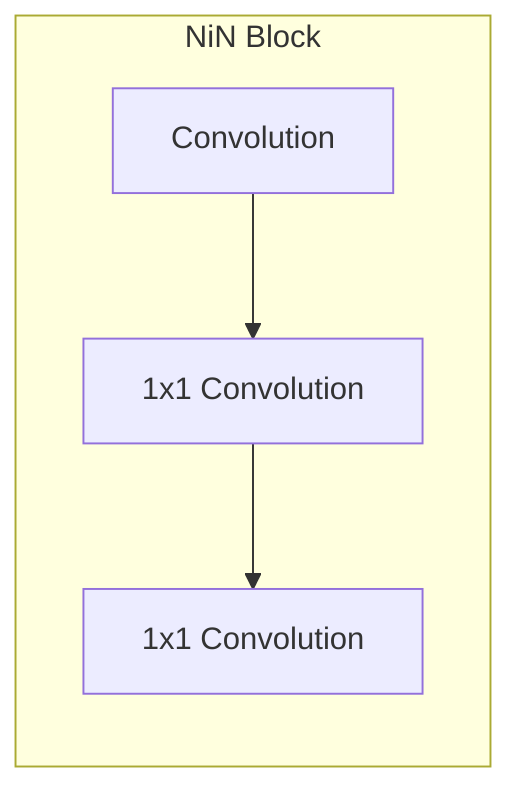

# 24 - 网络中的网络 NiN

---

### 🎦 本节课程视频地址 👇

[](https://www.bilibili.com/video/BV1Uv411G71b)

## 全连接层的问题

LeNet、AlexNet 和 VGG 都有一个共同的设计模式：通过一系列的卷积层与池化层来提取空间结构特征；然后通过全连接层对特征的表征进行处理。 AlexNet 和 VGG 对 LeNet 的改进主要在于如何扩大和加深这两个模块。而全连接层存在以下问题：

1. 相比卷积层，全连接层**参数存储空间大得多**，同时占用很大的计算带宽

   - 卷积层需要较少的参数：$c_i\times c_o\times k^2$

   > $c_i$表示输入通道数，$c_o$表示输出通道数，$k$表示卷积核尺寸，

   - 以卷积层后的第一个全连接层的参数大小为例
     - LeNet：$16\times5\times5\times120=48k$
     - AlexNet：$256\times5\times5\times4096=26M$
     - VGG：$512\times7\times7\times4096=102M$

2. 大尺寸的全连接层很容易引起**过拟合**问题
3. 使用了全连接层，相当于放弃特征的**空间结构**

## NiN

网络中的网络（NiN）提供了一个非常简单的解决方案：在每个像素的通道上分别使用多层感知机来取代全连接层

### NiN 块



一个卷积层后跟两个全连接层（即$(1 \times 1)$卷积层，用于混合通道，可参考[卷积层通道](19-卷积层通道.md)一节内容），每个$(1 \times 1)$卷积层：

- 步幅 stride=1，无填充，通道数等于卷积层通道数，输出形状跟卷积层输出一样，不改变输出尺寸与通道数
- 起到全连接层的作用
- 对每个像素增加了非线性性


> 上图为$(1 \times 1)$卷积层老示例图仅供参考。对应 NiN 块，输入三通道时，则卷积层也需要输出 3 通道而不是上图的的 2 通道

### NiN 架构


- 无全连接层
- 交替使用 **NiN 块**和步幅为 2 的**最大池化层**
  - 逐步减小高宽和增大通道数
- 最后使用**全局平均池化层**得到输出替代 AlexNet、VGG 的全连接层
  - 其输入通道数是类别数
  - 从每个通道拿出一个值，作为对其类比的预测，再求 softmax
  - 减小全连接层过拟合问题，减少参数个数，降低存储空间使用

## 代码实现

- 实现 NiN Block

```python
def nin_block(in_channels, out_channels, kernel_size,
             strides, padding):
    return nn.Sequential(
        nn.Conv2d(in_channels, out_channels, kernel_size, strides, padding),nn.ReLU(),
        nn.Conv2d(out_channels, out_channels, kernel_size=1),nn.ReLU(),
        nn.Conv2d(out_channels, out_channels, kernel_size=1),nn.ReLU())
```

- 定义 NiN 网络（以 AlexNet 为模板）

```python
net = nn.Sequential(
    nin_block(1, 96, kernel_size=11, strides=4, padding=0),
    nn.MaxPool2d(3, stride=2),
    nin_block(96, 256, kernel_size=5, strides=1, padding=2),
    nn.MaxPool2d(3, stride=2),
    nin_block(256, 384, kernel_size=3, strides=1, padding=1),
    nn.MaxPool2d(3, stride=2), nn.Dropout(0.5),
    # 最后将输出通道降到10
    nin_block(384, 10, kernel_size=3, strides=1, padding=1),
    # nn.AdaptiveAvgPool2d使得输出尺寸为(1x10x1x1)
    # 相当于在每个通道内做平均池化
    nn.AdaptiveAvgPool2d((1, 1)),
    nn.Flatten())
```

- 测试各层输出尺寸

```python
X = torch.rand(size=(1, 1, 224, 224))
for layer in net:
    X = layer(X)
    print(layer.__class__.__name__, 'output shape\t', X.shape)

# Out:
# Sequential output shape:     torch.Size([1, 96, 54, 54])
# MaxPool2d output shape:      torch.Size([1, 96, 26, 26])
# Sequential output shape:     torch.Size([1, 256, 26, 26])
# MaxPool2d output shape:      torch.Size([1, 256, 12, 12])
# Sequential output shape:     torch.Size([1, 384, 12, 12])
# MaxPool2d output shape:      torch.Size([1, 384, 5, 5])
# Sequential output shape:     torch.Size([1, 10, 5, 5])
# AdaptiveAvgPool2d output shape:      torch.Size([1, 10, 1, 1])
# Flatten output shape:        torch.Size([1, 10])
```

- 训练

```python
lr, num_epochs, batch_size = 0.1, 10, 128
train_iter, test_iter = d2l.load_data_fashion_mnist(batch_size, resize=224)
d2l.train_ch6(net, train_iter, test_iter, num_epochs, lr, d2l.try_gpu())

# Out:
# loss 0.563, train acc 0.783, test acc 0.772
# 3192.9 examples/sec on cuda:0
```

> 根据结果对比 AlexNet 可知，由于有多个 1x1 卷积存在，训练速度要比 AlexNet 慢，而且精度没有后者高（可能数据集过小）


## Pytorch 模块参考文档

- `torch.nn.AdaptiveAvgPool2d(output_size)` Pytorch 2 维的自适应最大池化操作 🧐[中文](https://pytorch-cn.readthedocs.io/zh/latest/package_references/torch-nn/#_2) | [官方英文](https://pytorch.org/docs/stable/generated/torch.nn.AdaptiveAvgPool2d.html#torch.nn.AdaptiveAvgPool2d)

---

## Q&A🤓

**Q：为什么最近几个模型做分类问题，在网络定义中都没看到 Softmax 层？**

**🙋‍♂️**：一般现有深度学习框架为避免反向传播过程中可能会困扰我们的数值稳定性问题，大都将 softmax 和交叉熵损失函数结合在一起。详细内容可参考 👉[这里](https://zh.d2l.ai/chapter_linear-networks/softmax-regression-concise.html#subsec-softmax-implementation-revisited)
