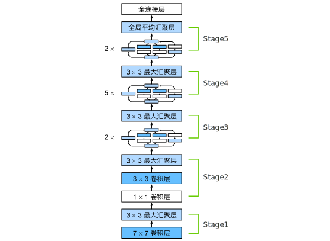
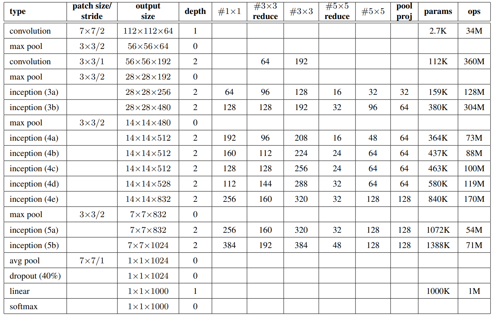

# 25 - 含并行连接的网络 GoogLeNet

---

### 🎦 本节课程视频地址 👇

[](https://www.bilibili.com/video/BV1b5411g7Xo)

## 问题的引出

在 2014 年的 ImageNet 图像识别挑战赛中，一个名叫 GoogLeNet [[Szegedy et al., 2015]](https://www.cv-foundation.org/openaccess/content_cvpr_2015/papers/Szegedy_Going_Deeper_With_2015_CVPR_paper.pdf)的网络架构大放异彩。 GoogLeNet 吸收了 NiN 中**串联网络**的思想，并在此基础上做了改进。 这篇论文的一个重点是**解决了什么样大小的卷积核最合适的问题**。 毕竟，以前流行的网络使用小到 1×1 ，大到 11×11 的卷积核。 该文的一个观点是，有时使用不同大小的卷积核组合是有利的。

## Inception 块

在 GoogLeNet 中，基本的卷积块被称为**Inception 块**（Inception block）。这很可能得名于电影《盗梦空间》（Inception），因为电影中的一句话“我们需要走得更深”（“We need to go deeper”）。


Inception 块使用用 4 个路径从不同层面抽取信息，然后在输出通道维合并。


- 输出和输入等高宽，将 4 条路径的结果按通道合并
- 1x1 卷积层：进行通道融合，降低通道数来控制模型复杂度
- 非 1x1 的卷积层、MaxPooling：提取空间特性，增加鲁棒性
- 每条路径的通道数可能不一样

### Inception 的优势

跟单 3x3 或 5x5 卷积层相比，输出相同通道数，Inception 块只需要更少的参数个数和计算复杂度.

|           | #parameters | FLOPS |
| --------- | ----------- | ----- |
| Inception | 0.16M       | 128M  |
| 3x3 Conv  | 0.44M       | 346M  |
| 5x5 Conv  | 1.22M       | 963M  |

> FLOPS，Floating-point Operations Per Second

## GoogLeNet

包含 5 Stages, 9 Inception 块

- 架构图



- 各层信息



### Inception 变种

- Inception-BN(V2)：使用了 batch normalization
- Inception-V3：修改了 Inception(包含诡异的 1x3、3x1、1x7、7x1Conv)
- Inception-V4：使用残差连接

## 总结

- Inception 块使用 4 条有不同超参数的卷积层和池化层的通路来抽取不同的信息
  - 一个主要优点是模型参数小，计算复杂度低
- GooLeNet 用了 9 个 Inception 块，是第一个达到上百层的网络
  - 后续有一系列改进变种

## 代码实现

- 实现 Inception 块

```python
import torch
from torch import nn
from torch.nn import functional as F
from d2l import torch as d2l

class Inception(nn.Module):
    # c1~c4表示四条路径的通道数
    def __init__(self, in_channels, c1, c2, c3, c4, **kwargs):
        super(Inception, self).__init__(**kwargs) #继承父类属性

        #pass1 1x1conv
        self.p1_1 = nn.Conv2d(in_channels, c1, kernel_size=1) #Conv2d, default_stride=1, default_padding=0
        #pass2 1x1+3x3conv
        self.p2_1 = nn.Conv2d(in_channels, c2[0], kernel_size=1)
        self.p2_2 = nn.Conv2d(c2[0], c2[1], kernel_size=3, padding=1)
        #pass3 1x1+5x5conv
        self.p3_1 = nn.Conv2d(in_channels, c3[0], kernel_size=1)
        self.p3_2 = nn.Conv2d(c3[0], c3[1], kernel_size=5, padding=2)
        #pass4 3x3MaxPool+1x1conv
        self.p4_1 = nn.MaxPool2d(kernel_size=3, stride=1, padding=1)
        self.p4_2 = nn.Conv2d(in_channels, c4, kernel_size=1)

    def forward(self, x):
        p1 = F.relu(self.p1_1(x))
        p2 = F.relu(self.p2_2(F.relu(self.p2_1(x))))
        p3 = F.relu(self.p3_2(F.relu(self.p3_1(x))))
        p4 = F.relu(self.p4_2(self.p4_1(x)))
        # .cat(dim=1)在通道维dim=1合并结果
        return torch.cat((p1, p2, p3, p4), dim=1)
```

- 定义 Stage1 结构：使用 64 个通道、 7×7 卷积层

```python
b1 = nn.Sequential(nn.Conv2d(1, 64, kernel_size=7, stride=2, padding=3),nn.ReLU(),
                   nn.MaxPool2d(kernel_size=3, stride=2, padding=1))
```

- 定义 Stage2 结构：第一个卷积层是 64 个通道、 1×1 卷积层；第二个卷积层使用将通道数量增加三倍的 3×3 卷积层

```python
b2 = nn.Sequential(nn.Conv2d(64, 64, kernel_size=1),nn.ReLU(),
                   nn.Conv2d(64, 192, kernel_size=3, padding=1),nn.ReLU(),
                   nn.MaxPool2d(kernel_size=3, stride=2, padding=1))
```

- 定义 Stage3 结构：第一个 Inception 块的输出通道数为 64+128+32+32=256。第二个 Inception 块的输出通道数增加到 128+192+96+64=480

```python
b3 = nn.Sequential(Inception(192, 64, (96, 128), (16, 32), 32),
                   Inception(256, 128, (128, 192), (32, 96), 64),
                   nn.MaxPool2d(kernel_size=3, stride=2, padding=1))
```

- 定义 Stage4 结构：串联 5 个 Inception 块

```python
b4 = nn.Sequential(Inception(480, 192, (96, 208), (16, 48), 64),
                   Inception(512, 160, (112, 224), (24, 64), 64),
                   Inception(512, 128, (128, 256), (24, 64), 64),
                   Inception(512, 112, (144, 288), (32, 64), 64),
                   Inception(528, 256, (160, 320), (32, 128), 128),
                   nn.MaxPool2d(kernel_size=3, stride=2, padding=1))
```

- 定义 Stage5 结构：两个 Inception 块后面紧跟输出层

```python
b5 = nn.Sequential(Inception(832, 256, (160, 320), (32, 128), 128),
                   Inception(832, 384, (192, 384), (48, 128), 128),
                   nn.AdaptiveAvgPool2d((1,1)),
                   nn.Flatten())

net = nn.Sequential(b1, b2, b3, b4, b5, nn.Linear(1024, 10))
```

- 测试各层输出

```python
X = torch.rand(size=(1, 1, 96, 96))
for layer in net:
    X = layer(X)
    print(layer.__class__.__name__,'output shape:\t', X.shape)

# Out:
# Sequential output shape:     torch.Size([1, 64, 24, 24])
# Sequential output shape:     torch.Size([1, 192, 12, 12])
# Sequential output shape:     torch.Size([1, 480, 6, 6])
# Sequential output shape:     torch.Size([1, 832, 3, 3])
# Sequential output shape:     torch.Size([1, 1024])
# Linear output shape:         torch.Size([1, 10])
```

- 训练

```python
lr, num_epochs, batch_size = 0.1, 10, 128
train_iter, test_iter = d2l.load_data_fashion_mnist(batch_size, resize=96)
d2l.train_ch6(net, train_iter, test_iter, num_epochs, lr, d2l.try_gpu())

# Out:
# loss 0.244, train acc 0.908, test acc 0.896
# 3490.2 examples/sec on cuda:0
```


