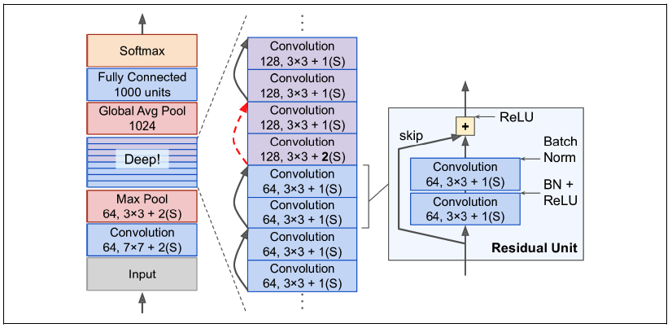

# 27 - 残差网络 ResNet

---

### 🎦 本节课程视频地址 👇

[](https://www.bilibili.com/video/BV1bV41177ap)

## 问题引出：加更多的层总是改善精度吗？

以下图示例来说，对于非嵌套函数（non-nested function）类，较复杂的函数类并不总是向“真”函数 $f^∗$ 靠拢（区域大小代表模型复杂度，复杂度由 $\mathcal{F1}$ 向 $\mathcal{F6}$ 递增）。 在下图左边，虽然 $\mathcal{F3}$ 比 $\mathcal{F1}$ 更接近 $f^∗$ ，但 $\mathcal{F6}$ 却离的更远了。 相反对于下图右侧的嵌套函数（nested function）类 $\mathcal{F1}\subseteq…\subseteq \mathcal{F6}$ ，我们可以避免上述问题。


因此，只有**当较复杂的函数类包含较小的函数类时**，我们才能确保提高它们的性能（相当于在原有区域逐渐增大覆盖面积来逼近最优解）。 对于深度神经网络，如果我们能将新添加的层训练成**恒等映射**（identity function）$f(x)=x$，新模型和原模型将同样有效。 同时，由于新模型可能得出更优的解来拟合训练数据集，因此添加层似乎更容易降低训练误差。

## 残差块（Residual blocks）

假设我们的原始输入为 $x$ ，而希望学出的理想映射为 $f(x)$ （作为下图上方激活函数的输入）。 下图虚线框中的部分需要直接拟合出该映射 $f(x)$ ，而右图虚线框中的部分则需要拟合出残差映射 $f(x)−x$ 。 残差映射在现实中往往更容易优化。 以本节开头提到的恒等映射作为我们希望学出的理想映射 $f(x)$ ，我们只需将下图右侧虚线框内上方的加权运算（如仿射）的权重和偏置参数设成$0$，那么 $f(x)$ 即为恒等映射。 实际中，当理想映射 $f(x)$ 极接近于恒等映射时，残差映射也易于**捕捉恒等映射的细微波动**。 右图是 ResNet 的基础架构–残差块（residual block）。 在残差块中，输入可通过跨层数据线路更快地向前传播。


- 串联一个层改变函数类，我们希望能扩大函数类。

- 残差块加入快速通道（右边）来得到$f(x)=x+g(x)$

- 相当于在后面复杂网络嵌入了前面的简单网络。

### 残差块细节

残差块有两种实现方式， 一种是当`use_1x1conv=False`时，应用 ReLU 非线性函数之前，将输入添加到输出。 另一种是当`use_1x1conv=True`时，添加通过 $1×1$ 卷积调整通道和分辨率。


## ResNet 网络结构

ResNet 的前两层跟之前介绍的 GoogLeNet 中的一样： 在输出通道数为 64、步幅为 2 的 $7×7$ 卷积层后，接步幅为 2 的 $3×3$ 的最大汇聚层。 不同之处在于 ResNet 每个卷积层后增加了批量规范化层。



每个模块有 4 个卷积层（不包括恒等映射的 $1×1$ 卷积层）。 加上第一个 $7×7$ 卷积层和最后一个全连接层，共有 18 层。 因此，这种模型通常被称为 ResNet-18。 通过配置不同的通道数和模块里的残差块数可以得到不同的 ResNet 模型，例如更深的含 152 层的 ResNet-152。


- 高宽减半 ResNet 块(stride=2)
- 后接多个高宽不变的 ResNet
  - 用 1x1Conv skip 可以改变输出通道匹配 ResNet
- 类似于 VGG 和 GooleNet 的总体架构
  - 一般是 5 个 Stage
  - $7×7$ Conv + BN + $3×3$ MaxPooling
  - 每一个 Stage 的具体框架很灵活
- 但替换成了 ResNet 块

## 总结

- 残差块使得很深的网络更加容易训练
  - 甚至可以训练一千层的网络
- 残差网络对随后的深层神经网络设计产生了深远影响，无论是卷积累网络还是全连接类网络

## 代码实现

- 定义 Residual class

```python
import torch
from torch import nn
from torch.nn import functional as F
from d2l import torch as d2l

class Residual(nn.Module):
    def __init__(self, input_channels, num_channels, use_1x1conv=False, strides=1):
        super().__init__()
        #kernel_size=3, padding=1，输出高宽不变
        self.conv1 = nn.Conv2d(input_channels, num_channels,
                               kernel_size=3, padding=1, stride=strides)
        #default_stride=1，同上输出高宽不变
        self.conv2 = nn.Conv2d(num_channels, num_channels,
                               kernel_size=3, padding=1)
        # 如果指定了旁路卷积
        if use_1x1conv:
            self.conv3 = nn.Conv2d(input_channels, num_channels,
                                   kernel_size=1, stride=strides)
        else:
            self.conv3 = None
        self.bn1 = nn.BatchNorm2d(num_channels)
        self.bn2 = nn.BatchNorm2d(num_channels)
        # self.relu = nn.ReLU(inplace=True)

    def forward(self, X):
        Y = F.relu(self.bn1(self.conv1(X)))
        Y = self.bn2(self.conv2(Y))
        if self.conv3:
            X = self.conv3(X)
        Y += X
        return F.relu(Y)
```

- 测试

```python
blk = Residual(3, 3)
X = torch.rand(4, 3, 6, 6)
Y = blk(X)
Y.shape
# Out:
# torch.Size([4, 3, 6, 6])

blk = Residual(3, 6, use_1x1conv=True, strides=2)
blk(X).shape
# Out:
# torch.Size([4, 6, 3, 3])
```

- 定义 Residual block

```python
#照搬GoogleNet b1
b1 = nn.Sequential(nn.Conv2d(1, 64, kernel_size=7, stride=2),
                   nn.BatchNorm2d(64), nn.ReLU(),
                   nn.MaxPool2d(kernel_size=3, stride=2, padding=1))

def resnet_block(input_channels, num_channels, num_residuals,
                 first_block=False):
    blk = []
    for i in range(num_residuals):
        if i == 0 and not first_block:
            #第一块高宽减半
            blk.append(
                Residual(input_channels, num_channels, use_1x1conv=True,
                         strides=2))
        else:
            blk.append(Residual(num_channels, num_channels))
            #高宽不变
    return blk
```

- 构建 Stage

```python
b2 = nn.Sequential(*resnet_block(64, 64, 2, first_block=True))
b3 = nn.Sequential(*resnet_block(64, 128, 2))
b4 = nn.Sequential(*resnet_block(128, 256, 2))
b5 = nn.Sequential(*resnet_block(256, 512, 2))

net = nn.Sequential(b1, b2, b3, b4, b5,
                    nn.AdaptiveAvgPool2d((1,1)),
                    nn.Flatten(), nn.Linear(512, 10))
```

- 测试网络输出

```python
X = torch.rand(size=(1, 1, 224, 224))
for layer in net:
    X = layer(X)
    print(layer.__class__.__name__,'output shape:\t', X.shape)
# Out:
# Sequential output shape:     torch.Size([1, 64, 56, 56])
# Sequential output shape:     torch.Size([1, 64, 56, 56])
# Sequential output shape:     torch.Size([1, 128, 28, 28])
# Sequential output shape:     torch.Size([1, 256, 14, 14])
# Sequential output shape:     torch.Size([1, 512, 7, 7])
# AdaptiveAvgPool2d output shape:      torch.Size([1, 512, 1, 1])
# Flatten output shape:        torch.Size([1, 512])
# Linear output shape:         torch.Size([1, 10])
```

- 模型训练

```python
lr, num_epochs, batch_size = 0.05, 10, 256
train_iter, test_iter = d2l.load_data_fashion_mnist(batch_size, resize=96)
d2l.train_ch6(net, train_iter, test_iter, num_epochs, lr, d2l.try_gpu())
# Out:
# loss 0.009, train acc 0.998, test acc 0.922
# 4702.7 examples/sec on cuda:0
```


> 通过与之前模型结果的对比，可以看出 ResNet 得益于残差设计，使得梯度传播更快，模型收敛更快、训练精度更高，也就是模型特征提取能力更强，速度也更快。（比 Alexnet 稍快、比 VGG 快将近 100%、比 NiN 快将近 50%、比 GoogLeNet 快将近 35%）

## 从 ResNet 到 DenseNet

**稠密连接网络（DenseNet）** [[Huang et al., 2017]](https://arxiv.org/abs/1608.06993)在某种程度上是 ResNet 的逻辑扩展。让我们先从数学上了解它，ResNet 将函数展开为:

$$
f(\mathbf{x}) = \mathbf{x} + g(\mathbf{x})
$$

也就是说，ResNet 将 $f$ 分解为两部分：

- 一个简单的线性项 $\mathbf{x}$
- 一个复杂的非线性项 $g(\mathbf{x})$。

那么再向前拓展一步，如果我们想将 $f$ 拓展成超过两部分的信息呢？ 一种方案便是 DenseNet👇


> ResNet（左）与 DenseNet（右）在跨层连接上的主要区别：使用相加(+)和使用**连结(concat)**

ResNet 和 DenseNet 的关键区别在于，DenseNet 输出是**连接**（用图中的 [,] 表示）而不是如 ResNet 的简单相加。 因此，在应用越来越复杂的函数序列后，我们执行从 x 到其展开式的映射：

$$
\mathbf{x} \to \left[
\mathbf{x},
f_1(\mathbf{x}),
f_2([\mathbf{x}, f_1(\mathbf{x})]), f_3([\mathbf{x}, f_1(\mathbf{x}), f_2([\mathbf{x}, f_1(\mathbf{x})])]), \ldots\right]
$$

最后，将这些展开式结合到多层感知机中，再次减少特征的数量。 实现起来非常简单：我们不需要添加术语，而是将它们连接起来。 DenseNet 这个名字由变量之间的“稠密连接”而得来，最后一层与之前的所有层紧密相连。 稠密连接如下图所示：


稠密网络主要由 2 部分构成：**稠密块**（dense block）和**过渡层**（transition layer）。 前者定义如何连接输入和输出，而后者则控制通道数量，使其不会太复杂。

## 代码实现

- 定义卷积块

```python
import torch
from torch import nn
from d2l import torch as d2l


def conv_block(input_channels, num_channels):
    return nn.Sequential(
        nn.BatchNorm2d(input_channels), nn.ReLU(),
        nn.Conv2d(input_channels, num_channels, kernel_size=3, padding=1))
```

> 一个稠密块由多个卷积块组成，每个卷积块使用相同数量的输出通道。在前向传播中，我们将每个卷积块的输入和输出在通道维上连结（concat）

- 定义 dense block

```python
class DenseBlock(nn.Module):
    def __init__(self, num_convs, input_channels, num_channels):
        super(DenseBlock, self).__init__()
        layer = []
        for i in range(num_convs):
            layer.append(conv_block(
                num_channels * i + input_channels, num_channels))
        self.net = nn.Sequential(*layer)

    def forward(self, X):
        for blk in self.net:
            Y = blk(X)
            # 连接通道维度上每个块的输入和输出
            X = torch.cat((X, Y), dim=1)
        return X
```

> 我们定义一个有 2 个输出通道数为 10 的 DenseBlock。 使用通道数为 3 的输入时，我们会得到通道数为 $3+2×10=23$ 的输出。 卷积块的通道数控制了输出通道数相对于输入通道数的增长，因此也被称为增长率（growth rate）。

```python
blk = DenseBlock(2, 3, 10)
X = torch.randn(4, 3, 8, 8)
Y = blk(X)
Y.shape
# Out:
# torch.Size([4, 23, 8, 8])
```

> 由于每个稠密块都会带来通道数的增加，使用过多则会过于复杂化模型。 而过渡层可以用来控制模型复杂度。 它通过 $1×1$ 卷积层来减小通道数，并使用步幅 stride=2 的平均汇聚层减半高和宽，从而进一步降低模型复杂度。

- 定义过渡层

```python
def transition_block(input_channels, num_channels):
    return nn.Sequential(
        nn.BatchNorm2d(input_channels), nn.ReLU(),
        nn.Conv2d(input_channels, num_channels, kernel_size=1),
        nn.AvgPool2d(kernel_size=2, stride=2))
```

> 对上一个例子中稠密块的输出使用通道数为 10 的过渡层。 此时输出的通道数减为 10，高和宽均减半。

```python
blk = transition_block(23, 10)
blk(Y).shape
# Out:
# torch.Size([4, 10, 4, 4])
```

- 构造 DenseNet

```python
b1 = nn.Sequential(
    nn.Conv2d(1, 64, kernel_size=7, stride=2, padding=3),
    nn.BatchNorm2d(64), nn.ReLU(),
    nn.MaxPool2d(kernel_size=3, stride=2, padding=1))

# num_channels为当前的通道数
num_channels, growth_rate = 64, 32
num_convs_in_dense_blocks = [4, 4, 4, 4]
blks = []
for i, num_convs in enumerate(num_convs_in_dense_blocks):
    blks.append(DenseBlock(num_convs, num_channels, growth_rate))
    # 上一个稠密块的输出通道数
    num_channels += num_convs * growth_rate
    # 在稠密块之间添加一个转换层，使通道数量减半
    if i != len(num_convs_in_dense_blocks) - 1:
        blks.append(transition_block(num_channels, num_channels // 2))
        num_channels = num_channels // 2

net = nn.Sequential(
    b1, *blks,
    nn.BatchNorm2d(num_channels), nn.ReLU(),
    nn.AdaptiveMaxPool2d((1, 1)),
    nn.Flatten(),
    nn.Linear(num_channels, 10))
```

- 训练模型

```python
lr, num_epochs, batch_size = 0.1, 10, 256
train_iter, test_iter = d2l.load_data_fashion_mnist(batch_size, resize=96)
d2l.train_ch6(net, train_iter, test_iter, num_epochs, lr, d2l.try_gpu())
# Out:
# loss 0.151, train acc 0.944, test acc 0.822
# 5507.0 examples/sec on cuda:0
```


---

## Q&A🤓

**Q：为什么$f(x)=x+g(x)$就能保证结果至少不会变差？假如$g(x)$变得更差呢？**

**🙋‍♂️**：在神经网络训练中，如果反向传播时算法发现$g(x)$对模型`loss`损失函数没有贡献（或者有负贡献），就会逐渐将$g(x)$的梯度置零（或者反方向降低$g(x)$的影响直到权重为零），最后$g(x)$就得不到梯度更新，网络最终结果$f(x)$也会忽略$g(x)$而向$x$靠近。

**Q：是不是训练精度总是会比测试精度高？**

**🙋‍♂️**：也不一定，在许多有 Data Argument（数据增强）的任务中，比如图片识别，测试精度是可能高于训练精度（因为训练图片有添加噪声等干扰，而测试图片没有）。
