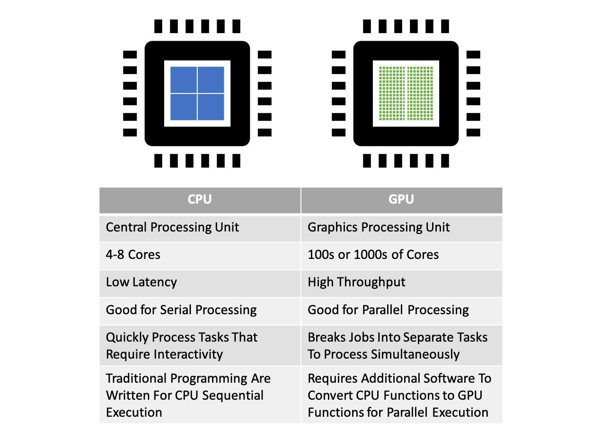
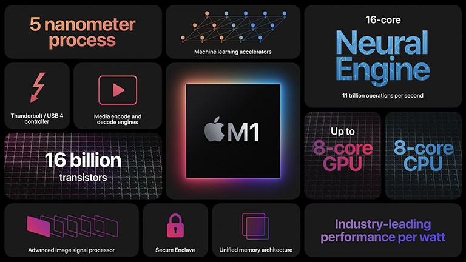
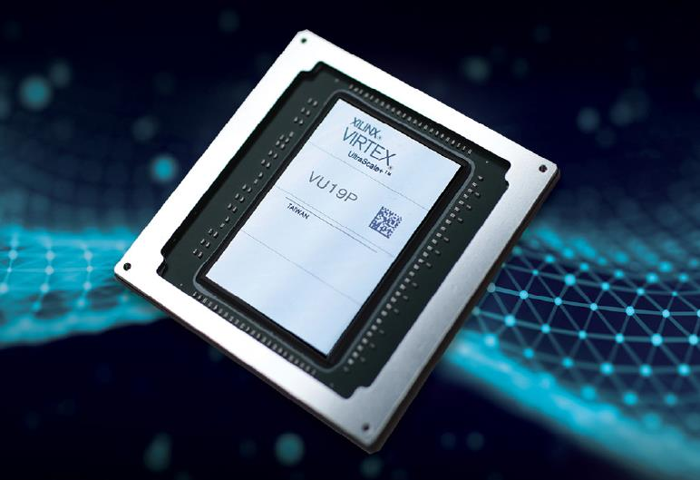
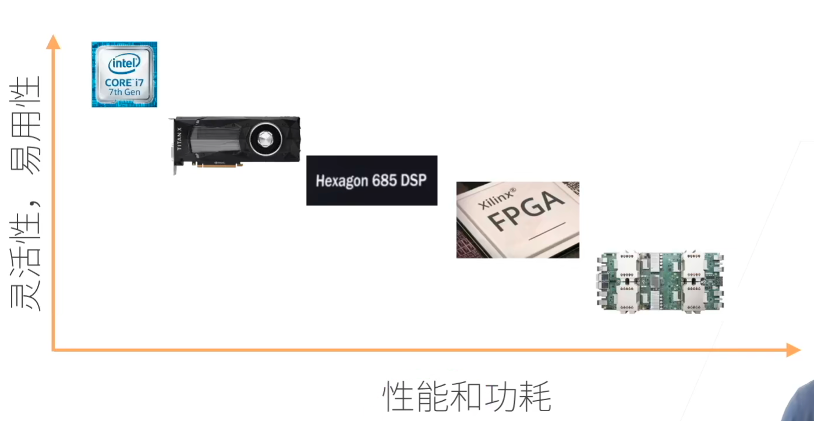
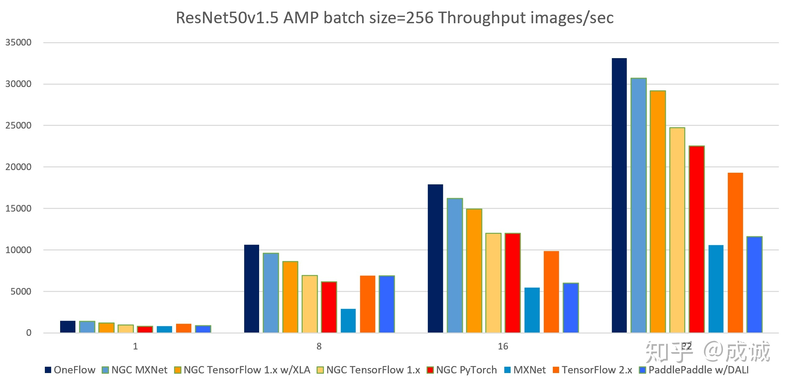
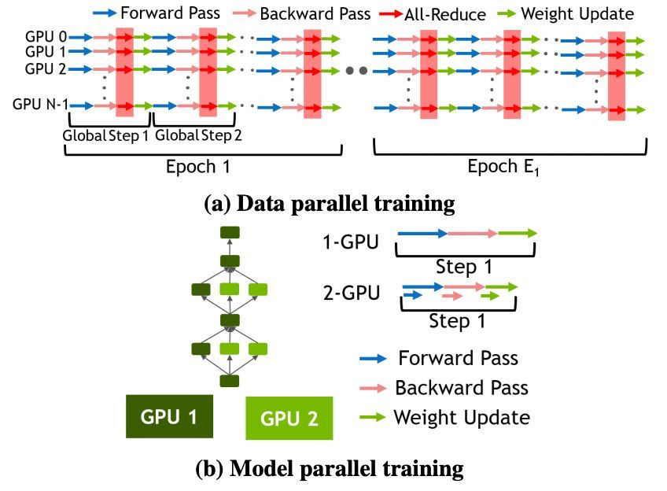
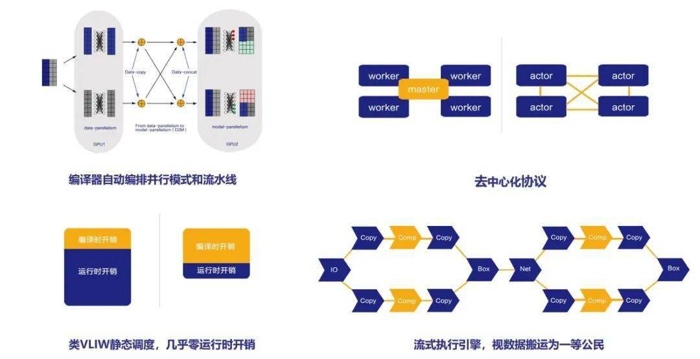

# 28 - 深度学习硬件和相关技术

---

### 🎦 本节课程视频地址 👇

> CPU & GPU

> TUP & others

## 硬件的重要性

很好地理解算法和模型才可以捕获统计方面的问题，构建出具有出色性能的系统。一个好的设计可以很容易地在性能上造就数量级的差异，这也是后续产生的能够训练网络（例如，训练时间为 1 周）和无法训练网络（训练时间为 3 个月，导致错过截止期）之间的差异。我们先从计算机的研究开始。然后深入查看 CPU 和 GPU。最后，再查看数据中心或云中的多台计算机的连接方式。

以一台电脑配置为例：

- CPU: Intel i7，算力 0.15TFLOPS
- RAM: 32GB
- GPU：Nvidia Titan X, 算力 12TFLOPS, 16GB 显存

下图源自科林·斯科特的[互动帖子](https://people.eecs.berkeley.edu/~rcs/research/interactive_latency.html)，在帖子中很好地概述了过去十年的进展。原始的数字是取自于 Jeff Dean 的[Stanford 讲座](https://static.googleusercontent.com/media/research.google.com/en//people/jeff/Stanford-DL-Nov-2010.pdf)的截图，它被成为“**每个程序 🐒 都应该知道的延迟数字**”（点击 👉[这里](https://colin-scott.github.io/personal_website/research/interactive_latency.html)可获得当下最新硬件的实时更新）。对于计算机体系结构的深入概述，建议读者参考 [[Hennessy & Patterson, 2011]](https://zh.d2l.ai/chapter_references/zreferences.html#hennessy-patterson-2011)或关于该主题的最新课程，例如[Arste Asanovic](http://inst.eecs.berkeley.edu/~cs152/sp19/)

> 简单解释上图，黑色每小格代表 1ns，第一行表示 CPU L1 高速缓存的时延正好为 1ns；分支预测错误时延 3ns；L2 缓存时延 4ns；互斥锁/解锁时延 17ns；

> 蓝色每小格代表 100ns，主内存时延 100ns；使用 Zippy 算法压缩 1KB 数据需要 2000ns 即$2\mu s$；

> 绿色每小格代表 10000ns，在 1Gbps 网络发送 2KB 数据需要 44ns；固态硬盘随机读取需要 16000ns；内存顺序读取 1MB 数据需要 3000ns；SSD 顺序读取相同大小数据需要 49000ns；同数据中心内部传输需要 500000ns；

> 红色每小格代表 1ms，机械硬盘顺序读取 1MB 数据需要 0.825ms；机械磁盘寻址需要 2ms；从洛杉矶发送数据到荷兰需要 150ms

## CPU

### 怎样提升 CPU 利用率 I

- 在计算$a+b$之前，需要准备数据，数据路径：

  - 主内存->L3->L2->L1->寄存器——每级 cache 逐渐变小。
    - L1 访问延时：0.5ns
    - L2 访问延时：7ns(14xL1)
    - 主内存访问延时：100ns(200xL1)

- 提升空间和时间的内存本地性
  - 时间：重用数据使得保持它们在缓存里
  - 空间：按序读写数据使得可以预读取(Prefect)

### 怎样提升 CPU 利用率 II

- 高端 CPU 有几十个核
  - 如第三代 AMD EPYC（霄龙）处理器最高拥有 64 核心 128 线程
- 并行来利用所有核
  - 超线程不一定能提升性能，因为他们共享寄存器，一个逻辑核占用了寄存器，另一个逻辑核只能等它运算完释放出来才可计算

> 又是一张暴露年龄的图 😥 当年带超线程 HT 技术的“奔 4”处理器的广告可谓火遍国内，而贴了此标的网吧广告无疑是吸引学生选择的最好途径。当年 Intel 和 AMD 可谓神仙打架，和当下 Intel 被 AMD Zen 系处理器锤爆后而奋发图强有些许类似。

## GPU

> Nvidia Turing 架构图

### 三千个臭皮匠，顶一个诸葛亮

- CPU： 一般 6-64 核，0.2-1TFLOPS，内存带宽 30-100GB/s ，控制流强
- GPU： 上千个核，10-100TFLOPS，内存带宽 0.4-1TB/s，控制流弱

### 提升 GPU 利用率方法

- 并行
  - 充分使用数千个线程
- 内存本地性
  - 缓存更小，架构更加简单，带宽更大
- 少用控制语句
  - 支持有限
  - 同步开销很大

### CPU/GPU 带宽

- 不要频繁在 CPU 和 GPU 之间传数据
  - 带宽限制：内存与 CPU 的总线带宽要大于显卡与 CPU 的 PCIe 总线带宽（当然随着 PCIe 4.0、PCIe 5.0 的普及，差距会缩小）
  - 同步开销

> 高速扩展总线由直接连接到 CPU 的多个通道组成，将 CPU 与大多数组件（网络、GPU 和存储）连接在一起。例如，AMD 的 Threadripper™3 有 64 个 PCIe4.0 通道，每个通道都能够双向传输 16Gbit/s 的数据，PCIe 4.0 x16 通道带宽可达 64GB/s。内存直接连接到 CPU，总带宽高达 100GB/s。

## 更多的 CPUs 和 GPU

- **CPU**: AMD（线程撕裂者、EPYC👍YYDS）、ARM
- **GPU**: AMD、Intel、ARM、Qualcomm...
- **SoC**：Apple M1、M1 Pro、M1 Max、M2👍YYDS

## GPU/CPU 高性能计算

- **CPU**: C++或者任何高性能语言
  - 编译器成熟：LLVM
- **GPU**:
  - Nvidia 上用 [**CUDA**](https://developer.nvidia.com/cuda-toolkit) 语言
    - 编译器、驱动、生态成熟
  - 其他用 OpenCL（质量取决于硬件厂商，发展不好，目前有被大家弃用的现象）
  - AMD 目前在推自己的高性能计算生态：[**ROCm**](https://www.amd.com/zh-hans/graphics/servers-solutions-rocm-ml)，不知能否追上 CUDA

### 总结

- CPU：可以处理通用计算。性能优化考虑数据读写效率和多线程
- GPU：使用更多的小核和更大的内存带宽，适合能大规模并行的计算任务

## TPU 和其他

### DSP（Digital Signal Processor）

- 为**数字信号处理**算法专门设计：点积，卷积，FFT
- 低功耗、高性能（核不多，频率低）
  - 比移动 GPU 快 5x，功耗更低
- **VLIW**: Very long instruction word
  - 一条指令计算上百次乘累加
- 编程和调试困难（类比汇编语言性能高，但反人类）
- 编译器质量良莠不齐

### FPGA（可编程阵列）

- 有大量可以编程逻辑单元和可配置的连接
- 可以配置成计算复杂函数
  - 编程语言：VHDL、Verilog
- 通常比通用硬件**更高效**
- 工具链质量也良莠不齐
- 一次“编译”需要数小时以上（相当于固件烧录）
- FPGA 也作为芯片研发流片前的测试验证环节

> 目前 FPGA 也随着智能汽车、人工智能等领域的发展得到极广的应用。目前行业龙头是赛灵思（XILINX），现已被 AMD 收购。

### ASIC（Application Specific Integrated Circuit，专用集成电路）

- 目前深度学习硬件的热门领域（也是挖矿的热门硬件 😨）
  - 大厂都在造自己的 ASIC 芯片（国外：Google、Intel、Qualcomm、AMD、Amazon、Facebook...国内：**华为麒麟(NPU)**、联发科、比特大陆、嘉楠科技(K210)、Oppo(马里亚纳)、地平线、阿里、寒武纪）

  > 这里有一个OPPO介绍其“马里亚纳”影像NPU的研发介绍[视频](https://b23.tv/aBOhJuW)可供参考
- **Google TPU** 是代表作
  - 能媲美 Nvidia GPU 性能（RTX3090 算力为 285TFLOPS，谷歌宣称一块 TPU v4 算力在 250TFLOPS，一个 Pod 包含 4096 块 TPU v4，性能超过 1EFLOPS，相当于世界第一超算“富岳”的两倍）
  - 成本可控，目前已在 Google 大规模部署
  - 核心思想是**Systolic Array**（脉动阵列）[[5]](https://zhuanlan.zhihu.com/p/421737378)

### 总结

> **欲戴皇冠，必承其重**：没有两头都好的产品，也没有“既要、又要、还要、都要”的政策，要根据自身条件和需求去 trade off，要有系统论的思维方法。

## 单机多卡并行

- 一台计算机可安装多个GPU（根据CPU支持的PCIe总线通道数决定）
- 在模型训练与预测时，可以将小批量切分到多个GPU上来达到加速计算的效果
- 常见切分方案有
  - 数据并行（Data Parallelism）
  - 模型并行（Model Parallelism）
  - 通道并行（数据+模型融合并行）

> 目前主流深度学习框架在“通道并行”做的还比较欠缺，国内有个新兴框架[**OneFlow**](http://oneflow.ai/a/chanpin/oneflow/)在这一领域做得十分出色，通过重新设计的全并行架构实现了性能的大幅度提高，下图为通过DLPerf项目使用不同框架在Resnet-50上1卡~32卡并行的Benchmark对比，可看出Oneflow性能的确十分出众！同时华为的[**MindSpore**](https://www.mindspore.cn/)也在此领域做的很棒（不过一直很低调没见公开Benchmark）

> P.S.因为沐神最早师从机器学习大师 Alex Smola 和 分布式系统教授 Dave Andersen，所以由沐神领导开发的MXNet在分布式扩展上，性能也是十分强劲~

### 数据并行VS模型并行VS通道并行

- 数据并行：把小批量分成 n 块，每个 GPU 拿到**完整参数**计算一块数据的梯度
  - 实现较简单，通常性能更好

- 模型并行：将模型分成 n 块，每个 GPU 拿到他的**一部分模型**计算前向、反向结果
  - 针对单GPU显存放不下模型时

- 通道并行：这里以Oneflow架构为例，它采用SBP + Actor机制将深度学习数据载入、分发、模型训练等整个工作流视为计算图进行并行优化。感兴趣的童鞋可参考Oneflow技术博客的三篇文章了解👉[文章1](http://oneflow.ai/a/share/jishuboke/57.html)、[文章2](http://oneflow.ai/a/share/jishuboke/56.html)、[文章3](http://oneflow.ai/a/share/jishuboke/55.html)

> 这里真想建议一下Oneflow团队请个靠谱的美工吧，整个官网和品牌配色太辣眼睛了。。。🥴

## 分布式计算

其实与单机多卡的数据并行原理相似，单机多卡数据并行是GPU通过PCIe总线通信，训练数据存储在本地硬盘，共享权重参数存储在内存；而分布式计算相当于通过网络通信，训练数据存储在分布式文件系统，共享权重参数存储在不同参数服务器中。此时性能瓶颈主要为网络带宽，所以要尽量减少跨机器的通信。

## 参考资料

[1][详解ai加速器（一）：2012年的AlexNet到底做对了什么？ - 机器之心编译](https://mp.weixin.qq.com/s/lep6RQmlQlYM3SlyQduBQg)

[2][详解AI加速器（二）：为什么说现在是AI加速器的黄金时代？ - 机器之心编译](https://mp.weixin.qq.com/s/dPPqhdoCDJMiA8gdEiWgsQ)

[3][详解AI加速器（三）：架构基础离不开ISA、可重构处理器 - 机器之心编译](https://mp.weixin.qq.com/s/wWqKav4eNwbBdX7NuZhYhQ)

[4][详解AI加速器（四）：GPU、DPU、IPU、TPU…AI加速方案有无限种可能 - 机器之心编译](https://mp.weixin.qq.com/s/f4mNfFLBDb_DmuUtESWtIQ)

[5][脉动阵列介绍 - 知乎专栏](https://zhuanlan.zhihu.com/p/421737378)

[5][「AI芯片/GPU/NPU/DSP专用处理器」技术特征比较分析最新2022综述论文](https://mp.weixin.qq.com/s/JBEzLMKIoIyuCLCTOHjHmg)
