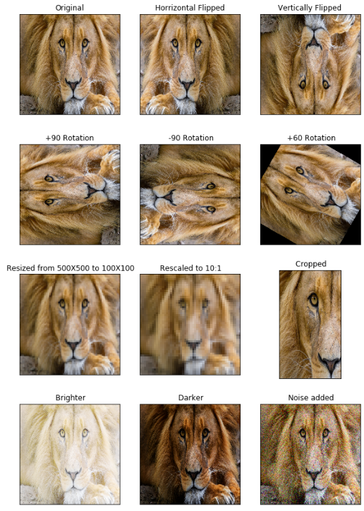

# 29 - 数据增广

---

### 🎦 本节课程视频地址 👇

[](https://www.bilibili.com/video/BV17y4y1g76q)

## 数据增强（Data Augmentation）

大型数据集是成功应用深度神经网络的先决条件。 以图像增广为例，在对训练图像进行一系列的随机变化之后，生成相似但不同的训练样本，从而扩大了训练集的规模。 此外，应用图像增广的原因是，随机改变训练样本可以减少模型对某些属性的依赖，从而提高模型的泛化能力。

在一个已有数据集，通过数据变换，使得有更多的多样性

- 在语言里加入各种不同的背景噪音
- 改变图片的颜色、形状、位置、变形等待属性



## 使用增强数据训练

在训练中随机在线生成增强数据，在测试时不进行增强操作。

- 上下、左右翻转(Flip)：`torchvision.transforms.RandomHorizontalFlip()`

  > 相应操作要符合语义解释

- 切割，从图片中切割一块，变成固定形状（由 CNN 特性决定），所以还存在拉伸等(Crop)
  - 随机高宽比（e.g.[3/4,4/3]）
  - 随机大小（e.g.[80%,100%]）
  - 随机位置
- 颜色(Color)
  - 色调
  - 饱和度
  - 明亮度

类似于对图片做 PS 的变换

### 总结

- 数据增广通过变形数据来获取多样性从而使模型泛化性能更好
- 常见方法翻转、切割、变色等等

## 代码实现

```python
%matplotlib inline
import torch
import torchvision
from torch import nn
from d2l import torch as d2l

d2l.set_figsize()
img = d2l.Image.open('./Image/Lions.png')
d2l.plt.imshow(img)

#定义辅助函数，参数为图片img,和增广方法aug
#默认(2, 4)=8张变换
def apply(img, aug, num_rows=2, num_cols=4, scale=1.5):
    Y = [aug(img) for _ in range(num_rows * num_cols)]
    d2l.show_images(Y, num_rows, num_cols, scale=scale)
```

- 翻转

```python
#水平随机翻转
apply(img, torchvision.transforms.RandomHorizontalFlip())
#随机上下翻转
apply(img, torchvision.transforms.RandomVerticalFlip())
```


- 裁剪

```python
#随机剪裁
#size = (200, 200)，裁出来的图片大小
#scale=(0.1, 1)，裁处区域面积占原始图片百分比，从10%到100%
#ratio=(0.5, 2)，高宽比，1:2 or 2:1
shape_aug = torchvision.transforms.RandomResizedCrop((200, 200), scale=(0.1, 1), ratio=(0.5, 2))
apply(img, shape_aug)
```


- 更改亮度`brightness`、对比度`contrast`、饱和度`saturation`、色调`hue`

```python
apply(img, torchvision.transforms.ColorJitter(
    brightness=0.5, contrast=0, saturation=0, hue=0))

apply(img, torchvision.transforms.ColorJitter(
    brightness=0, contrast=0, saturation=0, hue=0.5))
```


- 可结合多种增广方法

> torchvision.transforms.Compose([aug1, aug2, aug3, aug4])

```python
augs = torchvision.transforms.Compose([
    torchvision.transforms.RandomHorizontalFlip(),
    color_aug, shape_aug])
apply(img, augs)
```


- 指定训练、测试所用增广方式

```python
train_augs = torchvision.transforms.Compose([
    torchvision.transforms.RandomHorizontalFlip(),
    torchvision.transforms.ToTensor()
])

test_augs = torchvision.transforms.Compose([
    torchvision.transforms.ToTensor()
])
```

- 定义加载数据集函数

```python
def load_cifar10(is_train, augs, batch_size):
    dataset = torchvision.datasets.CIFAR10(
        root='../data', train=is_train,
        transform=augs, download=True)
    dataloader = torch.utils.data.DataLoader(
        dataset, batch_size=batch_size, shuffle=is_train,
        num_workers=4)
    #untils.data.DataLoader()
    #Combines a dataset and a sampler,
    #and provides an iterable over the given dataset.
    #dataset:加载的数据集
    #batch_size:批量大小
    #shuffle：打乱
    #aug需要很大的计算量，num_workers可根据CPU核心数设大一些
    return dataloader
```

- 定义训练函数

```python
def train_batch_ch13(net, X, y, loss, trainer, devices):
    if isinstance(X, list):
        X = [x.to(devices[0]) for x in X]
    else:
        X = X.to(devices[0])
    y = y.to(devices[0])
    net.train()
    trainer.zero_grad()
    pred = net(X)
    l = loss(pred, y)
    l.sum().backward()
    trainer.step()
    train_loss_sum = l.sum()
    train_acc_sum = d2l.accuracy(pred, y)
    return train_loss_sum, train_acc_sum

def train_ch13(net, train_iter, test_iter, loss, trainer, num_epochs,
               devices=d2l.try_all_gpus()):
    """用多GPU进行模型训练"""
    timer, num_batches = d2l.Timer(), len(train_iter)
    animator = d2l.Animator(xlabel='epoch', xlim=[1, num_epochs], ylim=[0, 1],
                            legend=['train loss', 'train acc', 'test acc'])
    net = nn.DataParallel(net, device_ids=devices).to(devices[0])
    for epoch in range(num_epochs):
        # 4个维度：储存训练损失，训练准确度，实例数，特点数
        metric = d2l.Accumulator(4)
        for i, (features, labels) in enumerate(train_iter):
            timer.start()
            l, acc = train_batch_ch13(
                net, features, labels, loss, trainer, devices)
            metric.add(l, acc, labels.shape[0], labels.numel())
            timer.stop()
            if (i + 1) % (num_batches // 5) == 0 or i == num_batches - 1:
                animator.add(epoch + (i + 1) / num_batches,
                             (metric[0] / metric[2], metric[1] / metric[3],
                              None))
        test_acc = d2l.evaluate_accuracy_gpu(net, test_iter)
        animator.add(epoch + 1, (None, None, test_acc))
    print(f'loss {metric[0] / metric[2]:.3f}, train acc '
          f'{metric[1] / metric[3]:.3f}, test acc {test_acc:.3f}')
    print(f'{metric[2] * num_epochs / timer.sum():.1f} examples/sec on '
          f'{str(devices)}')
```

- 定义网络、训练

```python
batch_size, devices, net = 256, d2l.try_all_gpus(), d2l.resnet18(10, 3)

def init_weights(m):
    if type(m) in [nn.Linear, nn.Conv2d]:
        nn.init.xavier_uniform_(m.weight)

net.apply(init_weights)

def train_with_data_aug(train_augs, test_augs, net, lr=0.001):
    train_iter = load_cifar10(True, train_augs, batch_size)
    test_iter = load_cifar10(False, test_augs, batch_size)
    loss = nn.CrossEntropyLoss(reduction="none")
    trainer = torch.optim.Adam(net.parameters(), lr=lr)
    train_ch13(net, train_iter, test_iter, loss, trainer, 10, devices)

train_with_data_aug(train_augs, test_augs, net)
# Out:
# loss 0.177, train acc 0.939, test acc 0.819
# 5079.7 examples/sec on [device(type='cuda', index=0), device(type='cuda', index=1)]
```


## Pytorch 模块参考文档

- `torchvision.transforms` torchvison中图片增广相关方法 🧐[中文](https://pytorch-cn.readthedocs.io/zh/latest/package_references/torch-nn/#containers) | [官方英文](https://pytorch.org/vision/stable/transforms.html)