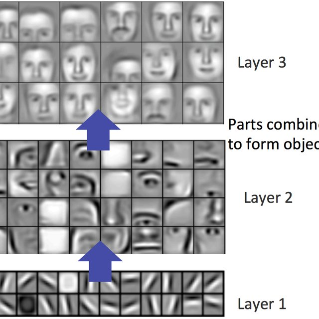

# 30 - 模型微调 Fine-tuning

---

### 🎦 本节课程视频地址 👇

[](https://www.bilibili.com/video/BV1Sb4y1d7CR)

## 为什么需要微调/迁移学习(Fine-tuning / Transfer Learning)

在实际工程应用中，需要深度学习模型对特定的任务具有良好的泛化性，如果从头训练该模型，则需要大量该任务专用的数据集才能使模型收敛到一个可接受的结果。但是这个体量的专用数据集的标注成本也会很高。



另一方面，例如在图像识别领域，已有许多在 ImageNet 等大规模数据集上训练好的模型，其**靠近底层的神经元**，经训练已具备基本的图像特征提取能力，这有助于识别边缘、纹理、形状和对象组合。我们可以在此模型基础上，使用相对少量的专有样本再训练，就可以得到比较好的结果。


## 微调

### 训练过程


- 在源数据集（例如 ImageNet 数据集）上预训练神经网络模型，即源模型。
- 创建一个新的神经网络模型，即目标模型。**复制源模型上的所有模型设计及其参数（输出层除外）**。我们假定这些模型参数包含从源数据集中学到的知识，这些知识也将适用于目标数据集。我们还假设源模型的输出层与源数据集的标签密切相关；因此不在目标模型中使用该层。
- 向目标模型添加输出层，其输出数是目标数据集中的类别数。然后随机初始化该层的模型参数。
- 在目标数据集（如椅子数据集）上训练目标模型。输出层将从头开始进行训练，而所有其他层的参数将根据源模型的参数进行微调。
- 是一个目标数据集上的正常训练任务，但使用**更强的正则化**
  - 使用**更小的学习率**
  - 使用**更少的数据迭代**
  - 使用**更少的 epoch**
- 源数据集远复杂于目标数据（例如相差 10 倍以上），通常微调效果更好

### 常用技术

#### 重用分类器权重

- 源数据集可能也有目标数据中的部分标号
- 可以使用预训练好模型分类器中对应标号对应的向量来做初始化

#### 固定一些层

- 神经网络通常学习有层次的特征表示
  - 低层次的特征更加通用
  - 高层次的特征则跟数据集相关
- 可以固定底部一些层的参数，不参与更新
  - 更强的正则

### 总结

- 微调通过使用在大数据集上得到的预训练好的模型来初始化模型权重来完成精度提升，相当于使用了**先验知识**，也相当于将模型初始化在一个距离最优解附近的一个“模型初始化”方法
- 预训练模型质量很重要（比如一般选择 ImageNet 上预训练的 ResNet50 等）
- 微调通常速度更快、精度更高

## 代码实现

- 载入数据集

```python
d2l.DATA_HUB['hotdog'] = (d2l.DATA_URL + 'hotdog.zip', 'fba480ffa8aa7e0febbb511d181409f899b9baa5')

data_dir = d2l.download_extract('hotdog')
# 使用datasets.ImageFolder载入数据集
train_imgs = torchvision.datasets.ImageFolder(os.path.join(data_dir, 'train'))
test_imgs = torchvision.datasets.ImageFolder(os.path.join(data_dir, 'test'))

hotdogs = [train_imgs[i][0] for i in range(8)]
not_hotdogs = [train_imgs[-i - 1][0] for i in range(8)]
#显示最后八张图片，写法可以参考
d2l.show_images(hotdogs + not_hotdogs, 2, 8, scale=1.4)
```


- 数据增广

```python
# 将tensor每个通道正则化为均值为[R,G,B]，方差为[a,b,c]
# 此操作是为适配ImageNet预训练模型的数据处理方法
normalize = torchvision.transforms.Normalize([0.485, 0.456, 0.406], [0.229, 0.224, 0.225])

# 适配ImageNet的尺寸（224x224）
train_augs = torchvision.transforms.Compose([
    torchvision.transforms.RandomResizedCrop(224),
    torchvision.transforms.RandomHorizontalFlip(),
    torchvision.transforms.ToTensor(), normalize
])
# 因为图像高宽比都不一样，所以先缩放在从中截取
test_augs = torchvision.transforms.Compose([
    torchvision.transforms.Resize(256),
    torchvision.transforms.CenterCrop(224),
    torchvision.transforms.ToTensor(), normalize
])
```

- 载入预训练模型

```python
# 提取训练模型&经验
# pretrained=True 载入预训练权重
pretrained_net = torchvision.models.resnet18(pretrained=True)
# 打印最后一层全连接层结构
pretrained_net.fc
# Out:
# Linear(in_features=512, out_features=1000, bias=True)
```

- 载入并初始化 fine-tune 模型

```python
finetune_net = torchvision.models.resnet18(pretrained=True)
#重定义全连接层，input_features不变，output_labels=2，表示二分类
finetune_net.fc = nn.Linear(finetune_net.fc.in_features, 2)
# 随机初始化FC层参数
nn.init.xavier_uniform_(finetune_net.fc.weight)
```

- 微调模型

```python
#定义训练函数
def train_fine_tuning(net, learning_rate, batch_size=128, num_epochs=5, param_group=True):
    # 载入训练数据集
    train_iter = torch.utils.data.DataLoader(torchvision.datasets.ImageFolder(
        os.path.join(data_dir, 'train'), transform=train_augs),
        batch_size=batch_size, shuffle=True)
    # 载入测试数据集
    test_iter = torch.utils.data.DataLoader(torchvision.datasets.ImageFolder(
        os.path.join(data_dir, 'test'), transform=test_augs),
        batch_size=batch_size)
    devices = d2l.try_all_gpus()
    loss = nn.CrossEntropyLoss(reduction="None")
    # 指定参数区分训练
    if param_group:
        #把非全连接层的参数提取出来
        params_1x = [param for name, param in net.named_parameters()
                   if name not in ["fc.weight", 'fc.bias']]
        # 指定不同层参数的学习率
        # 全连接层十倍学习率，使用权重衰减
        # SGD传入的是字典，keys是参数名称。
        # params: iterable of parameters to optimize or dicts defining parameter groups
        trainer = torch.optim.SGD([{'params': params_1x},
                                  {'params': net.fc.parameters(),
                                   'lr': learning_rate * 10}],
                                 lr=learning_rate, weight_decay=0.001)
    else:
        trainer = torch.optim.SGD(net.parameters(), lr=learning_rate, weight_decay=0.001)
    d2l.train_ch13(net, train_iter, test_iter, loss, trainer, num_epochs, devices)
```

- 开始微调

```python
train_fine_tuning(finetune_net, 5e-5)
# Out:
# loss 0.220, train acc 0.926, test acc 0.935
# 820.7 examples/sec on [device(type='cuda', index=0), device(type='cuda', index=1)]
```


## Pytorch 模块参考文档

- `torchvision.datasets.ImageFolder` torchvison 从文件夹内构造数据集方法 🧐[中文](https://pytorch-cn.readthedocs.io/zh/latest/torchvision/torchvision-datasets/#imagefolder) | [官方英文](https://pytorch.org/vision/stable/datasets.html#torchvision.datasets.DatasetFolder)
- `torchvision.transforms.Normalize` torchvison 中图片正则方法 🧐[中文](https://pytorch-cn.readthedocs.io/zh/latest/torchvision/torchvision-transform/) | [官方英文](http://pytorch.org/vision/main/generated/torchvision.transforms.Normalize.html)
- `torch.nn.init` Pytorch 参数初始化相关方法 🧐[中文](https://pytorch-cn.readthedocs.io/zh/latest/package_references/nn_init/) | [官方英文](https://pytorch.org/docs/stable/nn.init.html)
