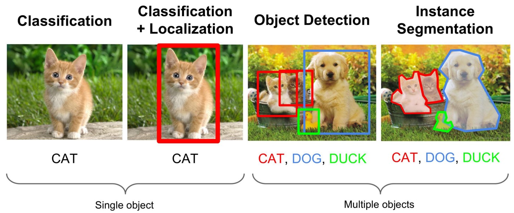

# 32 - 物体检测和数据集

---

### 🎦 本节课程视频地址 👇

[](https://www.bilibili.com/video/BV1Lh411Y7LX)

## 目标检测（Object Detection）

### 图片分类、目标检测和实例分割



图像分类任务中，我们假设图像中只有一个主要物体对象，我们只关注如何识别其类别。 然而，很多时候图像里有多个我们感兴趣的目标，我们不仅想知道它们的类别，还想得到它们在图像中的具体位置。 在计算机视觉里，我们将这类任务称为目标检测（object detection）或目标识别（object recognition）。

目标检测在多个领域中被广泛使用。 例如，在**无人驾驶**里，我们需要通过识别拍摄到的视频图像里的车辆、行人、道路和障碍物的位置来规划行进线路。 **机器人**也常通过该任务来检测感兴趣的目标。**安防领域**则需要检测异常目标，如歹徒或者炸弹。

### 边界框（bounding box）

一个边界框可以用 4 个数字定义

- 左上 x，左上 y，右下 x，右下 y
- 左上 x，左上 y，宽，高

目标识别的数据集通常比图片分类的数据集小很多。

### 目标检测数据集

- 每行表示一个物体，若一张图里有 n 个物体，则重复 n 行

  > 如：`图片文件名,物体类别,边缘框(x1,y1,x2,y2)`

- [COCO 数据集](cocodataset.org)

  > 80 类别，330K 图片，1.5M 物体

## 代码实现

```python
%matplotlib inline
import torch
from d2l import torch as d2l

d2l.set_figsize()
img = d2l.plt.imread('../Image/Lions.png')
d2l.plt.imshow(img)
```

- 定义两种边界框表示函数

```python
def box_corner_to_center(boxes):
    """从（左上，右下）转换到（中间，宽度，高度）"""
    x1, y1, x2, y2 = boxes[:, 0], boxes[:, 1], boxes[:, 2], boxes[:, 3]
    #行数>1,表示多个框
    cx = (x1 + x2) / 2
    cy = (y1 + y2) / 2
    w = x2 - x1
    h = y2 - y1
    boxes = torch.stack((cx, cy, w, h), axis=-1)
    #torch.stack(),tensor的concatenate
    #Concatenates a sequence of tensors along a new dimension.
    return boxes

def box_center_to_corner(boxes):
    """从（中间，宽度，高度）转换到（左上，右下）"""
    cx, cy, w, h =boxes[:, 0], boxes[:, 1], boxes[:, 2], boxes[:, 3]
    x1 = cx - 0.5 * w
    y1 = cy - 0.5 * h
    x2 = cx + 0.5 * w
    y2 = cy + 0.5 * h
    boxes = torch.stack((x1, y1, x2, y2), axis=-1)
    return boxes
```

我们将根据坐标信息定义图像中狗和猫的边界框。 图像中坐标的原点是图像的左上角，向右的方向为 x 轴的正方向，向下的方向为 y 轴的正方向。

```python
# bbox是边界框的英文缩写
dog_bbox, cat_bbox = [60.0, 45.0, 378.0, 516.0], [400.0, 112.0, 655.0, 493.0]

boxes = torch.tensor((dog_bbox, cat_bbox))
box_center_to_corner(box_corner_to_center(boxes)) == boxes
# Out:
# tensor([[True, True, True, True],
#         [True, True, True, True]])
```

- 画出边界框

```python
def bbox_to_rect(bbox, color):
    return d2l.plt.Rectangle(xy=(bbox[0], bbox[1]), width=bbox[2] - bbox[0],
                             height=bbox[3] - bbox[1], fill=False, edgecolor=color, linewidth=2)

fig = d2l.plt.imshow(img)
fig.axes.add_patch(bbox_to_rect(dog_bbox, 'blue'))
fig.axes.add_patch(bbox_to_rect(cat_bbox, 'red'))
```


- 目标检测数据集

```python
%matplotlib inline
import os
import pandas as pd
import torch
import torchvision
from d2l import torch as d2l

d2l.DATA_HUB['banana-dection'] = (
    d2l.DATA_URL + 'banana-detection.zip',
    '5de26c8fce5ccdea9f91267273464dc968d20d72')

def read_data_bananas(is_train=True):
    data_dir = d2l.download_extract('banana-detection', folder='../data')
    csv_fname = os.path.join('../data/banana-detection', 'bananas_train' if is_train else 'bananas_val', 'label.csv')
    csv_data = pd.read_csv(csv_fname)
    csv_data = csv_data.set_index('img_name')
    images, targets = [], []
    for img_name, target in csv_data.iterrows():
    #iterrows()进行行索引，返回索引和内容
        images.append(
            torchvision.io.read_image(
                os.path.join('../data/banana-detection', 'bananas_train' if is_train else
                             'bananas_val', 'images', f'{img_name}')))
            #Reads a JPEG or PNG image into a 3 dimensional RGB Tensor.
            #把图片张量加入images，也就是说把所有图片都读到内存里
            #因为数据集小
        targets.append(list(target))
        #把所识别内容加入targets
    return images, torch.tensor(targets).unsqueeze(1) / 256
    #unsqueeze(1)，在第一维增加维度
    #Returns a new tensor with a dimension of size one inserted at the specified position.
    #原来是df的(1000, 5)，现在是(1000, 1, 5)
    #target是香蕉的框
    #tensor(target)/256相当于把框正则化，变成关于一个像素的位置
```

- 创建自定义 Dataset 实例

```python
class BananasDataset(torch.utils.data.Dataset):
    def __init__(self, is_train):
        self.features, self.labels = read_data_bananas(is_train)
        print('read' + str(len(self.features)) + (f' training examples' if is_train else f' validation examples'))
        print(self.labels.shape)

    def __getitem__(self, idx):
    # __getitem__(self, idx)定义了类似于索引，去实现可索引的功能
    # 需要更复杂的逻辑去定义切片、顺序、步长等
        return (self.features[idx].float(), self.labels[idx])

    def __len__(self):
        return len(self.features)
```

- 定义数据迭代器

```python
def load_data_bananas(batch_size):
    train_iter = torch.utils.data.DataLoader(BananasDataset(is_train=True),
                                             batch_size, shuffle=True)
    val_iter = torch.utils.data.DataLoader(BananasDataset(is_train=False),
                                           batch_size)

    return train_iter, val_iter
```

- 测试

```python
batch_size, edge_size = 32, 256 #图片大小256
train_iter, _ = load_data_bananas(batch_size)
batch = next(iter(train_iter))
batch[0].shape, batch[1].shape
# Out:
# (torch.Size([32, 3, 256, 256]), torch.Size([32, 1, 5]))
# 训练iter(batch_size, RBG_channals, height, width)
# 标号iter(batch_size, 每张图片最多物体数, 标号+边界框4个坐标)

imgs = (batch[0][0:10].permute(0, 2, 3, 1)) / 255
#batch[0]是imgs
#permute()函数改变tensor的维度顺序
print(imgs.shape)
axes = d2l.show_images(imgs, 2, 5, scale=2)
#Plot a list of images.

for ax, label in zip(axes, batch[1][0:10]):
    #batch[1]是boxes,tensor.shape = (32, 1, 5)
    #bacth[1][0:10]就是前十个boxes
    #label.shape=(1, 5)
    d2l.show_bboxes(ax, [label[0][1:5] * edge_size], colors=['w'])
```

## Python 模块参考文档

- `matplotlib.axes.Axes.add_patch` Matplotlib 添加 Patch 到轴的补丁 🧐[中文](https://www.osgeo.cn/matplotlib/api/_as_gen/matplotlib.axes.Axes.add_patch.html) | [官方英文](https://matplotlib.org/stable/api/_as_gen/matplotlib.axes.Axes.add_patch.html)
- `torch.unsqueeze` Pytorch Tensor 在指定 dim 前插入维度 🧐[中文](https://pytorch-cn.readthedocs.io/zh/latest/package_references/torch/) | [官方英文](https://pytorch.org/docs/stable/generated/torch.unsqueeze.html#torch.unsqueeze)
- `torch.utils.data.DataLoader` Pytorch Dataloader 迭代器 🧐[中文](https://pytorch-cn.readthedocs.io/zh/latest/package_references/data/) | [官方英文](https://pytorch.org/docs/stable/data.html#torch.utils.data.DataLoader)

---

## Q&A🤓

**Q：怎样标注新的数据集并使用？**

**🙋‍♂️**：一般来说不用大规模的从头标注一个大数据集，通常会使用迁移模型，标注少量的目标数据集后，在已有的目标检测模型上做 fine-tuning，然后选出结果置信度不高的样本，再进行标注、微调，使用这种方式进行迭代直到效果满意为止。
