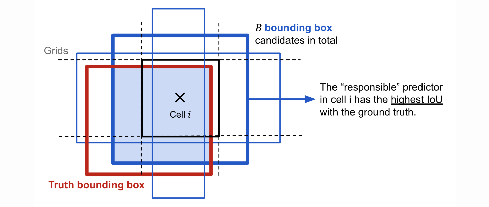
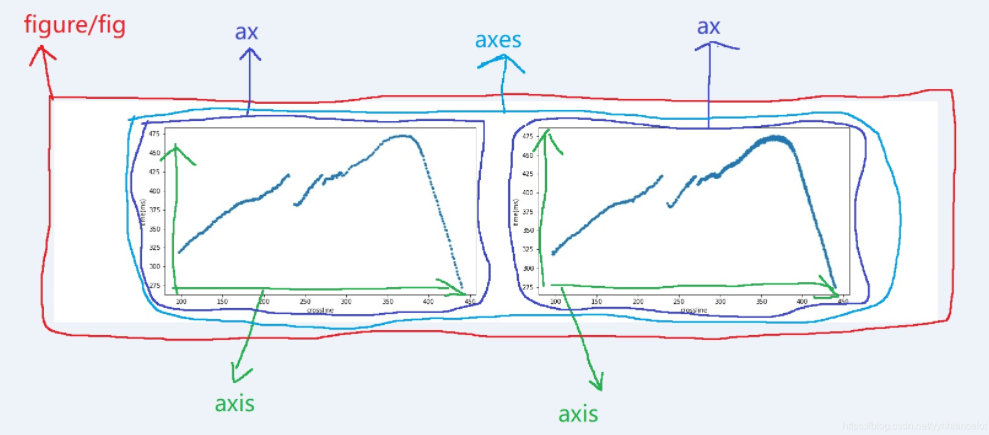
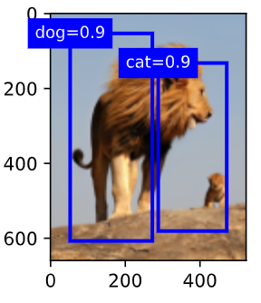

# 33 - 锚框

---

### 🎦 本节课程视频地址 👇

[](https://www.bilibili.com/video/BV1aB4y1K7za)

## 锚框(Anchor Box)

目标检测算法通常会在输入图像中采样大量的区域，然后判断这些区域中是否包含我们感兴趣的目标，并调整区域边界从而更准确地预测目标的真实边界框（ground-truth bounding box）。

一类目标检测算法是基于锚框

- 提出多个被称为锚框的区域（边缘框）
- 预测每个锚框里是否含有关注的物体
- 如果是，预测从这个锚框到真实边缘框的偏移
- 调整位置，找到真实的边缘框


> 如上图所示，蓝色的锚框效果是较好的，其效果衡量通常使用IoU（交并比）指标

### IoU - 交并比


- IoU 用于对比两个锚框之间的**相似度**
  - 0 表示无重叠，1 表示重合
- 这是 Jacquard 指数的一个特殊情况
  - 给定两个集合 A 和 B

$$J(A, B)={|A \bigcap B|\over|A \bigcup B|}$$



### 赋予锚框标号（训练）

- 将每个锚框视为一个训练样本
- 将每个锚框，要么标注成背景，要么关联上一个真实边缘框
  
  > 锚框组成：真实物体的标号（class） + 距离真实物体边界框的偏移（offset）

- 我们可能会生成大量的锚框（锚框多于边界框）

  > 这会导致大量的负类样本（背景）

一般使用矩阵表示，其中列表示**真实的边界框索引**（如下图所示，真实边界框为4个，一般为标注好的数据），行代表生成的**锚框索引**（下图所示锚框为9个，一般为固定生成或根据图片生成），元素填充锚框与边界框的**IoU值**。下图展示了如何赋予锚框标号的一种算法：


- 对上述矩阵取出**最大值**（如左侧图所示，最大值为$x_{23}$），所在行对应的锚框则与该边界框关联（`锚框2`与`边界框3`关联），并将该行与该列元素“抠除”
- 在上步“抠除”后的矩阵内重复以上操作（如中图，找到最大值$x_{71}$，关联`锚框7`与`边界框1`，继续抠除`行7列1`）
- 继续重复上述步骤，直到所有边界框关联完毕，最后遍历剩下的锚框，然后根据阈值确定是否为它们分配真实边界框

### 使用非极大值抑制(NMS)输出（预测）

- 每个锚框要预测一个边缘框
- NMS 可以合并相似的预测
  - 对于非背景类的锚框，选中针对某一类别最大预测值(softmax)的锚框（如蓝色的`dog=0.9`框）
  - 去掉所有其他和它 IoU 值大于阈值 $\theta$ 的预测锚框（如绿色、红色框）
  - 重复上述过程直到所有预测要么被选中，要么被去掉


### 总结

- 一类目标检测算法基于锚框来预测；
- 首先生成大量锚框。并赋予标号，每个锚框作为一个样本进行训练；
- 在预测时，使用 NMS 来去掉冗余的预测

## 代码实现

- 导入包

```python
%matplotlib inline
import torch
from d2l import torch as d2l

torch.set_printoptions(2)
# 精简作图精度
# Set options for printing. Items shamelessly taken from NumPy
# precision-Number of digits of precision for floating point output (default = 4)
```

> 关于 matplotlib 图表组成：


- 定义像素的锚框

假设输入图像的**高度**为 $h$，**宽度**为 $w$。 我们以图像的每个像素为中心生成不同形状的锚框：锚框占图像的**缩放比**为 $s\in (0,1]$ ，锚框**宽高比**为 $r>0$。则锚框的宽度和高度分别是$ws\sqrt r$和$hs/\sqrt r$。

对于$(h,w)$的图片，有$h\times w$个像素，在乘以所有$s,r$的组合$s\times r$，就有$h\times w\times s\times r$个锚框。

只考虑组合：

$$(s_1,r_1),(s_1,r_2),...,(s_1,r_m),(s_2,r_1),(s_3,r_1),...,(s_n,r_1)$$

也就是$s,r$各自最合理的一个取值与其他的做匹配

```python
def multibox_prior(data, sizes, ratios):
    # data就是指image_tensor
    # 提取图片高宽 660*524
    in_height, in_width = data.shape[-2:]
    device, num_sizes, num_ratios = data.device, len(sizes), len(ratios)
    boxes_per_pixel = (num_sizes + num_ratios - 1)
    # s
    size_tensor = torch.tensor(sizes, device=device)
    # ratio
    ratio_tensor = torch.tensor(ratios, device=device)
    # 为了将锚点移动到像素的中心，需要设置偏移量。
    # 因为一个像素的的高为1且宽为1，我们选择偏移我们的中心0.5
    offset_h, offset_w = 0.5, 0.5
    #宽高缩放步长
    steps_h = 1. / in_height
    steps_w = 1. / in_width
    # 生成锚框的所有中心点
    center_h = (torch.arange(in_height, device=device) + offset_h) * steps_h
    center_w = (torch.arange(in_width, device=device) + offset_w) * steps_w
    # 创造网格 (660, 524)
    shift_y, shift_x = torch.meshgrid(center_h, center_w)
    shift_y, shift_x = shift_y.reshape(-1), shift_x.reshape(-1)
    #reshape(-1)=reshape(1,-1)，横向铺满(1, 660*524=345840)

    w = torch.cat((size_tensor * torch.sqrt(ratio_tensor[0]),
                   sizes[0] * torch.sqrt(ratio_tensor[1:]))) \
    * in_height / in_width
    #s*根号r*h/w
    #\表示代码换行
    h = torch.cat((size_tensor / torch.sqrt(ratio_tensor[0]),
                   sizes[0] / torch.sqrt(ratio_tensor[1:])))
    #s/根号r

    anchor_manipulations = torch.stack((-w, -h, w, h)).T.repeat(in_height * in_width, 1) / 2
    #stack()默认按行堆积，cat()默认按行连接,4*5
    #T:5*4
    #repeat(): Repeats this tensor along the specified dimensions.
    #传入(m,n)，沿行赋值h*w,沿列复制1
    #赋值height行和width列
    #四个点的相对坐标复制到每个像素上
    #(5*660*524=1729200, 4)

    out_grid = torch.stack([shift_x, shift_y, shift_x, shift_y], dim=1).repeat_interleave(boxes_per_pixel, dim=0)
    #dim=1,按列并列，因为是一维张量(345840,4)
    #repeat_interleave()按照元素按行复制5遍(1729200, 4)
    #也就是每行先复制五遍，再复制下一行5遍
    output = out_grid + anchor_manipulations
    return output.unsqueeze(0)
```

<font color=red> 有两个问题：

- 定义边框宽高的算法，以及 s 和 r 的定义；
- 图片的宽高必须是互质的，才能保证 x, y 在分配的时候不重复，这里的情况显然有重复，宽高的公约数是 4，所以重复了 4 倍，或者说锚框少了 4 倍。
  </font>

- 按像素分块

```
img = d2l.plt.imread('../code/Image/Lions.png')
h, w = img.shape[:2]

print(h, w)
X = torch.rand(size=(1, 3, h, w))
Y = multibox_prior(X, sizes=[0.75, 0.5, 0.25], ratios=[1, 2, 0.5])

Y.shape

boxes = Y.reshape(h, w, 5, 4)
#reshape的时候从高维度先开始，先按列拿，再拿下一行；同样，先按列填，再填下一行格列
boxes[250, 250, :, :]
```

<font color=red>
这里的分块只是把 $ 5\times4$ 的锚框分配到每个像素的位置，但并不是与像素索引准确映射，便于视察
</font>

**绘制锚框**

```
def show_bboxes(axes, bboxes, labels=None, colors=None):
    def _make_list(obj, default_values=None):
        if obj is None:
            obj = default_values
        elif not isinstance(obj, (list, tuple)):
            obj = [obj]
        return obj

    #内置函数用_开头定义表明
    #虽然我可以被访问，但是，请把我视为私有变量，不要随意访问
    labels = _make_list(labels)
    colors = _make_list(colors, ['b', 'g', 'r', 'm', 'c'])
    #返回colors
    for i, bbox in enumerate(bboxes):
        color = colors[i % len(colors)]
        rect = d2l.bbox_to_rect(bbox.detach().numpy(), color)
        #Convert bounding box to matplotlib format
        axes.add_patch(rect)
        if labels and len(labels) > i:
            text_color = 'k' if color == 'w' else 'w'
            axes.text(rect.xy[0], rect.xy[1], labels[i],
                      va='center', ha='center', fontsize=9, color=text_color,
                      bbox=dict(facecolor=color, lw=0))
            #写文本框

d2l.set_figsize()
bbox_scale = torch.tensor((w, h, w, h))
#把框放大
fig = d2l.plt.imshow(img)

show_bboxes(fig.axes, boxes[250, 250, :, :] * bbox_scale,#取出对应点
            ['s=0.75, r=1', 's=0.5, r=1', 's=0.25, r=1', 's=0.75, r=2',
             's=0.75, r=0.5'])

```


**求 IoU**


```
def box_iou(boxes1, boxes2):
    box_area = lambda boxes: ((boxes[:, 2] - boxes[:, 0]) *
                              (boxes[:, 3] - boxes[:, 1]))
            #(x2-x1)(y2-y1)
    areas1 = box_area(boxes1)#(5, 1)
    areas2 = box_area(boxes2)#(5, 1)

    inter_upperlefts = torch.max(boxes1[:, None, :2], boxes2[:, :2])
    inter_lowerrights = torch.min(boxes1[:, None, 2:], boxes2[:, 2:])
    #切片里的None相当于在该位置增加一个维度
    #做运算要在同一维度上，有高到低
    #也就是说，boxes1.slice=(5, 1, 2), boxes.slice=(5, 2),
    #用(1, 2)和(5, 2)做广播，再用第二组，直到第五组
    #最终形状(5, 5, 2)，代表一个点的五个锚框与另一个点的五个锚框左上、右下的极小、极大值

    #事实上，图片坐标y轴是反向，所以左上和右下的极小极大是内测的点
    inters = (inter_lowerrights - inter_upperlefts).clamp(min=0)
    #clamp()定义了分段函数上下限,防止两个框不重合而出现负值
    #换言之，inter本就是0
    #shape(5, 5, 2)

    inter_areas = inters[:, :, 0] * inters[:, :, 1]
    #算交集(5, 5, 1)
    union_areas = areas1[:, None] + areas2 - inter_areas
    #算并集(5, 1, 1)+(5, 1) - (5, 5, 1)=(5, 5, 1)
    return inter_areas / union_areas
```


**给边界框分配锚框**

```
def assign_anchor_to_bbox(ground_truth, anchors, device ,iou_threshold=0.5):
    #ground_truth真实边界框
    num_anchors, num_gt_boxes = anchors.shape[0], ground_truth.shape[0]
    jaccard = box_iou(anchors, ground_truth)
    #(num_anchors, num_gt_boxes, 1)
    anchors_bbox_map = torch.full((num_anchors,), -1, dtype=torch.long, device= device)
    #torch.full():Creates a tensor of size size filled with fill_value. The tensor’s dtype is inferred from fill_value.
    #(num_anchors,)表示创建长度为num_anchors的一维tuple,填充-1
    max_ious, indices = torch.max(jaccard, dim=1)
    #Returns a namedtuple (values, indices)
    #where values is the maximum value of each row of the input tensor in the given dimension dim.
    #And indices is the index location of each maximum value found (argmax).
    #当把max()作用于高维度张量时，返回该维度的矩阵每一行的最大值和索引值
    #也就是说这里返回每个锚框对于所有边界框的最大iou和对应的边界框标号
    #max_ious/indices.shape=(num_anchors, 1)
    anc_i = torch.nonzero(max_ious >= 0.5).reshape(-1)
    #对于大于0.5的iou,返回True
    #nonzero()返回张量非零值的索引，是一个二维张量，内部维度存储索引
    #reshape(-1)=reshape(1,-1),铺平，变成一维
    #也就是各个符合要求的锚框的标号
    box_j = indices[max_ious >= 0.5]
    #用bool作为索引，返回True所在位置的索引
    #A= [[1], [2], [3]], B = [[True], [False], [True]],
    #A[B]==[A[0],A[2]]==[[1],[3]]
    #此处就是返回大于0.5的锚框的索引

    ##anc_i和 box[j]找到到达threshold的锚框以及与其映射的边界框
    anchors_bbox_map[anc_i] = box_j
    #把num_anch*[-1]的向量，非负锚框位置替换为对应边界框的标号，其余依旧为负类
    col_discard = torch.full((num_anchors,), -1)
    #num_anchors*[-1]
    row_discard = torch.full((num_gt_boxes,), -1)
    #num_gt_boxes*[-1]
    for _ in range(num_gt_boxes):
        max_idx = torch.argmax(jaccard)
        #torch.argmax如果不指定维度，就所有元素排成一行，取最大位置
        box_idx = (max_idx % num_gt_boxes).long()
        #long()将数字或字符串转换为一个长整型 ==》找到最大值所在列，即边界框序号
        anc_idx = (max_idx / num_gt_boxes).long()
        #对于一个float,去小数部分取整 ==》找到最大值所在行，即锚框序号
        anchors_bbox_map[anc_idx] = box_idx #把锚框位置的（-1）换做边界框的号
        jaccard[:, box_idx] = col_discard #把所在列重新赋值为负类
        jaccard[anc_idx, :] = row_discard #把所在行重新赋值为负类
    return anchors_bbox_map
    # 遍历结束 anchors_bbox_map.shape=(num_anchors, 1)，某个gt所在行标号与对应gt映射，其余为-1。
```

<font color=red>
在 for loop 之前的代码并没有实际用到，相当于一种补充算法，保证相关度有一个阈值，而且产生了一个bug——循环之前对所有锚框做了阈值映射，但在循环中重新映射的时候前面已经赋值的anchors_bbox_map没有被完全覆盖，所以对于同一个边界框，有不止一个锚框的映射。
</font>

关于多维度张量计算:


**锚框与边界框偏移拟合**

做 Normalize，并且方差较大，分散样本，便于计算

假设一个锚框 A 被分配了一个真实边界框 B 。 一方面，锚框 A 的类别将被标记为与 B 相同。 另一方面，锚框 A 的偏移量将根据 B 和 A 中心坐标的相对位置以及这两个框的相对大小进行标记。 鉴于数据集内不同的框的位置和大小不同，我们可以对那些相对位置和大小应用变换，使其获得分布更均匀且易于拟合的偏移量。给定框 A 和 B ，中心坐标分别为 $(x_a,y_a)$ 和 $(x_b,y_b)$ ，宽度分别为 $w_a$ 和 $w_b$ ，高度分别为 $h_a$ 和 $h_b$ 。 我们可以将 A 的偏移量标记为:

$$\left({{x_b-x_a\over w_a}-\mu_x\over \sigma_x},{{y_b-y_a\over h_a}-\mu_y\over \sigma_y},{\log{w_b\over w_a}-\mu_w\over\sigma_w},{\log{h_b\over h_a}-\mu_h\over\sigma_h}\right)$$

通常
$\mu_x=\mu_y=\mu_w=\mu_h=0$
$\sigma_x=\sigma_y=0.1,\ \sigma_w=\sigma_h=0.2$

```
#anchors.shape=(num_anchors=num_gt, 4)
def offset_boxes(anchors, assigned_bb, eps=1e-6):
   c_anc = d2l.box_corner_to_center(anchors)
   #中心法表示锚框四维
   c_assigned_bb = d2l.box_corner_to_center(assigned_bb)
   #中心法表示映射边界框四维
   offset_xy = 10 * (c_assigned_bb[:, :2] - c_anc[:, :2]) / c_anc[:, 2:]
   ##偏移计算 /sigma=0.1=> *10
   offset_wh = 5 * torch.log(eps + c_assigned_bb[:, 2:] / c_anc[:, 2:])
   ## /sigma=0.2 => *5
   offset = torch.cat([offset_xy, offset_wh], axis=1)
   ##cat()按维度连接，也就是在该维度上做出改变。
   ##axis和dim可以互换
   ##off_set.shape=(num_gt, 4)
   return offset

def multibox_target(anchors, labels):
   #labels=边界框标号
   batch_size, anchors = labels.shape[0], anchors.squeeze(0)
   #labels.shape[0]就是一次传入的文件批量，如果没有多余（为1）维度，就返回本身
   #squeeze(0)降低维度
   batch_offset, batch_mask, batch_class_labels = [], [], []
   device, num_anchors = anchors.device, anchors.shape[0]

   for i in range(batch_size):
       label = labels[i, :, :]
       #返回标号（物体数量），或者说边界框的数量和四维
       anchors_bbox_map = assign_anchor_to_bbox(
           label[:, 1:], anchors, device)
       #第一个特征是物体类别，并不需要，所以只取出四维
       #求出与锚框的映射
       bbox_mask = ((anchors_bbox_map >= 0).float().unsqueeze(-1)).repeat(
           1, 4)
       #求出正类，再把bool转化为浮点数(0., 1.),shape=(num_anchors, 1)
       #再沿列复制，shape(num_anchors, 4)
       class_labels = torch.zeros(num_anchors, dtype=torch.long,
                                  device=device)
       #num_anchors*(0)向量
       assigned_bb = torch.zeros((num_anchors, 4), dtype=torch.float32,
                                 device=device)
       #(num_anchors,4) * 0二维张量
       indices_true = torch.nonzero(anchors_bbox_map >= 0)
       #返回正类在anchors向量里的索引
       bb_idx = anchors_bbox_map[indices_true]
       #把正类索引的值提取出来，也就是所映射真实边界框的标号
       class_labels[indices_true] = label[bb_idx, 0].long() + 1
       #前面定义的全0向量,把被映射边界框对应物体类型(切片[0]) + 1赋值给它，在打印的时候不至于出现第0类。
       assigned_bb[indices_true] = label[bb_idx, 1:]
       #把映射gt的4维映射给锚框

       offset = offset_boxes(anchors, assigned_bb) * bbox_mask
       #求出偏移，把负类的偏移值全部清零
       batch_offset.append(offset.reshape(-1))
       #reshape(-1)=reshape(1,-1),铺平，变成一维, 4*num_anchors向量
       #在列表里加张量
       batch_mask.append(bbox_mask.reshape(-1))
       #reshape(-1)=reshape(1,-1),铺平，变成一维, 4*num_anchors向量，有映射为4*1，无映射为4*0
       batch_class_labels.append(class_labels)
       #num_anchors长度向量，有映射索引为物体类型+1，其余为0
   bbox_offset = torch.stack(batch_offset)
   # 把原列表batch_offset变成(batch_size, 4*num_anchors)的二维张量bbox_offset
   bbox_mask = torch.stack(batch_mask)
   # 把原列表batch_mask变成(batch_size, 4*num_anchors)的二维张量bbox_mask，有映射为4*1，无映射为4*0
   class_labels = torch.stack(batch_class_labels)
   #把原列表batch_class_labels变成(batch_size, num_anchors)的二维张量class_labels，有映射索引为物体类型+1，其余为0
   return (bbox_offset, bbox_mask, class_labels)
   # stack()可以把列表/元组里的张量元素沿一个维度合并成一个张量
```

**栗子**

```
ground_truth = torch.tensor([[0, 0.1, 0.08, 0.52, 0.92],
                         [1, 0.55, 0.2, 0.9, 0.88]])
anchors = torch.tensor([[0, 0.1, 0.2, 0.3], [0.15, 0.2, 0.4, 0.4],
                    [0.63, 0.05, 0.88, 0.98], [0.66, 0.45, 0.8, 0.8],
                    [0.57, 0.3, 0.92, 0.9]])

fig = d2l.plt.imshow(img)
show_bboxes(fig.axes, ground_truth[:, 1:] * bbox_scale, ['dog', 'cat'], 'k')
show_bboxes(fig.axes, anchors * bbox_scale, ['0', '1', '2', '3', '4']);
labels = multibox_target(anchors.unsqueeze(dim=0),
                         ground_truth.unsqueeze(dim=0))
#unsqueeze(dim=0)表示添加一个维度批量大小，因为只传了一张图，所以是1
#对应函数里的anchors.squeeze(0)
#返回长度为bbox_offset=20，
labels[2], labels[0]
```


**用最大抑制化简**

```
#根据预测值逆求边界框位置
def offset_inverse(anchors, offset_preds):

    anc = d2l.box_corner_to_center(anchors)
    #变成中心4维
    pred_bbox_xy = (offset_preds[:, :2] * anc[:, 2:] / 10) + anc[:, :2]
    pred_bbox_wh = torch.exp(offset_preds[:, 2:] / 5) * anc[:, 2:]
    pred_bbox = torch.cat((pred_bbox_xy, pred_bbox_wh), axis=1)
    predicted_bbox = d2l.box_center_to_corner(pred_bbox)
    #返回预测的边界框位置
    #shape=(num_boxes, 4)
    return predicted_bbox
```

```
#最大抑制筛选函数
def nms(boxes, scores, iou_threshold):
    #socres是预测该锚框属于某个边界框的置信度

    B = torch.argsort(scores, dim=-1, descending=True)
    #argsort()对于张量元素排序，返回索引排序，默认从低到高， descending_default=True
    keep = []
    while B.numel() > 0:
        i = B[0]
        keep.append(i)
        if B.numel() == 1: break
        iou = box_iou(boxes[i, :].reshape(-1, 4), #变成行向量
                      boxes[B[1:], :].reshape(-1, 4)).reshape(-1)#变成行向量len=(num_boxes-1)
        inds = torch.nonzero(iou <= iou_threshold).reshape(-1)#把重叠度小于阈值的索引拿出来
        B = B[inds + 1]#因为拿出去的索引不包含B[0]
    return torch.tensor(keep, device=boxes.device) #返回与其他都不重合的boxes的索引
```

```
#最大抑制应用函数

def multibox_detection(cls_probs, offset_preds, anchors, nms_threshold=0.5,
                       pos_threshold=0.009999999):
    #cls_probs传入(batch_size, labels, scores)
    #offset_preds偏移预测结果
    device, batch_size = cls_probs.device, cls_probs.shape[0]
    anchors = anchors.squeeze(0) #加入通道项
    num_classes, num_anchors = cls_probs.shape[1], cls_probs.shape[2]
    #num_classes类别数=边界框数，num_anchors每个物体的边界框数
    out = []
    for i in range(batch_size):
        cls_prob, offset_pred = cls_probs[i], offset_preds[i].reshape(-1, 4)
        #每张图的预测(labels, boxes, 4d)

        conf, class_id = torch.max(cls_prob[1:], 0) #dim=0
        #每个锚框对于每个类别的最大预测，以及对应类别的index

        predicted_bb = offset_inverse(anchors, offset_pred)
        #返回边界框四维
        keep = nms(predicted_bb, conf, nms_threshold)
        #得到还有用的锚框


        all_idx = torch.arange(num_anchors, dtype=torch.long, device=device)
        combined = torch.cat((keep, all_idx))
        #连接有用和所有
        uniques, counts = combined.unique(return_counts=True)
        #返回batchsize长度向量，以及每个box出现的次数
        non_keep = uniques[counts == 1]
        #把只出现一次的锚框编号拿出来
        all_id_sorted = torch.cat((keep, non_keep))
        #把有用的和没用的连接
        class_id[non_keep] = -1
        #把没用的标记成负类
        #把索引的标号做成tensor，可以按顺序提取对应元素组成新的tensor
        class_id = class_id[all_id_sorted]
        #再按照有用的顺序排列，把负类放在最后
        conf, predicted_bb = conf[all_id_sorted], predicted_bb[all_id_sorted]
        #把这两个也按顺序排
        below_min_idx = (conf < pos_threshold)
        #pos_threshold是背景类的阈值
        class_id[below_min_idx] = -1
        #bool作为索引，就是索引True的位置，False就忽略
        #把背景类也标记成-1
        conf[below_min_idx] = 1 - conf[below_min_idx]
        pred_info = torch.cat((class_id.unsqueeze(1),
                               conf.unsqueeze(1),
                               predicted_bb), dim=1)
        #按列连接，[类别，置信率，边界框四维]
        out.append(pred_info)
    return torch.stack(out)
```

**再一个栗子**
<font color=red>我不太理解 cls_probs 第一行全零代表什么</font>

```
anchors = torch.tensor([[0.1, 0.08, 0.52, 0.92], [0.08, 0.2, 0.56, 0.95],
                      [0.15, 0.3, 0.62, 0.91], [0.55, 0.2, 0.9, 0.88]])
offset_preds = torch.tensor([0] * anchors.numel())
cls_probs = torch.tensor([[0] * 4,
                      [0.9, 0.8, 0.7, 0.1],
                      [0.1, 0.2, 0.3, 0.9]])

fig = d2l.plt.imshow(img)
show_bboxes(fig.axes, anchors * bbox_scale,
            ['dog=0.9', 'dog=0.8', 'dog=0.7', 'cat=0.9'])

output = multibox_detection(cls_probs.unsqueeze(dim=0),
                            offset_preds.unsqueeze(dim=0),
                            anchors.unsqueeze(dim=0),
                            nms_threshold=0.5)
output

fig = d2l.plt.imshow(img)
for i in output[0].detach().numpy():
    if i[0] == -1:
        continue
    #忽略负类
    label = ('dog=', 'cat=')[int(i[0])] + str(i[1])
    #类别+置信率
    show_bboxes(fig.axes, [torch.tensor(i[2:]) * bbox_scale], label)
```




## Python 模块参考文档

- `torch.meshgrid` Pytorch生成网格方法 🧐[中文](https://www.osgeo.cn/matplotlib/api/_as_gen/matplotlib.axes.Axes.add_patch.html) | [官方英文](https://pytorch.org/docs/stable/generated/torch.meshgrid.html?highlight=meshgrid)