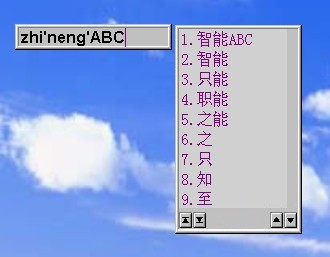
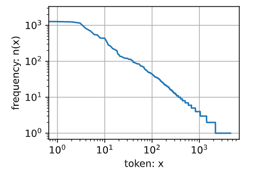
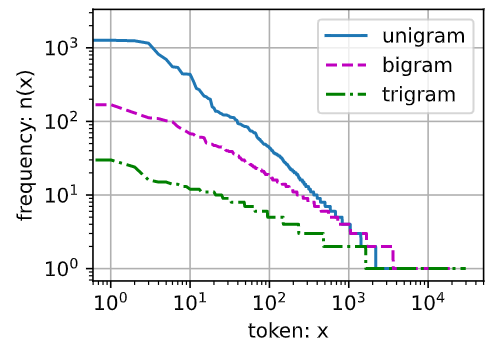

# 42 - 语言模型

---

### 🎦 本节课程视频地址 👇

[](https://www.bilibili.com/video/BV1ZX4y1F7K3)

## 语言模型

- 目前的语言模型，主要思路是给定文本序列 $x_1,...,x_T$，目标为估计其出现的**联合概率** $p(x_1,...,x_T)$
- 联合概率可用于：
  - 做**预训练模型**去 Fine-tune(eg [BERT](57-BERT.md), GPT-3)
  - 生成本文，给定前面几个词，不断地使用 $x_t \thicksim p(x_t|x_1,...,x_{t-1})$，生成后续文本
  - 判断多个序列中哪个更常见
    - 在语音识别领域，e.g. "to recognize a speech" vs "to wreck a nice beach"，对于两个发音相近的句子，语言模型可以预测其可能性(合理性)。
    - 输入法领域也是类似，给定一个键盘输入序列，判断哪种输出更常见

这个领域的重要发展，最早是由 MIT 科学家，后领导了著名的 IBM Watson 实验室的弗里德里克·贾里尼克（Frederick Jelinek，[wiki](https://en.wiki.hancel.org/wiki/Frederick_Jelinek)）提出将**信息论**与**统计方法**成功应用于解决语音识别问题后，带来的整个 NLP 领域方法论的革新。李开复也是贾里尼克的学生。

> 本节课沐神讲的连贯性不是特别好，如果还想了解语言模型相关案例，强烈推荐童鞋阅读吴军老师的科普书《数学之美》第三章，对语言模型的前世今生、工业界（Google）的发展应用都有十分生动有趣的介绍 👇


## 使用计数来建模

> 这里将计数频率等价于概率有前提，那就是“**大数定律**”，要求语料要足够大

- 假设序列长度为 2，我们预测联合概率

  $$p(x,x')=p(x)p(x'|x)={n(x)\over n}{n(x,x')\over n(x)}$$

  > $n$ 是总词数， $n(x),n(x,x')$ 是单个单词和连续单词对（一前一后）的出现次数

- 很容易拓展到长为 3 的情况

  $$p(x,x',x'')=p(x)p(x'|x)p(x''|x,x')={n(x)\over n}{n(x,x')\over n(x)}{n(x,x',x'')\over n(x,x')}$$

通过扫一遍整个语料库，统计该序列中每个词和其与几个词一起出现的次数，根据大数定律，就可以计算出上述联合概率。不过理论上虽然可行，但当要求的序列很长时（比如一个长句），因为搜集语料库成本所限，文本量不够大，很可能造成 $n(x_1,...,x_T)$接近于零而无法计算得到该序列的联合概率。

## N 元模型（N-gram Model）

使用**马尔可夫假设**可以缓解这个问题，该假设可将问题简化为当前词概率只与前一个词（或几个词）有关，与其他词无关，这就避免了求长难句序列的联合概率。虽然该方法丧失了精确性，但是在数学中也广泛应用，效果也不错，不失一种对复杂问题近似逼近的方法。

> 特别的，当只与前一个词有关时，叫做二元模型（Bigram Model），与前两个词有关，叫三元模型，与前 N-1 个词有关，则称为 N 元模型（N-gram Model），马尔可夫假设与真实情况的精度差可以随着 N 的增大而减小。

以计算序列长为4的联合概率为例，使用条件概率展开：

- 一元模型，即上下文无关：$\tau=0$

$$
  \begin{aligned}
      p(x_1,x_2,x_3,x_4)
      &=p(x_1)p(x_2)p(x_3)p(x_4)\\ \\
      &={n(x_1)\over n}{n(x_2)\over n}{n(x_3)\over n}{n(x_4)\over n}
  \end{aligned}
$$

- 二元模型，只与前一个词相关：$\tau=1$

  $$
  \begin{aligned}
      p(x_1,x_2,x_3,x_4)
      &=p(x_1)p(x_2|x_1)p(x_3|x_2)p(x_4|x_3)\\ \\
      &={n(x_1)\over n}{n(x_1,x_2)\over n(x_1)}{n(x_2,x_3)\over n(x_2)}{n(x_3,x_4)\over n(x_3)}
  \end{aligned}
  $$

- 三元模型，只与前两个词相关： $\tau=2$

  $$
  \begin{aligned}
      p(x_1,x_2,x_3,x_4)
      &=p(x_1)p(x_2|x_1)p(x_3|x_1,x_2)p(x_4|x_2,x_3)\\ \\
      &={n(x_1)\over n}{n(x_1,x_2)\over n(x_1)}{n(x_1,x_2,x_3)\over n(x_1,x_2)}{n(x_2,x_3,x_4)\over n(x_2,x_3)}
  \end{aligned}
  $$

N 元模型相比直接计数来算联合概率的方法，优势在于可以简便计算来近似得到长序列的概率。

以二元模型为例，近似计算联合概率时，扫一遍语料库，只需要存储一个二元词组$n(x_i,x_{i-1})$和单词$n(x_i)$出现的频数即可近似计算其联合概率。

N 元语法的空间复杂度与 N 的取值是指数关系，即$O(|V|^N)$，这里$|V|$表示一个语言的词汇量。在计算机性能不高的年代，N 取值都不会很大，大家曾经如果用过老式输入法如**智能 ABC**（暴露年龄了…👴）就会秒懂，在输入句子时，大多数情况也只能两个字、两个字地往外蹦，推测用的就是二元模型。



后期随着计算机性能的提高，输入法使用的 N 才稍稍增大（但也不会很大，不然下载个输入法媲美 3A 大作游戏的体积你是不会答应的 🈲），现代输入法也新增“**云输入**”的功能，通过在本地输入法运行一个小 N 模型，在云端运行一个大 N 模型，来解决输入长难句的需求。


### 总结

- 语言模型估计文本序列的联合概率
- 使用统计方法时常用 N 元模型（N-gram Model）来近似得到联合概率

## 代码实现

- 观测数据

```python
import random
import torch
from d2l import torch as d2l

# 读取并分词语料，形成token二维嵌套列表，一级元素为每行的分词列表
tokens = d2l.tokenize(d2l.read_time_machine())
# 将嵌套列表展平为一维列表，每个元素为整个语料分词结果
corpus = [token for line in tokens for token in line]
vocab = d2l.Vocab(corpus)
# 取出出现频率前10的词频结果
vocab.token_freqs[:10]
# Out: [('the',2261),(i,1267),('and',1245)……]

# 提取频数放到列表中
freqs = [freq for token, freq in vocab.token_freqs]
#单词按索引标号排序，作为x轴
d2l.plot(freqs, xlabel='token: x', ylabel='frequency: n(x)',
         xscale='log', yscale='log')
```

> 语言序列也符合二八定律，出现十次的词不超过二三百，剩下的千余词出现频率很少



- 二元模型词频统计

```python
# 这里构造方法很巧妙，起到了类似滑动窗口的效果
# 把相同的两个corpus去掉最后一个和第一个词，使得tokens错开一位，做两两zip()打包
# 相当于构建出前后两两在一起的词对pair
bigram_tokens = [pair for pair in zip(corpus[:-1], corpus[1:])]
# 给Vocab创建一个二元词典，Vocab接受一个tokens分词列表
bigram_vocab = d2l.Vocab(bigram_tokens)
# 取出词频前10的二元词组
bigram_vocab.token_freqs[:10]
# Out:
# [(('of','the'),309),
#  (('in','the'),169),
#  (('i','had'),130),……]
```

- 三元模型词频统计

```python
# 以相同方法构造三元词组
trigram_tokens = [triple for triple in zip(
    corpus[:-2], corpus[1:-1], corpus[2:])]
trigram_vocab = d2l.Vocab(trigram_tokens)
trigram_vocab.token_freqs[:10]
# Out:
# [(('the','time','traveller'),59),
#  (('the','time','machine'),30),
#  (('it','seemed','to'),16),……]
```

- 对比一元、二元、三元词频统计

```python
bigram_freqs = [freq for token, freq in bigram_vocab.token_freqs]
#因为返回的是字典key-value元组，所以必须用两个变量去接
trigram_freqs = [freq for token, freq in trigram_vocab.token_freqs]
d2l.plot([freqs, bigram_freqs, trigram_freqs], xlabel='token: x',
         ylabel='frequency: n(x)', xscale='log', yscale='log',
         legend=['unigram', 'bigram', 'trigram'])
```



> 可以看出，N 元词频都是对数关系，随着，随着 N 的增大，词频下降很快，所以对语料库$|V|$的大小要求也在增大，语料库太小，则大的 N-gram 无法得到有效训练。如果增大语料库$|V|$大小，根据上文介绍，复杂度又是$|V|$的$N$的指数，所以根据以上分析，大量词的词频都是比较少的，可以将词频数小于某个阈值的词删掉，来降低模型复杂度。

> Stop words（停止词）
>
> 还有一个途径，NLP 中为保证效率，根据信息论，过滤掉的所含信息量很低（出现频率很高）的词，一般是指无意义的定冠词，不定冠词（a,an,the）, 连接词（of,but...）

- 子序列采样


- 定义随机序列生成函数

用一种随机分割的方式决定起始位置，随机生成一个小批量数据的特征和标签以供读取。在随机采样中，每个样本都是在原始的长序列上任意捕获的子序列。

```python
# corpus：tokens列表，num_step：s时间假设t,或者马尔可夫假设的tau
def seq_data_iter_random(corpus, batch_size, num_steps):
    # 从index=0~num_step-1区间随机抽样索引点，取出索引点后的语料
    # 索引点前面的抛弃
    corpus = corpus[random.randint(0, num_steps - 1):]
    # 整除来计算能够生成子序列的份数数
    num_subseqs = (len(corpus) - 1) // num_steps
    """
    初始化索引列表，从掐头的corpus的第一个token（index=0）开始，
    到len(corpus) - 1结束，步长为num_steps=tau
    也就是每隔tau个取一个作为索引，共有num_subseqs个索引
    """
    initial_indices = list(range(0, num_subseqs * num_steps, num_steps))
    # 每次执行此函数时随机打乱分割索引下标
    random.shuffle(initial_indices)

    # 返回从pos索引开始长度为num_steps的序列
    def data(pos):
        return corpus[pos: pos + num_steps]

    #每个batch的子序列数量
    num_batches = num_subseqs // batch_size

    # 遍历每个batch
    for i in range(0, batch_size * num_batches, batch_size):
        # 把每个batch里分割序列的索引点下标拿出来
        initial_indices_per_batch = initial_indices[i: i + batch_size]
        # 提取分割点的连续token列表
        X = [data(j) for j in initial_indices_per_batch]
        # 错一位token提取分割点的连续token列表
        Y = [data(j + 1) for j in initial_indices_per_batch]
        #每次返回一个batch的子序列
        #对于一个三元序列
        #用X[0]预测Y[0];X[0],X[1]预测Y[1];X[1],X[2]预测Y[2];X[2],X[3]预测Y[3];X[3],X[4]预测Y[4];
        #Y就是labels
        yield torch.tensor(X), torch.tensor(Y)
```

- 测试以 0 到 34 的序列为示例语料库，抽取`batch_size=2`，`num_steps=5`的 batch

```python
my_seq = list(range(35))
# 现在0-4里取一个掐头
# 长为35的序列，如以步长=5可分为6个子序列
# 打乱分成6/2=3个batch，每个batch有两个子序列
# 再提取每个batch里的所有元素
for X, Y in seq_data_iter_random(my_seq, batch_size=2, num_steps=5):
    print('X: ', X, '\nY:', Y)
# Out:
# X: tensor([[23,24,25,26,27],
#            [8,9.10,11,12]])
# Y: tensor([[24,25,26,27,28],
#            [9.10,11,12,13]])
# ……
```

- 定义另一种随机取样函数，保证每个小批量的第 i 个元素和下一个小批量的第 i 个元素在原始文本上的相邻

```python
def seq_data_iter_sequential(corpus, batch_size, num_steps):
    # 随机生成0~num_steps之间的偏移点
    offset = random.randint(0, num_steps)
    num_tokens = ((len(corpus) - offset - 1) // batch_size) * batch_size
    Xs = torch.tensor(corpus[offset: offset + num_tokens])
    Ys = torch.tensor(corpus[offset + 1: offset + 1 + num_tokens])
    #X和Y相差一个token
    Xs, Ys = Xs.reshape(batch_size, -1), Ys.reshape(batch_size, -1)
    # 求出一个batch里有多少个子序列
    num_batches = Xs.shape[1] // num_steps
    # 遍历batch
    for i in range(0, num_steps * num_batches, num_steps):
        #通过定义步长可以跳着索引
        #决定每个batch的起始位置
        #按顺序取token
        X = Xs[:, i: i + num_steps]
        Y = Ys[:, i: i + num_steps]
        #把return改成yield,就是一个生成器，每次返回一个batch，每个batch只有一个子序列
        yield X, Y
```

- 生成效果，每个 batch 里的序列开始位置都是接上个 batch 序列的结束

```python
for X, Y in seq_data_iter_sequential(my_seq, batch_size=2, num_steps=5):
    #生成器里的for-loop已经分割好了batch，这里的for-loop是返回所有的batch
    print('X: ', X, '\nY:', Y)
# Out:
# X: tensor([[4,5,6,7,8],
#            [19,20.21,22,23]])
# Y: tensor([[9,10,11,12,13],
#            [20.21,22,23,24]])
# ……
```

- 将以上两种采样函数包装到一个类中

```python
class SeqDataLoader:
    """加载序列数据的迭代器"""
    def __init__(self, batch_size, num_steps, use_random_iter, max_tokens):
        if use_random_iter:
            self.data_iter_fn = d2l.seq_data_iter_random
        else:
            self.data_iter_fn = d2l.seq_data_iter_sequential
        self.corpus, self.vocab = d2l.load_corpus_time_machine(max_tokens)
        self.batch_size, self.num_steps = batch_size, num_steps

    def __iter__(self):
        #__iter__()可一让实例成为可迭代对象
        #定义__next__()可以获得其返回值
        #这里iter返回的本身就是一个生成器self.data_iter_fn()，所以不需要定义next
        #可以理解为for _ in self.data_iter_fn()
        return self.data_iter_fn(self.corpus, self.batch_size, self.num_steps)
        # 返回批量
```

> 输入是原始的 token 和步长、批量等，返回批量，类就很方便地封装了中间的功能

- 定义`load_data_time_machine`函数，返回数据迭代器和 Vocab

```python
def load_data_time_machine(batch_size, num_steps, use_random_iter=False, max_tokens=10000):
    data_iter = SeqDataLoader(batch_size, num_steps, use_random_iter, max_tokens)
    return data_iter, data_iter.vocab
```
