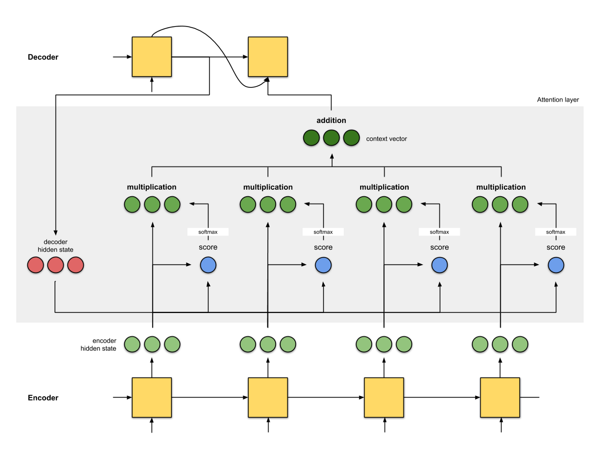
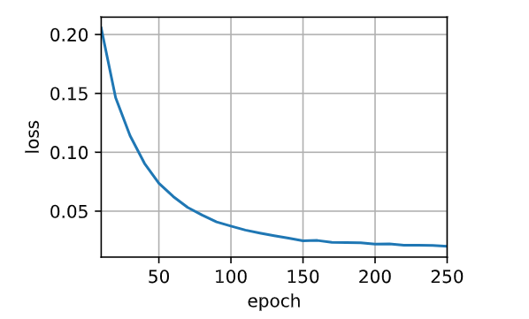

## 使用注意力机制的seq2seq

### 理论学习

**动机**

- 机器翻译中，每个生成的词可能相关于源句子中不同的词
  - 传统的 seq2seq 模型不能对此直接建模
  - 一个编码-解码器串联的 RNN 里，有一句话"Hello world!"，翻译成其他语言，第一个词看的不是"Hello"，而是"!"，就显得不合理。
  - 引入注意力机制就是要把关注点放在源句子里的对应部分


**加入注意力**

- 编码器对每次词的输出作为 key 和 value（这里他们是同一个东西），即第 $i$ 个词在 RNN 里的输出。
- 解码器 RNN 对上一个词的输出是 query
  - 因为当前词还没有被预测，所以只能拿与之语义最接近的上一个词
  - 同一个 RNN，同一个语义空间
- 注意力的输出和下一个词的词嵌入合并进入（取代原先按顺序传入的的隐藏层）
  - 就是把所有的词拿出来，做一个相关性的加权，成为下一刻的输入



**总结**

- Seq2seq 中通过隐状态在编码器和解码器中传递信息
- 注意力机制可以根据解码器 RNN 的输出来匹配到合适的编码器 RNN 的输出来更有效地传递信息。

### 代码实现

**Bahdanau**

```
import torch
from torch import nn
from d2l import torch as d2l

#先定义一个广义父类
class AttentionDecoder(d2l.Decoder):
    """带有注意力机制解码器的基本接口"""
    def __init__(self, **kwargs):
        super(AttentionDecoder, self).__init__(**kwargs)

    @property
    #用来画热力图
    def attention_weights(self):
        # 此处对应子类的一个多态，子类会存储注意力机制的权重，调用时有覆盖父类方法并返回值，如果调用父类则报错
        raise NotImplementedError
```

```
#再定义一个专用子类
class Seq2SeqAttentionDecoder(AttentionDecoder):
    # encoder不变，decoder变了
    def __init__(self, vocab_size, embed_size, num_hiddens, num_layers,
                 dropout=0, **kwargs):
        super(Seq2SeqAttentionDecoder, self).__init__(**kwargs)
        self.attention = d2l.AdditiveAttention(
            num_hiddens, num_hiddens, num_hiddens, dropout)
        #解码器和编码器用的不是同一本词典
        #定义好类的时候，基于该词典的word-vec就已经形成且不会随迭代更改了
        self.embedding = nn.Embedding(vocab_size, embed_size)
        self.rnn = nn.GRU(
            embed_size + num_hiddens, num_hiddens, num_layers,
            dropout=dropout)
        self.dense = nn.Linear(num_hiddens, vocab_size)
    #需要指定输入中的有效长度，即排除padding
    def init_state(self, enc_outputs, enc_valid_lens, *args):
        # outputs的形状为(batch_size，num_steps，num_hiddens).
        # hidden_state的形状为(num_layers，batch_size，num_hiddens)
        outputs, hidden_state = enc_outputs
        #把outputs形状变为(num_steps，batch_size，num_hiddens)
        return (outputs.permute(1, 0, 2), hidden_state, enc_valid_lens)

    def forward(self, X, state):
        # enc_outputs的形状为(batch_size,num_steps,num_hiddens).
        # hidden_state的形状为(num_layers,batch_size,
        # num_hiddens)
        # state对应init_state的输出
        enc_outputs, hidden_state, enc_valid_lens = state
        # 输出X的形状为(num_steps,batch_size,embed_size)
        X = self.embedding(X).permute(1, 0, 2)
        outputs, self._attention_weights = [], [] #_被视为私有属性
        for x in X:
            # query的形状为(batch_size,num_queries=1,num_hiddens)
            # 上一层RNN的隐状态输出
            query = torch.unsqueeze(hidden_state[-1], dim=1)
            # context的形状为(batch_size,1,num_hiddens)
            # 代表key-value都是enc_outputs
            # enc_valid_lens是长为batch_size的向量
            context = self.attention(
                query, enc_outputs, enc_outputs, enc_valid_lens)
            # 在特征维度上连结
            # 将x变形为(1,batch_size,embed_size+num_hiddens)
            # 所需要预测位置的特征与其上下文的隐状态统一成一个新特征
            x = torch.cat((context, torch.unsqueeze(x, dim=1)), dim=-1)
            # rnn把依旧用了上一层的hidden_state
            # 只是把输入x通过注意力机制重新连接出了更长的特征向量
            out, hidden_state = self.rnn(x.permute(1, 0, 2), hidden_state)
            outputs.append(out)
            #保存注意力权重
            self._attention_weights.append(self.attention.attention_weights)
        # 全连接层变换后，outputs的形状为
        # (num_steps,batch_size,vocab_size)
        outputs = self.dense(torch.cat(outputs, dim=0))
        return outputs.permute(1, 0, 2), [enc_outputs, hidden_state,
                                          enc_valid_lens] #state

    @property
    def attention_weights(self):
        return self._attention_weights
```

**定义模型并训练**

```
encoder = d2l.Seq2SeqEncoder(vocab_size=10, embed_size=8, num_hiddens=16,
                             num_layers=2)
encoder.eval()
decoder = Seq2SeqAttentionDecoder(vocab_size=10, embed_size=8, num_hiddens=16,
                                  num_layers=2)
decoder.eval()
X = torch.zeros((4, 7), dtype=torch.long)  #(batch_size,num_steps)
state = decoder.init_state(encoder(X), None) #enc_valid_lens=None
output, state = decoder(X, state)
output.shape, len(state), state[0].shape, len(state[1]), state[1][0].shape
```
```
embed_size, num_hiddens, num_layers, dropout = 32, 32, 2, 0.1
batch_size, num_steps = 64, 10
lr, num_epochs, device = 0.005, 250, d2l.try_gpu()

train_iter, src_vocab, tgt_vocab = d2l.load_data_nmt(batch_size, num_steps)
encoder = d2l.Seq2SeqEncoder(
    len(src_vocab), embed_size, num_hiddens, num_layers, dropout)
decoder = Seq2SeqAttentionDecoder(
    len(tgt_vocab), embed_size, num_hiddens, num_layers, dropout)
net = d2l.EncoderDecoder(encoder, decoder)
d2l.train_seq2seq(net, train_iter, lr, num_epochs, tgt_vocab, device)
```


速度慢了，精度也高了

```
engs = ['go .', "i lost .", 'he\'s calm .', 'i\'m home .']
fras = ['va !', 'j\'ai perdu .', 'il est calme .', 'je suis chez moi .']
for eng, fra in zip(engs, fras):
    translation, dec_attention_weight_seq = d2l.predict_seq2seq(
        net, eng, src_vocab, tgt_vocab, num_steps, device, True)
    print(f'{eng} => {translation}, ',
          f'bleu {d2l.bleu(translation, fra, k=2):.3f}')
```

```
engs = ['go .', "i lost .", 'he\'s calm .', 'i\'m home .']
fras = ['va !', 'j\'ai perdu .', 'il est calme .', 'je suis chez moi .']
for eng, fra in zip(engs, fras):
    translation, dec_attention_weight_seq = d2l.predict_seq2seq(
        net, eng, src_vocab, tgt_vocab, num_steps, device, True)
    print(f'{eng} => {translation}, ',
          f'bleu {d2l.bleu(translation, fra, k=2):.3f}')

attention_weights = torch.cat([step[0][0][0] #num_bacth,batch_size,
                               for step in dec_attention_weight_seq], 0).reshape((
    1, 1, -1, num_steps))

# 加上一个包含序列结束词元
d2l.show_heatmaps(
    attention_weights[:, :, :, :len(engs[-1].split()) + 1].cpu(),
    xlabel='Key positions', ylabel='Query positions')
```
