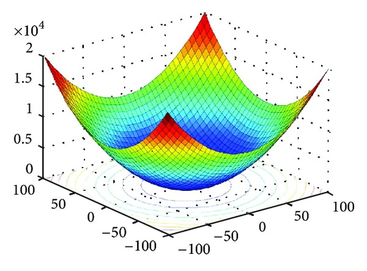
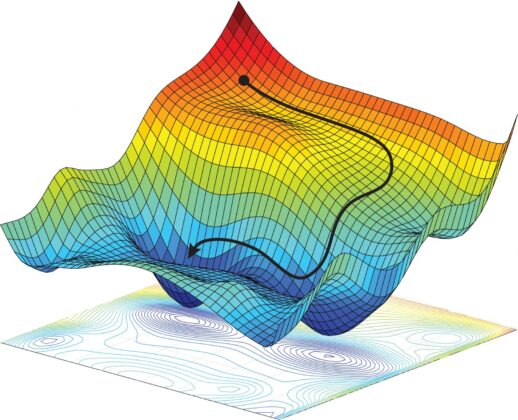
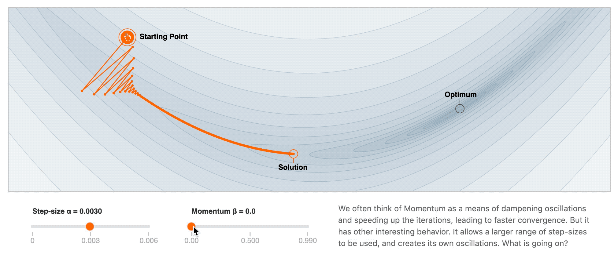
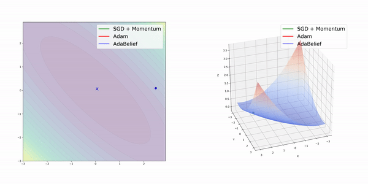

# 58 - 优化算法

---

### 🎦 本节课程视频地址 👇

## 优化问题

对于深度学习问题，我们通常会先定义损失函数。一旦我们有了损失函数，我们就可以使用优化算法来尝试**最小化损失**。在优化中，损失函数通常被称为优化问题的目标函数。按照传统和惯则，大多数优化算法都关注的是最小化。如果我们需要最大化目标，那么有一个简单的解决方案：在目标函数前加负号即可。

- 一般形式

  $$\text{minimize}\ f(\bf{x})\quad \text{subject to}\ \bf{x}\in C$$

  - 目标函数（在 Deep Learning 中为损失函数） $f:\mathbb R^n\rightarrow\mathbb R$
  - 限制集合例子：

    $C=\{\bf{x}|\mathbb{h_1}(\bf {x})=0,...,\mathbb{h_m}(\bf{x})=0,\mathbb{g_1}(\bf {x})\le 0,...,\mathbb{g_r}(\bf {x})\}$

  - 如果 $C=\mathbb {R}^n$ ，那就是**不受限**（Deep Learning 通常选用此条件）

### 局部最小 vs 全局最小

- 全局最小 ${\bf x^*}$: $f({\bf x^*})\le f({\bf x})\quad \forall {\bf x}\in C$
- 局部最小 ${\bf x^*}$: 存在$\epsilon$，使得 $f({\bf x^*})\le f({\bf x})\quad \forall {\bf x}\in ||{\bf x^*}-{\bf x}||\le\epsilon$
- 使用迭代优化算法来求解，**一般只能保证找到局部最小值**

> 也存在特例情况，即在**凸优化**（Convex Optimization）问题中，局部最小和全局最小是等价的。**凸性**（convexity）在优化算法的设计中起到至关重要的作用， 这主要是由于在这种情况下对算法进行分析和测试要容易得多。 换言之，如果该算法甚至在凸性条件设定下的效果很差， 通常我们很难在其他条件下看到好的结果。 此外，即使深度学习中的优化问题通常是非凸的， 它们也经常在局部极小值附近表现出一些凸性。接下来介绍相关知识。

## 凸优化

### 凸集

凸集（convex set）是凸性的基础。

- 一个 $\mathbb {R}^n$ 的子集 $C$ 是凸当且仅当：

  $$
  \alpha\bf {x}+(\mathbb{1}-\alpha)\bf {y}\in C \qquad
  \forall \alpha \in [\mathbb{0,1}]\quad \forall \bf{x},\bf{y}\in C
  $$

> 直观说，如果一个区域是凸集，则在集合中找任意两个点连成一条线，线都在区域内

### 凸函数

我们有了凸集，我们可以引入凸函数（convex function）

- 对于函数$f:\mathbf{C} \rightarrow \mathbb{R}$是凸，当且仅当：
  $$
  f(\alpha{\bf x}+(1-\alpha){\bf y})\le\alpha f({\bf x})+(1-\alpha)f({\bf y})\quad \forall\alpha\in[0,1]\ \forall{\bf x}, {\bf y}\in C
  $$
- 如果 $\bf {x}\ne y,\alpha\in(\mathbb{0,1})$ 时不等式严格成立，那么叫严格凸函数

### 凸函数优化

- 如果代价函数 $f$ 是凸的，且限制集合 $C$ 是凸的，那么就是凸优化问题，那么局部最小一定是全局最小
- 严格凸优化问题有唯一的全局最小

### 凸和非凸例子

- 凸

  - [线性回归](08-线性回归.md)：$f({\bf x})=||{\bf Wx}-{\bf b}||_2^2$
  - [Softmax 回归](09-Softmax回归.md)
    > 统计上更关心凸性的

- 非凸
  - MLP、CNN、RNN、Attention
    > 非线性的，非凸的函数表达能力强，深度学习更关注非凸

## 梯度下降

- 最简单的迭代求解算法
- 选取开始点 ${\bf x_0}$
- 对 $t=1,...,T$
  - ${\bf x_t}={\bf x_{t-1}}-\eta\nabla f({\bf x_{t-1}})$
- $\eta$ 叫做学习率

著名的 3Blue1Brown 博主做过一期关于梯度下降的科普视频 👇 推荐观看

### 随机梯度下降（SGD）

- 有 $n$ 个样本时，计算 $f({\bf x})={1\over n}\sum_{i=0}^nl_i({\bf x})$ 的导数太贵
- 随机梯度下降在时间 $t$ 随即选择样本 $t_i$ 来近似 $f(x)$

  $$
  {\bf x_t}={{\bf x_{t-1}}-\eta\nabla l_{t_i}({\bf x_{t-1}})}\\
  \mathbb E\left[\nabla l_{t_i}({\bf x_{t-1}})\right] \approx \mathbb E[\nabla f({\bf x})]
  $$

  > 求导是线性可加的，因此局部期望接近于整体

### 小批量随机梯度下降（mini-batch SGD）

- 计算单样本的梯度难完全利用硬件资源，无法利用硬件的并行计算能力
- 小批量随机梯度下降在时间 $t$ 采样一个随机子集 $I_t\subset\{1,...,n\}$ 使得 $|{\bf I_t}|=b$
  $$
  {\bf x_t}={\bf x_{t-1}}-{\eta\over b}\sum_{i\in{\bf I_t}}\nabla l_i({\bf x_{t-1}})
  $$
- 同样，这是一个无偏的近似，但降低了方差
  $$
  \mathbb E[{1 \over b}\sum_{i\in{\bf I_t}}\nabla l_i({\bf x})]=\nabla f({\bf x})
  $$
  > 方差降低了，噪音就小了，方向变得更加平滑。
  > 批量大，计算慢，收敛快；批量小，计算快，收敛慢，所以要权衡

### 冲量法/动量法（Momentum）

- 冲量法使用平滑过的梯度对权重更新

  $$
  {\bf g_t}={1 \over b}\sum_{i\in{\bf I_t}}\nabla l_i({\bf x_{t-1}})\\
  {\bf v_t}=\beta{\bf v_{t-1}}+{\bf g_t}\\
  {\bf w_t}={\bf w_{t-1}}-\eta{\bf v_t}
  $$

- 将第二条公式展开,可以起到梯度平滑作用：
  $$
  {\bf v_t}={\bf g_t}+\beta{\bf g_{t-1}}+\beta^2{\bf g_{t-2}}+\beta^3{\bf g_{t-3}}+...
  $$
  > $\beta$ 常见取值 $[0.5,0.9,0.95,0.99]$

不同$\beta$取值对优化结果的影响：

不同$\beta$取值的有效样本权重的对比图，可知$\beta$越大，历史值对当前值影响越大：

> 在几乎所有深度学习框架都实现了动量法，可以通过在优化算法函数使用`momentum`参数进行启用

还可以观看吴恩达 Deep Learning 公开课的动量法一节 👇

### Adam

> 优化效果都在伯仲之间，不一定有 SGD+Momentum 仔细调参后的效果好，Adam 最大的优点是对学习率不敏感，非常非常平滑

Adam 算法的关键组成部分之一是：它使用指数加权移动平均值来估算梯度的动量和第二力矩：

- 记录 ${\bf v_t}=\beta_1{\bf v_{t-1}}+(1-\beta_1){\bf g_t}$，通常 $\beta_1=0.9$
  > 相当于进一步放缩了当前梯度
  >
  > 展开 ${\bf v_t}=(1-\beta_1)({\bf g_t}+\beta_1{\bf g_{t-1}}+\beta_1^2{\bf g_{t-2}}+\beta_1^3{\bf g_{t-3}}+...)$
  >
  > 因为 $\sum_{i=0}^\infty \beta_1^i={1 \over 1-\beta_1}$，所以权重和为 $1$
  >
  > 由于 ${\bf v_0}=0$，且 $\sum_{i=0}^t \beta_1^i={1-\beta_1^t \over 1-\beta_1}$，
    修正 ${\bf \hat v_t}={{\bf v_t}\over 1-\beta_1^t}$，
  > 当$t$ 不是无穷大的时候，就需要此修正
- 类似记录 ${\bf s_t}=\beta_2{\bf s_{t-1}}+(1-\beta_2){\bf g_t}^2$，通常 $\beta_2=0.999$，且修正 ${\bf \hat s_t}={{\bf s_t}\over 1-\beta_2^t}$
  > 相当于对每个元素的平方做 smooth
- 计算重新调整后的梯度 ${\bf g_t'}={{\bf \hat v_t}\over\sqrt{\bf \hat s_t}+\epsilon}$
  > 不同特征的梯度有大有小，通过该操作，可使梯度控制在一个适当的范围，防止过大或过小，
  > 相当于做归一化，类似的技术还有 [Batch Normalization](26-批量归一化.md)
- 最后更新 ${\bf w_t}={\bf w_{t-1}}-\eta{\bf g_t'}$

#### ⚠ 注意！！！Adam不能与Weight Decay混用

论文[《Decoupled Weight Decay Regularization》](https://arxiv.org/abs/1711.05101v3)指出在Adam优化器中，weight decay与L2正则并不等价，在实际使用中确实发现Adam+Weight decay反而会造成结果更差的现象，参考👉[这里](extra/番外04-Kaggle竞赛实践经验.md)。要对使用Adam优化算法的模型增加正则，可以换用AdamW算法，参考👉[Pytorch文档](https://pytorch.org/docs/stable/generated/torch.optim.AdamW.html)

还可以观看吴恩达 Deep Learning 公开课的Adam一节 👇

## 总结

- 深度学习模型大多是非凸
- 小批量随机梯度下降是最常用的优化算法
- 冲量对梯度做平滑
- Adam 对梯度做平滑，且对梯度各个维度值做重新调整，且对学习率取值范围更加宽松

> 不同优化算法的可视化对比

