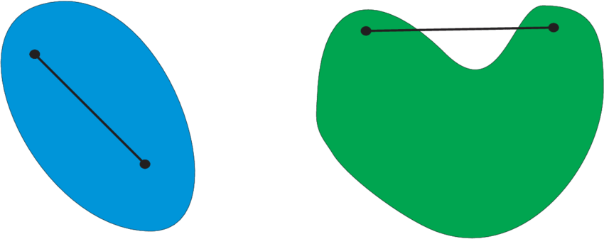

## 优化算法

**优化问题**

- 一般形式
  $minimize\quad f({\bf x})\quad subject\ to\ {\bf x}\in C$
  - 目标函数 $f:\mathbb R^n\leftarrow\mathbb R$
  - 限制集合例子：
  $C=\{{\bf x}|h_1({\bf x})=0,...,h_m({\bf x})=0,g_1({\bf x})\le 0,...,g_r({\bf x})\}$
  - 如果 $C=\mathbb R^n$ 那就是不受限
    - DL 通常选择不受限

**局部最小 vs 全局最小**

- 全局最小 ${\bf x^*}$: $f({\bf x^*})\le f({\bf x})\quad \forall {\bf x}\in C$
- 局部最小 ${\bf x^*}$: 使得 $f({\bf x^*})\le f({\bf x})\quad \forall {\bf x}\in ||{\bf x^*}-{\bf x}||\le\epsilon$
- 使用迭代优化算法来求解，一般只能保证找到局部最小值

**凸集**

- 一个 $R^n$ 的子集 $C$ 是凸当且仅当

$\alpha{\bf x}+(1-\alpha){\bf y}\in C\\
\forall\alpha\in [0,1]\ \forall{\bf x},{\bf y}\in C$

**凸函数**

- 对于函数 $f(\alpha{\bf x}+(1-\alpha){\bf y})\le\alpha f({\bf x})+(1-\alpha)f({\bf y})\ \forall\alpha\in[0,1]\ \forall{\bf x}, {\bf y}\in C$
- 如果 ${\bf x}\ne,\ \alpha\in(0,1)$ 时不等式严格成立，那么叫严格凸函数

**凸函数优化**

- 如果代价函数 $f$ 是凸的，且限制集合 $C$ 是凸的，那么就是凸优化问题，那么局部最小一定是全局最小
- 严格凸优化问题有唯一的全局最小

**凸和非凸例子**

- 凸
  - 线性回归 $f({\bf x})=||{\bf Wx}-{\bf b}||_2^2$
  - Softmax 回归
  - 统计上更关心凸性的

- 非凸
  - MLP,CNN,RNN,attention
    - 非线性的
  - 深度学习更关注非凸
    - 非凸比凸能够表达出更多的特征

**梯度下降**

- 最简单的迭代求解算法
- 选取开始点 ${\bf x_0}$
- 对 $t=1,...,T$
  - ${\bf x_t}={\bf x_{t-1}}-\eta\nabla f({\bf x_{t-1}})$
- $\eta$ 叫做学习率

**随机梯度下降**

- 有 $n$ 个样本时，计算 $f({\bf x})={1\over n}\sum_{i=0}^nl_i({\bf x})$ 的导数太贵
  - 对所有样本上损失的平均
- 随机梯度下降在时间 $t$ 随即选择样本 $t_i$ 来近似 $f(x)$
  ${\bf x_t}={{\bf x_{t-1}}-\eta\nabla l_{t_i}({\bf x_{t-1}})}\\
  \mathbb E\left[\nabla l_{t_i}({\bf x_{t-1}})\right]=\mathbb E[\nabla f({\bf x})]$
  - 求导是线性可加的，因此局部期望接近于整体

**小批量随机梯度下降**

- 计算单样本的梯度难完全利用硬件资源
- 小批量随机梯度下降在时间 $t$ 采样一个随机子集 $I_t\subset\{1,...,n\}$ 使得 $|{\bf I_t}|=b$
${\bf x_t}={\bf x_{t-1}}-{\eta\over b}\sum_{i\in{\bf I_t}}\nabla l_i({\bf x_{t-1}})$
- 同样，这是一个无偏的近似，但降低了方差
$\mathbb E[{1 \over b}\sum_{i\in{\bf I_t}}\nabla l_i({\bf x})]=\nabla f({\bf x})$
- 方差降低了，噪音就小了，方向变得更加平滑
- 批量大，计算慢，收敛快；批量小，计算快，收敛慢，所以要权衡

**冲量法**

- 冲量法使用平滑过的梯度对权重更新
  - 在实际图中梯度是非常“糙”的

${\bf g_t}={1 \over b}\sum_{i\in{\bf I_t}}\nabla l_i({\bf x_{t-1}})\\
{\bf v_t}=\beta{\bf v_{t-1}}+{\bf g_t}\quad{\bf w_t}={\bf w_{t-1}}-\eta{\bf v_t}$
  - 梯度平滑：
  ${\bf v_t}={\bf g_t}+\beta{\bf g_{t-1}}+\beta^2{\bf g_{t-2}}+\beta^3{\bf g_{t-3}}+...$
  - $\beta$ 常见取值 $[0.5,0.9,0.95,0.99]$
  - 使两次之间的梯度差异减小

**Adam**

- 优化效果都在伯仲之间，最大的优点是对学习率不敏感，所以非常非常平滑

- 记录 ${\bf v_t}=\beta_1{\bf v_{t-1}}+(1-\beta_1){\bf g_t}$，通常 $\beta_1=0.9$
  - 相当于进一步放缩了当前梯度
- 展开 ${\bf v_t}=(1-\beta_1)({\bf g_t}+\beta_1{\bf g_{t-1}}+\beta_1^2{\bf g_{t-2}}+\beta_1^3{\bf g_{t-3}}+...)$
- 因为 $\sum_{i=0}^\infty \beta_1^i={1 \over 1-\beta_1}$，所以权重和为 $1$
- 由于 ${\bf v_0}=0$，且 $\sum_{i=0}^t \beta_1^i={1-\beta_1^t \over 1-\beta_1}$
- 修正 ${\bf \hat v_t}={{\bf v_t}\over 1-\beta_1^t}$
  - $t$ 不是无穷大的时候，就要正则化
- 类似记录 ${\bf s_t}=\beta_2{\bf s_{t-1}}+(1-\beta_2){\bf g_t}^2$，通常 $\beta_2=0.999$，且修正 ${\bf \hat s_t}={{\bf s_t}\over 1-\beta_2^t}$
  - 对每个元素的平方 smooth
- 计算重新调整后的梯度 ${\bf g_t'}={{\bf \hat v_t}\over\sqrt{\bf \hat s_t}+\epsilon}$
  - ${\bf v_t}$ 是向量的平滑
  - 特征的维度不一样，比如 NLP 里，有些词出现频繁，其特征值大，梯度大；反之亦然，所以时各种值之间的梯度也变化均匀
  - 除以梯度得平方和
  - 类似的技术还有 batch normalization
- 最后更新 ${\bf w_t}={\bf w_{t-1}}-\eta{\bf g_t'}$
  

**总结**

- 深度学习模型大多是非凸
- 小批量随机梯度下降是最常用的优化算法
- 冲量对梯度做平滑
- Adam 对梯度做平滑，且对梯度各个维度值做重新调整

