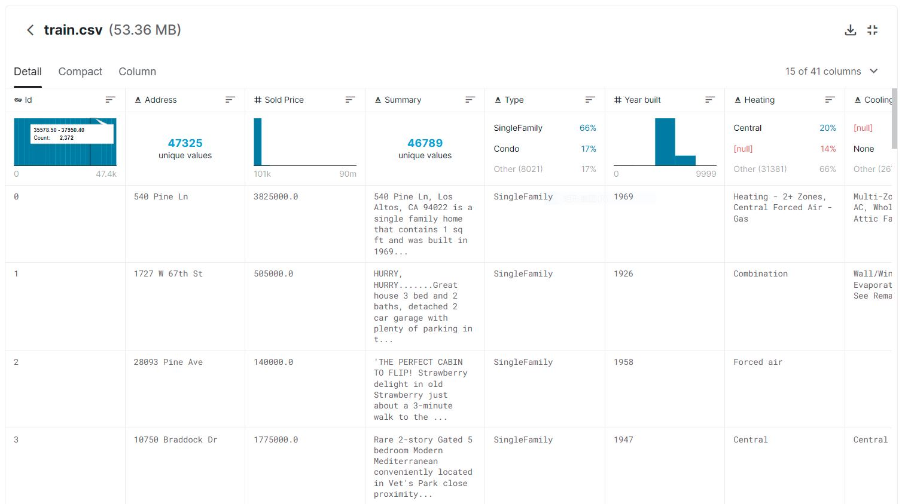
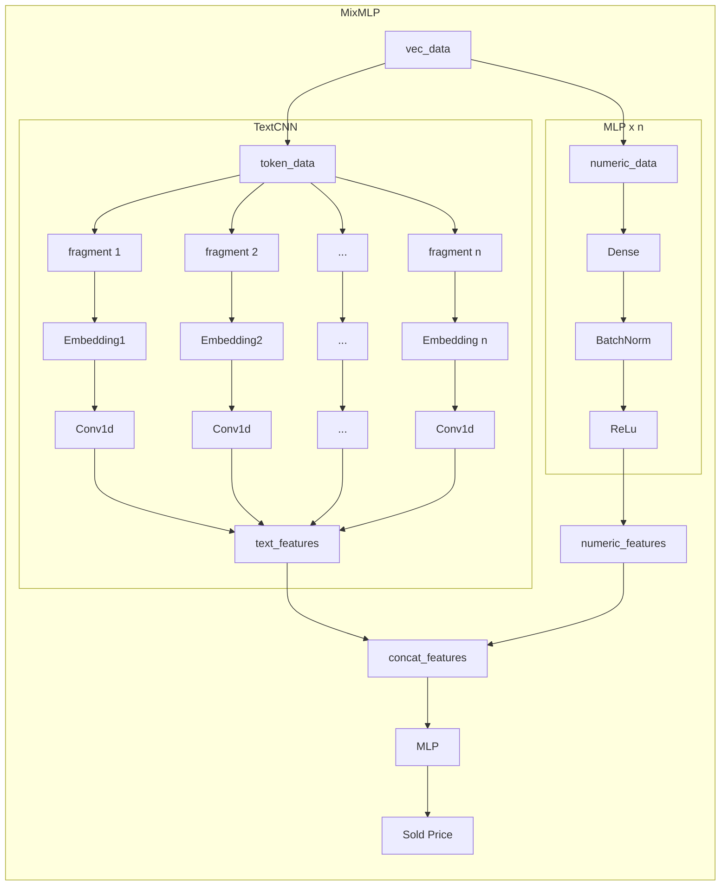

# 番外 04-Kaggle 竞赛实践经验

## 竞赛 1：California-House-Price

### 数据载入可使用 Kaggle API 进行下载

尤其适合在云计算或其他无 GUI 界面的 Linux 主机上使用。

```bash
# 安装
pip install kaggle

# 下载指定数据集
kaggle competitions download -c california-house-prices

# 解压
unzip california-house-prices-xxx.zip && rm california-house-prices-xxx.zip
```

### Kaggle 每个项目的数据概览页面至少要瞥一眼

Kaggle 的每个项目主页，都设有数据的概览页面，点击`Data`，可看到每个特征的**数据分布**、**数据类型**、**简要统计**等等，十分方便对数据整体进行一个初步的把握



### 探索性数据分析（EDA）

拿到数据后，第一步可以先进行 EDA，使用 Pandas、Seaborn、Plotly 包可以高效地对训练数据进行处理。以下为常用命令：

```python
# 导入相关包
import seaborn as sns
import matplotlib.pyplot as plt
import numpy as np
import pandas as pd

# 读取CSV格式文件并转换为Dataframe格式
data = pd.read_csv('train_data.csv')

# 展示数据形状
data.shape

# 展示各列数据类型
data.info()

# 展示数值列简要统计信息
data.describe()

# 取样
data.sample()

# 取出前n行、后n行
data.head(n)
data.tail(n)

# 取出指定索引地行或列（可用切片）
data.iloc[:,[1:3]]
```

- 对于数值列

```python
# 对某列进行数据映射
data['gender'] = data['gender'].map({"male":0,"femal":1})

# 对某列进行数据处理操作
data['Bedrooms'] = data['Bedrooms'].map(lambda x: float(x))

# 如果处理函数比较复杂，有不止一个参数，可以使用`apply()`
def apply_age(x,bias):
    return x+bias
#以元组的方式传入额外的参数
data["age"] = data["age"].apply(apply_age,args=(-3,))
# 多列计算
data['col3'] = df.apply(lambda x: x['col1'] + 2 * x['col2'], axis=1)

# 按行横向apply
def BMI(series):
    weight = series["weight"]
    height = series["height"]/100
    BMI = weight/height**2
    return BMI
data["BMI"] = data.apply(BMI,axis=1)

# 待补充`.filter() .groupby() .agg . `

# 计算各数值列地相关系数，可选{'pearson', 'kendall', 'spearman'}
data_corr = data.corr(method='pearson')
# 做出直观的相关系数热力图
plt.subplots(figsize=(20,20))
mask = np.zeros_like(data_corr,dtype=np.bool)
mask[np.triu_indices_from(mask)] = True # 遮掉重复的上半图
sns.heatmap(data_corr,mask=mask,annot=True) # annot显示数值
plt.show()

# 使用pairplot展现两两变量列的关系和数据分布
# 传入数值列数据，'corner'：是否展示半角；
# 'kind'={"scatter","reg"}非对角线子图用散点或回归拟合:
# 'diag_kind'={"hist","kde"}对角线子图使用直方图或核密度函数
sns.pairplot(data,vars=var,corner=True, diag_kind='hist',kind='reg',dropna=True)
```

- 对于离散类别列

```python
# 计算所包含各类型数量
data['Type'].value_counts()

# 筛选出属于某集合的行数据
data[data['Type'].isin(['apple','pear'])]

# 对类别列做出箱图、小提琴图
sns.catplot(y="Type",x="Sold Price",kind="violin",data=type_df,height=5,aspect=3)
```

### 使用超好用的 Pandas-Profiling 库进行 EDA，解放上述繁琐的操作，好用到哭！

```python
# 安装
%pip install pandas-profiling[notebook]
# 将Dataframe传入做EDA分析
profile = ProfileReport(df, title="Pandas Profiling Report", explorative=True)
```

### 数据预处理

一般数据包含的类型有连续型数值（如价格、温度）、离散型数值（如年份、邮编）、描述型短字符串（如性别、地区）、叙述型长文本（如概述、新闻、对话），预处理时要区别对待。

#### 区分数值类和非数值类，并对数值类进行归一化

```python
numeric_features = all_features.dtypes[all_features.dtypes != 'object'].index
all_features[numeric_features] = all_features[numeric_features].apply(
    lambda x: (x - x.mean()) / (x.std()))
all_features[numeric_features] = all_features[numeric_features].fillna(0)
```

#### 对于离散型数值、描述型短字符，如果各列的种类不多，可采用独热编码（但如果种类很多，则不能盲目使用，否则会撑爆内存）

```python
no_numeric_features = all_features.dtypes[all_features.dtypes == 'object'].index

all_features[no_numeric_features] = pd.get_dummies(all_features[no_numeric_features], dummy_na=True)
```

#### 对于种类多、不能采用独热编码的数据，可以采用`scikit-learn.preprocessing`的一系列特征工程的方法。参考文档 👉[API](https://scikit-learn.org/stable/modules/classes.html#module-sklearn.preprocessing)

#### 对于文本特征，如果为一些长度短的文本或由专有领域词语构成，可以为每个特征单独构建词汇表`Vocabl`，再进行词嵌入生成特征向量进行训练

```python
# 定义函数统一小写、空格替换特殊符号并以空格分词的函数
import re
def str2tok_list(string):
    return re.sub('[^A-Za-z]+', ' ', str(string)).strip().lower().split()

# 在文本列上以map方法对每行文字进行处理并转换为二维嵌套列表
summary_list=all_features['Summary'].map(str2tok_list).tolist()
# 将嵌套列表展平为一维list
summary_plain=[token for line in summary_list for token in line]
# 生成该列的词典
v=d2l.Vocab(summary_plain)
# 对语料进行下采样
subsampled, counter = d2l.subsample(summary_list, v)
# 使用词典索引替换原有文本
all_features['Summary']=[v[line] for line in subsampled]
# 一般模型训练要求为定长序列，可以使用truncate_pad方法指定pad_len长度
all_features['Summary']=[d2l.truncate_pad(v[line],pad_len,v['<pad>']) for line in subsampled]
```

### 神经网络相关

#### 由浅入深，奥卡姆定理

最开始的网络模型可以先从最简单的单层或浅层线性模型逐步过渡到复杂网络，没必要一开始就使用高阶神经网络。首先尝试浅层网络能否 work？work 到什么程度？根据结果再逐步进行改进。

#### 对数值列进行 MLP 操作

精度最高为 Public Score：0.38412、Private Score：0.40706

#### 对数据 Vector 化，并采用以下混合结构

将数据分为数值类特征和文本特征，首先对文本特征分别按列进行分词并使用 Vocab 转换为对应的索引，然后统计各列分词长度，按平均长度进行截断或 Padding。

再将数值类和文本类特征 concat 到一起，作为训练数据。



#### Embedding 层输入数据要求必须为`Int`或`Long`数据类型，使用默认`FloatTensor`数据类型会报错

> 可通过`X.int()` or `X.long()`进行转换

#### 使用嵌入层得到词向量，在送往 Conv1d 卷积层前，需要对 Tensor 维度使用方法`.permute()`进行调换，以符合卷积输入格式

嵌入层的输出形状是`(批量大小, 词元数量, 词元向量维度)`，而卷积层要求输入形状为`(批量大小，词元特征维度, 词元数量)`，可以使用`embeddings.permute(0, 2, 1)`进行调换。

### 模型训练相关

#### 不能直接将 BN 层与 Dropout 层混用

BatchNorm 和 Dropout 两种方法不能混用，实际使用中发现会导致精度下降且训练不稳定的现象。

论文参考 👉[Understanding the Disharmony between Dropout and Batch Normalization by Variance Shift](https://arxiv.org/abs/1801.05134)

#### 记得在模型预测时写上`net.eval()`开启评估模式，以免前功尽弃

#### 在使用 GPU 训练时，若数据集小于显存容量，可直接将整个训练集放置于显卡上，来提高运算效率

本次Kaggle项目所涉及数据经前期特征化预处理，数据规模已缩小很多，如果按照常用方案在读取每个batch数据后移至GPU显存进行计算，会造成频繁跨设备的数据移动，产生很大的计算开销。如果显存足够大（壕），就直接将数据集放置于GPU上即可。关于不同硬件的时延对比，可以参考👉[本章](../28-深度学习硬件（CPU和GPU）.md)

#### Adam 优化器不能与 Weight Decey 一起使用，可以用 AdamW 优化器替代

在 Adam 优化器中，weight decay 与 L2 正则并不等价，除此之外，Adam+L2 的方案会导致不理想的优化过程。论文《Decoupled Weight Decay Regularization》指出了这一点

> Just adding the square of the weights to the loss function is _not_ the correct way of using L2 regularization/weight decay with Adam, since that will interact with the m and v parameters in strange ways.
