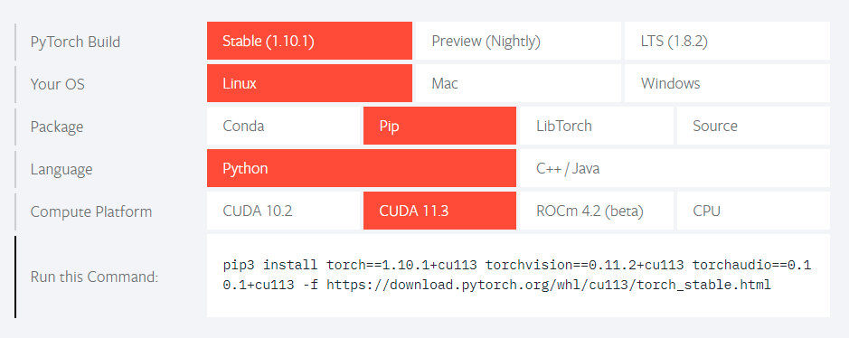

# 番外 02 - 使用和购买 GPU

---

### 🎦 本节课程视频地址 👇

[](https://www.bilibili.com/video/BV1z5411c7C1)

## GPU 在深度学习领域扮演的角色

纵观深度学习的历史，大约 2010 年开始，那些在计算上看起来不可行的神经网络算法变得热门起来，实际上是以下两点导致的： 其一，随着互联网的公司的出现，为数亿在线用户提供服务，**大规模数据集**变得触手可及。 另外，廉价又高质量的传感器、廉价的数据存储（克莱德定律）以及廉价计算（摩尔定律）的普及，特别是**GPU 的普及**，使大规模算力唾手可得。


GPU 在深度学习领域扮演着极为重要的角色，随着硬件发展及游戏业的需求，GPU 的计算能力突飞猛进，可以说，GPU 促进了神经网络在 2012 年的第三次复兴。由于最早是 Nvidia 公司开发出了**CUDA**，一种并行计算平台和编程模型。它通过利用图形处理器 (GPU) 的处理能力，可大幅提升计算性能，而后 Nvidia 嗅到此领域的前景，乘胜追击开发了**CuDNN**，广泛应用于深度学习各个领域，差不多形成了行业的“既定标准”（苏妈加把劲啊，希望在 DL 领域听到是 AMD💪YES！）


由于 Nvidia GPU 在深度学习中的广泛应用，本篇 GPU 主要以绿厂为主。同时因 Windows 上经常出现莫名其妙的环境配置问题，建议使用 Linux 平台。

## GPU 的使用

### 硬件及驱动准备

首先你要有一块绿厂 GPU（GTX9XX、GTX10X0、RTX20X0、RTX30X0），然后安装最新的驱动程序，再在 👉[此处](https://developer.nvidia.com/cuda-downloads)下载 CUDA Toolkot（适合Windows）。或点此👉[此处](https://www.autodl.com/docs/cuda/)以命令行形式下载（适合云主机等无GUI界面Linux）

安装完毕后，在命令行输入命令`nvidia-smi`，若出现类似信息（型号等参数不同硬件会有不同），则表明安装成功：

```bash
Mon Jan 17 01:34:20 2022
+-----------------------------------------------------------------------------+
| NVIDIA-SMI 418.67       Driver Version: 418.67       CUDA Version: 10.1     |
|-------------------------------+----------------------+----------------------+
| GPU  Name        Persistence-M| Bus-Id        Disp.A | Volatile Uncorr. ECC |
| Fan  Temp  Perf  Pwr:Usage/Cap|         Memory-Usage | GPU-Util  Compute M. |
|===============================+======================+======================|
|   0  Tesla V100-SXM2...  Off  | 00000000:00:1B.0 Off |                    0 |
| N/A   42C    P0    52W / 300W |   1358MiB / 16130MiB |     20%      Default |
+-------------------------------+----------------------+----------------------+
|   1  Tesla V100-SXM2...  Off  | 00000000:00:1C.0 Off |                    0 |
| N/A   44C    P0    39W / 300W |     11MiB / 16130MiB |      0%      Default |
+-------------------------------+----------------------+----------------------+
|   2  Tesla V100-SXM2...  Off  | 00000000:00:1D.0 Off |                    0 |
| N/A   77C    P0   292W / 300W |   3964MiB / 16130MiB |     99%      Default |
+-------------------------------+----------------------+----------------------+
|   3  Tesla V100-SXM2...  Off  | 00000000:00:1E.0 Off |                    0 |
| N/A   58C    P0    58W / 300W |     11MiB / 16130MiB |      0%      Default |
+-------------------------------+----------------------+----------------------+

+-----------------------------------------------------------------------------+
| Processes:                                                       GPU Memory |
|  GPU       PID   Type   Process name                             Usage      |
|=============================================================================|
|    0     30549      C   ...conda3/envs/d2l-zh-release-0/bin/python  1347MiB |
|    2     85969      C   ...conda3/envs/d2l-en-release-1/bin/python  3953MiB |
+-----------------------------------------------------------------------------+
```

> 通过以上内容，可得知计算机拥有的 Nvidia GPU 型号、数量、驱动版本、**支持的 CUDA 版本**（重要：下文安装 Pytorch 时需要）、显存大小等待信息

### Pytorch GPU 版本安装

如果之前使用的是 CPU 版 Pytorch，需要使用命令`pip uninstall pytorch`卸载，再安装 GPU 版本，具体方法可参考 👉[Pytorch 官网](https://pytorch.org/)介绍的方法，根据系统类型、CUDA 版本选择：



在 PyTorch 中，每个数组都有一个设备（device）， 我们通常将其称为上下文（context）。 默认情况下，所有变量和相关的计算都分配给 CPU。 有时上下文可能是 GPU。 当我们跨多个服务器部署作业时，事情会变得更加棘手。 通过智能地将数组分配给上下文， 我们可以最大限度地减少在设备之间传输数据的时间。 例如，当在带有 GPU 的服务器上训练神经网络时， 我们通常希望模型的参数在 GPU 上。

### 张量与 GPU

- 计算设备

我们可以指定用于存储和计算的设备，如 CPU 和 GPU。 默认情况下，张量是在内存中创建的，然后使用 CPU 计算它。

在 PyTorch 中，CPU 和 GPU 可以用`torch.device('cpu')` 和`torch.device('cuda')`表示。 应该注意的是，cpu 设备意味着所有物理 CPU 和内存， 这意味着 PyTorch 的计算将尝试使用所有 CPU 核心。 然而，gpu 设备只代表一个卡和相应的显存。 如果有多个 GPU，我们使用`torch.device(f'cuda:{i}')` 来表示第 i 块 GPU（ i 从 0 开始）。 另外，`cuda:0`和`cuda`是等价的。

```python
import torch
from torch import nn

torch.device('cpu'), torch.device('cuda'), torch.device('cuda:1')
# Out:(device(type='cpu'), device(type='cuda'), device(type='cuda', index=1))
```

- 查询可用 GPU 数量

```python
torch.cuda.device_count()
```

> 定义两个方便的函数， 这两个函数允许我们在不存在所需所有 GPU 的情况下运行代码。

```python
def try_gpu(i=0):  #@save
    """如果存在，则返回gpu(i)，否则返回cpu()"""
    if torch.cuda.device_count() >= i + 1:
        return torch.device(f'cuda:{i}')
    return torch.device('cpu')

def try_all_gpus():  #@save
    """返回所有可用的GPU，如果没有GPU，则返回[cpu(),]"""
    devices = [torch.device(f'cuda:{i}')
             for i in range(torch.cuda.device_count())]
    return devices if devices else [torch.device('cpu')]

try_gpu(), try_gpu(10), try_all_gpus()
# Out: (device(type='cuda', index=0),
# device(type='cpu'),
# [device(type='cuda', index=0), device(type='cuda', index=1)])
```

- 张量与 GPU

```python
# 查询张量所在的设备，默认在CPU上
x = torch.tensor([1, 2, 3])
x.device
# Out: device(type='cpu')

# 创建时指定放在GPU显存上
X = torch.ones(2, 3, device=try_gpu())
X
# Out: tensor([[1., 1., 1.],
#       [1., 1., 1.]], device='cuda:0')

# 指定放在第二块GPU上
Y = torch.rand(2, 3, device=try_gpu(1))
Y
# Out: tensor([[0.1490, 0.3662, 0.3373],
#       [0.7341, 0.9128, 0.6263]], device='cuda:1')
```

- 复制

如果我们**要计算`X + Y`，我们需要决定在哪里执行这个操作**。例如，如下图所示，我们可以将`X`传输到第二个 GPU 并在那里执行操作。
*不要*简单地`X`加上`Y`，因为这会导致异常，运行时引擎不知道该怎么做：它在同一设备上找不到数据会导致失败。由于`Y`位于第二个 GPU 上，所以我们需要将`X`移到那里，
然后才能执行相加运算。使用命令`.cuda(i)`


```python
Z = X.cuda(1)
print(X)
print(Z)

# Out: tensor([[1., 1., 1.],
#       [1., 1., 1.]], device='cuda:0')
# tensor([[1., 1., 1.],
#       [1., 1., 1.]], device='cuda:1')

# 现在数据在同一个GPU上（Z和Y都在），我们可以将它们相加。
Y + Z
# Out: tensor([[1.5473, 1.1942, 1.2213],
#       [1.5998, 1.5565, 1.0372]], device='cuda:1')
```

### 神经网络与 GPU

神经网络模型也可以指定设备。 下面的代码使用`.to(device)`将模型参数放在（某个）GPU 上：

```python
net = nn.Sequential(nn.Linear(3, 1))
net = net.to(device=try_gpu())

net(X)
# Out: tensor([[1.2194],
#       [1.2194]], device='cuda:0', grad_fn=<AddmmBackward>)
```

确认模型参数存储在同一个 GPU 上

```python
net[0].weight.data.device
# Out: device(type='cuda', index=0)
```

> 只要所有的数据和参数都在同一个设备上， 我们就可以有效地学习模型。

## 购买 GPU


- 目前来说购买 **绿厂（Nvidia）** 的 GPU 要比红厂（AMD）、蓝厂（Intel）的要好，能获得最多的生态支持、性能表现、参考资料。
- **买新不买旧**，越新一代的 GPU 在同等价格上能提供更高的 GFlops
- **量力而行**，因挖矿不好买就使用云计算按需使用付费，常用云服务商汇总可参考 👉[这里](../README.md)
- 点击👉[这里](https://www.autodl.com/docs/gpu/)，查看GPU选型参考
- 点击👉[这里](https://www.autodl.com/docs/gpu_perf/)，查看主流Nvidia GPU性能Benchmark参考

## 使用具有GPU实例的云计算

### Amazon SageMaker（免费GPU实例，适合学习）

- [项目主页](https://studiolab.sagemaker.aws/)
- [使用说明](https://zh.d2l.ai/chapter_appendix-tools-for-deep-learning/sagemaker.html)

### 使用Amazon EC2实例（按需付费）

- [项目主页](https://aws.amazon.com/cn/)
- [使用说明](https://zh.d2l.ai/chapter_appendix-tools-for-deep-learning/aws.html)

### 使用华为云（按需付费）

- [项目主页](https://www.huaweicloud.com/)
- [使用说明 - 由该笔记作者之一Greener-Dalii整理](https://mp.weixin.qq.com/s/J7flZrkrKEjWNqwzHmm4Zw)

### 云计算使用时需要注意的额外问题

#### 开启云主机的交换文件（虚拟内存）功能，降低内存溢出的概率

大多数公司的Linux云主机为保证性能，默认禁用了**Swap（交换文件）**，不过在实际使用过程中，遇到数据量较大的操作时，经常会占满内存导致机器假死或崩溃，所以需要手动开启Swap，步骤参考👉[这里](番外03-Linux常用命令.md#开启/禁用Swap交换文件)。
