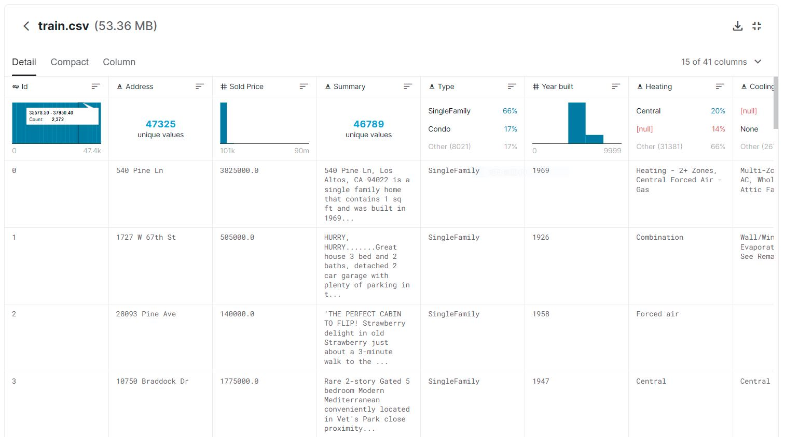

# 番外 04 - Kaggle竞赛实践经验

## 竞赛1：California-House-Price

### 数据载入可使用Kaggle API进行下载

尤其适合在云计算或其他无GUI界面的Linux主机上使用。

```bash
# 安装
pip install kaggle

# 下载指定数据集
kaggle competitions download -c california-house-prices

# 解压
unzip california-house-prices-xxx.zip && rm california-house-prices-xxx.zip
```

### Kaggle每个项目的数据概览页面至少要瞥一眼

Kaggle的每个项目主页，都设有数据的概览页面，点击`Data`，可看到每个特征的**数据分布**、**数据类型**、**简要统计**等等，十分方便对数据整体进行一个初步的把握



### 探索性数据分析（EDA）

拿到数据后，第一步可以先进行EDA，使用Pandas、Seaborn、Plotly包可以高效地对训练数据进行处理。以下为常用命令：

```python
# 导入相关包
import seaborn as sns 
import matplotlib.pyplot as plt
import numpy as np
import pandas as pd

# 读取CSV格式文件并转换为Dataframe格式
data = pd.read_csv('train_data.csv')

# 展示数据形状
data.shape

# 展示各列数据类型
data.info()

# 展示数值列简要统计信息
data.describe()

# 取样
data.sample()

# 取出前n行、后n行
data.head(n)
data.tail(n)

# 取出指定索引地行或列（可用切片）
data.iloc[:,[1:3]]
```

- 对于数值列

```python
# 对某列进行数据映射
data['gender'] = data['gender'].map({"male":0,"femal":1})

# 对某列进行数据处理操作
data['Bedrooms'] = data['Bedrooms'].map(lambda x: float(x))

# 如果处理函数比较复杂，有不止一个参数，可以使用`apply()`
def apply_age(x,bias):
    return x+bias
#以元组的方式传入额外的参数
data["age"] = data["age"].apply(apply_age,args=(-3,))
# 多列计算
data['col3'] = df.apply(lambda x: x['col1'] + 2 * x['col2'], axis=1) 

# 按行横向apply
def BMI(series):
    weight = series["weight"]
    height = series["height"]/100
    BMI = weight/height**2
    return BMI
data["BMI"] = data.apply(BMI,axis=1)

# 待补充`.filter() .groupby() .agg . `

# 计算各数值列地相关系数，可选{'pearson', 'kendall', 'spearman'}
data_corr = data.corr(method='pearson')
# 做出直观的相关系数热力图
plt.subplots(figsize=(20,20))
mask = np.zeros_like(data_corr,dtype=np.bool)
mask[np.triu_indices_from(mask)] = True # 遮掉重复的上半图
sns.heatmap(data_corr,mask=mask,annot=True) # annot显示数值
plt.show()

# 使用pairplot展现两两变量列的关系和数据分布
# 传入数值列数据，'corner'：是否展示半角；
# 'kind'={"scatter","reg"}非对角线子图用散点或回归拟合:
# 'diag_kind'={"hist","kde"}对角线子图使用直方图或核密度函数
sns.pairplot(data,vars=var,corner=True, diag_kind='hist',kind='reg',dropna=True)
```

- 对于离散类别列

```python
# 计算所包含各类型数量
data['Type'].value_counts()

# 筛选出属于某集合的行数据
data[data['Type'].isin(['apple','pear'])]

# 对类别列做出箱图、小提琴图
sns.catplot(y="Type",x="Sold Price",kind="violin",data=type_df,height=5,aspect=3)
```

### 神经网络相关

#### 由浅入深，奥卡姆定理

最开始的网络模型可以先从最简单的单层或浅层线性模型逐步过渡到复杂网络，没必要一开始就使用高阶神经网络。

首先尝试浅层网络能否work？work到什么程度？根据结果再逐步进行改进。

#### 不能直接将BN层与Dropout层混用

两种正则化不能混用，实际使用中发现会导致精度下降。

论文参考👉[Understanding the Disharmony between Dropout and Batch Normalization by Variance Shift](https://arxiv.org/abs/1801.05134)